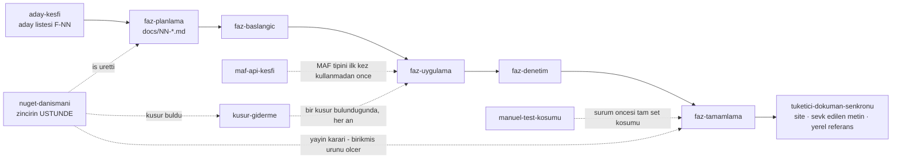

# Skill'ler — Klasör Konvansiyonu

Tekrarlanan iş akışları burada yaşar. Hangi skill'in ne zaman çalıştırılacağı
[`AGENTS.md`](../../AGENTS.md) içindeki tablodadır; bu dosya yalnız **klasör
kurallarını** anlatır.

## Kurallar

- Her skill bir klasördür: `.agents/skills/<yetenek-adi>/`
- `SKILL.md` **zorunludur**. Frontmatter iki alan taşır: `name`, `description`
- `name` klasör adıyla birebir aynıdır ve kebab-case yazılır
- `description` skill'in **ne zaman** kullanılacağını söyler, ne yaptığını değil.
  Agent bu cümleye bakarak skill'i seçer; belirsiz bir açıklama skill'i
  görünmez yapar
- Gerektiğinde alt klasör eklenir: `scripts/`, `examples/`, `resources/`,
  `references/`

## Taşınabilirlik

Skill mekanizması olmayan agent'lar (GitHub Copilot vb.) `SKILL.md`'yi normal
bir doküman gibi okuyup uygular. `SKILL.md` **kendi protokolü** bakımından
kendi kendine yeter — bir `runtime`'a bağlı yazılmaz. Ortak sözleşme
(kapı koşumu, test seviyeleri, [kurtarma rampaları](../ortak/kurtarma.md))
`.agents/ortak/` altında tek kaynakta yaşar ve adıyla bağlanır; skill'ler
zaten birbirine sürekli bağlanıyor
(`faz-tamamlama` → `tuketici-dokuman-senkronu`, `faz-denetim` → kalite
sözleşmesi, K-522 emsali). Bağlantı hedefi repo içinde olmalıdır; skill
mekanizması olmayan bir agent onu normal bir dosya olarak açar (Faz 92).

Claude Code keşfi için `.claude/skills` → `.agents/skills` symlink'tir.
`.agents/ortak/` bu symlink'in **dışındadır** — skill keşfi onu bir skill
sanmaz, çünkü `SKILL.md`/frontmatter taşımaz.

🚨 **Bir skill'in kuralını araca taşıyan yapılandırma symlink'lenmez ve
taşınmaz.** `faz-denetim`'in salt-okunurluğu Claude Code'da
[`.claude/agents/faz-denetcisi.md`](../../.claude/agents/faz-denetcisi.md)
araç kümesinden gelir; agent keşfi ayrı bir kod yoludur ve symlink desteği
belgelenmemiştir, bu yüzden o dosya **gerçek bir dosyadır**. Başka bir
agent'ta o dosya okunmaz ve salt-okunurluk **gelmez** — kuralı yalnız
`SKILL.md` metni korur. Skill metni bu yüzden yapılandırmaya devredilmez
(Faz 167).

## Mevcut skill'ler ve zincir

| Skill | Ne zaman |
|---|---|
| `aday-kesfi` | Yeni aday yeteneği ararken — **yalnız kullanıcı istediğinde** |
| `faz-planlama` | Aday (F-NN) faz dokümanına dönüşürken |
| `faz-baslangic` | Faza başlarken — okuma protokolü |
| `faz-uygulama` | İlk kod satırından önce — yazım protokolü |
| `faz-denetim` | Kod bittiğinde — taze bağlamlı bağımsız denetim |
| `faz-tamamlama` | Kapanışta — kapılar, manuel case, doküman senkronu |
| `tuketici-dokuman-senkronu` | Faz kullanıcıya dönük bir yüzeye dokunduğunda — `faz-tamamlama` Adım 7 içinden |
| `maf-api-kesfi` | Bir MAF tipini ilk kez kullanmadan önce |
| `kusur-giderme` | Bir kusur bulunduğunda — her an |
| `manuel-test-kosumu` | `docs/manuel-test/` setinin **tamamı** koşulurken ve kusurları kapatılırken |
| `nuget-danismani` | Yayın kararı, 1.0/GA olgunluk denetimi ve yayın sonrası olayda — zincirin üstünde, tek faza bağlı değil; tek yazma yeri `docs/YAYIN-HAZIRLIK.md` |
