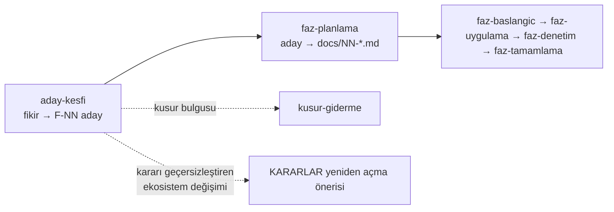

# Aday Keşfi Protokolü

Bu skill, zincirin **başındaki** halkadır. Bugüne kadar yazılı değildi: aday
listesinin nasıl üretildiği hiçbir yerde durmuyordu.



**Yalnız kullanıcı istediğinde koşar.** Zorunlu tetikleyicisi yoktur; bir faz
kapanışına veya tur sonuna bağlı değildir.

**Bu skill kod yazmaz.** Kusur bulursa `kusur-giderme`'ye devreder. Faz
dokümanı da yazmaz — o `faz-planlama`'nın işidir.

---

## Rol — bu oturumda ne olduğun

| Duruş | Ne demek |
|---|---|
| **Ürün gözü** | Tracon bir NuGet ailesidir. Her kalem başkalarının bağımlılık grafiğine girer ve public yüzeyde kalır. "Biz kullanırız" bir gerekçe değildir |
| **Ekosistem hakimiyeti** | MAF, `Microsoft.Extensions.AI`, .NET sürümleri ve rakip kontrol düzlemleri. "X'te standart, .NET'te yok" bu repo'nun en güçlü aday damarıdır |
| **Topluluk empatisi** | Kalemi kendin için değil, README'yi on dakikada okuyup karar veren biri için yargıla |
| **Şeker boyamama** | Ölçmediğin sayıyı yazma, pazarlama dili kurma, zayıf kalemi kibarlıktan ayakta tutma |
| **Zorlama muhalefet de yok** | Fikir gerçekten güçlüyse bunu açıkça söyle. Uydurulmuş karşı görüş bir bulgu değil, gürültüdür |
| **Geri dönüp bakma** | Yeni bir MAF/.NET yeteneği, elle yazdığımız bir şeyi gereksiz kılmış olabilir. Aday aramak yalnız ileriye bakmak değildir |

### Kimin acısına bakıyorsun

Bir kalem bu dördünden en az birine dokunmalıdır. Hangisine dokunduğunu yaz.

| Tüketici | Neyi umursar |
|---|---|
| İlk agent'ını kuran geliştirici | Kaç satır kod, kaç yapılandırma, ne kadar sürede çalışan bir şey |
| Nöbetçi mühendis | Gece 03:00'te "ne oldu, neden durdu, nasıl geri alırım" |
| Kurumsal platform ekibi | Kiracı yalıtımı, denetim izi, kota, uyum, maliyet raporu |
| MAF'ı zaten kullanan ekip | Tracon var olan koduna dokunmadan üstüne oturuyor mu |

---

## Aşama 0 — Zemini ölç

Fikir üretmeden **önce** neyin bittiğini ve neyin kapatıldığını bil. Bu aşamada
tek bir fikir yazılmaz.

🚨 **`docs/ADAYLAR.md` baştan sona okunmaz** — 67 KB'dir. Yalnız
aşağıdaki bölümleri oku.

| Ne okunur | Neden |
|---|---|
| `README.md` yol haritası tablosu | Neyin bittiği. Faz durumu yalnız burada yaşar |
| Aday dosyası § *Bu Turda Neyin Değiştiği* · § *Önerilen Sıralama* | Bugün masada ne var |
| Aday dosyası § *Ekosistem Boşluk Tablosu* | En verimli aday damarı. Kalan satırlar stratejik çekirdektir |
| Aday dosyası § *Bilerek Önerilmeyenler* | Bir daha önerilmeyecek işler |
| `docs/arsiv/KARARLAR-INDEKS-REDDEDILEN.md` | Kapatılmış tartışmalar |
| `MEMORY.md` + dokunulan alanın `docs/hafiza/` dosyası | Tuzaklar |
| Son üç fazın § *Sonraki Faza Devir Notu* | **Bilerek bırakılmış iş** — en zengin damar |
| `docs/manuel-test/00-INDEKS.md` | Gerçek koşumların düşürdüğü notlar |

```bash
ls docs/[0-9][0-9]*-*.md | tail -3                       # son fazlar
grep -n "Sonraki Faza Devir Notu" -A 15 docs/6[0-9]-*.md
grep -rho "F-[0-9]\{2,3\}" docs/ | sort -t- -k2 -n -u | tail -1   # en büyük F-NN
```

---

## Aşama 1 — 🚨 Her bulguyu üç kanaldan birine koy

**Bu adım atlanırsa skill zarar verir.** Bir kusuru faz adayına çevirmek onu
aylarca açık bırakır; bir yeteneği kusur sanmak da yanlış aciliyet üretir.

| Bulgu | Kanal | Nereye gider |
|---|---|---|
| Var olmayan bir yetenek | **Aday** | F-NN olarak aday dosyasına |
| Var olan kodun yanlış davranışı | **Kusur** | `kusur-giderme` — faza dönüştürülmez |
| Ekosistem değişimi kapatılmış bir kararı geçersizleştirdi | **Karar** | K-NNN'e atıfla yeniden açma önerisi; kararı kullanıcı verir |

**Kanıt (bu repo'nun kendi geçmişi):** 2026-08-08 denetimi F-76'yı faza değil
kusura yolladı (K-352). 2026-08-14 koşumundaki dokuz bulgudan yalnız F-106,
2026-08-15 koşumundaki bulgulardan yalnız F-107 faza döndü; geri kalanı
doğrudan kodlandı.

Örüntü şudur: bir bulgu ancak **var olmayan bir altyapı** istiyorsa ya da
**MAF'ın kapalı-kutu davranışına** bağımlıysa faza döner. Geri kalanı kusurdur.

Kusur kanalı için kural: bulguyu keşif notuna yaz, kullanıcıya **söyle**, onay
alırsan `kusur-giderme` koş. Sessizce not dosyasına gömme.

---

## Aşama 2 — Ham fikir turu

Ucuz tur. Amaç eleme yapmaktır, kanıtlamak değil.

- **12–20 kalem**, her biri en fazla üç satır: **ne** · **kim için** ·
  **neden şimdi**
- 🚨 Bu turda kanıt aranmaz, dosya okunmaz, web taranmaz. Gerekçe: eleneceği
  belli bir fikre araştırma bütçesi yanar
- Listeyi numaralı ver, **kendi sıralamanı** da ver ve üç tanesini öner:
  "şu üçünü öneriyorum, çünkü…"
- Kullanıcı eler. Sonraki her aşama **yalnız ayakta kalanlar** içindir

### Fikir nereden gelir — altı damar

| Damar | Nasıl aranır |
|---|---|
| Ekosistem boşluğu | "X'te standart, .NET'te yok" — boşluk tablosunun kalan satırları |
| Devir notları | Fazların bilerek bıraktığı iş |
| Manuel koşum notları | `docs/manuel-test/` — gerçek kullanım acısı |
| MAF veya .NET yeni sürümü | Elle yazdığımızı çerçeve verdi mi? Ön sürümden çıktı mı? |
| Var olanın optimizasyonu | Yeni bir API eski çözümümüzü gereksiz kıldı mı? (çoğu zaman Kanal 3) |
| Persona acısı | İlk agent'a kadar geçen süre · gece 03:00 · satın alma kapısı |

---

## Aşama 3 — Ayakta kalanı derinleştir

### 3.1 Kanıt seviyesini işaretle

Her kalem bir seviye taşır. Seviye uydurulmaz.

| Seviye | Ne demek |
|---|---|
| **Ölçüldü** | `dosya:satır` okundu veya komut koşuldu; çıktı nottadır |
| **İddia** | Doküman okundu ama kod veya komutla doğrulanmadı |
| **Varsayım** | Yalnız akıl yürütme |

**Kural:** aday dosyasına yazılan her kalem en az bir **Ölçüldü** satırı taşır —
ya kodda (`dosya:satır`) ya ekosistemde (tarih damgalı kaynak). Taşımayan kalem
keşif notunda "kanıt bekliyor" olarak kalır, aday dosyasına **girmez**.

Gerekçe: `faz-planlama` Adım 1'in ölçtüğü gibi, 2026-08-05 aday listesinin üç
iddiası bir gün sonra yanlış çıktı. Kanıtsız kalem sonraki oturumun bütçesini
yakar.

### 3.2 Ekosistem taraması — zorunlu adım

Bir kalem "bunu kimse yapmamış" ya da "MAF bunu artık veriyor" diyorsa
**bakılır**. Kaynağı sen seçersin; aşağıdaki liste bir başlangıç önerisidir,
zorunluluk değil:

- MAF geliştirici blogu · `Microsoft.Agents.AI` ve `Microsoft.Extensions.AI`
  NuGet sürüm notları
- .NET sürüm notları — yeni bir BCL yeteneği elle yazdığımızı gereksiz kılmış olabilir
- Rakip kontrol düzlemleri: LiteLLM · Portkey · Langfuse · Braintrust ·
  LangGraph · Mastra
- Standartlar: MCP · A2A · ACS

Kurallar:

- Her ekosistem iddiası **tarih damgası** taşır: "2026-08-16'da bakıldı"
- Web erişimi yoksa adım atlanır ve kalemler **"ekosistem doğrulanmadı"**
  işaretiyle yazılır. Sessizce geçilmez
- Kalem bir MAF tipine dayanıyorsa imza **tahmin edilmez** — `maf-api-kesfi`
  koşulur

### 3.3 Yargıla — dört ölçüt, sekiz mercek

Çerçeve `docs/ADAYLAR.md` § *Değerlendirme Ölçütleri* içindedir ve
burada **tekrarlanmaz**; iki yerde tutmak kayma üretir. Oradan oku, kaleme
uygula.

- Dört ölçüt: **Değer · Maliyet · Risk · Hazırlık**
- Sekiz mercek: kalemin `Mercek:` satırı destekleyen mercekleri **numarayla**
  sayar
- 🚨 Yalnız bir mercekten iyi görünen kalem zayıftır. Ya kapsamını büyüt ya düşür

### 3.4 Eleyici sınırlar

Tam kapsam sınırı listesi `faz-planlama` Adım 2'dedir. Aday turunda yalnız
**kalemi öldürebilecek** olanlara bakılır:

| Sınır | Aday turunda ne demek |
|---|---|
| **K2 — tool'lar yalnız kodda** | Arayüzden çalıştırılabilir kod/ifade tanımlatan fikir **anında elenir**. Güvenlik sınırıdır, tartışılmaz |
| **K3 — MAF sarmalanmaz** | Paralel tip hiyerarşisi kuran fikir elenir |
| **Yeni NuGet paketi** | Geçişli ağırlığı **sayılır**. Faz 27: 37 paket → ertelendi (K-212) |
| **AOT** | `Abstractions`, `Core`, `PostgreSql`, `OpenAI` AOT uyumlu kalır. Yansımaya dayanan fikir bu paketlere giremez |
| **Bundle** | Arayüz işi 250 KB gzip bütçesine girer |
| **Public API** | Faz 60 public API takibini açtı. Public yüzeyi büyüten kalem artık bir sürüm kararıdır |

### 3.5 🚨 Karşı görüş satırı

Ayakta kalan her kalem "**Karşı görüş**" satırı taşır: bunu *yapmamak* için en
güçlü gerekçe.

- Gerçek bir karşı gerekçe yoksa satır şunu yazar: **"Ciddi bir karşı gerekçe
  bulunamadı."** Uydurma karşı görüş yazılmaz
- Kullanıcının önerdiği fikir de aynı satırı taşır. Katılmıyorsan açıkça söyle;
  **katılıyorsan da açıkça söyle**
- Bir kalemi "cezbedici" diye savunma. Savunma cümlesi şudur: *kim, hangi işini
  bugün yapamıyor*

### 3.6 Reddedilmiş işi yeniden önerme

```bash
grep -n "<konu>" docs/arsiv/KARARLAR-INDEKS-REDDEDILEN.md docs/KARARLAR-INDEKS.md
grep -n "K-0NN" docs/KARARLAR.md      # bulduğun kalemin tam gerekçesi
```

Fikir oradaysa ya listeden çıkar ya da **kararı neyin değiştirdiğini** kanıtla
yaz. Kararın "yeniden açılma koşulu" varsa gerçekleşip gerçekleşmediğini ölç.

---

## Aşama 4 — Yaz

İki çıktı vardır ve **aynı içeriği taşımazlar**.

| Çıktı | Yer | Ne taşır |
|---|---|---|
| Keşif notu | `docs/kesif/YYYY-AA-GG-<konu>.md` | Turun tamamı: ham liste, eleme, kanıtlar, ekosistem taraması, üç kanal, reddedilenler ve gerekçeleri |
| Onaylanan aday | `docs/ADAYLAR.md` | Kalemin **tam bölümü** |

🚨 Kalem iki yerde tam yazılmaz. Onaylanan kalemin ayrıntısı aday dosyasına
gider; keşif notu ondan yalnız tek satır tutar ve oraya işaret eder. Böylece
`faz-planlama` **tek dosya** okur.

Keşif notu şablonu: [`resources/kesif-notu-sablonu.md`](resources/kesif-notu-sablonu.md).

Keşif notu bir **koşum kaydıdır**, spec değildir. `docs/kesif/` sıcak yolda
değildir ve dizin bütçesinden hariç tutulur (K-426, K-412 deseni) — birikebilir.

### Aday bölümünün alanları

Aday dosyasındaki mevcut biçim korunur, sonuna bir alan eklenir:

```
### F-NN · <başlık>

**Sorun:** … (kanıt `dosya:satır`)
**Kapsam:** …
**Değer:** …
**Mercek:** 2, 3, 8.
**Hazırlık:** …
**Maliyet:** …
**Risk:** …
**Bağımlılık:** …
**Ekosistem:** … (tarih damgalı)
**Karşı görüş:** …
```

Numara: en büyük mevcut F-NN + 1. Numara geri dönüştürülmez.

### Reddedilen fikir nereye gider

| Ret türü | Nereye |
|---|---|
| **Kalıcı** — bir daha önerilmemeli | Aday dosyası § *Bilerek Önerilmeyenler* tablosuna satır. Mimari bir karara dayanıyorsa kullanıcı onayıyla K-NNN |
| **Bu turda değil** — zamanlama | Yalnız keşif notunda kalır |

### Kapanış komutu

```bash
python3 scripts/dokuman-bakim.py
```

Çıkış kodu 0 olmalıdır. Aday dosyası 80 KB bütçesindedir; aşarsa içerik
**silinmez**, `docs/arsiv/`'e taşınır.

---

## Aşama 5 — Kapanış kontrolü

Üç soruya dürüst cevap ver:

> 1. Aday dosyasına yazdığın her kalem, `faz-planlama` Adım 1'de **yeniden
>    doğrulanabilir** bir kanıt taşıyor mu — `dosya:satır` veya tarih damgalı kaynak?
> 2. Her kalemin karşı görüş satırı dolu mu, ve yazdığın gerçek mi?
> 3. Kanal 2 (kusur) ve Kanal 3 (karar) bulguları kullanıcıya **söylendi** mi?

---

## Yazılmayacaklar

Bu skill'in çıktısına **girmez**:

- **Kod.** Kusur kanalı `kusur-giderme`'ye devredilir.
- **Faz dokümanı.** Aday bir plan değildir; `faz-planlama` yazar.
- **Faz numarası, migration numarası veya K-NNN rezervasyonu.**
- **Ölçülmemiş sayı.** "%30 hızlanır", "iki günde biter" — ölçmediysen yazma.
- **Tahmin edilmiş MAF imzası.** `maf-api-kesfi` koşulur.
- **Uydurma karşı görüş.**
- **Sekiz merceğin kopyası.** Çerçeve aday dosyasında yaşar.
- **Pazarlama dili.** "Güçlü", "modern", "endüstri standardı" bir gerekçe değildir.
