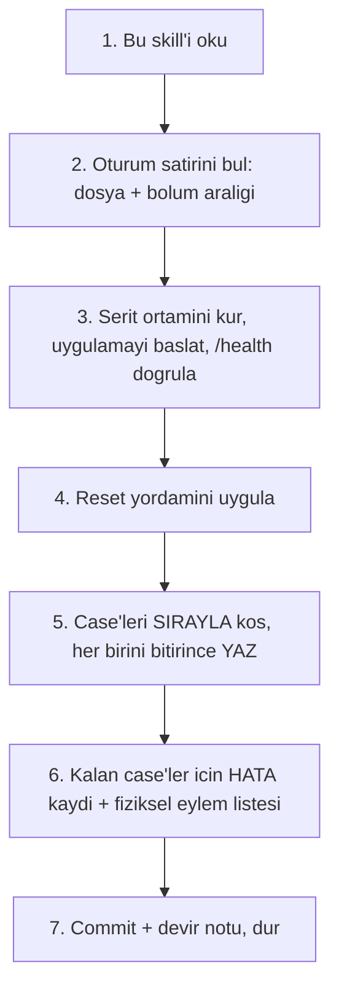
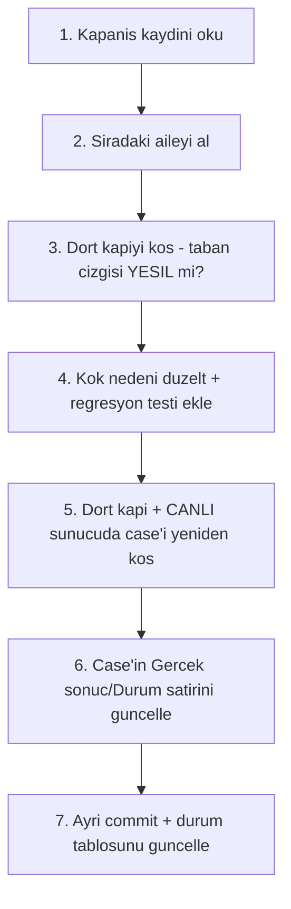

# Manuel Kabul Testi Koşumu

`docs/manuel-test/` yayın öncesi **elle** koşulan kabul setidir. Otomatik
testlerin yakalamadığı şeyi yakalar: gerçek sağlayıcı, gerçek tarayıcı, gerçek
veritabanı, gerçek insan yolu. Sekiz fazda gerçek hatalar **yalnız** orada
çıktı (K-166, K-167).

Bu skill setin **tamamının** koşumunu yönetir. Tek bir fazın kendi case'lerini
eklemek başka bir iştir — `faz-tamamlama` Adım 6.

## İki mod

| Mod | Ne zaman | Bölüm |
|---|---|---|
| **Koşum** | Case'ler koşulacak | §1 – §5 |
| **Kapanış** | Koşum bitti, kusurlar kodlanacak | §6 – §8 |

İkisi **karışmaz**. Koşum sırasında kod değiştirilmez (§1.1); kapanış sırasında
yeni case koşulmaz, yalnız düşenler yeniden koşulur.

---

## 1. Değişmez kurallar

Pazarlığa açık değildir. Her oturum bu kurallarla açılır.

### 1.1 Koşum sırasında kod değiştirilmez

Koşum ajanı `src/`, `samples/`, `tests/` altında **hiçbir dosyayı
değiştirmez**. Bir kusur bulduğunda:

1. Kaynağı **okur** ve kök nedeni bulur (`grep`, `Read` serbest).
2. Bulguyu case'in `Gerçek sonuç` alanına yazar — log alıntısı, `dosya.cs:satır`.
3. `Durum` satırını `☑ Kaldı` işaretler.
4. Şeridin sonuç dosyasına `HATA-S<N>-NNN` kaydı ekler.
5. **Koşmaya devam eder.**

Gerekçe: şeritler paralel çalışır. Bir şeridin kod düzeltmesi diğerinin koştuğu
ikiliyi değiştirir ve sonuçlar karşılaştırılamaz hâle gelir. Düzeltmeler koşum
bittikten sonra kapanış modunda yapılır (§6).

**Tek istisna:** Bir case'in **beklenen sonucu** koda göre yanlışsa (doküman
kusuru, ürün kusuru değil), `Beklenen sonuç` düzeltilir ve gerekçesi
`Gerçek sonuç` alanına yazılır. `AGENTS.md` kuralı: doküman ile kod çelişirse
doküman yanlıştır.

### 1.2 `user-secrets` yazılmaz — ortam değişkeni kullanılır

`dotnet user-secrets` deposu `UserSecretsId` ile **makine genelinde tektir**.
Şeritler onu paylaşır; biri yazarken diğeri okur. Senaryolarda geçen her
`dotnet user-secrets set/remove` adımı şeridin **kendi ortam değişkenine**
çevrilir:

```bash
export AgentPrism__PostgreSql__ConnectionString="..."
export AgentPrism__Sqlite__ConnectionString=""      # remove = bos deger
```

Ortam değişkeni `user-secrets`'ı **ezer** (ASP.NET Core yapılandırma sırası).
Boş değer "kayıtlı değil" demektir. `dotnet user-secrets list` ile **okumak**
serbesttir; anahtar hiçbir dosyaya, hiçbir loga yazılmaz.

> Bu bir sapmadır ve her oturumun sonuç dosyasına bir kez yazılır.

### 1.3 Yalnız kendi şeridinin kaynağına dokunulur

| Kaynak | Kural |
|---|---|
| Senaryo dosyaları | Bir dosya **tek** şeride aittir. Başka şeridin dosyasına yazma. |
| PostgreSQL | Yalnız kendi şemanı düşür (`mt_s<N>`) — **asla** `agentprism` şemasını değil. |
| SQLite | Yalnız kendi worktree'ndeki `.db` dosyası. |
| SQL Server | Yalnız kendi veritabanın (`AgentPrism_S<N>`). |
| Docker container | **Durdurma, silme, yeniden başlatma yok.** Paylaşılırlar. |
| Küresel kayıt (`dotnet new install`, yerel NuGet feed) | Yalnız o dosyayı koşan ajan dokunur. |
| Port | Yalnız kendi portun. |

### 1.4 Ne zaman kullanıcıya sorulur

Ajan şu durumlarda **durur ve sorar** — varsayım yapmaz:

1. Bir kimlik bilgisi yok ya da çalışmıyor (sağlayıcıdan `401`/`403`).
2. Bir case fiziksel eylem ister: mikrofon, hoparlör, göz denetimi.
   → Önce fiziksel eylem listesine ekle; oturum sonunda topluca sor.
3. Bir case paylaşılan bir kaynağı bozacak: container durdurma, küresel şablon
   kaydı, `agentprism` şeması, repo'nun `NuGet.config` dosyası.
4. Beklenen sonuç iki farklı biçimde okunabiliyor ve hangisinin doğru olduğu
   koddan çıkmıyor.
5. **Kritik** bir kusur bulundu ve aynı kök neden sonraki 5+ case'i bloklayacak.
   (Kusuru kaydet, sonra sor: "bu şeridin kalanını atlayayım mı?")
6. Gerçek sağlayıcı çağrısı beklenenden çok tüketiyor (bir case 20+ çağrı).

Sormak ucuzdur. Yanlış varsayımla 40 case koşmak pahalıdır.

### 1.5 Maliyet

Gerçek sağlayıcı çağrısı yapan case'ler **en ucuz modelle** koşulur — örnek
uygulamanın varsayılanları zaten budur. Model çağrısı gerekmeyen her yerde
`echo` sağlayıcısı kullanılır. Bir case açıkça büyük model isterse (yapısal
çıktı, uzun bağlam, akıl yürütme) gerekçesi `Gerçek sonuç` alanına yazılır.

---

## 2. Turu aç

Bir koşum turu **tarihle** adlanır ve kendi kayıt dizinini alır (K-414):

```
docs/manuel-test/                      spec — case metinleri, TURDAN BAGIMSIZ
docs/manuel-test/kosumlar/<YYYY-AA-GG>/   O TURUN kaydi (Gercek sonuc + Durum)
docs/arsiv/manuel-test-kosum-<YYYY-AA>/   Tur kapandiginda kayit buraya taşınır
```

Spec dosyalarında `Durum:` satırı **yoktur**. İkinci bir koşum spec'i üzerine
yazmaz; `kosumlar/` altında yeni bir kardeş dizin açar.

Tur açılışı:

1. `docs/manuel-test/00-INDEKS.md` — ortam kurulumu, fixture verisi, önem
   dereceleri, hata bildirim şablonu. **Tek kaynak budur**, bu skill onu
   tekrarlamaz.
2. `kosumlar/<tarih>/` dizinini aç; her spec dosyası için bir kardeş kayıt
   dosyası.
3. Şerit kurulumu: [`resources/serit-kurulumu.md`](resources/serit-kurulumu.md)
   — worktree, port, şema, ortam bloğu, reset yordamı.
4. Şerit dağılımını yaz: hangi şerit hangi dosyaları alır, kaç oturum.
   Bölme noktaları dosyaların kendi `#` bölüm başlıklarıdır — bir bölümün
   ortasında oturum bitmez.

---

## 3. Koşum oturumu protokolü

Her oturum şu yedi adımı uygular. Adım atlanmaz.



**Adım 5 kuralı:** Bir case bitince sonucu **hemen** yaz. Oturum sonunda toplu
yazma yok — bütçe biterse yazılmamış her şey kaybolur.

**Adım 7 kuralı:** Oturum kendi dalında commit eder ve devir notunu sonuç
dosyasının başına yazar: nerede kalındı, sonraki oturum neyle başlamalı, hangi
ön koşul bozuk kaldı.

### Oturum bütçesi

| Oturum türü | Case sayısı |
|---|---|
| Saf CLI (`curl`, `psql`, `dotnet`) | ~40 |
| Karışık (birkaç arayüz case'i) | ~28 |
| Arayüz ağırlıklı (Playwright) | ~18 |

Bütçe aşılırsa oturum **durur** ve kaldığı yeri devir notuna yazar. Yarım
okunan bir case'in sonucu yazılmaz.

---

## 4. Sonuç kaydı

### 4.1 Case kaydı (birincil)

```markdown
**Gerçek sonuç**
`valid:true`, `messages:[]`. `GET /api/agents` sonrasında kayıt yok — beklendiği gibi.

**Durum:** ☐ Beklemede · ☑ Geçti · ☐ Kaldı · ☐ Atlandı
```

`Gerçek sonuç` **gözlenen** şeyi yazar, beklentiyi tekrarlamaz. Kaldıysa log
alıntısı ve `dosya.cs:satır` referansı taşır.

### 4.2 Şerit sonuç dosyası

Başlık bloğu (koşulan dosya, ortam, sayım, devir notu) + yalnız `Kaldı`
case'lerin `HATA-NNN` kayıtları (`00-INDEKS.md` hata şablonu). Hata numarası
**şerit önekiyle** verilir (`HATA-S2-001`) — böylece şeritler aynı numarayı
üretmez.

### 4.3 Fiziksel eylem listesi

Ajanın koşamadığı her case sonuç dosyasının sonuna yazılır:

```markdown
| Case | Neden | Kullanıcıdan istenen |
|---|---|---|
| MT-MM-091 | Hoparlör çıktısı | Üretilen `.mp3` dinlenir, ses anlaşılır mı? |
```

Bu case'ler `☑ Atlandı` **değil**, `☐ Beklemede` kalır — koşulmadılar.

---

## 5. Playwright kuralları (arayüz oturumları)

| Kural | Neden |
|---|---|
| Önce `browser_snapshot`, sonra tıkla | Erişilebilirlik ağacı ekran görüntüsünden ucuz ve kararlıdır. |
| Ekran görüntüsü **yalnız** kanıt gerektiğinde | Her adımda görüntü almak oturum bütçesini bitirir. |
| Kanıt yolu `docs/manuel-test/kanit/S<N>/<case>.png` | Sonuç dosyası bu yolu referans verir. |
| Konsol hatası her case'te kontrol edilir | `browser_console_messages` — sessiz JS hatası "Geçti" gibi görünür. |
| Dar ekran testi `browser_resize` ile | Gerçek cihaz gerekmez. |
| Tema/dil geçişi arayüzden yapılır | Depoyu elle değiştirme; kullanıcı yolunu test ediyorsun. |
| Site verisi temizleme | Yeni bağlam aç ya da `localStorage.clear()` + yenile. |

Ekran okuyucu (VoiceOver) case'leri **kullanıcıya** gider — §4.3 tablosuna yazılır.

---

## 6. Kapanış protokolü

Koşum bitince kusurlar **aile aile** kapatılır. Aile = aynı kök nedeni paylaşan
case kümesi. Bir oturum **bir aile** bitirir.



| Kural | Gerekçe |
|---|---|
| **🚨 Düzeltmeden önce kusuru ampirik olarak yeniden üret.** | Kusurların bir kısmı önceki dalgalarda **zaten kapanmıştır**; 2026-08 turunda üç kusur böyle çıktı. Varsayma, ölç. |
| Bir oturum bir aile bitirir. Aile ortasında bırakma. | Aile sınırı kesme noktasıdır; yarım aile sonraki oturumu yanıltır. |
| Her aile **ayrı commit**. | Geri alınabilirlik (K-400..K-407 turunun yordamı). |
| Eski `Gerçek sonuç` **silinmez**; altına `---` ve yeni koşum notu eklenir. | Kusurun tarihçesi en değerli bilgidir. |
| Kök neden düzeltilir, semptom değil. Aynı sınıfın diğer örnekleri taranır. | `kusur-giderme` skill'i — SINIF TARAMASI. |
| Dört kapı kırmızıysa iş **bitmemiştir**. | `AGENTS.md`. |

> 🚨 **`dotnet test --no-build` kırık build'de ESKİ ikiliyi koşar ve yanlış
> yeşil verir.** `--no-build` kullanmadan önce build'in başarılı olduğunu
> doğrula. Bu tuzağa 2026-08 turunda bir kez düşüldü.

Yeni bir **yetenek** isteyen bulgular kodlanmaz — faz adayı olarak
[`docs/ADAYLAR.md`](../../../docs/ADAYLAR.md)'ya yazılır. Kodlanabilir olan her
şey kodlanır (kullanıcı kararı, 2026-08-14).

---

## 7. Bitti tanımı

> 🚨 **Sayım satır değil, CASE bazında yapılır.** Yeniden koşulan bir case
> **iki** `Durum:` satırı taşır (önce `Kaldı`, sonra `Geçti`); satır sayan bir
> `grep` onu iki kez sayar. Aşağıdaki betik her case'in **son** işaretini alır.

```bash
python3 - <<'PY'
import pathlib, re
from collections import Counter
K = pathlib.Path("docs/manuel-test/kosumlar/<YYYY-AA-GG>")
CASE, DURUM = re.compile(r"^## (MT-[A-Z0-9]+-\d+)"), re.compile(r"^\s*\*\*Durum:\*\*(.*)")
c, acik = Counter(), []
for p in sorted(K.glob("[0-2]*.md")):
    L = p.read_text(encoding="utf-8").split("\n")
    b = [i for i, s in enumerate(L) if CASE.match(s)] + [len(L)]
    for k in range(len(b) - 1):
        ad = CASE.match(L[b[k]]).group(1)
        d = [x for i in range(b[k], b[k+1]) if (m := DURUM.match(L[i]))
             for x in ("Beklemede", "Geçti", "Kaldı", "Atlandı")
             if re.search(r"[☒☑]\s*" + x, m.group(1))]
        s = d[-1] if d else "İŞARETSİZ"
        c[s] += 1
        if s in ("Beklemede", "İŞARETSİZ"):
            acik.append(f"{ad} ({p.name}) -> {s}")
print(dict(c), "toplam:", sum(c.values()))
print("ACIK:", *acik, sep="\n  ")
PY
```

Tur **bitti** sayılır:

- [ ] Sayım betiği koşuldu; `Beklemede` ve `İŞARETSİZ` case'lerin her biri ya
      kapandı ya gerekçesiyle açık kalem olarak `00-INDEKS.md`'ye yazıldı
- [ ] Dört doğrulama kapısı sıfır uyarı verir
- [ ] `python3 scripts/dokuman-bakim.py` çıkış kodu 0
- [ ] `secret` taraması temiz (`faz-tamamlama` komutu)
- [ ] Her kusur `docs/KARARLAR.md`'ye gerekçesiyle yazıldı, indeks üretildi
- [ ] Tuzaklar `docs/hafiza/<alan>.md` dosyalarına yazıldı — **bu adım
      atlanırsa ders kaybolur**; 2026-08 turunda bir ders bu yüzden yalnız kod
      yorumunda kaldı
- [ ] Yetenek isteyen bulgular `docs/ADAYLAR.md`'ye F-NN olarak eklendi
- [ ] `kosumlar/<tarih>/` kaydı ve tur talimatları `docs/arsiv/` altına taşındı
- [ ] Kalıcı `Kaldı` ve ortam bekleyen case'ler `00-INDEKS.md`'nin açık kalem
      tablosuna yazıldı
- [ ] `git worktree remove` ile şerit çalışma kopyaları silindi

---

## 8. Nereye ne yazılır

| Bilgi | Yer |
|---|---|
| Case metni (ön koşul, adım, beklenen sonuç) | `docs/manuel-test/<NN>-<ALAN>.md` — **turdan bağımsız** |
| Ortam kurulumu, fixture, önem derecesi, hata şablonu | `docs/manuel-test/00-INDEKS.md` |
| Açık kalemler (kalıcı `Kaldı`, ortam bekleyen) | `docs/manuel-test/00-INDEKS.md` |
| Bir turun `Gerçek sonuç` + `Durum` kaydı | `docs/manuel-test/kosumlar/<tarih>/` |
| Kapanmış turun tam kaydı | `docs/arsiv/manuel-test-kosum-<YYYY-AA>/` |
| Kusurun karar gerekçesi | `docs/KARARLAR.md` |
| Tekrar bedel ödeten teknik tuzak | `docs/hafiza/<alan>.md` |
| Yetenek isteyen bulgu | `docs/ADAYLAR.md` — F-NN |
| Koşum ve kapanış protokolü | **bu dosya** |
