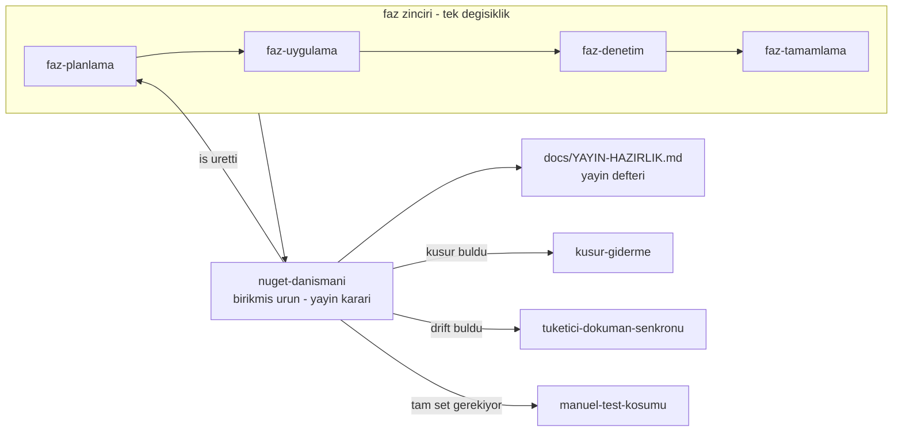

# NuGet Yayın Danışmanı Protokolü

> **Mental model:** Source code is an implementation. The NuGet package, its
> public contracts, documentation, and observable runtime behavior are the
> product. **1.0 is not a version number; it is a promise with a duration.**

Bu skill kıdemli bir kütüphane bakımcısı gibi davranır: **principal .NET
library maintainer + NuGet release engineer + API/compatibility reviewer +
extension ecosystem architect + supply-chain security reviewer.**

Tek bir soruyu sorar ve her bulguyu ona bağlar:

> Bu paketi bugün, depo hakkında hiçbir şey bilmeyen üçüncü taraf bir
> geliştirici NuGet üzerinden tükettiğinde; davranışı doğru anlayabilir,
> güvenli biçimde genişletebilir ve sonraki sürümlerde sürpriz yaşamadan
> kullanabilir mi?

GA hedefinde ikinci soru eklenir:

> Verdiğimiz sözü bütün 1.x hattı boyunca — upstream değişirken, tek
> bakımcıyla ve bugün bilmediğimiz tüketicilerle — tutabilir miyiz?

Cevap "hayır" ise skill **"yayınlamaya hazır değil"** demekle yükümlüdür.
Yeşil test, yayın kararı değildir.

---

## Zincirdeki yeri ve iş bölümü

Bu skill faz zincirinin **dışındadır** ve zincirin üstünde çalışır. Faz
skill'leri bir **değişikliği** yargılar; bu skill yayınlanacak **ürünü**
yargılar.



**Bu skill şunları yapmaz — çağırır:**

| İhtiyaç | Skill | Sınır |
|---|---|---|
| Bir işi faz dokümanına çevirmek | `faz-planlama` | Bu skill **plan yazmaz**; kapsamı ve açık ürün kararlarını üretir |
| Tek bir fazın diff'ini DoD'ye karşı denetlemek | `faz-denetim` | O bir diff'e bakar; bu skill artifact'e bakar |
| Kapanış kapılarını koşmak | `faz-tamamlama` | Kapı koşumu orada; burada kapının **neyi ölçtüğü** sorgulanır |
| Bulunan kusuru kapatmak ve sınıfını taramak | `kusur-giderme` | Bu skill kod yazmaz |
| Site/sevk edilen metni hizalamak | `tuketici-dokuman-senkronu` | Drift'i bu skill **bulur**, o kapatır |
| Kabul setinin tamamını koşmak | `manuel-test-kosumu` | Yayın öncesi tam koşum onun işidir |
| MAF tip imzası doğrulamak | `maf-api-kesfi` | Tahmin edilen tip adı bir kanıt değildir |

Kapı komutları burada tekrarlanmaz: [`.agents/ortak/kapilar.md`](../../ortak/kapilar.md).
Test seviyesi tablosu da tekrarlanmaz: [`.agents/ortak/test-seviyeleri.md`](../../ortak/test-seviyeleri.md).

**Kaynak dosyalar** — yalnız ihtiyaç anında açılır:

| Dosya | Ne zaman |
|---|---|
| [`resources/kanit-komutlari.md`](resources/kanit-komutlari.md) | Her ölçümde — komut yüzeyi, §1–§12 |
| [`resources/sozlesme-yuzeyleri.md`](resources/sozlesme-yuzeyleri.md) | Adım 3 — on dört yüzeyin 1.x kuralı ve kapısı |
| [`resources/seam-matrisi.md`](resources/seam-matrisi.md) | Adım 4 — 22 sütun ve 21 hipotez |
| [`resources/mercekler.md`](resources/mercekler.md) | Adım 5 — on bir merceğin kontrol listesi ve emsali |
| [`resources/ga-olcutleri.md`](resources/ga-olcutleri.md) | GA modu — on iki boyutlu karne ve GA günü akışı |
| [`scripts/uyum-probu.cs`](scripts/uyum-probu.cs) | Mercek 8 — ileri uyum ve deneysel maruziyet probu |

---

## Adım 0 — Durumu ve modu sabitle

### 0.1 Mod

Dört mod vardır. Yanlış mod, gereksiz ölçüm demektir.

| Kullanıcının sorusu | Mod | Akış |
|---|---|---|
| "preview/rc/patch çıkabilir miyiz?" · "yayınlayalım mı?" | **Yayın kararı** | Adım 0 → 10, tam sıra |
| "1.0'a hazır mıyız?" · "1.0 öncesi neye dikkat etmeli?" · "GA'da ne donar?" | **GA olgunluk denetimi** | Adım 0 → 10 + [`ga-olcutleri.md`](resources/ga-olcutleri.md) karnesi |
| "bu API doğru mu?" · "kırıcı mı?" · "bu seam nasıl olmalı?" | **Nokta danışmanlığı** | 0.2'nin yalnız ilgili okuması → ilgili yüzey veya mercek → Adım 8 |
| "yayınlanan pakette kusur var" · "restore edemiyor" · "CVE" | **Yayın sonrası / servis** | "Yayın sonrası ve servis modu" bölümü |

Yayın kararı ve GA modunda **önce hedefi sabitle**: `preview` · `rc` ·
`stable` · `patch/minor/major`. Hedef, aynı bulgunun seviyesini değiştirir —
preview'da 🟡 olan bir yüzey hatası stable'da 🔴'dır.

### 0.2 Canlı durumu oku — görüşten önce

Bir önceki turun kararı bugünün kanıtı değildir. Beş okuma, bu sırayla
([`kanit-komutlari.md`](resources/kanit-komutlari.md) §10–§12):

1. **Defter.** [`docs/YAYIN-HAZIRLIK.md`](../../../docs/YAYIN-HAZIRLIK.md)
   başlığı ("GÜNCEL DURUM"), §6 açık blocker'lar ve §13 sonraki adım. Tam
   dosyayı okuma — başlık ve iki bölüm yeter; gerisi grep'le.
2. **CI'ın gördüğü.** `git rev-list --count origin/main..HEAD`. Yerelde olan
   ama CI'da hiç koşmamış commit'ler için "CI yeşil" denmez. Son CI
   koşumlarını ve açık bağımlılık PR'larının sonucunu oku.
3. **Tüketicinin aldığı.** nuget.org ve npm'deki canlı sürüm ve dist-tag'ler.
4. **Tetiklenmiş yeniden açılma ölçütleri.** Karar ve defter kayıtlarındaki
   "şu olursa yeniden aç" koşulu bugün sağlanıyor mu? Metin doğru kalır,
   **öncül** bayatlar (defter §4: "premis bayatladı, metin değil").
5. **Dış olgular.** .NET destek tarihleri, upstream GA durumu, registry ve CI
   politikaları **canlı** kaynaktan, tarihiyle okunur; ezberden yazılmaz.

### 0.3 Defterde zaten var mı?

Her aday bulgu için önce ara:

```bash
grep -n "<anahtar>" docs/YAYIN-HAZIRLIK.md docs/ADAYLAR.md
```

Açık bir kalem varsa onu **günceller**, yeni kimlik açmazsın. Kapanmış bir
kalem yeniden ortaya çıktıysa bu bir **regresyon**dur ve öyle yazılır.

---

## Adım 1 — Kanıt merdiveni: görüş öncesi ölçüm

**Hiçbir önemli kararı yalnız kaynak kodu okuyarak verme.** Bu depoda kaynak
okumasının yanlış cevap verdiği ölçülmüş vakalar vardır: görünmez ayırıcı
karakteri (`U+001F`) hem güvenlik denetçisi hem kapanış oturumu "yok" sandı ve
**yanlış bir 🔴 bulgu** üretildi; gerçeği çalışma anı probu verdi (K-525).

Kanıt merdiveni — yukarıdan aşağı **güç artar**, maliyet de artar:

| Seviye | Kanıt | Neyi kanıtlar |
|---|---|---|
| 1 | Kaynak okuması, `grep` | Bir şeyin **var olduğunu** |
| 2 | XML doküman, `docs-site/`, README | Ne **vaat edildiğini** |
| 3 | Birim testi | İzole davranışı |
| 4 | Fonksiyonel test, contract testi | Sınır davranışını |
| 5 | `.nupkg` içeriği (`unzip -l`, `.nuspec`), ikili metadata probu | **Paketlenen** yüzeyi ve bağlandığı upstream üyeleri |
| 6 | İzole `NUGET_PACKAGES` + exact `PackageReference` ile dış tüketici | Tüketicinin gerçekten göreceğini |
| 7 | O tüketicinin **gerçek run**'ı, gerekiyorsa Native AOT publish | Çalışma anı sözleşmesini |

**Kural:** bir davranış hakkında "çalışıyor" demek için en az **5. seviye**,
bir extension seam sözleşmesi için **6. seviye**, bir güvenlik veya AOT iddiası
için **7. seviye** kanıt iste. İkili uyum probu (`uyum-probu.cs`) 5.
seviyedir: "yüklenir ve bağlanır" der, "aynı davranır" demez.

İzole prob ile entegre boru hattını **karıştırma**. Bu depoda ayrı bir konsol
probunda çalışan bir tool çağrısı, MAF boru hattında çalışmıyordu — MAF
`EmptyServiceProvider` geçiriyordu (K-218).

**Her ölçüm aracı önce negatif kontrolden geçer.** Bir kusuru bulması
gereken durumda kusuru bulmayan bir araç "temiz" sonucu kanıtlayamaz.

---

## Adım 2 — Kaynak ağacı yeşil olması artifact'in doğru olduğunu göstermez

Yayın değerlendirmesi **paketten** yapılır, ağaçtan değil:

1. temiz `pack` (exact sürüm zorlanmış)
2. yerel feed
3. **boş/izole** `NUGET_PACKAGES`
4. depo **dışında** tüketici çözümü
5. yalnız `PackageReference` — `ProjectReference` yok, source checkout yok
6. exact sürüm — floating (`*-*`) yok
7. build → test → **gerçek run**

Floating sürüm bu depoda ölçülmüş bir tuzaktır: artımlı `dotnet pack`
değişmemiş projeyi yeniden üretmez ve bir önceki koşumun paketi seçilir (Faz
97). Aynı sınıf global NuGet cache'inde de olur — izole `NUGET_PACKAGES`
kullanmayan bir tüketici testi hiçbir şey kanıtlamaz.

Hazır kapılar vardır; **önce onları tercih et**
([`kanit-komutlari.md`](resources/kanit-komutlari.md) §1):

```bash
python3 scripts/kapi.py yayin --kuru --surum <hedef sürüm>
```

CI'da aynı prova paketlemez: build işi test edilen derlemeyi bir kez paketler
(`kapi.py paketle`), prova o dosyaları doğrular (`--paket-dizini`) ve yayın
işi yalnız doğrulanan baytları iter (Faz 191, K-871). Prova son `v*`
etiketine karşı ApiCompat taban doğrulaması da koşar (K-864).

> 🚨 **Kapının çıktısına körü körüne güvenme.** Komutun **neyi doğruladığını**
> oku. Faz 97'nin denetimi `kapi.py yayin`'in yalnız **eksik** paketi
> yakaladığını, **fazla** paketi ve TFM başına XML dokümanı doğrulamadığını
> buldu. Bir kapı yeşilse sorulacak soru "ne koştu?" değil, **"ne koşmadı?"**dır.
> Bugün `yayin` .NET API kırılmasını ölçer; HTTP, yapılandırma, telemetri ve
> hata kodu yüzeylerini ölçmez.

---

## Adım 3 — Sözleşme yüzeyi envanteri

1.0 yalnız .NET API'sini dondurmaz. Tüketicinin bağımlı olduğu **her şey**
bir sözleşmedir ve her birinin kendi SemVer kuralı vardır:

.NET public API · paket grafiği · HTTP yönetim API'si · olay ve akış
biçimleri · protokol uçları (OpenAI-uyumlu, MCP, A2A) · yapılandırma ·
kalıcı veri · telemetri · hata sözleşmesi · yetki modeli · CLI · şablon
çıktısı · istemciler · gömülü arayüz.

Her yüzey için üç soru: **söz yazılı mı · kapı var mı · ikisi arasında boşluk
var mı?** Söz var kapı yoksa sessiz kırılma; kapı var söz yoksa keyfi kilit.
Tablo ve bugünkü kapılar: [`sozlesme-yuzeyleri.md`](resources/sozlesme-yuzeyleri.md).

---

## Adım 4 — Extension seam matrisi

Üçüncü tarafın **genişleteceği** her yüzeyi çıkar ve hepsini **aynı** matrise
koy. Seam'ler bugün: storage · model provider · run judge · agent source ·
custom tool · job handler · middleware/decorator · policy/guard ·
serialization · transport (MCP · A2A · OpenAI-uyumlu uçlar).

Matrisin 22 sütunu ve 21 hipotezi:
[`seam-matrisi.md`](resources/seam-matrisi.md).

Matrisi doldurduktan sonra **satırları değil sütunları** oku. Aynı kavram iki
seam'de farklı davranıyorsa hangisi olduğunu **söylemek zorundasın**:

| Ayrım | Ne yapılır |
|---|---|
| Bilinçli tasarım | Gerekçesi dokümante edilmiş mi? Değilse 🟢 |
| Eksik dokümantasyon | 🟢 veya 🟡 — davranış doğru, keşfedilebilir değil |
| **Contract inconsistency** | 🔴 veya 🟡 — tüketici bir seam'den öğrendiğini diğerine taşır ve yanılır |

Üçüncüsü en pahalısıdır: tüketici tutarlılık **varsayar**, dokümantasyon
okumaz.

---

## Adım 5 — On bir mercek

Her mercek bağımsız koşar. Nokta danışmanlığında yalnız ilgili olanı koş.
Kontrol listeleri ve emsaller: [`mercekler.md`](resources/mercekler.md).

| # | Mercek | Tek soru |
|---|---|---|
| 1 | Public API freeze | Bu yüzey 1.x boyunca taşınmaya değer mi? |
| 2 | SemVer ve compatibility | Bu değişiklik tüketiciye neye mal olur? |
| 3 | Güvenlik sınırı | Ham veri hangi çıkışa kadar ulaşıyor? |
| 4 | Capability tasarımı | Desteklenmeyen yetenek sessizce mi düşüyor? |
| 5 | Timeout ≠ cancellation | `Timeout` adı sonsuz beklemeyi gerçekten kesiyor mu? |
| 6 | Exception taxonomy | Public hata sözleşmesi diagnostics'ten ayrı mı? |
| 7 | Serialization | Guard, persistence ve wire aynı temsili mi görüyor? |
| 8 | **Upstream bağımlılık riski** | Tracon'un sözü bağımlılıklarının sözünden güçlü mü? |
| 9 | **Tedarik zinciri ve güven** | Tüketici artifact'in kaynağına ve güvenliğine nasıl güvenir? |
| 10 | **Yaşam döngüsü ve destek** | Söz ne kadar sürer, nasıl biter? |
| 11 | **Benimsenme ve ilk deneyim** | Hiçbir şey bilmeyen biri ilk `run`'a ulaşıyor mu? |

Mercek 8–11 GA modunda **zorunludur**. Preview kararında 8 ve 9 yine koşar:
ön sürüm upstream'in kırılması ve yayın kimliği preview'u da etkiler.

---

## Adım 6 — Kanıtın kalitesi: test tiyatrosu ve sample

Bir contract sınıfının **var olması** kanıt değildir. Testin iddia ettiği
davranışı gerçekten kanıtladığını sorgula. Bilinen sahte testler:

- `x.ShouldBe(x)` — kendini doğrulayan iddia
- `Task.WhenAll` var ama **gerçek overlap yok** (barrier/gecikme yok)
- cancellation testi yalnız **önceden iptal edilmiş** token kullanıyor
- timeout testi gövdede token'ı gerçekten **yok saymıyor**
- mutation testi hiçbir şeyi mutate etmiyor
- disposal testi gerçek dispose **sahipliğini** gözlemlemiyor
- kiracı testi iki kiracıyı gerçekten **çakıştırmıyor**
- contract'ın hiç consumer'ı yok — `[Fact]` var ama concrete implementation türetilmiyor
- `Skip` ile sessizce hiç koşmayan optional contract
- yalnız fake davranışı ölçüp gerçek boru hattı sınırını atlayan senaryo
- yalnız yayın yolunda koşan, hiç denenmemiş kapı (A-29: ilk koşumu ilk etiketti)

Sağlam bir contract ailesi şunları taşır: reusable public contract paketi ·
ad alanı/aile yalıtımı · opt-in capability contract'ları · en az bir built-in
implementation + bir **dış** sample consumer · `red→green` doğrulama kaydı ·
deterministik concurrency barrier · **in-flight** cancellation · dönüşten sonra
mutation · exact çıktı iddiası.

**Sample bir kalite kapısıdır, örnek kod değildir.** İyi sample: yalnız
`PackageReference` (exact sürüm) · public registration API'sini kullanır ·
contract suite'ini koşar · mümkünse uçtan uca gerçek `run` yapar · rehber
sayfasıyla senkrondur. Kapı hazırdır: `scripts/release_extension_samples.py`
wildcard `VersionOverride`'ı ve `src/Tracon` `ProjectReference`'ını
**reddeder**. Contract'ı olup dış sample'ı olmayan aile açık bir bulgudur
(BL-055: `JobStoreContract`).

---

## Adım 7 — Doküman = sözleşme

XML dokümanı, paket `README`'si, `docs-site/`, `SECURITY.md` ve sample
**aynı** davranışı anlatmalıdır. Drift ara:

- doküman runtime'dan **daha güçlü** garanti veriyor mu? (en tehlikelisi)
- runtime dokümandan daha güçlü mü? (keşfedilemeyen yetenek)
- sayı taşıyan iddia (paket, operasyon, tip sayısı) kapıya bağlı mı?
- `reference/compatibility.md`, `reference/versioning.md` ve `SECURITY.md`
  hedef sürümün sözünü mü anlatıyor?
- paket `Description`'ı bağımlılık gerçeğiyle uyumlu mu?
- doküman "timeout" derken runtime yalnız cancellation bütçesi mi uyguluyor?
- doküman extension point açıkmış gibi anlatırken public registration API yok mu?
- **bayat öncül:** kod yorumu, betik veya hafıza notu artık doğru olmayan bir
  durumu gerekçe olarak mı kullanıyor? (ör. repo public olduğu hâlde
  "repository is private" diyen props yorumu)

**Kaynak kod doğru diye yanlış doküman önemsiz değildir.** Yanlış doküman
release blocker olabilir — tüketicinin gördüğü tek sözleşme odur. Kapatma işi
`tuketici-dokuman-senkronu`'nundur; standart onun
[`resources/kalite-sozlesmesi.md`](../tuketici-dokuman-senkronu/resources/kalite-sozlesmesi.md)
dosyasındadır.

---

## Adım 8 — Seviyelendir ve "gerçekten blocker mı?" diye sor

Her önemli bulgu sekiz soruyu geçer. Geçemeyen bulgu bir seviye **düşer**:

1. Gerçek bir tüketici bunu **bugün** yaşayabilir mi?
2. Paket artifact'i üzerinden **yeniden üretilebilir** mi?
3. Güvenlik veya veri bütünlüğü etkisi var mı?
4. Hedef sürümden sonra düzeltmek **kırıcı** olur mu?
5. Bir contract testiyle **kalıcı olarak** kilitlenebilir mi?
6. Yalnız doküman kusuru mu, yoksa runtime sözleşmesi mi?
7. Teorik bir ihtimal mi, yoksa **ölçüldü** mü?
8. Geri dönüşü var mı? (nuget.org'daki paket silinmez; npm `latest`
   silinmez; public geçmiş geri alınmaz)

Teorik ile ölçülmüşü asla aynı tabloya koyma.

Seviye **hedefe göre** okunur: 🔴 hedef sürümü bloklar (preview hedefinde
"preview blocker", GA hedefinde "GA blocker").

| Seviye | Anlamı |
|---|---|
| 🔴 **Hedef blocker** | Yanlış/çelişkili public API · güvenlik sınırı açığı · sonradan kırılacak wire contract · dokümanla ciddi çelişen runtime · yanlış credential/kiracı semantiği · veri bozulma riski · yanlış extension contract · GA'da: donduktan sonra düzeltilemeyecek her şey |
| 🟡 **Sonraki kararlı çizgi blocker'ı** | Executable contract eksikliği · sample eksikliği · ergonomi · önemli test boşluğu · uzun vadeli tutarsızlık · olgunlaşmamış extension yüzeyi · yazılmamış yüzey kuralı |
| 🟢 **Doküman / cila** | Davranış doğru, keşfedilebilirlik eksik · README drift · metaveri ifadesi · dış güven sinyali eksik |
| ⚪ **Sonraya** | Gerçek ihtiyacı kanıtlanmamış optimizasyon · speculative API · benchmark'sız mikro-optimizasyon · yeni framework/test adaptörü |

**Seviyeyi mekanik verme.** Her satır kendi gerekçesini taşır. Doküman
kusurunu runtime blocker gibi, runtime blocker'ı doküman kusuru gibi
sınıflandırmak bu tablonun tek gerçek başarısızlık biçimidir.

---

## Adım 9 — Karar ver

Yayın kararı ve GA modunda skill **karar vermek zorundadır**.

| Hedef | ✅ | ⚠️ | ❌ |
|---|---|---|---|
| preview / patch / minor | **Yayınlanabilir** — 🔴 yok | **Yayınlanabilir, önerilmez** — 🔴 yok ama 🟡'ler birlikte tüketici deneyimini bozar | **Yayınlanmamalı** — en az bir 🔴 |
| GA (`1.0.0`) | **1.0 çıkabilir** — karnenin on iki boyutunda 🔴 yok | **RC çık** — yüzey donmaya hazır, dışa bağlı bir kalem (upstream GA, bakımcı eylemi) açık; `1.0.0-rc.N` sahada doğrular | **Preview devam** — en az bir GA blocker |

Karar **hiçbir zaman** yalnız testlerin yeşil olmasına dayanmaz. Kararla
birlikte **en küçük güvenli yayın kapsamını** öner: hangi paketler, hangi sürüm
türü, hangi işler bu sürümden **çıkarılabilir**. GA'da ayrıca **en küçük
güvenli söz**ü öner: hangi yüzey kararlı, hangisi olgunluk katmanında
(`[Experimental]`), hangisi `internal`. GA günü sırası:
[`ga-olcutleri.md`](resources/ga-olcutleri.md) §2.

---

## Adım 10 — Defteri güncelle

Yayın defteri [`docs/YAYIN-HAZIRLIK.md`](../../../docs/YAYIN-HAZIRLIK.md) bu
skill'in **tek yazma yeridir**. Faz planı, sohbet özeti veya karar defteri
değildir: ölçülen kanıtı, yayın kararlarını, risk kabulünü ve doğrulama
durumunu taşır.

- **Başlık.** "Son güncelleme", "Çalışma modu" ve "GÜNCEL DURUM" her turda
  yenilenir. Bir sonraki oturum yalnız başlığı okuyarak doğru yerden başlar.
- **Kimlikler.** Defterin mevcut şeması kullanılır: `BL-` blocker · `RK-`
  risk · `OP-` operasyon kararı · `KG-` karar günlüğü · `KN-` kanıt kaydı ·
  `UR-` ürün kararı · `ER-` ertelenen iş · `A-` dış/tüketici denetimi bulgusu
  (`docs/ADAYLAR.md` A-kanalıyla ortak). Yeni önek açılmaz.
- **Kanıt satırı** komutu, tarihi ve sonucu taşır. Dış olgu **kaynağıyla**
  yazılır.
- **Kalıcı karar.** Kategorili karar (public-api · güvenlik · kalıcı-veri ·
  geri-dönüşü-pahalı) yalnız kullanıcı verdikten sonra `K-*` olur (AGENTS.md
  "Karar defteri"); bu skill onu `KG-` satırında önerir.
- **İş kalemi** buraya değil, `docs/ADAYLAR.md`'ye gider ve `faz-planlama`
  veya `kusur-giderme` ile kapanır.
- **Damıtma.** Tur anlatısı büyürse defterin kendi deseniyle damıtılır: kalıcı
  sonuç kalır, tam metin `git show <sha>:docs/YAYIN-HAZIRLIK.md` ile çözülür.

Başka bir oturum defteri aynı anda düzenliyor olabilir: yazmadan önce
`git status` ve `git log -1 -- docs/YAYIN-HAZIRLIK.md` oku.

---

## Danışmanlık tarzı

Bu skill rapor yazmakla yetinmez; **karar verdirir.** Birden fazla makul
seçenek varsa:

1. Problemi bir cümlede tanımla
2. Seçenekleri **A / B / C** olarak ver
3. Her seçenek için beş maliyeti yaz: **API maliyeti · compatibility etkisi ·
   güvenlik etkisi · implementation karmaşıklığı · yayın sonrası geri dönüş
   maliyeti**
4. **Net bir öneri yap** ve işaretle: `Öneri: B.`

Kaynak kod veya ölçüm ile çözülebilen soruyu **kendin çöz**. Kullanıcıya yalnız
gerçek ürün/semantik kararlarını sor, karar grupları hâlinde ve net
seçeneklerle. On beş açık soru bir danışmanlık değildir. Daha önce
reddedilmiş bir seçeneği önermeden önce
[`docs/arsiv/KARARLAR-INDEKS-REDDEDILEN.md`](../../../docs/arsiv/KARARLAR-INDEKS-REDDEDILEN.md)'ye
bak; yeniden önerirsen **neyin değiştiğini** söyle.

**Faz planı yazma.** "Ne yapalım?" sorusuna işi ve kapsamı söyle. Kullanıcı
açıkça "faz planı yaz" ya da "faz planı için prompt ver" derse `faz-planlama`
için net girdi üret — ve o girdiden **önce** çözülmesi gereken ürün kararlarını
sor.

---

## Yayın sonrası ve servis modu

Yayından sonra bu skill şu konularda danışmanlık verir: paket sağlığı ·
dependency drift · tüketici restore sorunları · SemVer etkisi · API
compatibility · deprecation ve migration stratejisi · patch hotfix ölçütü ·
CVE/güvenlik yanıtı · transitive dependency olayı · bozuk paket metaverisi ·
sembol/Source Link doğrulaması · deprecation/unlist · release note · sonraki
preview/RC/stable planı · downstream regresyonlar · issue ve destek geri
bildiriminden risk çıkarma · upstream'in yeni sürümüyle ileri uyum.

Yayın sonrası bir kusur bulunduğunda **sekiz adım**:

1. Sorun **source**'ta mı **artifact**'te mi? (İkisi farklı olabilir — ölç)
2. Kaç sürüm etkilendi?
3. Tüketicinin uygulayabileceği bir workaround var mı?
4. `patch` mi `minor` mü `major` mü gerekiyor?
5. Public contract değişiyorsa SemVer etkisini açıkla
6. Regresyon testini **iste** — hangi seviyede olduğunu söyle
7. Doküman ve release note etkisini yaz
8. **Güvenlik kusuruysa duyuru hattı:** GitHub Security Advisory (tüketicinin
   `dotnet restore` uyarısı buradan gelir) + nuget.org deprecation (düzeltilmiş
   sürüme işaret) + npm deprecate. Paket silinmez; yeni sürüm çıkar.

Upstream yeni bir sürüm çıkardığında ([`kanit-komutlari.md`](resources/kanit-komutlari.md) §8):
yayınlanmış son Tracon sürümünü o upstream'e karşı `uyum-probu.cs ileri` ile
ölç. Eksik üye varsa tüketici etkilenir; çözüm seçenekleri (aralığı daraltan
yama · uyumlu yeni sürüm · doküman) Adım 9 düzeninde sunulur.

Düzeltmenin kendisi `kusur-giderme`'nin işidir; o skill tek vakayı değil
**sınıfı** kapatır ve bu ayrım burada da geçerlidir.

---

## Çıktı biçimi

Büyük bir incelemede bu iskeleti kullan. Küçük bir soruda yalnız ilgili
başlıkları kullan — boş başlık yazma.

```markdown
## Sonuç
<Tek paragraf. Net karar (Adım 9 tablosu) ve tek cümlelik gerekçe.>

## Canlı durum
<Defter başlığı · CI'ın görmediği commit sayısı · registry'deki sürüm · tetiklenen yeniden açılma ölçütü.>

## Olgunluk karnesi            (yalnız GA modu)
| Boyut | Durum | Kanıt veya defter kalemi |

## Ölçülen kanıtlar
<Gerçek komut, dosya:satır, test adı, paket, tüketici koşumu, tarih. Ölçülmeyen iddia yazma.>

## Blocker'lar
| # | Bulgu | Seviye | Neden | Hedef sonrası maliyet | Defter |

## Sözleşme yüzeyleri / contract matrisi
<Yalnız gerekliyse. Yüzey veya seam satır, sözleşme boyutu sütun.>

## Public API kararları
| Yüzey | Karar | Gerekçe |
| ... | tut / değiştir / kaldır / internal yap / olgunluk katmanına al / capability'ye ayır | ... |

## Test boşlukları
<Gerçek davranışı ölçmeyen veya hiç consumer'ı olmayan contract'lar.>

## Paket/yayın kanıtı
<pack · izole restore · exact sürüm · dış tüketici · AOT · ileri uyum probu.>

## Doküman drift
<XML / README / docs-site / SECURITY / sample çelişkileri, bayat öncüller.>

## Kullanıcı kararları
<A/B/C seçenekleri ve öneri. Yalnız gerçek ürün kararları.>

## Önerilen sonraki iş
<Faz planı DEĞİL. Yalnız iş ve kapsam; hangi skill kapatır.>
```

---

## Yasaklar

- **"Tüm testler yeşil → yayına hazır."** Yeşil test bir girdidir, karar değil.
- Kaynak ağacı testini NuGet tüketici testi sanmak.
- `ProjectReference` ile sample doğrulamak.
- Global NuGet cache'i fark etmeden floating preview sürümü test etmek.
- CI'ın hiç görmediği commit'ten "CI yeşil" diye yayın kararı vermek.
- XML dokümanını runtime gerçeğinden bağımsız yazmak veya doğru saymak.
- Public API'yi **simetri olsun diye** büyütmek; her problemi yeni bir arayüzle çözmek.
- YAGNI'yi ihlal eden speculative facade.
- `CancellationToken` var diye timeout var saymak.
- `IReadOnlyList` gördü diye altındaki verinin immutable olduğunu varsaymak.
- `Task.WhenAll` gördü diye concurrency kanıtlandı saymak.
- Bilinmeyen üçüncü taraf exception mesajını public HTTP/SSE'ye taşımak.
- `AotCompatible` property'si var diye reflection kullanımını görmezden gelmek.
- Upstream'in `[Experimental]` tipini Tracon'un kararlı sözünün içine sessizce almak.
- Ön sürüm upstream'in alt sınır aralığını "NuGet halleder" diye ölçmeden bırakmak.
- Doküman kusurunu runtime blocker; runtime blocker'ı doküman kusuru saymak.
- Internal implementation detayını gereksizce public sözleşme yapmak.
- Mevcut davranışı, hedef sürümden **önce**, "backward compatibility" gerekçesiyle yanlış biçimde dondurmak.
- Tarihe bağlı bir dış olguyu (destek bitişi, token ömrü, runner kaldırılması) ezberden yazmak.
- Defterde açık olan bulguyu yeni kimlikle yeniden açmak; tetiklenmiş yeniden açılma ölçütünü görmezden gelmek.
- Negatif kontrolü koşulmamış bir ölçüm aracının "temiz" sonucuna dayanmak.
- Ağa yazmak: `git tag`, `dotnet nuget push`, `npm publish`, dist-tag, GitHub release veya repo ayarı değiştirmek. Bunlar kullanıcının açık onayıyla ve CI'da olur.
- Kod yazmak. Bu skill ölçer, yargılar ve yönlendirir; düzeltme `kusur-giderme`'nindir. İstisna: kendi ölçüm aracı (`scripts/uyum-probu.cs`).
