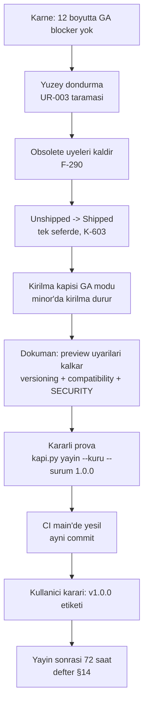

# 1.0 / GA Ölçütleri ve GA Günü Akışı

> `nuget-danismani` GA olgunluk denetimi modunun kaynak dosyasıdır. Skill
> **nasıl yargılanacağını** söyler; bu dosya **neyin sağlanması gerektiğini**
> ve **hangi sırayla** yapılacağını söyler.
>
> Bu bir iş listesi değildir. Her satır bir **ölçüttür**: ya ölçülmüş bir
> kanıtla ✅ olur ya da bir defter kalemine (BL-/A-/F-) bağlanır. Kalemin
> ayrıntısı defterde yaşar, burada tekrarlanmaz.

## 1. Karne — on iki boyut

Her boyut için durum yaz: ✅ ölçüldü ve sağlıyor · 🟡 açık ama GA'yı
bloklamaz · 🔴 GA blocker · ⚪ kapsam dışı (gerekçeli). Kanıtı olmayan ✅
yazılmaz.

| # | Boyut | GA ölçütü | Nereden ölçülür |
|---|---|---|---|
| 1 | Upstream hazırlığı | Doğrudan ön sürüm bağımlılığı **sıfır**; kararlı pack `NU5104` vermez | K-008 · K-602 · `kanit-komutlari.md` §8 |
| 2 | Upstream uyumu | Public imzada upstream `[Experimental]` tipi yok **veya** Tracon üyesi kendi `[Experimental]` kimliğini taşıyor; en yeni upstream GA'ya karşı ileri probu temiz | `uyum-probu.cs deneysel` · `uyum-probu.cs ileri` |
| 3 | Public API | Freeze taraması bitti (UR-003); kanıtsız tip gerekçeli (K-850); `Shipped` tek seferde dolduruldu (K-603); `[Obsolete]` üyeler kalktı (F-290) | `public-yuzey-envanteri.py` · `grep -rn "\[Obsolete" src` |
| 4 | Kırılma kapısı | `kapi.py yayin` 1.x minor'unda kırılmayı **durdurur**, notla geçirmez | K-864 · Mercek 2 |
| 5 | Sözleşme yüzeyleri | On dört yüzeyin her birinin 1.x kuralı yazılı; kapı boşlukları ya kapandı ya kabul edildi | `sozlesme-yuzeyleri.md` |
| 6 | Kalıcı veri | Her yayınlanmış preview veritabanı paketlenmiş 1.0'a yükselir; durum zarfı okunur | `tracon state-check` · packed tüketici |
| 7 | Artifact | Tam `kapi.py yayin --kuru` yeşil; altı dış sample + AOT smoke; CI'ın kendisi bu commit'i gördü | `kanit-komutlari.md` §1 · §10 |
| 8 | Güvenlik | Açık 🔴 güvenlik bulgusu yok; `SECURITY.md` 1.x destek tablosunu ve GHSA hattını anlatır | Mercek 3 · Mercek 9 |
| 9 | Tedarik zinciri | Yayın kimliği kısa ömürlü (NuGet ✅, npm?); lisans bildirimleri pakette; provenance/SBOM kararı verildi | Mercek 9 · `kanit-komutlari.md` §9 |
| 10 | Süreklilik | Yayın organizasyonunda ikinci yetkili (BL-057) | 👤 bakımcı beyanı + nuget.org |
| 11 | Yaşam döngüsü | TFM kümesi sabit (K-855); destek penceresi ve deprecation politikası yayınlandı; doküman sürüm ayrımı çözüldü | Mercek 10 |
| 12 | İlk deneyim | Temiz makinede şablon → ilk `run` yeşil; paket sayfaları doğru | Mercek 11 |

**Karar kuralı.** 🔴 tek bir boyutta bile varsa GA çıkmaz. 🔴 yoksa ama
upstream veya operasyon kalemi dışarıya bağlıysa **RC** çıkar: yüzey donar,
saha doğrular, GA RC'nin aynısıdır.

## 2. GA günü akışı

Sıra bir sözleşmedir: bir adım öncekinin kanıtını tüketir. Etiket **en son**
adımdır ve kullanıcının kararıdır.

Adım notları:

- **Yüzey dondurma.** Donacak yüzey küçüldükçe söz ucuzlar. Kaldırılacak veya
  olgunluk katmanına alınacak her tip **bu adımda** karara bağlanır; sonrası
  major'dır.
- **`Shipped` dolumu.** Tek commit'te, yalnız dosya taşıması. Aynı commit'e
  davranış değişikliği girmez — diff'in okunabilir kalması için.
- **Kırılma kapısının GA modu.** Taban son `v*` etiketidir; `1.0.0`'dan
  sonraki ilk minor, `1.0.0`'a karşı kırılmasız olmalıdır. Kapının bu modda
  **kırmızı** olduğunu bir deneme kırılmasıyla göster (negatif kontrol).
- **Doküman.** `Tracon is published as 1.0.0-preview.N` notları, "pre-1.0
  package family" cümleleri ve `--prerelease` kurulum komutları kalkar; npm
  `latest` kararlı sürüme geçer (defter §4, A-42 emsali).
- **Kararlı prova.** `--surum 1.0.0` ile koşulur; `NU5104` burada ilk kez
  gerçek kararlı pack'te sınanır.
- **CI main'de yeşil.** Yerelde yeşil olan ama `origin`'e itilmemiş commit
  bir yayın adayı değildir (`kanit-komutlari.md` §10).

## 3. GA sonrası ilk 1.x kuralları

GA'dan sonraki ilk turda şu dört kural yazılı olmalıdır; yoksa servis modu
tahminle çalışır:

1. Yama sürümü (`1.0.x`) hangi dala kesilir ve `main`'den nasıl geri taşınır?
2. Güvenlik düzeltmesi hangi sürümlere geri taşınır (destek penceresi)?
3. Bir upstream kırıcı değişikliği Tracon'u major'a mı zorlar, yoksa yama
   ile mi karşılanır (Mercek 8)?
4. Olgunluk katmanındaki (`[Experimental]`) bir yüzey hangi ölçütle kararlıya
   geçer?
