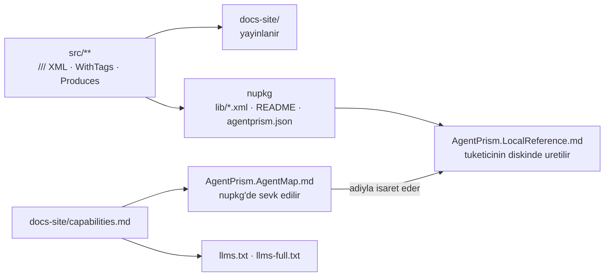

# Tüketici Doküman Senkronu Protokolü

Bu skill `faz-tamamlama` Adım 7 içinden koşar. Amacı tek bir şeydir: **fazın
bıraktığı davranışı tüketicinin kendi başına öğrenebilmesi.**

Tüketici üç yüzeyden öğrenir. Üçü de ayrı bayatlar ve üçü de ayrı beslenir:



Kod doğru olsa bile bayat bir yüzey kullanıcıya **kusur olarak görünür**.

> Standardın kendisi bu dosyada değil, [`resources/kalite-sozlesmesi.md`](resources/kalite-sozlesmesi.md)
> içindedir. Bu dosya **ne yapılacağını** söyler; o dosya **neyin doğru
> sayıldığını** söyler. Faz 75 ve 76 birikimli faz dokümanlarıdır ve
> okunmalarına gerek yoktur — standart oradan ayrıştırıldı (K-522).

---

## Adım 0 — Bu skill koşulmalı mı?

Fazın dokunduğu yolları çıkar, sonra tabloya bak:

```bash
git diff --name-only <faz öncesi commit>
```

| Değişen yol | Tetiklenen yüzey |
|---|---|
| `src/**/*.cs` içinde **public** üye | Sevk edilen metin · `api/` · yerel referans |
| `src/AgentPrism.AspNetCore/{Endpoints,OpenAICompat,A2A,McpServer}/` | `http-api/` · `http-api.md` sayısı · paketlenen `agentprism.json` |
| `src/AgentPrism.UI/frontend/src/{screens,components}/` | `ui.md` + ekran görüntüsü |
| Yeni `src/<Paket>/` | `packages.md` · `capabilities.md` `## Packages` · paket `README.md` |
| `src/*/README.md` · kök `README.md` | Sevk edilen metin |
| `src/AgentPrism.Core/buildTransitive/` | Yerel referans · agent haritası |
| Yeni yetenek veya davranış değişimi | `concepts/<alan>.md` · `capabilities.md` |

**Hiçbiri tutmuyorsa skill koşmaz.** Gerekçesini faz dokümanına yaz ve
`dokuman-bakim.py --site-denetle` komutunu `--site-gerekce-yazildi` ile geç.
Gerekçe yazmadan geçmek yasaktır — o bayrak bir kaçış kapısı değil, bir kayıttır.

---

## Adım 1 — Yüzey envanterini yaz

Adım 0'ın çıktısını üç kovaya ayır ve **yazılı hâle getir**. Bu liste fazın
dokümanına girer; sonraki oturum onu okur.

1. **`docs-site/`** — hangi sayfalar, elle mi üretilen mi
2. **Sevk edilen metin** — hangi `///` blokları, hangi paket `README.md`'si,
   `agentprism.json` değişti mi
3. **Yerel referans ve agent haritası** — `capabilities.md` satırı gerekiyor mu

Envanteri yazmadan düzenlemeye başlama. Ölçüldü: yazılmayan yüzey unutulan
yüzeydir.

---

## Adım 2 — Üretileni elle yazılandan ayır

🚨 **Bu ayrımı bilmezsen üretilen bir sayfayı elle yazarsın ve emeğin bir
sonraki `npm run generate` ile silinir.**

| Yüzey | Kim yazar | Commit edilir mi |
|---|---|---|
| `docs-site/src/content/docs/api/` | **Üretilir** (DocFX) — iş koddadır: XML dokümanı eksiksiz mi | ❌ |
| `docs-site/src/content/docs/http-api/` | **Üretilir** (OpenAPI) — iş koddadır: `.WithTags`/`.Produces` üstverisi var mı | ❌ |
| `docs-site/public/openapi/agentprism.json` | **Üretilir** (sanitize kopya) | ❌ |
| Elle yazılan sayfalar (`concepts/`, `guides/`, `getting-started/`, `reference/`, kök) | **Elle** | ✅ |
| `docs-site/src/sidebar.mjs` | **Elle** — Starlight `autogenerate` kullanılmıyor | ✅ |
| `AgentPrism.AgentMap.md` · `llms.txt` · `llms-full.txt` | **Üretilir** (`capabilities.md`'den) ama **commit edilir** | ✅ |
| `docs-site/public/screenshots/*.png` | E2E koşumundan üretilir | ✅ |
| `AgentPrism.LocalReference.md` | **Üretilir** — tüketicinin diskinde, her build'de | ❌ (tüketicinin `.gitignore`'unda) |

Yeni bir elle yazılan sayfa **sidebar'a elle eklenir**. Eklemezsen kapı kırılır:
`check-content.mjs` her elle yazılan sayfanın kenar çubuğundan erişilebilir
olmasını arar.

---

## Adım 3 — Kalite sözleşmesini uygula

[`resources/kalite-sozlesmesi.md`](resources/kalite-sozlesmesi.md) dosyasını aç
ve dokunduğun her yüzey için ilgili bölümü uygula:

| Dokunduğun yüzey | Sözleşme bölümü |
|---|---|
| Elle yazılan site sayfası | **A** sayfa sözleşmesi · **C** diyagram kuralı · **D** erişilebilirlik |
| `///` XML dokümanı, paket `README.md`'si, kök `README.md`, `agentprism.json` | **B** kendi kendine yeterlik |
| Yeni paket, yeni yetenek | **E** yerel referans ve agent haritası |
| Herhangi bir muafiyet listesi veya taban çizgisi | **F** cırcır |

---

## Adım 4 — Yerel referans yüzeyi

`AgentPrism.LocalReference.md` **tamamen üretilir**
([`AgentPrism.Core.targets`](../../../src/AgentPrism.Core/buildTransitive/AgentPrism.Core.targets)).
Elle düzenlenmez ve repoda durmaz. Bayatlaması bu yüzden **dolaylıdır** — üç yol:

1. **XML dokümanı eksikse `grep` reçetesi boş döner.** Dosyanın en değerli yeri
   `## How to read them` bölümüdür; gösterdiği korpus `lib/*.xml`'dir. Eksik bir
   `<summary>` orada bir boşluk üretir.
2. **Giriş noktasında `<example>` yoksa kapı kızarır.** Reçete "her `Add*`,
   `Use*` ve `Map*` bir `<example>` taşır" diye söz verir; `CapabilityExampleTests`
   bu sözü zorlar. Yeni bir giriş noktası eklediysen örneği **şimdi** yaz.
3. **Agent haritası yerel referansa adıyla işaret eder.** Dosyanın adı veya
   konumu değişirse `AgentPrism.AgentMap.md`'nin `## Where to look` bölümü de
   değişir.

Yeni paket XML satırını **otomatik** kazanır (`@(ReferencePath)` süzgeci
`%(NuGetPackageId)` değeri `AgentPrism` ile başlayan her referansı alır). Ama
`capabilities.md`'nin `## Packages` satırını **elle** kazanır — ve harita yalnız
o dosyadan üretilir.

🚨 **Agent haritası bütçesi aşımda kırpmaz, kırılır.** Bütçe 10 240 B. Aşarsan
`capabilities.md`'yi kısalt; üretecin bütçesini yükseltmek bir karardır ve
ölçümle gerekçelenir.

---

## Adım 5 — Kapıları tam sırayla koş

Ucuzdan pahalıya sıralıdır. Bir tanesi kırmızıysa sonrakini koşma, önce düzelt.

```bash
# 1 — Sevk edilen metin kapıları (.NET, ölçüldü: 15 test / ~2 sn)
./artifacts/bin/AgentPrism.Core.UnitTests/release/AgentPrism.Core.UnitTests \
  --filter-class "*ShippedDocumentationSelfContainmentTests*" \
                 "*CapabilityExampleTests*" "*SourceLanguageTests*"
./artifacts/bin/AgentPrism.Templates.Tests/release/AgentPrism.Templates.Tests \
  --filter-class "*LocalReferenceTests*"

# 2 — Sevk edilen agent haritası ve llms dosyaları bayat mı
cd docs-site && node scripts/build-agent-map.mjs --check

# 3 — Site: icerik → derleme → baglanti → agirlik (dördü tek komutta)
cd docs-site && npm run check

# 4 — Fazın site senkronu denetimi
python3 scripts/dokuman-bakim.py --site-denetle --taban <faz öncesi commit>
```

🚨 **`dotnet test --filter <Ad>` YAZMA — MTP onu sessizce yutar.** Ölçüldü:
`dotnet test … --filter CapabilityExampleTests` paketin **1004 testinin
tamamını** koşar ve yeşil döner; daralttığını sanırsın. MTP'de `--filter` diye
bir seçenek yoktur, `--filter-class` / `--filter-method` / `--filter-namespace`
vardır ve yalnız **derlenmiş test ikilisi** doğrudan çağrılırken geçerlidir.
Aynı bayat komut `docs/73`, `docs/74` ve `docs/75` içinde de durur; oradan
kopyalama.

🚨 **`npm run build && check-links.mjs` yetmez.** O eski komut `check:content`
ve `check:weight` kapılarını atlar — yani sayfa sözleşmesini, diyagram kuralını,
kontrastı ve ağırlık tavanını hiç denetlemez. `npm run check` dördünü de koşar.

🚨 **`///` XML dokümanına dokunduysan tam koşum gerekir.** `generate:fast` ve
`build-api-reference.mjs --skip-docfx` **bayat** `docfx/api-md` önbelleğini okur.
`npm run check` zaten `prebuild` üzerinden tam üretim koşar; `generate:fast`
yalnız site içi prose düzenlemesinde kabul edilir.

🚨 **Dört kapı YAYIN DEĞİLDİR.** `npm run check` yeşil olduğunda `dist/` yalnız
senin makinendedir. Siteyi sunucuya `scripts/site-deploy.sh` taşır ve o
`faz-tamamlama` Adım 10'dur. Bu skill'i tek başına koşuyorsan (faz kapanışı
dışında) yayını da sen koşmalısın — yoksa düzelttiğin sayfa canlıda eski kalır.

🚨 **Yeni ekran varsa ekran görüntüsü E2E'den üretilir ve commit edilir:**
`AGENTPRISM_UI_SCREENSHOTS=1`. Ekran görüntüsünün **dosya olarak var olduğunu**
`check-content.mjs` denetler; **doğru ekranı gösterdiğini** `DocumentationScreenshotTests`
kanıtlar. İki kapı iki ayrı şey söyler ve ikisi de gereklidir. Yeni bir ekran
eklerken tohumu da büyüt (`SeedCatalogAsync`) — boş bir ekran görüntüsü kılavuzda
hiçbir şey öğretmez.

---

## Adım 6 — Muafiyet ve taban çizgisi cırcırı

Sözleşme bölüm **F**'deki her taban çizgisi **yalnız iyileşir**. Bu bir üslup
tercihi değil, Faz 73'ten beri süren bir kuraldır.

- Bir sayfayı muafiyet listesine **eklemek** bir karardır: gerekçesi listenin
  içine yazılır ve `faz-denetim` bunu 🔴 sayar.
- Ağırlık tavanını veya kontrast tabanını değiştirmek **ölçüm ister**. Sayı
  uydurulmaz.
- Muafiyet listesi artık var olmayan bir sayfayı adlandırıyorsa kapı kızarır —
  liste sayfayla birlikte temizlenir.

---

## Adım 7 — Kalan boşluğu aday olarak yaz

Bu protokolün bazı kalemleri **gözle** denetlenir: ilk paragrafın gerçekten bir
soruyu cevaplaması, `## Read next` bağlantılarının doğru sayfaya gitmesi, bir
gerekçe cümlesinin gerçekten gerekçe taşıması.

Gözle denetlenen bir kalem makine kapısına dönüşebiliyorsa `docs/ADAYLAR.md`'ye
**F-NN** olarak yaz. Bu işte kodlama — aday yazmak ile kapı yazmak iki ayrı iştir.

---

## Kapanış kontrolü

> 1. Fazın dokunduğu her yüzey Adım 1 envanterinde yazılı mı?
> 2. Adım 5'in dört kapısı da koştu ve **yeşil** mi? Çıktıları faz dokümanına
>    yazıldı mı?
> 3. Hiçbir muafiyet listesi ve hiçbir taban çizgisi **büyümedi** mi?
> 4. Bu repoyu hiç görmemiş bir tüketici, fazın vaat ettiği davranışı yalnız
>    yayınlanan siteden **ve** yerel referans dosyasından öğrenebilir mi?

4'e cevap "hayır" ise eksik olan yüzeyi bul: site sayfası mı, `<example>` mi,
`capabilities.md` satırı mı? Üçü ayrı yüzeydir ve biri diğerinin yerine geçmez.

---

## Yazılmayacaklar

- **Üretilen sayfaya elle satır yazılmaz.** `api/`, `http-api/` ve
  `public/openapi/` üretilir; oradaki iş koddadır.
- **Sevk edilen metne iç referans yazılmaz.** `K-NNN`, `F-NN`, faz numarası,
  `MT-*` ve `docs/NN-*.md` tüketicinin elinde yoktur (sözleşme bölüm **B**).
- **`docs/` ile `docs-site/` karıştırılmaz.** Geliştirme kaydı `docs/`'a,
  kullanıcıya dönük anlatı siteye. Aynı içerik iki yere yazılmaz.
- **Kırık bağlantı üretilmez.** Bir `docs/` adresini site adresine çevirirken
  hedefin var olduğu doğrulanır; adres uydurmak, adres olmamasından kötüdür.
- **Kapı gevşetilmez.** Kızaran bir kapı düzenlemenin kusurudur, kapının değil.
