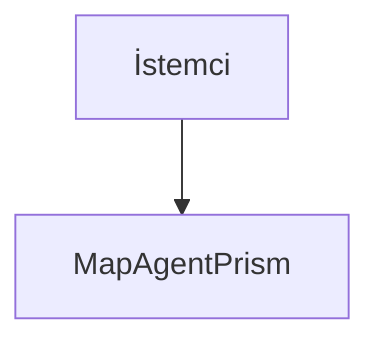

# AgentPrism — AGENTS.md

> **Merkezi agent talimat dosyası.** Claude Code, GitHub Copilot, Antigravity ve diğer tüm AI kod agent'ları için tek kaynak budur. `CLAUDE.md` bu dosyaya symlink'tir — platform-spesifik ayrı talimat dosyası oluşturma; kural değişiklikleri yalnızca burada yapılır.

## Memory

Read the first 200 lines of MEMORY.md before beginning.

Update MEMORY.md as you discover codepaths, patterns, library locations, and key architectural decisions. This builds up institutional knowledge across conversations. Write concise notes about what you found.

---

## Temel İletişim Kuralları

**Her zaman Türkçe konuş.** Kod, değişken adları, commit mesajları İngilizce kalabilir; ancak agent'ın tüm açıklamaları, soruları ve analizleri Türkçe olmalı. Tüm yanıtlarda **ASD-STE100 Basitleştirilmiş Teknik Dil kurallarını sıfır tolerans ile uygula** — kısa cümle, tek fikir, aktif çatı, onaylı kelime listesi. Bu kural hem Türkçe hem İngilizce yanıt için geçerlidir; her iki dilde de konuşulan dilin doğru karakterlerini kullan (ör. Türkçe'de ç/ğ/ı/ö/ş/ü). Teknik terimler orijinal dilinde kalır (ör. `AppService`, `migration`, `endpoint`).

**Geliştirme sırasında her belirsizliği sor.** Requirement'ta açık olmayan bir durum, edge-case veya tasarım kararı çıktığında varsayım yapmak yerine durumu tarif ederek kullanıcıya sor. Plan modundaysan aklına takılan en küçük şeyi bile sor.

**Uzun vadeli mimari kararlar al.** Sadece geçici çözümler sunan ve daha sonra değiştirilmesi amaçlanan çözümler önerme.

**Karar defteri:** Daha önce kanıtla reddedilmiş işleri yeniden önerme — `docs/KARARLAR.md`'ye bak.

---

## Bu Proje Nedir

AgentPrism, Microsoft Agent Framework (MAF) üzerine kurulu bir **NuGet paket ailesidir**. Bir uygulama değil, milyonlarca geliştiricinin bağımlı olabileceği bir kütüphanedir. Bu, kod kalitesi eşiğini belirler:

- Public API'de kırıcı değişiklik pahalıdır — tasarımı ilk seferde doğru yap
- Her public üye XML dokümanına sahip olmalıdır (build bunu zorlar)
- Tüketicinin bağımlılık grafiğini kirletme
- `TryAdd*` ile kaydet; tüketicinin kaydı her zaman kazanmalı

Mimari resim: **`docs/MIMARI.md`**. Bu dosya kalıcı gerçeği anlatır ve her fazın sonunda güncellenir.

---

## Faz Akışı ve Doküman Disiplini

**Geliştirme fazlar hâlinde ve çoğu zaman ayrı sohbetlerde yapılır.** Sonraki oturum bu depoyu sıfırdan okur ve yalnızca dokümanlara güvenir.

Bu yüzden şu kural mutlaktır:

> **Her geliştirme sonrası dokümanlar gözden geçirilir ve güncelliğini korur. Dokümanlar birbiriyle ahenk içinde olmalıdır.**

Somut anlamı:

| Kural | Neden |
|-------|-------|
| Doküman ile kod çelişirse **doküman yanlıştır** — koda göre düzeltilir | Sonraki oturum dokümana göre kod yazar |
| Plandan sapma **gizlenmez**, gerekçesiyle yazılır | Sapmanın gerekçesi en değerli bilgidir |
| Bir faz bitince sonraki fazın dokümanı **devir teslim kalitesine** çıkarılır | Ayrı sohbet o dokümanla tek başına çalışabilmeli |
| Her mimari karar `docs/KARARLAR.md`'ye numarayla ve gerekçeyle yazılır | Kapatılmış tartışma yeniden açılmaz |
| Keşfedilen tuzaklar `MEMORY.md`'ye yazılır | Aynı tuzağa iki kez düşülmez |

Faz bittiğinde **`faz-tamamlama` skill'i uygulanır**. Atlanmaz.

### Faz haritası

| Faz | Doküman | Durum |
|-----|---------|-------|
| 0 | `docs/00-ALTYAPI.md` | ✅ Tamamlandı |
| 1 | `docs/01-CEKIRDEK-SOYUTLAMALAR.md` | ✅ Tamamlandı |
| 2 | `docs/02-POSTGRESQL-KALICILIK.md` | ✅ Tamamlandı |
| 3 | `docs/03-SAGLAYICI-VE-DERLEYICI.md` | ✅ Tamamlandı |
| 4 | `docs/04-HTTP-API.md` | ✅ Tamamlandı |
| 5 | `docs/05-AGENTPRISM-UI.md` | ✅ Tamamlandı |
| 6 | `docs/06-GOZLEMLENEBILIRLIK.md` | ✅ Tamamlandı |
| 7 | `docs/07-SAGLAMLASTIRMA-VE-YAYIN.md` | ⏸ Beklemede — yayın zamanı kullanıcı kararı (K-068) |
| 8 | `docs/08-SAGLAYICI-GENISLEMESI.md` | ✅ Tamamlandı |
| 9 | `docs/09-YONETISIM-VE-DENETIM-IZI.md` | ✅ Tamamlandı |
| 10 | `docs/10-AGENT-SKILLERI.md` | ✅ Tamamlandı |
| 11 | `docs/11-SKILL-SCRIPT-CALISTIRMA.md` | ✅ Tamamlandı |
| 12 | `docs/12-AGENT-CAGRI-GRAFIGI.md` | ✅ Tamamlandı |
| 13 | `docs/13-BAGLAM-SIKISTIRMA-VE-BELLEK.md` | ✅ Tamamlandı |
| 14 | `docs/14-COK-MODLULUK.md` | ✅ Tamamlandı |
| 15 | `docs/15-WORKFLOWS-YURUTME.md` | ✅ Tamamlandı |
| 16–30 | `docs/IKINCI-FAZ-YOL-HARITASI.md` | 📋 Planlandı — **sıradaki Faz 16** |

**Sıradaki faz: 16** (`docs/16-WORKFLOWS-ARAYUZ.md`).

**İkinci faz (8–30):** `docs/IKINCI-FAZ-YOL-HARITASI.md` sırayı, bağımlılıkları
ve migration numaralarını tutar. Faz listesi orada; burada tekrarlanmaz —
iki yerde tutmak kayma üretir.

**Hammadde:** `docs/BEYIN-FIRTINASI.md` — 29 aday yeteneğin gerekçesi. Tamamı
planlandı; belge tarihsel kayıt olarak durur. Bir kalem ile faz dokümanı
çelişirse **faz dokümanı geçerlidir**.

---

## Doğrulama Kapıları

Dördü de sıfır uyarı vermelidir. Bir tanesi kırmızıysa iş **bitmemiştir**.

```bash
dotnet build  AgentPrism.slnx -c Release
dotnet test   AgentPrism.slnx -c Release --no-build
dotnet pack   AgentPrism.slnx -c Release --no-build
dotnet format AgentPrism.slnx --verify-no-changes --no-restore
```

`TreatWarningsAsErrors` açıktır — uyarı yoktur, hata vardır. Bir analyzer kuralını bastırmadan önce **neden** tetiklendiğini anla; bastırma gerekiyorsa gerekçesini koda ve `docs/KARARLAR.md`'ye yaz.

**Sırlar asla dosyaya yazılmaz.** Bağlantı dizesi ve API anahtarı yalnız `dotnet user-secrets` içinde yaşar. `appsettings.json` boş placeholder taşır. Faz sonunda sır taraması yapılır — komut `faz-tamamlama` skill'inde.

`dotnet build` **arayüzü de derler**: `npm ci` → `tsc --noEmit` → 42 Vitest testi →
Vite → Brotli sıkıştırma → bundle bütçesi kapısı (250 KB gzip). Adımlar artımsaldır.
Node.js 20.19+ gerekir; hızlı bir iç döngü için `-p:AgentPrismFrontendEnabled=false`.

> ⚠️ `dotnet format`, `dotnet build`'in yakalamadığı analyzer tanılarını yakalayabilir (yaşandı: yapılandırma bağlama kaynak üreteci build'de tanıyı gizledi, format'ta ortaya çıktı). Dört kapının da çalıştırılması bu yüzden zorunludur.

---

## Skill'ler (Ortak İş Akışları)

Tekrarlanan iş akışları `.agents/skills/<yetenek_adi>/SKILL.md` altında tanımlıdır — talimatlar bu dosyada tekrarlanmaz, ilgili skill okunup uygulanır:

| Skill | Ne zaman |
|-------|----------|
| `faz-tamamlama` | Bir fazın kodu bittiğinde. Doğrulama kapıları, doküman senkronizasyonu, karar defteri, hafıza. |
| `maf-api-kesfi` | MAF'ın bir tipini ilk kez kullanmadan önce. Gerçek imzayı reflection ile çıkarır. |

Klasör konvansiyonu: her skill'de `SKILL.md` zorunlu (frontmatter: `name`, `description`); gerektiğinde `scripts/`, `examples/`, `resources/`, `references/` (>500 satır ek dokümantasyon) alt klasörleri eklenebilir. Skill mekanizması olmayan agent'lar (Copilot vb.) ilgili `SKILL.md`'yi normal doküman gibi okuyup uygular. Claude Code keşfi için `.claude/skills` → `.agents/skills` symlink'tir.

---

## Kodlama Kuralları (Bu Depoya Özgü)

Genel .NET kuralları `.editorconfig` içinde zorunlu kılınır. Aşağıdakiler analyzer'ın yakalayamadığı, projeye özgü kurallardır:

**MAF tiplerini sarmalama.** `AIAgent`, `AgentSession`, `ChatMessage`, `AIFunction` doğrudan kullanılır. AgentPrism bir kontrol düzlemidir, bir soyutlama katmanı değil.

**`Activity.Current` async yardımcı metotta açılmaz.** `AsyncLocal` yazımı çağırana geri akmaz; span, çağıran metodun kendi gövdesinde başlatılmalıdır. Yaşandı: iç span'ler kök span'in çocuğu değil kardeşi oldu (Faz 6).

**Tool'lar yalnızca kodda tanımlanır.** Arayüzden agent oluşturulabilir; tool **kodu** yazılamaz. Bu bir güvenlik sınırıdır ve gevşetilmez.

**AOT uyumluluğu.** `Abstractions`, `Core`, `PostgreSql`, `OpenAI` paketleri AOT uyumludur. Yansımaya dayanan API kullanma. Sırayla dene: (1) elle yaz — yapılandırma bağlama ve ayar doğrulama böyle çözüldü; (2) kaynak üreteci kullan (`JsonSerializerContext`); (3) kaçınılmazsa metodu `[RequiresUnreferencedCode]` + `[RequiresDynamicCode]` ile işaretle — uyarıyı **bastırma**, çağırana ilet.

**Ön sürüm MAF paketleri yalnızca `AgentPrism.AspNetCore` içinde.** Karar K-008.

**Sırlar veritabanına da yazılmaz.** Bir sır gerekiyorsa kayıtta yalnızca değerin okunacağı **yapılandırma anahtarının adı** durur; değer çalışma anında `IConfiguration` üzerinden çözülür. Karar K-059 (MCP kimlik doğrulaması).

**Gözlemlenebilirlik işlevselliği bozmaz.** Çalıştırma kaydı deposu hata verirse çalıştırma devam eder; hata loglanır.

**`ValueTask` dönen arayüzlerde `ConfigureAwait(false)`.** Kütüphane kodudur.

---

## Diyagram Kuralı

**Her diyagram Mermaid ile yazılır.** ASCII kutu çizimi (`┌─┐│└┘`) kullanılmaz.

````markdown

````

**Neden:** ASCII diyagramlar elle hizalanır; bir kutuya kelime eklemek tüm satırları
bozar ve bakım maliyeti yüzünden diyagram bayatlar. Mermaid metinden düzeni kendisi
üretir, GitHub ve VS Code önizlemesinde çizilir, `git diff` anlamlı kalır.

Kullanılacak diyagram tipleri:

| Ne anlatılıyor | Tip |
|----------------|-----|
| Katman, akış, karar ağacı | `flowchart TD` / `flowchart LR` |
| Bileşenler arası çağrı sırası, zamanlama | `sequenceDiagram` |
| Veri modeli, tablo ilişkileri | `erDiagram` |
| Durum makinesi (çalıştırma durumları) | `stateDiagram-v2` |
| Paket bağımlılık grafiği | `flowchart` (yön okları ile) |
| Faz/zaman planı | `gantt` |

Kurallar:

- **Türkçe etiket serbest**, teknik terim orijinal dilinde kalır (`AIAgent`, `IRunStore`)
- Düğüm metninde `(`, `)`, `,` ve `:` karakterleri ayrıştırıcıyı bozar — tırnak kullan:
  `A["RunAsync(messages, session)"]`
- Bir diyagram **tek bir fikri** anlatır; on beş düğümü aşıyorsa ikiye böl
- Vurgu gerekiyorsa `style`/`classDef` kullan, ASCII'ye dönme
- Diyagram koddan sapmışsa **diyagram yanlıştır** — koda göre düzeltilir

**İstisna — dizin ağaçları.** Dosya/klasör listeleri düz metin kod bloğu olarak kalır
(`├──`, `└──`). Bunlar diyagram değil, dizindir; Mermaid'in ağaç gösterimi yoktur ve
`flowchart`'a çevirmek okunabilirliği düşürür.

---

## Canlı Referanslar

| Dosya | İçerik |
|-------|--------|
| `docs/MIMARI.md` | **Mimari gerçek** — katmanlar, MAF genişleme noktaları, veri modeli, çalıştırma yolu, güvenlik |
| `docs/KARARLAR.md` | Karar defteri — reddedilen işler + kalıcı tercihler, gerekçeleriyle |
| `docs/NN-*.md` | Faz dokümanları — sıra, kapsam, DoD, devir teslim notları |
| `MEMORY.md` | Oturumlar arası biriken kurumsal bilgi — codepath'ler, desenler, tuzaklar |
| `README.md` | Dış yüzey — paketler, kurulum, yol haritası |
