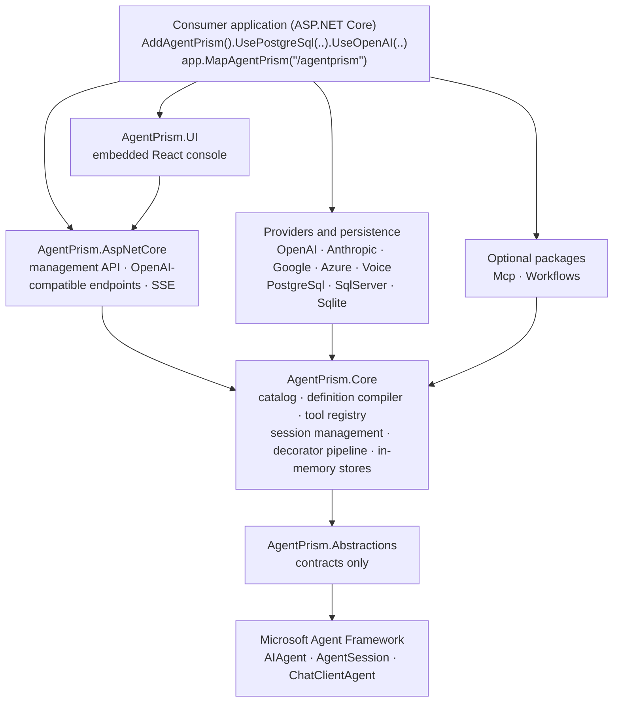
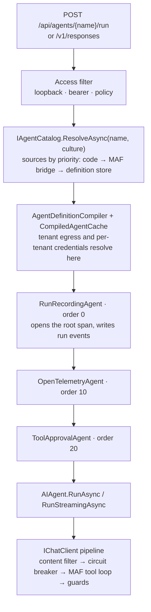

# Architecture

A short map of AgentPrism for people who want to change it. If you only want to
*use* it, read the [product documentation](https://agentprism.doayen.web.tr)
instead — this file is about the inside.

AgentPrism is a **control plane over the Microsoft Agent Framework (MAF)**, not
a framework of its own and not an application. It is a family of NuGet packages
that other people take a dependency on, and that one fact sets the quality bar:
a breaking change in a public API is expensive, every public member carries XML
documentation (the build enforces it), and a consumer's dependency graph stays
clean.

## Layers

Every arrow below means **references at compile time**, so it points from a
package to what that package depends on.

At run time the HTTP layer does reach the console and the optional packages, but
it never references them: it finds them through `IAgentPrismUiProvider`,
`IMcpToolRefresher`, and `IWorkflowRunner`, which live in `Abstractions`. That is
what keeps each of them an optional package.

**The dependency direction is one-way and has no cycles.** Every provider and
persistence package points at `Core`, `Core` points at `Abstractions`, and `UI`
points at `AspNetCore`. There is no reverse edge, and
`DependencyDirectionTests` turns a violation into a failing build — this is a
rule you cannot break by accident.

`AgentPrism.Client` references no AgentPrism package at all: its types are
generated from the published OpenAPI document, so it talks to a running
AgentPrism over HTTP rather than compiling against it.

The full picture, including the data model and every extension point, is in
`docs/MIMARI.md` (Turkish).

## Four rules that do not change

1. **No surprises.** Every extension point ships turned off. A consumer who
   upgrades gets no new behavior they did not ask for.
2. **Tools are defined in code only.** An agent can be created from the console;
   tool *code* can never be. This is a security boundary, not a convenience —
   it is why the console can be exposed to an operator at all.
3. **MAF objects are passed through, not wrapped.** `AIAgent`, `AgentSession`,
   `ChatMessage` and `AIFunction` are used directly. AgentPrism adds a control
   plane; it does not add a parallel type hierarchy you would have to learn.
4. **Every extension point is replaceable.** Registration uses `TryAdd*`, so a
   consumer's own registration always wins.

## The execution path

Decorator order is not arbitrary. Recording sits **outermost** so that it
measures the time every inner layer spends. Approval sits **innermost**, closest
to the model call; any further out and telemetry would count the wait for a human
as its own duration.

Two traps live on this path and have each cost real defects:

- The root span is opened in `RunRecordingAgent`'s **own method body**.
  `Activity.Current` is an `AsyncLocal`, and an assignment made inside an async
  helper method does not flow back to the caller.
- The same rule has a streaming form: an `AsyncLocal` assignment inside an
  `async IAsyncEnumerable` body does not cross the `yield return` boundary, so
  the run context is set again before every `MoveNextAsync`.

## Storage

Storage is a contract (`IRunStore`, `ISessionStore`, `IAgentDefinitionStore`, and
others), and there are four implementations: in-memory plus PostgreSQL, SQL
Server, and SQLite. The SQL logic lives in `AgentPrism.Sql.Shared` as **shared
source** — it is not its own assembly and carries no `.csproj`; each provider
package compiles it in. Migrations are embedded SQL, numbered per provider.

Anything you add to a store has to behave identically everywhere. That is what
the contract suite in `AgentPrism.Testing.Contracts.Xunit` is for: the same
abstract test classes run against the in-memory store and against all three
databases.

Tenant isolation lives in the application layer, enforced by those contract tests
in both directions, with a coverage gate that makes an untested public store
method a build failure. AgentPrism does not create database row level security
policies; the reasoning is recorded in the decision ledger.

## Where things live

| Path | What it holds |
|---|---|
| `src/` | The 20 packable projects, plus `AgentPrism.Generators` (analyzers, `IsPackable=false`) and `AgentPrism.Sql.Shared`, which is shared source with no project file of its own |
| `tests/` | Unit, contract, functional, integration, and Playwright end-to-end suites |
| `samples/` | Runnable applications, including the ones the release gate builds against packed NuGet packages |
| `docs/` | The development journal — **Turkish**, and never the product documentation |
| `docs-site/` | The product documentation site — **English**, Astro Starlight |
| `scripts/` | The gate runner (`kapi.py`), documentation maintenance, and the site deploy pipeline |
| `.agents/` | Instructions and workflow skills for AI coding agents |

## Reading further

- `docs/MIMARI.md` — layers, data model, and the execution path in full
- `docs/MIMARI-GUVENLIK.md` — the security model: tenancy, roles, audit chain,
  script sandbox
- `docs/MAF-GENISLEME-NOKTALARI.md` — which MAF extension points are used, and
  which are deliberately not
- `docs/KARARLAR.md` — the decision ledger: what was chosen, why, and what would
  reopen it

Those four are written in Turkish. They are the record of *why* the code looks
the way it does, and machine translation carries them well enough to follow.
