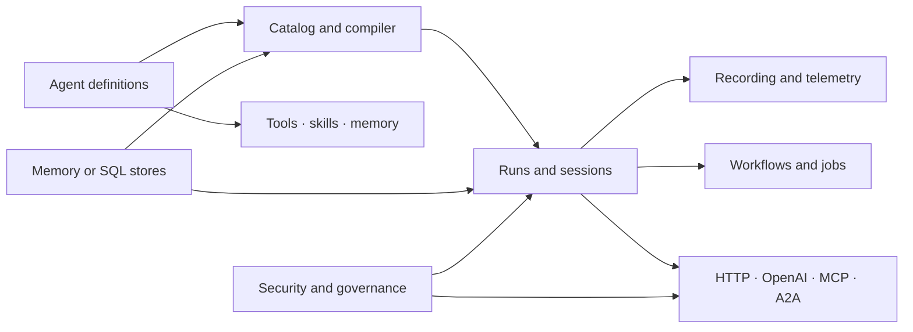

AgentPrism is a library, not a hosted service. You choose the pieces, keep control of
the dependency graph, and run the control plane inside your own .NET application.
This page is the inventory: what exists, where it lives, and what turns it on.

## The shortest complete picture

The default `AddAgentPrism()` registration is useful on its own. It gives you the
catalog, compiler, in-memory stores, run pipeline, sessions, jobs, evaluation
contracts, quotas, audit services, and other core services. Provider, SQL, UI,
workflow, MCP, voice, and external protocol packages add their own explicit calls.

## Agent design and model control

| Capability | What it gives you | Enable or define it | Boundary |
|---|---|---|---|
| Declarative agents | Instructions, model binding, tools, skills, callable agents, metadata, and runtime policy as data | `IAgentPrismBuilder.AddAgent(AgentDefinition)` | A code definition wins a name collision with a database definition |
| Factory agents | A direct escape hatch that returns any MAF `AIAgent` | `AddAgent(name, factory)` | The catalog still applies AgentPrism decorators when it resolves the agent |
| Database definitions | Create, validate, version, diff, roll back, and delete definitions at run time | HTTP API or console after `MapAgentPrism()` | Code-defined agents are visible but read-only |
| Custom agent source | Lists agents from a repository or external runtime | `AddAgentSource<T>()`, instance, or factory | Custom agents are visible but read-only in the management API |
| Definition validation | Checks providers, tools, skills, callable agents, cycles, and policy before save | Compiler and `POST /api/agents/validate` | Validation does not call a model |
| Model binding | Provider, model, temperature, output limit, `top_p`, reasoning effort, and provider-specific settings | `AgentDefinition.Model` | Credentials stay in provider configuration, never in the definition |
| Structured output | Explicit text, JSON, or JSON Schema responses | `ModelBinding.ResponseFormat` | Provider support is validated or translated by that provider; an opt-in, fail-closed `IStructuredResponseValidator` seam can check the response before the run closes; a rejected response can get a bounded number of model-driven repair turns (`MaxRepairAttempts`), non-streaming runs only |
| Agent graph | One agent can call registered agents as tools | `CallableAgentNames` | Shared limits bound call depth, total child runs, total token/cost spend, and wall-clock time — the token, cost, and time limits cut a run off mid-run, between model turns. Each call also has a two-layer wait limit (`SubAgentSettings`, or the installation-wide default): a cooperative deadline, then a hard cutoff that abandons a child that ignores cancellation |
| Harness mode | Context and iteration limits plus todo, file-memory, web-search, skill, and mode providers | `AgentDefinition.Harness` | The harness extends the agent; it does not replace MAF types. Its providers are on by default — each has its own `Disable...` flag |
| Harness loop | The agent is re-invoked until a declared stop criterion says the work is finished | `HarnessSettings.Loop`, plus `AddLoopEvaluator(kind, evaluator)` for a criterion written in code | Off unless the definition sets it. Four built-in criterion kinds take data only; an unknown kind is refused at compile time. The iteration ceiling is never open — an unset `MaxIterations` takes AgentPrism's own default — and every iteration writes a `LoopIterationCompleted` run event |
| Context compaction | Trigger-based truncation or summarization with preserved turns and an optional utility model | `AgentDefinition.Compaction` and `AgentPrism:UtilityModel` | Compaction is per definition and can be disabled by harness settings |
| Working memory | Todo state, file memory, text search, and vector search tools | `AgentDefinition.Memory` | Vector search also needs PostgreSQL and an embedding generator |
| Response caching | A tenant-, provider-, and tool-set-aware cache; a hit spends no tokens and opens no new trace span | `ModelBinding.ResponseCache` | Needs a registered `IDistributedCache`, or the agent fails to compile |
| Concurrent tool calls | Independent tool calls in one turn run at the same time instead of one after another | `ModelBinding.AllowConcurrentToolCalls` | Off by default; each call still gets its own authorization, result, and metric |
| Parameterized instructions | Named `{{name}}` placeholders bound to a run's own values | `AgentDefinition.Parameters` and the run's `parameters` field | Value substitution only — no expression, condition, loop, or field access |
| Shared instructions blocks | One definition's instructions prepended to another's at compile time | `AgentDefinition.SharedInstructionsName` | A block cannot reference another block |

AgentPrism uses `AIAgent`, `AgentSession`, `ChatMessage`, and `AIFunction` directly.
It is a control plane around MAF, not a competing agent abstraction.

## Model providers

Several providers can be active at the same time. Each agent selects one by its
stable provider name.

| Package | Registration | Provider names | Notable capability |
|---|---|---|---|
| `AgentPrism.OpenAI` | `UseOpenAI()` | `openai`, `openai-responses` | Chat Completions and Responses clients |
| `AgentPrism.OpenAI` | `UseOpenAICompatible(name, ...)` | `name`, and optionally `name-responses` | OpenRouter, Groq, Ollama, LM Studio, vLLM, and other compatible endpoints |
| `AgentPrism.Anthropic` | `UseAnthropic()` | `anthropic` | Claude, prompt caching, and extended-thinking settings |
| `AgentPrism.Google` | `UseGoogle()` | `google` | Gemini safety thresholds and thinking settings |
| `AgentPrism.Azure` | `UseAzureOpenAI()` | `azure-openai` | Azure deployments with an API key or a consumer-supplied Entra credential |
| Any package | `AddModelProvider()` | Chosen by the implementation | A custom `IModelProvider` without a provider package |

All built-in providers can publish a configured model catalog. The catalog feeds the
console and pricing; it is not an allowlist. Health checks are cached. A shared
circuit breaker protects provider calls. AgentPrism does not invent model names or
prices.

`ModelBinding.Fallbacks` decides whether a failure moves to the next provider link,
and `runs.error_class` decides how a failed run is classified afterward. Both
decisions can be overridden or composed with your own rules — see
[Write your own error classifier](/guides/write-your-own-error-classifier/).

## Tools, skills, and context

| Capability | Registration or source | What is enforced |
|---|---|---|
| Generated tools | `[AgentPrismTool]` and `AddGeneratedTools()` | Compile-time discovery without reflection or dynamic code; `minimum`/`maximum`/length/`pattern` constraints from standard `DataAnnotations` attributes reach the schema; a parameter may be a supported object (a public record or class with a single public constructor), up to 3 nested levels deep, bound through the tool's own `JsonSerializerContext` |
| Direct tools | `AddTool(AIFunction, configure)` | Exact tool instance and its approval, effect, permission, timeout, repeatability, and output policy |
| Delegate tools | `AddTool(delegate)` | Convenient reflection path; trimming and dynamic-code warnings reach the caller |
| Scanned tools | `AddToolsFrom<T>()` or `AddToolsFrom(Type)` | Only attributed methods become tools; this path uses reflection |
| Scoped tools | `AddScopedTool` | Every call gets its own DI scope, closed when the call ends |
| Argument validation | `IToolArgumentsValidator` | Runs before every call, code-defined or MCP; a rejection skips the real body |
| Tool approval | `RequiresApproval`, the registration flag, or `AddToolApprovalPolicy()` | A sensitive call cannot execute until a person or standing rule decides it |
| Tool output size limit | `MaxOutputBytes` (per tool) or `Tools.DefaultMaxOutputBytes` (installation-wide) | A result over the byte limit is trimmed into a JSON envelope before the model sees it; unlimited by default |
| Client-side tools | `AddClientTool(...)` | The declaration lives in code like every other tool; the server never runs the body. The model's call comes back to the caller, which answers it with `AgentRunRequest.ToolResults`. An agent carrying one cannot be replayed in any tool mode — its call was never recorded, so no mode can answer it |
| Custom content guards | `AddContentGuard<TGuard>()` | Multiple guards run; the strictest result wins |
| Pattern guard | `AddPatternContentGuard()` | Denied terms can block; selected PII patterns can mask input or output |
| Skills | `AddSkill()` or database/file skill sources | Markdown instructions and resources are bounded and validated |
| Skill scripts | `UseSkillScripts()` | Explicit enablement, platform-isolation acknowledgement, interpreter allowlist, tenant grant, timeout, output limit, and concurrency limits |
| Remote MCP tools | `UseMcp()` | Tool discovery, name normalization, resource limits, authentication, refresh, prompts, and OAuth coordination |
| MCP resources | `AgentDefinition.McpResourceUris` | A bounded snapshot of selected server resources enters agent context |
| Knowledge search | PostgreSQL, `IEmbeddingGenerator`, and memory settings | Chunking, embedding, HNSW cosine search, tenant isolation, and result limits |

Only application code defines executable tool logic. The console can edit which
registered tools an agent may use, but it cannot create a new executable function.
Stored skill scripts are a separate, deliberately gated feature; AgentPrism does not
claim to provide an operating-system sandbox.

## Runs, sessions, and media

| Capability | Surface | Important behavior |
|---|---|---|
| Streaming runs | .NET or `POST /api/agents/{name}/run` | Text and tool activity stream as SSE events |
| Non-streaming runs | .NET or an idempotent HTTP request | A completed response can be stored and replayed safely |
| Run recording | Core decorator pipeline | Default-on summaries, events, tool calls, usage, cost, errors, and optional input; it can be disabled and store failure never breaks the run |
| Custom run events | `RunEventType.Custom` and `AgentRunScope.Writer` | A tool writes its own named event into the stream a consumer already carries; the console draws it with a generic card, no code change required |
| Custom agent decorator | `AddAgentDecorator<T>()`, instance, or factory | Joins the built-in decorators; `Order` decides where |
| Cancellation | Run API and cancellation registry | A caller can request cancellation by run id while preserving the final recorded state |
| Replay | Recorded run input and replay service | Re-run against the current or selected definition, with tool replay modes and mismatch protection |
| Compare and score | HTTP API, console, or a custom `IRunJudge` | Compare two runs, attach human scores, or score completed runs automatically; a score carries a name, so one reviewer can rate the same run on several criteria; an online judge uses its provider setup credential and still obeys tenant egress policy |
| Sessions | `AgentSessionManager` and session endpoints | Durable conversation identity and readable history when the store supports it |
| Session ownership | `AgentPrism:SessionOwnership` | Off by default (`false`)<!-- claim:option AgentPrismSessionOwnershipOptions.Enabled=false -->; records which user opened a session, narrows the session list to that user **before** paging, and answers `404` for another user's session — sessions written before it was turned on stay unowned and appear only in the management listing, and `RefuseUnownedSessions` refuses those too once they no longer matter |
| Branching | Session branch API | Fork a durable conversation from an addressable item; SQL storage is required |
| Attachments | Attachment API and message references | Image, audio, PDF, and text uploads use size limits and magic-byte validation |
| Document channel | A run's `documents` field | Reference text kept apart from instructions in the message list and the run record; a convention and an audit trail, not a security guarantee |
| Multimodal messages | MAF content types plus stored attachments | Providers receive supported image, audio, document, and text content without a new AgentPrism message abstraction |
| Image generation | `UseOpenAIImages()`, `UseAzureOpenAIImages()`, or `UseGoogleImages()` plus `AgentPrism:Images` | Optional `generate_image` tool stores a verified attachment and records image or token usage |
| Speech tools | `AgentPrism.Voice` and `UseVoice()` | ElevenLabs synthesis and transcription, or consumer implementations of the speech contracts |
| Live voice conversation | `UseVoiceConversation()` plus `MapAgentPrism()` | A long-lived WebSocket joins transcription, an agent session, and synthesis; it is absent until registered |

A run is the unit of evidence. Everything that happened is recorded against a run id,
and a store failure never gets permission to stop the run itself.

## Workflows and background work

| Capability | Enable it | Storage and execution model |
|---|---|---|
| Multi-agent workflows | `AgentPrism.Workflows`, `UseWorkflows()`, and `AddWorkflow()` | Compiled graphs execute MAF workflow nodes and record a root run |
| Durable checkpoints | Workflow options and a SQL store | A workflow can resume after a restart instead of starting again |
| Human input | Workflow request and response endpoints | A waiting workflow resumes from its checkpoint as a new execution step |
| Job queue | Registered by `AddAgentPrism()` | Leases, retries, items, status, cancellation, and handler dispatch |
| Custom jobs | `IServiceCollection.AddJobHandler<THandler>(handlerKey)` | A string handler key adds a new job type without changing the core queue; dispatch is an exact key match, so registration order never decides the winner, and execution is at-least-once. See [Write your own job handler](/guides/write-your-own-job-handler/) |
| Queue work from code | `IJobDispatcher.EnqueueAsync()` | Queues a job for a registered handler key and refuses one nobody serves |
| Workflow functions | `AddWorkflowFunction<TInput, TOutput>()` | A typed function runs as a graph node without an agent of its own |
| Schedules | Scheduling API, console, or store | One-time and cron schedules enqueue work; time zones are explicit |
| Worker control | `IServiceCollection.UseScheduling()` | A process can run workers or act only as an API node |
| Async HTTP runs | `Prefer: respond-async` | The API returns `202` and a location while a worker owns execution |
| Idempotency | `Idempotency-Key` | Same tenant, operation, and key return the stored response instead of running twice |
| Singleton execution | `AgentPrism:SingletonExecution` | A distributed lease selects one active executor for singleton services |
| Run reconciliation | `AgentPrism:RunReconciliation` | Heartbeats let a scanner fail orphaned runs after process loss |
| Run continuation | `AgentPrism:RunContinuation` | An orphaned, session-bound run resumes as a new run; completed tool calls replay, a destructive or external one blocks continuation unless the tool declares `SafeToRepeat` |
| Workflow node retry | `AddWorkflowFunction(..., retryPolicy: ...)` | A transient provider error retries a single node without failing the run or costing an extra super-step |
| Graceful drain | `AgentPrism:Drain` | A stop signal waits for in-flight runs and refuses new ones instead of cutting execution off |

In-memory stores make these contracts usable for local work. Durable queues,
checkpoints, schedules, cross-process leases, and recovery need a SQL provider for
production behavior.

## Evaluation and controlled change

| Capability | Definition | Result |
|---|---|---|
| Eval suites and cases | API, console, or stores | Repeatable inputs, expected properties, checks, and run history |
| Built-in checks | Eval case configuration | Deterministic checks run without a judge model |
| Custom checks | `AddEvalCheck(kind, check)` | Application code adds a named MAF `EvalCheck` |
| Run judges | `IRunJudge` via `AddRunJudge<T>()`, instance, or factory, or the built-in `AddModelRunJudge()` | Manual or automatic scores with named criteria |
| Calibrated evaluator catalog | `AddEvaluatorJudge(name, evaluator)` with a `Microsoft.Extensions.AI.Evaluation` `IEvaluator` | Each metric the evaluator reports becomes its own `{judge}.{metric}` score row |
| Suite grading seam | `AddEvalEvaluatorFactory<T>()` or an instance | Replaces the MAF `LocalEvaluator` an eval suite is graded with |
| Online evaluation | Judge registration plus enabled sampling | A bounded sample of live runs is scored in the background |
| Eval run comparison | `GET /api/evals/runs/{id}/diff` or `IEvalStore.DiffRunsAsync` | Two runs of a suite align case by case into six buckets; added and dropped cases are never counted as regressions |
| Relative CI gate | `agentprism eval --baseline <runId\|previous> --max-regressions <n>` | A build fails on the cases that broke against an earlier run, not only on an absolute pass rate |
| Experiments | Experiment API and console | Stable traffic assignment compares agent versions and reports each arm separately |
| Canary rollback | Explicit canary policy | A background scan can stop or roll back a canary when its configured rule fails |

AgentPrism reports evidence. It does not declare a statistical winner for an
experiment, and automatic rollback is off until you configure it.

## Security and governance

| Capability | Where it applies | Default or gate |
|---|---|---|
| Loopback restriction | All mapped management surfaces | Remote access is off by default |
| Static bearer token | `MapAgentPrism()` options | Optional; compare uses constant time |
| ASP.NET Core policy | `RequireAuthorization(policy)` | Uses your authentication and identity pipeline |
| Reader, Operator, Admin roles | Endpoint groups | Optional policy names; production can require all three at startup |
| API keys | HTTP API and stores | Hashed, revocable, expiring, tenant-bound, and narrowed by a closed scope enum |
| Multi-tenancy | `UseTenancy()` | Single tenant by default; a verified key outranks a claim or header |
| Session ownership | `AgentPrism:SessionOwnership` | A second boundary drawn under the tenant; off by default (`false`)<!-- claim:option AgentPrismSessionOwnershipOptions.Enabled=false -->, and while off nothing changes. The owner comes from `IRunAttributionContext` and is never read from a request body. `RefuseUnownedSessions` extends it to the rows that predate it, while a session that does not exist yet is still opened by its first turn |
| Quotas | Run admission | Enabled with an empty rule set, so no run is rejected until a rule exists; a crossed threshold can also be written into the triggering run's own event stream, off by default |
| Rate limiting | HTTP requests | Off by default; partition by tenant, key, or remote address |
| Approvals | Tool execution and queued resume | Expiring requests, explicit decisions, and revocable standing rules |
| Audit trail | Administrative writes | Actor, action, entity, before/after data, and secret masking |
| Webhooks | Signed outbound events | HTTPS, SSRF checks, response limits, reserved-header rejection, retry jobs, and failure disablement |
| Outbound network guard | `AgentPrism:Egress` | One guard for webhook delivery, MCP connections, and provider endpoints; private network targets refused by default, checked inside the socket connect callback |
| Configuration key prefixes | Stored secret references | A record stores a key **name**, never a value, and each name must sit under an allowed prefix |
| At-rest content protection | `AddContentProtection(...)` | Off by default; AES-256-GCM encrypts session state, chat history, run inputs and events, tool arguments/results, agent files, and attachments before they reach the database |
| Retention and archive | Stored operational data | Deletion defaults are off (`false`)<!-- claim:option AgentPrismRetentionOptions.Enabled=false -->; preview and jobs make cleanup explicit |
| Content inspection | Model input and output | No guard cost until a guard is registered |
| External surface guard | MCP server and A2A | Requires the `ExternalInvoke` scope and refuses an unsafe remote-access combination |
| Cross-origin access | `AgentPrismEndpointOptions.AllowedOrigins` | Empty by default; no `Access-Control-Allow-Origin` header is ever sent until an exact origin is added — there is no wildcard option |

An API-key scope never grants a role. Effective authority is the intersection of the
caller's role and key scopes. See the complete scope table in
[Compatibility](/reference/compatibility/#api-key-scopes).

## Observability and operations

| Capability | Output | Control |
|---|---|---|
| Run event stream | Gapless, ordered domain events | Recording options choose deltas, tool payloads, input, and payload size |
| OpenTelemetry traces | `ActivitySource` spans | Your exporter remains in control; AgentPrism can also persist a sample |
| Metrics | Run counts, duration, tokens, cost, tools, errors, judges, background-job executions and attempt duration, plus optional quota and job-queue-depth gauges | Standard .NET metrics; high-cardinality tags are bounded and store-backed gauges are opt-in and cached |
| Cost attribution | Per model, agent, run, child run, voice, and image usage | Prices come from a model catalog or explicit configuration; image prices are never inferred |
| Provider health | Cached status and optional background polling | On-demand by default; a provider without a health check reports `Unknown` |
| Health checks | `AddAgentPrismHealthChecks()` | Adds checks to the consumer's health-check system; you choose the route with `MapHealthChecks()` |
| Diagnostics report | `GET /api/diagnostics` and console | Endpoint is off by default because it reveals deployment shape |
| Retention preview | HTTP API and console | Shows eligible rows before a cleanup job changes data |

Observability never changes behavior. Every signal here is a side effect of a run, and
a failure to record one is logged and stepped over rather than raised to the caller.

## Integration surfaces

| Surface | Registration | Intended caller |
|---|---|---|
| .NET API | `AddAgentPrism()` and `IAgentCatalog`, tuned with `IAgentPrismBuilder.Configure(...)` and extended through `IAgentPrismBuilder.Services` | Application code that wants direct MAF objects |
| Management HTTP API | `MapAgentPrism()` | The embedded console, automation, or your own client |
| Typed management client | `AgentPrism.Client`'s `AddAgentPrismClient()` | .NET code calling a running instance from outside the process that hosts it; every SSE endpoint also has a `...StreamAsync` method yielding one raw frame at a time |
| Typed TypeScript client | `@agentprism/client`'s `createAgentPrismClient()` | Browser or Node.js code calling a running instance from outside the process that hosts it; `parseAs: 'stream'` plus the exported `readSse` decoder reads an SSE endpoint |
| CLI | `agentprism` global tool (`AgentPrism.Cli`) | Deployment pipelines: `migrate`/`migrate status` apply schema without starting the application, `state-check` reports read-only whether this build can still read the stored session and checkpoint state before an upgrade, `health` checks model provider health, `eval` gates a build on agent quality, absolutely or against an earlier run |
| OpenAPI | Your application's `AddOpenApi()` setup | Client generation and API exploration |
| OpenAI compatibility | Included in `MapAgentPrism()` | Existing Chat Completions, Responses, and Conversations clients |
| Embedded console | `AgentPrism.UI` and `UseUI()` | Operators, developers, evaluators, and security administrators |
| Embeddable chat widget | `AgentPrism.UI`'s `embed.js` asset (served once `UseUI()` is registered) | A page you embed the widget in, running under its own origin |
| MCP client | `AgentPrism.Mcp` and `UseMcp()` | Agents that consume tools from remote MCP servers |
| MCP server | `UseMcpServer()` and `MapAgentPrismMcpServer()` | External MCP clients that invoke explicitly exposed agents as tools |
| A2A server | `UseA2A()` and `MapAgentPrismA2A()` | External agents that invoke an explicit allowlist of AgentPrism agents |
| Voice WebSocket | `UseVoiceConversation()` and `MapAgentPrism()` | Browser or native real-time audio clients |

`MapAgentPrism()` exposes the documented management and OpenAI operations. The
diagnostics endpoint, voice WebSocket, health route, MCP server, and A2A routes are
conditional or separately mapped, so they are not all represented by the generated
165-operation HTTP reference.

## Embedding points

| Capability | What it gives you | Enable or bind it | Boundary |
|---|---|---|---|
| Tenant resolution | Resolves the current tenant from your own identity layer | `ITenantContext`, `ITenantStore` | `AmbientTenantScope` carries the tenant into background work outside an HTTP request |
| Run attribution | Attributes a run to your own user and job labels | `IRunAttributionContext` | Unset by default; the columns stay `NULL` until you register one |
| Tool authorization | Decides whether a caller may invoke a specific tool | `IToolAuthorizationHandler` | Allows every call by default; a thrown exception denies the call |
| Run and session authorization | Decides whether a caller may start a run, reach an existing run's resources, or read/list/delete/branch/speak into a session | `IRunAuthorizationHandler` | Allows every call by default; a thrown exception denies the call. Called explicitly at all six run-starting endpoints and at every run-resource endpoint, not one shared filter |
| Run event bridge | Bridges run events to your own channel or message bus | `IRunEventSink` | Queue the event and return; a slow sink degrades on its own, never the model stream |
| Attachment storage | Stores attachment content in your own object store | `IAttachmentStorage` | Content stays in the database until you register one |
| Tool-approval presentation | Turns a pending approval's raw arguments into a resolved entity name | `IToolApprovalPresenter` | Best-effort: not registered, throws, or times out all publish the approval request unchanged |

Each contract is registered with `TryAdd`, so a registration made before
`AddAgentPrism()` wins over AgentPrism's built-in default, and
`GET /api/diagnostics` reports which of the seven are still built-in.
`RequireCustomBinding<T>()` turns a missed binding into a failed startup. A tool body
reads the same identity (including `UserId`) through `AgentPrismRunContext`,
since it cannot reach `AgentSession` directly.

## Coding-agent support

A coding agent working in your repository cannot use a capability it does not know
exists. Two channels tell it, and both are generated from this page.

| Capability | Enable it | Boundary |
|---|---|---|
| Agent map file | `AgentPrismWriteAgentsFile` | Writes `AGENTS.md` at the repository root during build; an existing file is never overwritten |
| Local reference file | `AgentPrismWriteLocalReference`, on by default with the map | Writes `AgentPrism.LocalReference.md` beside each project, naming the API documentation and the HTTP API document of the exact version that project restored; regenerated every build, never committed |
| Map for web agents | `llms.txt` and `llms-full.txt` | Published with this site; nothing to register. `llms.txt` carries the map and one line per documentation page; `llms-full.txt` carries every page in full |
| Usage diagnostics | Automatic with `AgentPrism.Core`; `AgentPrismUsageDiagnostics` turns the family off | The `AgentPrism.Usage` category reports absent wiring, a literal secret, hand-written substitutes for shipped behaviour, instructions that leave the map unreachable, an ambient write that does not survive a streaming loop, and a discarded ambient scope |
| Tool diagnostics | Automatic with `AgentPrism.Core` | The `AgentPrism.Tools` category reports a tool method the generator cannot use |

The map is refreshed by deleting `AGENTS.md` and building again; the file is never
rewritten in place because you may have added notes to it. The template
`dotnet new agentprism-api` sets the property, so a generated project has the map
from its first build. A repository that already keeps its own `AGENTS.md` never
receives the map file at all, and copying the capability list into it would only
create a second copy to maintain: add one line naming `AgentPrism.LocalReference.md`
instead, which is what `APG0402` asks for and what the first section of that file
answers.

The map names every entry point; it explains none of them. `AgentPrism.LocalReference.md`
answers the next question by pointing at what is already on your disk: the XML
documentation each package carries into the NuGet cache, where every entry point
carries a worked example, and the OpenAPI document that `AgentPrism.AspNetCore`
ships. One file is written beside each project, not one at the repository root:
a solution that splits a web host from a worker gives each project a different
set of packages, and one shared file could hold only one of those answers. The
paths are specific to your machine and to the versions that project restored, so
the file is regenerated on every build and belongs in `.gitignore` — the
template's `.gitignore` already covers it.

## Storage and testability

| Capability | Choice |
|---|---|
| Zero-infrastructure start | In-memory implementations for every required core store |
| PostgreSQL persistence | `UsePostgreSql()`; durable contracts plus pgvector knowledge search |
| SQL Server persistence | `UseSqlServer()`; durable contracts without vector knowledge search |
| SQLite persistence | `UseSqlite()`; durable single-node or local use with a native SQLite dependency |
| Store replacement | Register your implementation before AgentPrism; `TryAdd*` preserves the consumer registration |
| Provider-free tests | `AgentPrism.Testing.FakeModelProvider` scripts deterministic model turns |
| Integrated tests | `AgentPrismTestHost` builds a real catalog and in-memory stores |
| Assertions | `RunAssertions` checks recorded runs without binding to a unit-test framework |

In-memory stores make every contract usable before any database exists.

Use [Compatibility](/reference/compatibility/) before you choose packages
for a target framework or native AOT application. Use
[Configuration](/reference/configuration/) for verified section names and
defaults.

## Read next

- [Choosing packages](/packages/) — which of these capabilities each package carries
- [Your first agent](/getting-started/first-agent/) — the smallest application that uses any of them
- [Configuration](/reference/configuration/) — the section names and defaults behind every row above
