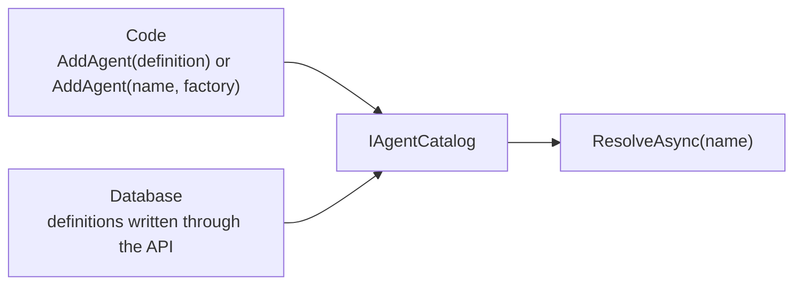
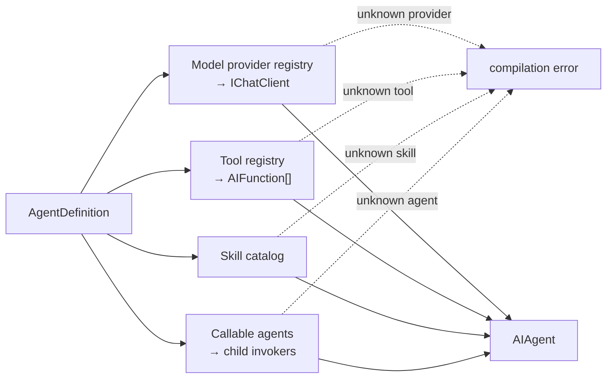
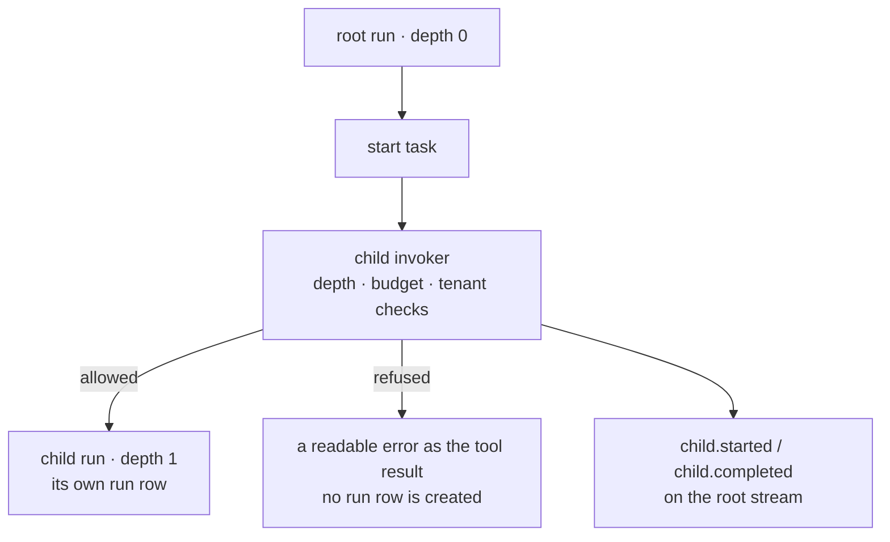

An agent is **data**: a name, a model binding, instructions, and the names of the
tools, skills, and other agents it may use. The compiler turns that data into a MAF
`AIAgent`.

```csharp
new AgentDefinition
{
    Name = "support",
    DisplayName = "Support Assistant",
    Instructions = "You are a support assistant. Answer briefly and clearly.",
    Model = new ModelBinding { Provider = "openai", Model = "…" },
    ToolNames = ["get_order_status"],
    SkillNames = ["refund-policy"],
    CallableAgentNames = ["billing"],
}
```

Because it is data, it can be edited without a deployment — and versioned, diffed,
rolled back, and A/B tested. That is the whole reason for the shape.

## Culture-keyed instructions

`InstructionsByCulture` maps a culture tag (`"en"`, `"tr"`) to its own instructions
text. `POST /api/agents/{name}/run` accepts an optional `culture` field; the compiler
resolves it in this order:

1. An exact match (`culture: "tr"` → the `"tr"` entry)
2. The requested culture's parent subtag (`"tr-TR"` → the `"tr"` entry)
3. `Instructions` — the default, used whenever nothing else matches

An unmatched culture never fails the run; it falls back to the default. The
`Accept-Language` HTTP header is not consulted — a browser header silently changing
the content sent to the model would be a surprise, so the culture is always an
explicit field on the request.

A compiled agent is cached per resolved culture: two runs of the same agent in
different cultures never share a compiled instance.

## Where agents come from

The catalog merges two sources, in priority order:



`AddAgent(name, factory)` is a code registration too — the factory returns a MAF
`AIAgent` directly, built however you want, and the catalog still applies AgentPrism's
decorators (recording, telemetry, approval) when it resolves the agent.

On a name clash the higher-priority source wins and the other is dropped from the
list. **Code wins.** That is why the API refuses to store a definition under a name a
code agent already uses: the stored definition would never resolve, and a silent
shadow is worse than a `409`.

A code-defined agent has no stored definition and no version history — its history is
your source history. The API reports that distinctly: `GET /api/agents/{name}` still
returns `200`, with `definition` set to `null` and `isEditable` set to `false`. The
console checks `isEditable` to decide whether to offer an edit form.

## Compiling a definition



Every name must resolve. An unknown tool, skill, provider, or callable agent is a
compilation error, not a run-time surprise.

The same check runs on the **save** path, so a definition that could not run is
rejected when it is written. `POST /api/agents/validate` runs it without saving and
without calling any model — useful in CI. A validation failure there is not an HTTP
error: the response is `200` with a report, because "this definition is invalid" is an
answer, not a transport failure.

Compiled agents are cached by name, version, and a fingerprint of their dependencies,
so changing a skill invalidates the agents that use it.

## Versions

Every save appends a version rather than overwriting. Nothing rewrites history:

- `GET /api/agents/{name}/versions` — full snapshots, newest first, not deltas
- `GET /api/agents/{name}/versions/{a}/diff/{b}` — both snapshots, verbatim; the diff
  is computed by the client, because the server takes no position on presentation
- `POST /api/agents/{name}/rollback` — writes the old content as a **new** version

Rollback moving forward is the point: the rollback is itself auditable and can be
rolled back in turn.

Versions are also what make [experiments](/concepts/evaluation/) possible —
an A/B test splits traffic between two versions of the same agent, which is why a
code-defined agent cannot be experimented on.

## Agents calling agents

List other agents in `CallableAgentNames` and the compiler wraps each one in a child
invoker and hands them to MAF's background agents provider. The model starts a task,
waits, and reads the result.



Four rules hold across the tree:

- Every run in the tree shares one budget, so a tree cannot spend more than a single
  run was allowed
- Every run in the tree shares one trace id, and only the root owns the trace buffer
- A child runs in the **same tenant**; a tenant change refuses the call
- A child **cannot ask for approval** — a child run that tries fails

The whole tree is readable with `GET /api/runs/{runId}/tree`, from any member.

## Read next

- [Runs and recording](/concepts/runs/)
- [Tools, skills, and MCP](/concepts/tools/)
