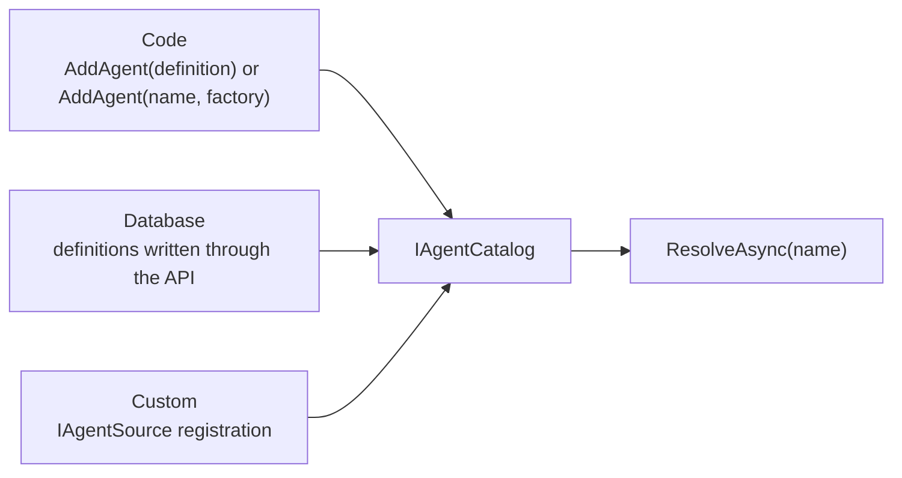
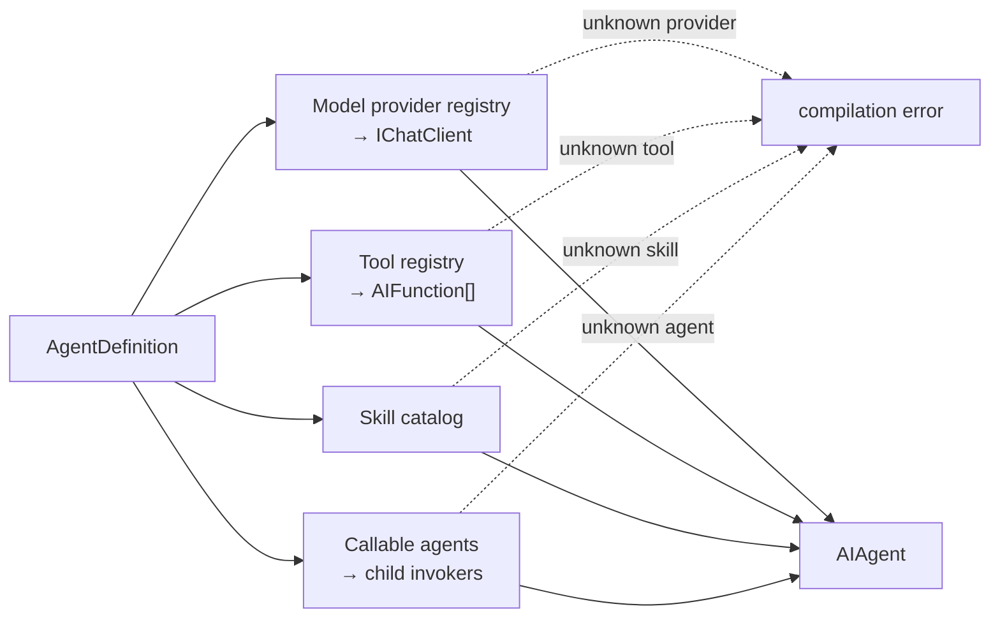
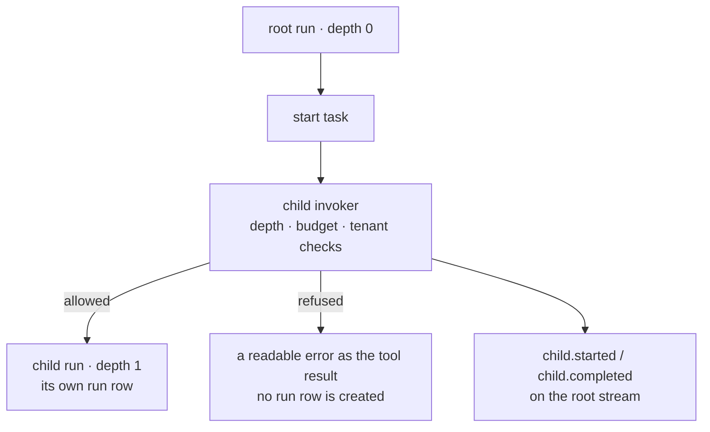

An agent is **data**: a name, a model binding, instructions, and the names of the
tools, skills, and other agents it may use. The compiler turns that data into a MAF
`AIAgent`.

```csharp
new AgentDefinition
{
    Name = "support",
    DisplayName = "Support Assistant",
    Instructions = "You are a support assistant. Answer briefly and clearly.",
    Model = new ModelBinding { Provider = "openai", Model = "…" },
    ToolNames = ["get_order_status"],
    SkillNames = ["refund-policy"],
    CallableAgentNames = ["billing"],
}
```

Because it is data, it can be edited without a deployment — and versioned, diffed,
rolled back, and A/B tested. That is the whole reason for the shape.

## Culture-keyed instructions

`InstructionsByCulture` maps a culture tag (`"en"`, `"tr"`) to its own instructions
text. `POST /api/agents/{name}/run` accepts an optional `culture` field; the compiler
resolves it in this order:

1. An exact match (`culture: "tr"` → the `"tr"` entry)
2. The requested culture's parent subtag (`"tr-TR"` → the `"tr"` entry)
3. `Instructions` — the default, used whenever nothing else matches

An unmatched culture never fails the run; it falls back to the default. The
`Accept-Language` HTTP header is not consulted — a browser header silently changing
the content sent to the model would be a surprise, so the culture is always an
explicit field on the request.

A compiled agent is cached per resolved culture: two runs of the same agent in
different cultures never share a compiled instance.

## Parameters

`Parameters` declares named placeholders an agent's instructions may reference as
`{{name}}`:

```csharp
new AgentDefinition
{
    Instructions = "You help {{customer}}. Use a {{tone}} tone.",
    Parameters =
    [
        new AgentParameter { Name = "customer", Kind = AgentParameterKind.Text, Required = true },
        new AgentParameter { Name = "tone", Kind = AgentParameterKind.Text, DefaultValue = "formal" },
    ],
}
```

A run supplies values on the `parameters` field of `POST /api/agents/{name}/run` (and
`/estimate`, which checks the same values without calling a model). A required
parameter with no value and no `DefaultValue` stops the run before it starts, and
names the missing parameter; a value for a name the schema does not declare is
rejected too, not silently dropped.

This is **value substitution, not a template engine**. There is no expression,
condition, loop, or field access (`{{a.b}}`) — a template language is a security
surface once it is in a library, and every consumer eventually wants their own
dialect. Substitution is single-pass: a value that itself contains `{{name}}` is
inserted literally, never substituted again. A placeholder written as a full JSON
string value in the instructions (`"customer": "{{customer}}"`) has its value
JSON-escaped so the produced text stays valid JSON; anywhere else, the value is
inserted as-is.

Binding runs once per request, after culture resolution and before compilation, and
the compiled agent is never cached for that run — two runs with different parameter
values never share a compiled instance, the same rule culture resolution follows.
Kind (`Text`, `Number`, `Boolean`) only labels the value's expected shape for the
console's own input form; every value travels as a string.

An agent with an empty `Parameters` list is entirely unaffected by this feature —
`{{...}}` in its instructions stays plain, coincidental text, exactly as before this
feature existed.

## Shared instructions blocks

A shared instructions block is an ordinary `AgentDefinition` — there is no separate
type or table for it. Point another definition at it with `SharedInstructionsName`,
and its `Instructions` text is prepended to the referencing definition's own resolved
text at compile time:

```csharp
// The block: any definition works, even one nobody runs directly.
new AgentDefinition { Name = "house-rules", Instructions = "Always cite your source." }

// The reference:
new AgentDefinition { Name = "support", SharedInstructionsName = "house-rules", Instructions = "Answer billing questions." }
```

Because it is saved through the same store as any other definition, a block gets
versioning, tenancy, and the audit trail for free. A block cannot reference another
block — the reference is a single hop, checked and rejected at compile time, not a
cycle-detecting walk.

## Where agents come from

The catalog merges registered sources, in priority order:



`AddAgent(name, factory)` is a code registration too — the factory returns a MAF
`AIAgent` directly, built however you want, and the catalog still applies Tracon's
decorators (recording, telemetry, approval) when it resolves the agent.

An application can add an `IAgentSource` for definitions stored outside Tracon or
for agents owned by another runtime. Custom-source agents are visible in the console
but remain read-only in the management API. See [write your own agent
source](/guides/write-your-own-agent-source/) for the lifecycle, priority, tenancy,
and contract-test rules.

On a name clash the higher-priority source wins and the other is dropped from the
list. **Code wins.** That is why the API refuses to store a definition under a name a
code agent already uses: the stored definition would never resolve, and a silent
shadow is worse than a `409`.

A code-defined agent has no stored definition and no version history — its history is
your source history. The API reports that distinctly: `GET /api/agents/{name}` still
returns `200`, with `definition` set to `null` and `isEditable` set to `false`. The
console checks `isEditable` to decide whether to offer an edit form.

## Compiling a definition



Every name must resolve. An unknown tool, skill, provider, or callable agent is a
compilation error, not a run-time surprise.

The same check runs on the **save** path, so a definition that could not run is
rejected when it is written. `POST /api/agents/validate` runs it without saving and
without calling any model — useful in CI. A validation failure there is not an HTTP
error: the response is `200` with a report, because "this definition is invalid" is an
answer, not a transport failure.

Compiled agents are cached by name, version, and a fingerprint of their dependencies,
so changing a skill invalidates the agents that use it.

## Versions

Every save appends a version rather than overwriting. Nothing rewrites history:

- `GET /api/agents/{name}/versions` — full snapshots, newest first, not deltas
- `GET /api/agents/{name}/versions/{a}/diff/{b}` — both snapshots, verbatim; the diff
  is computed by the client, because the server takes no position on presentation
- `POST /api/agents/{name}/rollback` — writes the old content as a **new** version

Rollback moving forward is the point: the rollback is itself auditable and can be
rolled back in turn.

Versions are also what make [experiments](/concepts/evaluation/) possible —
an A/B test splits traffic between two versions of the same agent, which is why a
code-defined agent cannot be experimented on.

## Agents calling agents

List other agents in `CallableAgentNames` and the compiler wraps each one in a child
invoker and hands them to MAF's background agents provider. The model starts a task,
waits, and reads the result.



Five rules hold across the tree:

- Every run in the tree shares one budget, so a tree cannot spend more than a single
  run was allowed
- Every run in the tree shares one trace id, and only the root owns the trace buffer
- A child runs in the **same tenant**; a tenant change refuses the call
- A child **cannot ask for approval** — a child run that tries fails
- A child call has a two-layer wait limit: a cooperative deadline that cancels a
  child reading its token, and a hard cutoff for one that does not. Past the hard
  cutoff the tree keeps going; the child keeps running in the background and its
  eventual result is discarded. Set `SubAgentSettings` on the calling agent to
  override the installation-wide default:

  ```csharp
  new AgentDefinition
  {
      Name = "router",
      CallableAgentNames = ["researcher"],
      SubAgents = new SubAgentSettings
      {
          ChildDeadline = TimeSpan.FromSeconds(10),
          WaitTimeout = TimeSpan.FromSeconds(20),
      },
      // ...
  };
  ```

  A timed-out call writes a `ChildRunTimedOut` event to the root run's stream,
  naming which layer cut it.

The whole tree is readable with `GET /api/runs/{runId}/tree`, from any member.

## Run until the work is done

A single agent invocation answers once. `HarnessSettings.Loop` re-invokes the
agent until a declared stop criterion says the work is finished, and records
every iteration in the run:

```csharp
new AgentDefinition
{
    Name = "researcher",
    Harness = new HarnessSettings
    {
        Loop = new LoopSettings
        {
            Criteria = [new LoopCriterion { Kind = "completionMarker", Marker = "ALL DONE" }],
            MaxIterations = 5,
        },
    },
    // ...
};
```

The loop is off while `Loop` is null, which is the default.

**`MaxIterations` is not `MaximumIterationsPerRequest`.** The two bound
different loops. `MaximumIterationsPerRequest` bounds the harness's *inner*
tool-calling loop inside one invocation. `MaxIterations` bounds the *outer*
loop that invokes the agent again after a criterion says the work is not
finished.

Four criterion kinds are built in, and each one takes data only:

| Kind | What stops the loop | Fields it reads |
|---|---|---|
| `completionMarker` | The answer contains a marker text | `marker` (required) |
| `todoCompletion` | The todo list has no open item left | `modes` |
| `aiJudge` | A judge model decides the work is finished | `judgeCriteria` (required), `judgeInstructions` |
| `backgroundTaskCompletion` | No background task is still running | — |

A criterion whose logic is code is registered in code and referenced by name,
the same boundary tools and eval checks live behind:

```csharp
// Microsoft Agent Framework marks the loop types for evaluation only, so
// naming one in your own code needs this suppression.
#pragma warning disable MAAI001
tracon.AddLoopEvaluator("hasCitations", new DelegateLoopEvaluator((context, ct) =>
    new ValueTask<LoopEvaluation>(
        context.LastResponse?.Text?.Contains("[1]", StringComparison.Ordinal) == true
            ? LoopEvaluation.Stop()
            : LoopEvaluation.Continue("Add a numbered citation for every claim."))));
#pragma warning restore MAAI001
```

A definition can then use `Kind = "hasCitations"`. A kind that is neither built
in nor registered is refused when the definition is saved, with `400`. It is
never ignored: a stop criterion that is silently dropped leaves a loop with no
stop criterion.

Four more rules are worth knowing before you turn the loop on:

- **Criteria are evaluated in order, and the first one that asks for another
  iteration wins.** The rest are not evaluated that iteration, so the loop stops
  only when every criterion is satisfied. Put the cheapest criterion first — an
  `aiJudge` placed after a `completionMarker` costs nothing on the iterations the
  marker already keeps going.
- **The iteration ceiling is never open.** An unset `MaxIterations` takes
  Tracon's own default of 10. A criterion that can never be satisfied then
  ends as a bounded run, not as an invoice.
- **`aiJudge` calls a model on every iteration it reaches.** It runs on the
  judge binding configured with `AddModelRunJudge(...)`, never on the agent's own
  model. Without that binding the definition does not compile.
- **A criterion that fails to evaluate stops the loop; it does not fail the
  run.** The work already finished is returned, and the iteration event names the
  criterion that failed.

Each evaluated iteration writes a `LoopIterationCompleted` run event carrying
the iteration number, whether a criterion asked for another iteration, and which
one. The criterion's feedback text is not carried in the event.

The event marks an *evaluated* iteration, not a model turn. The turn that
reaches `MaxIterations` is never evaluated — there is nothing left to decide —
so a loop that ends at its ceiling writes one event fewer than it takes turns.
Its last event carries `ceilingReached`, which is how the run record tells "the
criterion was finally satisfied" apart from "we ran out of iterations".

## Read next

- [Runs and recording](/concepts/runs/)
- [Tools, skills, and MCP](/concepts/tools/)
