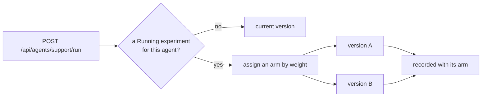

Four ways to find out whether an agent is any good. They answer different questions
and are meant to be used together.

| | Question | When it runs |
|---|---|---|
| **Eval suites** | Did this change break anything? | On demand, against a fixed case set |
| **Online judges** | Is production drifting? | Continuously, on sampled live runs |
| **Human feedback** | What do people think? | Whenever someone scores a run |
| **Experiments** | Is version B better than A? | Live, splitting real traffic |

## Eval suites

A suite names the agent under test and carries **declarative checks**. Its cases are a
list of queries with expected outputs or expected tool calls.

```bash
curl -X PUT http://localhost:5081/agentprism/api/evals/support/cases \
     -H 'Content-Type: application/json' \
     -d '[{"query":"Where is order 4182?","expectedTools":["get_order_status"]}]'
```

That `PUT` is a **full replacement**: cases missing from the body are removed, so send
the whole list every time. Sequence numbers come from the body's order, which means
reordering re-numbers the cases and past results then line up with different ones.
Treat the list as ordered data, not a set.

Running a suite queues a job. Each case runs in its own fresh session against the
agent and produces its own run row, so a failing check can be traced to the exact
conversation that produced it.

```bash
curl -X POST http://localhost:5081/agentprism/api/evals/support/run
curl http://localhost:5081/agentprism/api/evals/support/runs
```

Cases can also be **promoted from a real run** — a production conversation that went
wrong becomes a regression case in one request. The query is read from the run's own
session, so a run without a session cannot be promoted. Promoting the same run twice
returns the existing case rather than duplicating it.

## Online evaluation

Register an `IRunJudge` and finished runs are sampled and scored automatically. The
summary endpoint reports the average score, the sample count, and what the judging
cost.

That summary is **in-memory** and resets when the process restarts. For an
authoritative number, query the stored scores. Judging costs model calls, which is why
it samples rather than scoring everything.

`POST /api/runs/{runId}/judge` scores one run immediately, skipping the sampling
decision — for calibration and debugging.

## Human feedback

Scores can be attached to a run, or to a single message in it. Human scores and judge
scores live in **one** list with a source field on each entry, not in separate
endpoints, so "what do we think of this run" is one question.

Deleting a score is written to the audit trail: removing a judgement is itself
traceable.

## Experiments

An experiment splits traffic between **two versions of the same agent**. Since
code-defined agents have no version history, they cannot be experimented on.



Variant weights must sum to 100, and only one experiment per agent can be `Running` at
a time. Assignment happens **only** on `POST /api/agents/{name}/run` — the
OpenAI-compatible endpoints and child-agent calls do not go through it, which keeps
the comparison to traffic you meant to split.

The results endpoint gives per-arm counts, error rates, tokens, and durations. It
makes **no statistical claim about a winner**; it shows the raw numbers and leaves the
judgement to you.

Stopping affects new runs only. A run already in flight keeps its arm, results stay
readable, and the agent becomes free for another experiment. Deleting a `Running`
experiment is refused — stop it first, so traffic is never split against a definition
that no longer exists.

### Canary rules

A two-arm experiment can carry a canary rule: one arm is the canary and the other is
the control. The evaluation is **not persisted** — it is recomputed from current run
results on every read, so it never reports a stale verdict.

## Read next

- [Agents and definitions](/AgentPrism/concepts/agents/) — versions, which experiments need
- [Governance](/AgentPrism/concepts/governance/)
