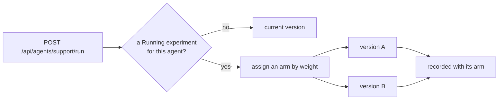

Four ways to find out whether an agent is any good. They answer different questions
and are meant to be used together.

| | Question | When it runs |
|---|---|---|
| **Eval suites** | Did this change break anything? | On demand, against a fixed case set |
| **Online judges** | Is production drifting? | Continuously, on sampled live runs |
| **Human feedback** | What do people think? | Whenever someone scores a run |
| **Experiments** | Is version B better than A? | Live, splitting real traffic |

## Eval suites

A suite names the agent under test and carries **declarative checks** — a JSON array
stored and read as one unit with the suite. Create or update the suite before adding
cases:

```bash
curl -X PUT http://localhost:5081/agentprism/api/evals/support \
     -H 'Content-Type: application/json' \
     -d '{
       "agentName": "support",
       "checks": [{"kind":"toolCalled","tools":["get_order_status"]}]
     }'
```

A suite needs at least one check before it can run — an empty `checks` array fails the
run outright instead of reporting every case as passed. Six built-in kinds cover the
common cases, matched directly to `Microsoft.Agents.AI.EvalChecks` factories:

| Kind | Checks | Fields |
|---|---|---|
| `nonEmpty` | The response has at least `minLength` characters | `minLength` (default 1) |
| `containsExpected` | The response contains the case's `expectedOutput` | `caseSensitive` (default false) |
| `keywords` | The response contains every string in `values` | `values`, `caseSensitive` |
| `toolCalled` | The listed `tools` were called, `all` or `any` of them | `tools`, `mode` (default `all`) |
| `toolCallsPresent` | At least one tool was called | — |
| `hasImageContent` | The response carries image content | — |

Application code can add more with `IAgentPrismBuilder.AddEvalCheck(kind, check)` — a
named MAF `EvalCheck` that becomes usable under a custom kind name alongside the six
built-in ones. A kind that matches neither fails the run with a clear error instead of
being silently skipped.

Cases are a separate, ordered list of queries:

```bash
curl -X PUT http://localhost:5081/agentprism/api/evals/support/cases \
     -H 'Content-Type: application/json' \
     -d '[{"query":"Where is order 4182?","expectedOutput":"shipped"}]'
```

That `PUT` is a **full replacement**: cases missing from the body are removed, so send
the whole list every time. Sequence numbers come from the body's order, so reordering
re-numbers the cases — but a sequence number is only display order. Runs are compared
by case **identifier** (see below), so reordering does not line a past result up
against a different question. `expectedOutput` reaches `containsExpected`;
a case also carries an `expectedTools` field for record-keeping, but the tool names a
`toolCalled` check verifies come from the suite's own check definition, shown above.

For an agent that declares [parameters](/concepts/agents/#parameters), a case's own
`parameters` field supplies the values that run's instructions bind against. A case
missing a value the agent requires fails outright, with a reason naming which
parameter is missing — the same check `POST /api/agents/{name}/run` applies, so a
case that would fail in production fails here too, before any model call is made.

Running a suite queues a job. Each case runs in its own fresh session against the
agent and produces its own run row, so a failing check can be traced to the exact
conversation that produced it.

```bash
curl -X POST http://localhost:5081/agentprism/api/evals/support/run
curl http://localhost:5081/agentprism/api/evals/support/runs
```

## Comparing two runs

A pass rate is a poor regression signal. A suite that slides from 95% to 90% still
clears a `0.85` threshold, and nothing in the run's own summary says which five cases
stopped working. `GET /api/evals/runs/{id}/diff?baseline={runId}` aligns two runs of
the same suite case by case instead:

```bash
curl "http://localhost:5081/agentprism/api/evals/runs/$SECOND/diff?baseline=$FIRST"
```

Every case lands in exactly one bucket:

| Bucket | Meaning |
|---|---|
| `Regressed` | Passed on the baseline, fails now |
| `Fixed` | Failed on the baseline, passes now |
| `StillFailing` | Failed on both |
| `Unchanged` | Passed on both |
| `Added` | Only in the run being judged |
| `Removed` | Only in the baseline run |

`Added` and `Removed` are deliberately their own buckets. Adding a case to a suite
moves the pass rate without anything having broken, and a gate that cannot tell those
apart cries wolf every time someone extends a suite. Each entry names both sides'
agent run, so a regression is one click from the two conversations that produced it.

Two answers are refusals rather than results:

- **`409`** — one of the runs holds results for fewer cases than its summary counts,
  because they aged out of the `eval_case_results` retention window. Retention deletes
  in batches and can leave a run partly trimmed, so the check counts rather than merely
  looking for emptiness: comparing the survivors would report every deleted case as
  `Removed` and quietly narrow the regression count to the rows that happen to remain.
- **`400`** — the two runs measure different suites, or one of them never completed.

Cases are aligned by identifier, and a case's content is not snapshotted per run. The
shipped API makes that safe: `PUT /api/evals/{name}/cases` assigns fresh identifiers,
so editing a case shows up as a `Removed` plus an `Added` entry rather than as a silent
comparison of two different questions. Calling `IEvalStore.ReplaceCasesAsync` directly
while preserving identifiers is the one path that can defeat this, and nothing detects
it.

### As a CI gate

`agentprism eval` turns the same comparison into an exit code:

```bash
agentprism eval --url http://localhost:5081/agentprism --suite support \
  --baseline previous --max-regressions 0
```

`--baseline` takes an eval run id or the word `previous`, which means the newest
completed run of that suite before this one. `--max-regressions` says how many cases
may break.

Three rules keep the gate honest:

- `--max-regressions` without `--baseline` is an **argument error** (exit `1`), never a
  silent no-op. A pipeline must not read a green exit code as "no regressions" when
  nothing was compared.
- A comparison that cannot be made exits **`4`**, not `3`. A lost history needs a
  different fix than a broken case.
- On a suite's first run there is nothing to compare against. That is written to
  stderr and the gate is **skipped**, not failed — otherwise every new suite's first
  CI run goes red for no reason.

The absolute thresholds still apply: `--min-pass-rate` and `--max-failures` are checked
first, and the relative gate only ever adds a check.

The eval run screen carries the same comparison, with a baseline picker and the
`Regressed` group open by default.

Cases can also be **promoted from a real run** — a production conversation that went
wrong becomes a regression case in one request. The query comes from the run's
`RunStarted` event, so failed and sessionless runs can be promoted. A run from a
multi-turn session is accepted only when it has no previous turn; otherwise a single
query cannot represent the conversation that produced the answer. Promoting the same
run twice returns the existing case rather than duplicating it.

## Online evaluation

Register an `IRunJudge` and finished runs are sampled and scored automatically. The
summary endpoint reports the average score, the sample count, and what the judging
cost.

That summary is **in-memory** and resets when the process restarts. For a number
that survives a restart, use the [persistent score summary](#persistent-score-summary)
below instead. Judging costs model calls, which is why it samples rather than
scoring everything.

`POST /api/runs/{runId}/judge` scores one run immediately, skipping the sampling
decision — for calibration and debugging.

The built-in judge is configured with `ModelRunJudgeOptions`: `Criteria` states the
standard to score against, and `Instructions` replaces the judge prompt when the
default wording does not fit your domain.

For lifecycle, concurrency, timeout, tenant, and retry requirements of a custom
judge, see [Write your own judge](/guides/write-your-own-judge/).

## Human feedback

Scores can be attached to a run, or to a single message in it. Human scores and judge
scores live in **one** list with a source field on each entry, not in separate
endpoints, so "what do we think of this run" is one question.

Every score carries a **name** — `helpfulness`, `accuracy`, `severity` — and the name
is part of what makes a score unique. One reviewer can therefore score the same run
several times over, once per name, and writing the same name again updates that row
instead of opening another. A request that sends no name gets `overall`, so a client
that never asks for names keeps a single score per reviewer.

A name is a low-cardinality label matching `[A-Za-z0-9._-]{1,64}` — the same rule a
judge name follows, because a judge writes its own name onto the score it produces.
It is used as a metric tag, so a run id or a timestamp does not belong there.

A score carries one of four shapes:

| Kind | Carries | Example |
|---|---|---|
| `Binary` | `value` 0 or 1 | thumbs down / thumbs up |
| `Stars` | `value` 1 to 5 | a star rating |
| `Numeric` | `value` 0 to 100 | a judge's score, or a similarity of `0.87` |
| `Categorical` | `textValue` | `minor`, `major`, `blocking` |

`value` is a decimal, so `0.87` is stored as `0.87`. A **null** `value` means no
measurement was made — not zero. Zero is a measurement; the absence of one is not,
which is the same rule `RunJudgment.Score` follows when a judge cannot decide.

Deleting a score is written to the audit trail: removing a judgement is itself
traceable.

## Persistent score summary

`GET /api/evaluation/scores/summary` aggregates the scores already written — human
and judge scores together, since they live in the same list. Unlike the
[online evaluation](#online-evaluation) summary, this one reads persisted rows, so
the same request made before and after a restart returns the same result.

Every breakdown groups by **name and kind together**: a 1-5 star rating and a 0-100
numeric score sharing a name never average into one number. `byName` is always
returned; `byAuthor`, `bySource`, and `byAgent` narrow the same data by a different
dimension. A `Categorical` group reports a count per category instead of an average.

```
GET /api/evaluation/scores/summary?bucket=day&from=2026-09-01T00:00:00Z
```

```json
{
  "byName": [
    { "key": "overall", "kind": "Binary", "count": 42, "noValueCount": 0, "average": 0.83 }
  ],
  "series": [
    { "bucketStart": "2026-09-01T00:00:00Z", "groups": [ /* one entry per (name, kind) scored that day */ ] }
  ]
}
```

`bucket` (`hour`, `day`, or `week`, UTC) adds the `series` field — a trend over time,
one entry per bucket that actually has a score. A bucket with nothing scored in it is
left out; the series is sparse, not filled. Leaving `bucket` out costs nothing extra
and returns an empty `series`. A `bucket` given with no `from` defaults the whole query
(breakdowns included) to the last 90 days — a series has no other bound the way a
breakdown does; pass `from` explicitly for an unbounded breakdown alongside it.

`messageId` is never a breakdown dimension — its cardinality is unbounded. Use
`target` (`run`, `message`, or `any`, the default) to narrow to run-level or
message-level scores instead.

Every breakdown, and the categories inside one `Categorical` group, is capped at
`maxRows` (default 20, max 500). A group's `truncatedCategoryCount` reports how many
categories did not fit, so a long tail never silently disappears.

## Experiments

An experiment splits traffic between **two versions of the same agent**. Since
code-defined agents have no version history, they cannot be experimented on.



Variant weights must sum to 100, and only one experiment per agent can be `Running` at
a time. Assignment happens **only** on `POST /api/agents/{name}/run` — the
OpenAI-compatible endpoints and child-agent calls do not go through it, which keeps
the comparison to traffic you meant to split.

The results endpoint gives per-arm counts, error rates, tokens, and durations. It
makes **no statistical claim about a winner**; it shows the raw numbers and leaves the
judgement to you.

Stopping affects new runs only. A run already in flight keeps its arm, results stay
readable, and the agent becomes free for another experiment. Deleting a `Running`
experiment is refused — stop it first, so traffic is never split against a definition
that no longer exists.

### Canary rules

A two-arm experiment can carry a canary rule: one arm is the canary and the other is
the control. The evaluation is **not persisted** — it is recomputed from current run
results on every read, so it never reports a stale verdict.

## Read next

- [Agents and definitions](/concepts/agents/) — versions, which experiments need
- [Governance](/concepts/governance/)
