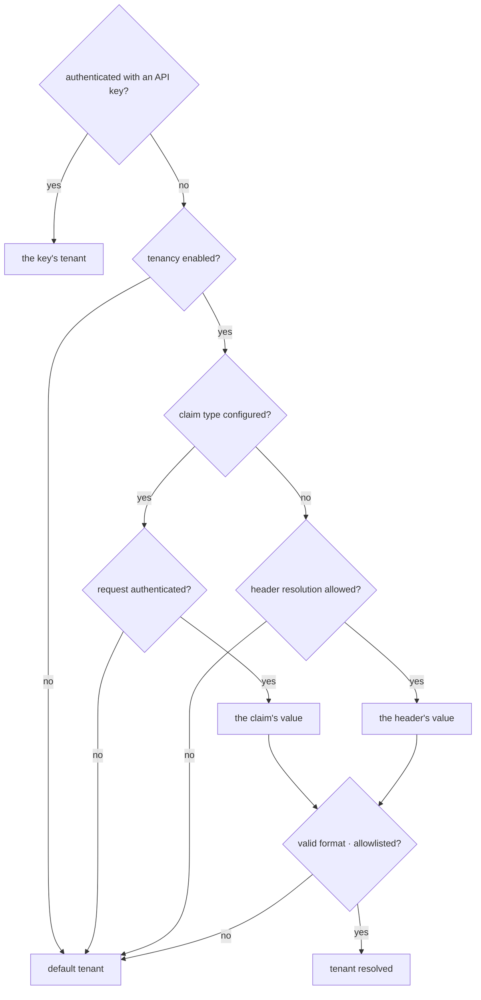
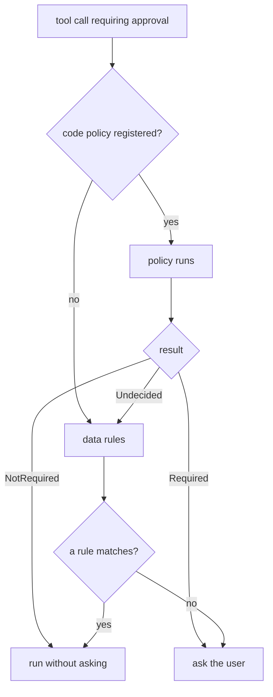

Governance is explicit and visible. Tenancy, quotas, rate limits, retention cleanup,
and content guards need configuration. Audit decorators and their default store are
registered by `AddTracon()`; authentication only changes which actor name they
can record.

## Multi-tenancy

Off by default. Turned on, the tenant is resolved in a fixed order:



Two rules are worth reading twice.

**An API key outranks everything.** A key *proves* a secret; a claim or a header only
*asserts* one. If a key and a header disagree, the request is refused with `403`
before it reaches any endpoint.

**If a claim type is configured, the header is never read.** Otherwise an
authenticated user could reach another tenant's data by adding a header. The header
path also has to be enabled explicitly — an HTTP header is not proof of identity.

Isolation is enforced by contract tests that check it in both directions, across the
in-memory store and all three SQL providers, with a coverage gate requiring every
public store method to be either tested or exempted with a documented reason.

Isolation lives in the application layer, and that is a deliberate choice. Every
query carries the resolved tenant; Tracon does not create database row level
security policies, and it does not assume your database has them. Two reasons: the
coverage gate above already makes an untested store method a build failure, and
SQLite has no row level security at all, so adding it would make the three
providers behave differently. You are free to add such policies in your own
database. If you do, keep the tenant that Tracon resolves and the tenant your
policy binds to the connection in agreement — they are two separate mechanisms.

Rate limits are not an isolation boundary. `Tracon:RateLimit` and the inbound
trigger limit count in the memory of one process, so a `Tenant` partition splits
that instance's own window per tenant rather than a window shared across the
deployment. What binds a tenant's total consumption is a quota, and quotas are
counted in the database.

### Attributing spend below the tenant

The tenant answers "whose data is this". Two further questions — which **user**
spent this, and which **job** it was spent on — are answered by
`IRunAttributionContext`, the sibling interface described in
[Runs](/concepts/runs/#who-ran-it-and-for-what).

The security property is the same one the tenant header has: the value is never
taken from the run request body. A `userId` field there would let any client
write spend against another user's name and forge the cost record outright, so
the body is not a source of attribution at all — the server resolves it from your
identity pipeline, and a `userId` sent in the body is ignored.

The recorded user id is an **opaque string**. Tracon does not resolve it,
does not validate it, and stores no personal detail of its own; what it
identifies is your application's decision.

:::caution
Erasure does **not** match on `runs.user_id`. `IDataSubjectResolver` is the only
thing that knows which subject a value belongs to — Tracon deliberately
holds no mapping — so a resolver must return those runs itself. Find them with
`GET /api/runs?userId={id}&includeChildren=true` and include their ids in the
scope's `RunIds`. Erasing a run row removes its `user_id` along with everything
else on it.
:::

### Below the tenant: session ownership

The tenant is the data boundary, and it is the only one Tracon draws by
default: inside a tenant, every `Reader` sees every session. Turning on
`Tracon:SessionOwnership` adds a second, narrower line under it — a session
records which user opened it, and the session list narrows to that user. It
governs sessions only, and it never crosses the tenant: the same person in two
tenants still has two independent data spaces.

Ownership is not retroactive, so rows written before you turned it on belong to
nobody. They fall out of every user's list immediately; `RefuseUnownedSessions`
refuses them outright once the conversations they hold no longer matter.

See [Sessions: session ownership](/concepts/sessions/#session-ownership) for the
behaviour and the migration notes, and
[Embedding](/guides/embedding/#6--run-and-session-authorization) for how it
composes with `IRunAuthorizationHandler`.

Every one of these handlers has a permissive built-in default, and a host that binds
nothing starts silently on it. Where that silence is unacceptable, declare the
binding required with
[`RequireCustomBinding<T>()`](/guides/embedding/#make-a-binding-required): the host
then refuses to start while Tracon's default is what resolves. It gates
composition, not the decision the handler goes on to make.

## Per-tenant provider credentials and egress

By default every tenant shares the model provider credential a `Use...()` call
registered at startup — one key, one bill, one usage pool. A tenant can instead bring
its own key (BYOK): its usage and its bill stay separate. A record for this binds a
tenant and a provider to the **name** of a configuration key, never to the key's
value — the value is read from `IConfiguration` only at call time and is never
written to a database, a log line, or an HTTP response. A tenant with no binding for
a provider keeps using the shared setup-time credential; nothing changes until an
administrator writes one, and a binding whose configuration key carries no value does
not fall back to the shared key silently — the run fails with a clear error, so a
misconfigured tenant is never billed against the wrong account.

An egress policy narrows which providers a tenant's agents may call at all. A tenant
with no saved policy is unrestricted; saving one is an additive restriction. Naming a
forbidden provider in an agent definition is rejected **at compile time** — before any
request reaches the network — and writing a credential binding for a forbidden
provider is rejected too, so the two surfaces cannot disagree.

Both are managed under `/api/tenants/{tenantId}/providers` and
`/api/tenants/{tenantId}/egress`, guarded by the `SecurityAdmin` API key scope. See
[Per-tenant credentials](/guides/model-providers/#per-tenant-credentials-byok)
for the full HTTP contract.

## The audit trail

Who changed what, when, and from what to what. Agent definitions, skills, MCP
servers, tenants, approval rules, API keys, quotas, retention policies, egress
policies, provider bindings, triggers, webhooks, and approval decisions all land in
it.

Skills are in that list for the same reason agent definitions are: a skill carries
the instructions the model is given **and** the scripts that run on your server, so
`skill.create`, `skill.update`, and `skill.delete` are governance changes, not
content edits.

Runs do **not** — the run history already holds the full record. The one exception is
a content guard's block decision, which is a governance decision rather than a run
detail and must stay traceable after retention deletes the run.

Most writes happen in store **decorators** rather than in endpoints, so no code path
can change one of those entities without an entry. The rest are written by the
endpoint itself, where the audited unit is the operation and not the row it touches —
branching a session, erasing a data subject, or rotating an API key.

The actor comes from your authentication. With none configured the actor is `null`,
and that is not hidden.

Before anything is written it passes a secret filter: any field whose name contains
`apiKey`, `authorization`, `password`, `secret`, or a singular `token` has its value
replaced with `***`. Plural `tokens` — count fields like `maxOutputTokens` — is
deliberately excluded.

```bash
curl 'http://localhost:5081/tracon/api/audit?action=agent.update'
curl 'http://localhost:5081/tracon/api/audit/quota:{id}'
```

### What is guaranteed to be written

Two different guarantees live in this system, and the difference decides what an
audit trail can be used to prove.

**Fail-closed — the operation does not happen unless the record does.** The entry is
written *before* the change is applied, and a write failure aborts the change:

| Operation | What a failed audit write refuses |
|---|---|
| An approval decision, [in band or out of band](#approvals) | The decision is not applied and the tool does not run |
| Granting or revoking a skill script | The grant is not changed |
| Running a skill script | The script does not run |
| Saving or deleting an inbound trigger | The trigger is not changed |
| An automatic canary rollback | The rollback is not applied |
| A data subject erasure | The erasure does not commit |

**Best-effort — the operation continues and the record can be missing.** Every other
audit write takes this path: the failure is logged as a warning, and the call carries
on. Either way the failure increments `tracon.audit.write_failures`, tagged `refused`
or `swallowed` — see [what a failed audit write looks
like](/guides/observability/#what-a-failed-audit-write-looks-like), because a hole in
the audit trail is not something to find out about by reading logs.

Run recording is best-effort in the same way, and goes one step further — after the
first store failure, recording is switched off for the rest of that run. A single
transient error can therefore cost the remainder of that run's events, not just one
of them.

The rule behind the split is that observability must not take down product
functionality. The cost is the part to be honest about: an audit trail is evidence of
what was recorded, not proof of everything that happened. Where a missing record would
itself be the whole problem, the operation is fail-closed instead.

See [Runs and recording](/concepts/runs/) for what a run stores, and
[Observability and cost](/guides/observability/) for what a store failure looks like
in the logs.

### Tamper detection

Every entry carries a hash of its own content and the hash of the entry before it,
chained per tenant. `GET /api/audit/verify` walks the chain and reports one of three
outcomes:

| Status | Meaning |
|---|---|
| `Valid` | Every entry's hash matches its content and links to the one before it |
| `Broken` | An entry's stored hash no longer matches its content — it was altered after it was written |
| `Gap` | A link between two entries is missing — a row was deleted, or a write never completed |

`Broken` and `Gap` both name the first entry where the chain fails.

```bash
curl 'http://localhost:5081/tracon/api/audit/verify'
# {"status":"Valid","entriesChecked":42,"firstFailingEntryId":null}
```

:::note[Entries written before this feature ships have no hash]
They are excluded from the walk rather than misreported as tampered — a chain starts
at the first entry written after upgrading, not retroactively.
:::

## Approvals

Two shapes, matching how the run was started.

Both surfaces carry the **same** guarantee: a decision that cannot be written to the
audit trail is not applied, and the tool it approved does not run. See [what is
guaranteed to be written](#what-is-guaranteed-to-be-written).

**In-band.** A streaming run that hits a tool needing approval carries the request in
its stream and the decision in the next turn.

**The mailbox.** A queued run stops at `AwaitingApproval` and the request waits in
`GET /api/approvals/pending`, with the tool's recorded arguments for the approver to
read and an absolute expiry.

Deciding either way **resumes** the run — the model has to see a result or a refusal
and continue. And the decision opens a **new** run; the one that stopped is never
rewritten.

By default an approver sees the raw call: `{ "orderId": "ORD-1001" }`. Register
`IToolApprovalPresenter` to turn that into "Cancel order for Priya Shah" — implement
`PresentAsync`, reading whatever the call's arguments name, and return a
`ToolApprovalPresentation` (an entity type, id, name, and a free-form message; every
field is optional).

```csharp
public sealed class OrderApprovalPresenter(IServiceScopeFactory scopes) : IToolApprovalPresenter
{
    public async ValueTask<ToolApprovalPresentation?> PresentAsync(
        ToolApprovalContext context, CancellationToken cancellationToken = default)
    {
        if (context.GetString("orderId") is not { } orderId)
        {
            return null;
        }

        using var scope = scopes.CreateScope();
        var orders = scope.ServiceProvider.GetRequiredService<IOrderRepository>();
        var order = await orders.FindAsync(orderId, cancellationToken);

        return order is null ? null : new ToolApprovalPresentation
        {
            EntityType = "order",
            EntityId = orderId,
            EntityName = $"Order {orderId}",
            Message = $"Cancel order {orderId} for {order.CustomerName}.",
        };
    }
}

services.AddSingleton<IToolApprovalPresenter, OrderApprovalPresenter>();
```

Register it as a singleton and reach a scoped dependency, such as a `DbContext`,
through an injected `IServiceScopeFactory` — the same rule as
[the empty service provider mistake](/getting-started/tools/#the-rule-that-trips-people-up),
because this runs on the same tool-call path. Unlike authorization and validation, a
presenter is not a gate: it fails **open**. Not registered, resolves nothing, throws, or
runs past its timeout (`TraconToolOptions.ApprovalPresentationTimeout`, 2 seconds
by default) — the approval request publishes either way, with the raw arguments still
there. A presentation is decoration for a decision a human still has to make from the
real call, never a replacement for it.

The resolved presentation reaches every surface a pending request does: the mailbox
list, the single-request read, the `RunAwaitingInput` run event, and the console's own
approval card.

:::note[The audit entry is written before the decision is applied]
An approval decision that cannot be recorded is not applied at all. This is one of the
six fail-closed operations listed in
[What is guaranteed to be written](#what-is-guaranteed-to-be-written); every other
audit write is best-effort and is swallowed on failure.
:::

Standing decisions are **approval rules** — a pre-approval for a tool. They do not
expire. `GET /api/approvals/rules` is the list to review periodically, because each
entry is a tool call that will never ask again.

A rule narrows its scope one of three ways: to one exact set of arguments (a hash,
written by the "don't ask again" flow above), to a set of argument **conditions** (for
example `amount <= 100`, written with `POST /api/approvals/rules`), or not at all —
matching every call of the tool. A rule carries a hash or conditions, never both.

Conditions are comparisons, never expressions: a dotted path into the arguments, one
operator from a closed set (`Equals`, `NotEquals`, `GreaterThan`,
`GreaterThanOrEqual`, `LessThan`, `LessThanOrEqual`, `In`, `NotIn`), and a value. All
of a rule's conditions must match — there is no `OR`; write two rules instead. A
condition fails closed: an unresolved path, a missing argument, or a type mismatch
(text `"100"` does not satisfy a numeric rule) all mean the call still asks for
approval.



A **code-defined policy**, registered with
`builder.AddToolApprovalPolicy("refund_order", context => ...)`, runs before the data
rules and can override them in both directions. Code is a security boundary; the data
rules are writable from the UI and are not allowed to loosen a policy that says
`Required`. An unhandled exception in a policy is treated as `Required` and logged —
a broken policy never silently releases a tool from approval.

### Tool authorization

Approval and authorization answer different questions. Approval asks "is this call okay
this time" and stops to wait for a person; authorization asks "can this caller call this
tool at all" and answers instantly from `IToolAuthorizationHandler` — your own policy,
checked before approval and before the call's timeout even starts. A denied call does not
fail the run: the model gets the reason as an ordinary tool result and continues its
turn. See [Tools, skills, and MCP](/concepts/tools/#authorization-validation-and-timeout)
for the interface and an example.

## Quotas and rate limits

Two different mechanisms, deliberately not merged. Rate limits work at second and
minute scale in memory; quotas work at day and month scale in the database.

Neither refuses anything by default: rate limiting is off, and quotas are empty until
a rule exists. An agent with no matching rule is unlimited.

A rule sets any of three limits — runs, tokens, or cost — over a period, scoped to the
tenant or to one agent. Exceeding one returns `429` with which quota was hit and when
the counter resets.

You are told **before** the wall, not only at it. As the counter crosses each
percentage in `Quotas:ThresholdPercents` (`80` and `100` by default) Tracon posts
a [`quota.threshold`](#webhooks) webhook carrying the metric, the period, the limit,
the consumption, the threshold crossed, and when the counter resets. Each threshold
fires **once per period**, so a counter that keeps climbing past `80` does not
re-notify. Set the list to empty to turn the notifications off.

The threshold event is a notification, not a decision: it stops nothing, and `429`
remains the only thing that refuses a run.

Turning on `Quotas:PublishThresholdToRunStream` (off by default) also writes the
crossed threshold into the *triggering run's own* event stream — a `custom` frame
carrying `tracon.quota.threshold` before the run's terminal event, so a client
already watching that one run's SSE stream sees the warning without a separate
webhook subscription. The frame's payload carries a `noticeId` (stable across a
reconnect, for dedup), the run and user the threshold belongs to, and the same
metric/period/limit/consumption fields the webhook carries. A threshold is claimed
for notification **once per period** durably — a restart or a second worker
process never re-announces one that already fired. Only the root run of a call
tree ever carries the notice — consumption is counted once at the tree's root,
the same scope [runs](/concepts/runs/) are already counted and billed at.

:::caution[Counters are approximate]
The check happens **before** a run starts; consumption is written **after** it
finishes. A run already in progress is never cut off during execution, so brief overshoot is
possible by design.
:::

This is a *different* budget from the one every root run's call tree carries
(`AgentGraph.MaxTotalTokens`/`MaxTotalCost`/`MaxDuration`, see [Reliable
runs](/guides/reliability/#bound-multi-agent-trees)): a quota is scoped to a tenant
or agent over a day or month and never interrupts a run in progress; the call-tree
budget is scoped to one run's tree and is checked between model turns, so it *does*
cut a long tool loop off mid-run.

## Retention

Recorded runs accumulate. A retention policy sets an age or row limit per target — run
events, tool calls, traces, jobs, webhook deliveries, eval results, checkpoints,
attachments, sessions, and more.

A database policy takes precedence. When none exists and retention is enabled in
configuration, Tracon falls back to its target defaults, including 30 days for
run events and 14 days for spans. With retention disabled, nothing is removed. A
policy with `enabled: false` is configured but paused.

When a policy has `archive: true`, cleanup first sends its batch to the registered
`IArchiveSink`. If no sink exists, no rows are deleted. This fail-safe trades storage
growth for protection from silent data loss.

No endpoint deletes synchronously. Preview first — it is the only way to see the size
of a deletion before it happens — then run, which queues a job.

```bash
curl 'http://localhost:5081/tracon/api/retention/preview'
curl -X POST 'http://localhost:5081/tracon/api/retention/run'
curl 'http://localhost:5081/tracon/api/retention/history'
```

The history of what was deleted is itself never cleaned up.

## Data subject rights

Retention removes data by **age**. Export and erasure remove it by **identity** — a
data subject's own sessions, runs, and conversations, on request (a GDPR-style
"right to erasure").

Tracon does not store personal identity itself: `sessions.id` is a value your own
application chose, and only your application knows which session, run, or
conversation belongs to which end user. You supply that mapping by registering an
`IDataSubjectResolver`:

```csharp
public sealed class MyResolver : IDataSubjectResolver
{
    public ValueTask<DataSubjectScope> ResolveAsync(
        string subjectId, string tenantId, CancellationToken cancellationToken = default)
        => new(new DataSubjectScope
        {
            SessionIds = LookUpSessionIds(subjectId),
            RunIds = LookUpRunIds(subjectId),
            ConversationIds = LookUpConversationIds(subjectId),
        });
}

builder.Services.AddSingleton<IDataSubjectResolver, MyResolver>();
```

Without a resolver registered, both endpoints return `409` — never a silent empty
result that could be misread as "already erased".

```bash
curl 'http://localhost:5081/tracon/api/data-subjects/user-42/export'
curl -X DELETE 'http://localhost:5081/tracon/api/data-subjects/user-42'
curl -X DELETE 'http://localhost:5081/tracon/api/data-subjects/user-42?dryRun=false'
```

:::caution[`dryRun` defaults to `true`]
A bare `DELETE` previews the row counts per target and deletes nothing.
`?dryRun=false` is required to actually erase.
:::

Erasure removes the session, run, conversation, attachment, score, and voice-session
rows that belong to the subject — including summarized conversation messages, which
retention otherwise keeps forever. It never touches the audit trail: an audit record
is "who did what", not the subject's own data, and stays intact and verifiable after
an erasure. The erasure itself **is** written there, with the row count per target; if
that write fails, the whole erasure rolls back.

Export returns every matching row, keyed by target, as one JSON document.
Attachment file bytes are not included — only their metadata.

## Content protection

`AddContentProtection(...)` encrypts session state, chat history, run inputs and
events, tool arguments/results, agent files, and attachments with AES-256-GCM
before they reach the database, and decrypts them transparently on read. Off by
default, like the content guards below — turning it on is a deliberate call, and
only new writes are protected: a row's own content, not configuration, decides
whether it needs decrypting. See
[at-rest content protection](/getting-started/security/#at-rest-content-protection)
for the key configuration and its limits.

## Content guards

An `IContentGuard` inspects content going to and coming from the model. Decisions are
`Allow`, `Mask`, or `Block`, and **the strictest decision wins**.

Off by default: with no guard registered the wrapper is never added and the measured
cost is zero.

The guard sits **inside** the tool-call loop, above the raw client. A tool result
re-enters the model on a second call, and a guard outside the loop would never see it.

Blocked content never reaches the provider network and does not trip the circuit
breaker. Recording stores the placeholder `[content_blocked]`, while the audit entry
records the guard, rule, and direction without the blocked text.

### Source-aware decisions

`ContentGuardContext` carries a `Source`: `UserMessage`, `ToolResult`, `Document`,
`ModelOutput`, or `SkillResource`. A user message and a tool result used to enter a
guard the same way — both are `Direction.Input` — even though the trust level is not
the same. A user can only poison their own session; a tool result can carry text a
different tenant's data wrote into a shared system, which is the most common
prompt-injection path. A guard reads `Source` to apply a stricter rule to
`ToolResult` than to `UserMessage`, or to skip a check that only makes sense for one
of them.

When `Source` is `ToolResult`, `ToolName` carries the tool's name if it can still be
resolved from the same message list — a many-turn conversation can drop the earlier
tool call from context, leaving `ToolName` `null` even though `Source` still reads
`ToolResult`. A security decision keys off `Source`, never off whether `ToolName`
happened to resolve.

`Source` defaults to `Unknown` for content a guard cannot classify. `Unknown` is
never a reason to relax a check — a guard should treat it at least as strictly as
its most sensitive known source. The built-in pattern guard does not read `Source`
at all: the same denied-term and PII patterns apply everywhere, including `Unknown`.

:::note[Masked content stays masked]
Input preview runs before the recording path. When a guard returns `Mask`, the model,
recorded input, and run events receive the masked value. Tracon does not retain a
hidden raw copy for later inspection.
:::

## Requiring a production decision

Nearly everything on this page is off by default, and that is deliberate: a first
run should surprise nobody. It is the wrong default for a production deployment,
which can reach production having never separated tenants, never decided who owns a
session and never registered a content guard — in silence.

`RequireProductionProfile()` refuses to start such a host:

```csharp
builder.AddTracon()
    .RequireProductionProfile(profile => profile
        .Accept(TraconProductionRisk.SingleTenant));
```

It **changes no setting**. It sets no value, chooses no policy and turns nothing on;
the only thing it does is turn a skipped decision into a startup failure. Six
decisions are asked about — tenant separation, session ownership, at-rest content
protection, content inspection, request rate limiting and retention — and each is
either answered by turning the feature on or accepted by name. Accepting is per
item, so each accepted risk is one reviewable line, and every accept is written to
the log at information level each time the host starts.

Content inspection shows why the gate reads registrations rather than flags: there
is no "inspection enabled" setting to read, so the question it asks is whether any
`IContentGuard` is registered at all.

`IProductionProfileCheck` is the seam behind it. More than one check may carry the
same risk and **the strictest answer wins**, which is how the HTTP package adds the
`UseTenancy(options => options.Enabled = false)` case the core cannot see — and how
you add a decision of your own.

Like `RequireCustomBinding<T>()`, this is a composition gate rather than a security
proof: it reports that a feature is switched on, never that the policy behind it is
right. The set of decisions is a versioned contract; see
[Compatibility](/reference/compatibility/#the-production-profile-is-a-versioned-contract).

## The document channel

`documents` on `POST /api/agents/{name}/run` attaches reference text to a run,
wrapped in a delimiter and marked apart from the agent's instructions:

```json
{
  "message": "Summarize the attached policy.",
  "documents": [{ "name": "policy.md", "content": "Refunds within 30 days." }]
}
```

:::caution[Not a security guarantee]
This is a **convention and an audit trail, not a security guarantee**. No provider
gives a hard promise that content wrapped this way is never treated as an
instruction — a capable-enough model can still be steered by content inside a
document. The value is in keeping the data channel visibly separate in the
transcript and in the run record, and in the boundary marker surviving content that
tries to imitate it: a document containing the literal delimiter has that occurrence
defanged, so it can never forge the end of the document and make the model treat
what follows as a new set of instructions.
:::

The run record keeps the document's **name and size**, in its own event — never the
content, which already lives with the rest of the run's recorded input, subject to
the same [content protection](#content-protection) and retention settings as
everything else.

## Webhooks

Subscribe to events and Tracon posts them to your endpoint.

| Event | Fires when |
|---|---|
| `run.completed` | A run completed successfully |
| `run.failed` | A run ended in an error |
| `approval.pending` | A tool call is awaiting approval |
| `workflow.request.pending` | A workflow is awaiting human input |
| `job.completed` | A queued job completed successfully |
| `job.failed` | A queued job ended in an error |
| `eval.completed` | An evaluation run completed |
| `quota.threshold` | A quota counter crossed a percentage in `Quotas:ThresholdPercents` — once per period |
| `run.score.low` | The online-evaluation window's average score dropped below `OnlineEvaluation:LowScoreThreshold`, once the minimum sample count is met |
| `test.ping` | You sent a test delivery to verify the subscription |

The signature is `HMAC-SHA256(timestamp + "." + body, secret)`, with the timestamp
inside the signature so a replay cannot be reused. Your receiver decides the tolerance
window.

The secret is never stored: the subscription carries the **name** of the configuration
key it is read from. Delivery goes through the job queue, so a `test` call reports
that it was queued, not how it went. The delivery history has one entry per event
carrying the latest status and attempt count — retries update that entry rather than
adding rows.

Address validation happens inside the socket connect callback, so the address
validated is the address connected to. See
[securing the endpoints](/getting-started/security/) for why.

## Read next

- [Securing the endpoints](/getting-started/security/) — bind endpoint authorization and tenant resolution to your host.
- [The HTTP API](/http-api/) — apply authentication, pagination, and error conventions to HTTP calls.
