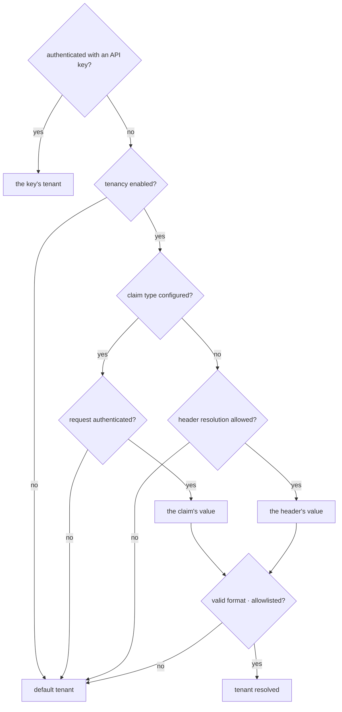

Everything in this page shares one property: it is **off until you configure it**, and
what it does is visible when it is on.

## Multi-tenancy

Off by default. Turned on, the tenant is resolved in a fixed order:



Two rules are worth reading twice.

**An API key outranks everything.** A key *proves* a secret; a claim or a header only
*asserts* one. If a key and a header disagree, the request is refused with `403`
before it reaches any endpoint.

**If a claim type is configured, the header is never read.** Otherwise an
authenticated user could reach another tenant's data by adding a header. The header
path also has to be enabled explicitly — an HTTP header is not proof of identity.

Isolation is enforced by contract tests that check it in both directions, across the
in-memory store and all three SQL providers, with a coverage gate requiring every
public store method to be either tested or exempted with a documented reason.

## The audit trail

Who changed what, when, and from what to what. Agent definitions, MCP servers,
tenants, approval rules, quotas, retention policies, and approval decisions all land
in it.

Runs do **not** — the run history already holds the full record. The one exception is
a content guard's block decision, which is a governance decision rather than a run
detail and must stay traceable after retention deletes the run.

Writes happen in store **decorators**, not in endpoints, so no code path can change
one of those entities without an entry.

The actor comes from your authentication. With none configured the actor is `null`,
and that is not hidden.

Before anything is written it passes a secret filter: any field whose name contains
`apiKey`, `authorization`, `password`, `secret`, or a singular `token` has its value
replaced with `***`. Plural `tokens` — count fields like `maxOutputTokens` — is
deliberately excluded.

```bash
curl 'http://localhost:5081/agentprism/api/audit?action=agent.update'
curl 'http://localhost:5081/agentprism/api/audit/quota:{id}'
```

## Approvals

Two shapes, matching how the run was started.

**In-band.** A streaming run that hits a tool needing approval carries the request in
its stream and the decision in the next turn.

**The mailbox.** A queued run stops at `AwaitingApproval` and the request waits in
`GET /api/approvals/pending`, with the tool's recorded arguments for the approver to
read and an absolute expiry.

Deciding either way **resumes** the run — the model has to see a result or a refusal
and continue. And the decision opens a **new** run; the one that stopped is never
rewritten.

:::note[The audit entry is written before the decision is applied]
Everywhere else an audit failure is swallowed. Not here: an approval decision that
cannot be recorded is not applied at all. Approvals and skill scripts are the only two
places with that inversion, and both are places where the missing record would be the
whole problem.
:::

Standing decisions are **approval rules** — a pre-approval for a tool, optionally
narrowed to one exact set of arguments by hash. They do not expire. `GET
/api/approvals/rules` is the list to review periodically, because each entry is a tool
call that will never ask again.

## Quotas and rate limits

Two different mechanisms, deliberately not merged. Rate limits work at second and
minute scale in memory; quotas work at day and month scale in the database.

Neither refuses anything by default: rate limiting is off, and quotas are empty until
a rule exists. An agent with no matching rule is unlimited.

A rule sets any of three limits — runs, tokens, or cost — over a period, scoped to the
tenant or to one agent. Exceeding one returns `429` with which quota was hit and when
the counter resets.

:::caution[Counters are approximate]
The check happens **before** a run starts; consumption is written **after** it
finishes. A run already in progress is never cut off mid-flight, so brief overshoot is
possible by design.
:::

## Retention

Recorded runs accumulate. A retention policy sets an age or row limit per target — run
events, tool calls, traces, jobs, webhook deliveries, eval results, checkpoints,
attachments, sessions, and more.

A target with **no** policy is kept forever; absence means "keep", not "use a
default". A policy with `enabled: false` is configured but paused, which is different
from having none.

No endpoint deletes synchronously. Preview first — it is the only way to see the size
of a deletion before it happens — then run, which queues a job.

```bash
curl 'http://localhost:5081/agentprism/api/retention/preview'
curl -X POST 'http://localhost:5081/agentprism/api/retention/run'
curl 'http://localhost:5081/agentprism/api/retention/history'
```

The history of what was deleted is itself never cleaned up.

## Content guards

An `IContentGuard` inspects content going to and coming from the model. Decisions are
`Allow`, `Mask`, or `Block`, and **the strictest decision wins**.

Off by default: with no guard registered the wrapper is never added and the measured
cost is zero.

The guard sits **inside** the tool-call loop, above the raw client. A tool result
re-enters the model on a second call, and a guard outside the loop would never see it.

Blocked content never reaches the network, does not trip the circuit breaker, and is
not written anywhere — the trace records the guard, the rule, and the direction, never
the text.

:::caution[Masking is at the model boundary]
Run events and recorded inputs keep the raw text. A guard controls what the *model*
sees, not what is stored.
:::

## Webhooks

Subscribe to events and AgentPrism posts them to your endpoint.

The signature is `HMAC-SHA256(timestamp + "." + body, secret)`, with the timestamp
inside the signature so a replay cannot be reused. Your receiver decides the tolerance
window.

The secret is never stored: the subscription carries the **name** of the configuration
key it is read from. Delivery goes through the job queue, so a `test` call reports
that it was queued, not how it went. The delivery history has one entry per event
carrying the latest status and attempt count — retries update that entry rather than
adding rows.

Address validation happens inside the socket connect callback, so the address
validated is the address connected to. See
[securing the endpoints](/AgentPrism/getting-started/security/) for why.

## Read next

- [Securing the endpoints](/AgentPrism/getting-started/security/)
- [The HTTP API](/AgentPrism/http-api/)
