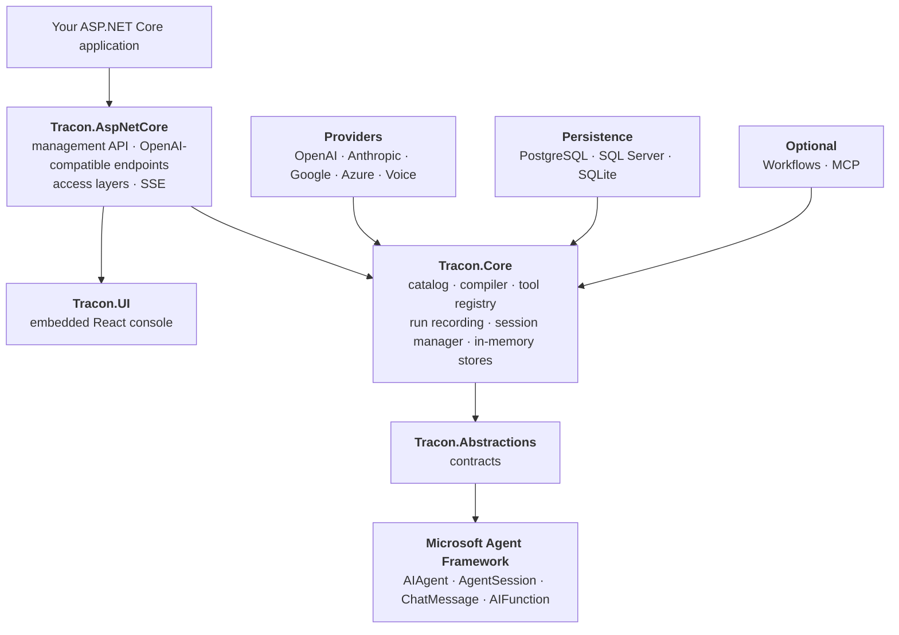

Tracon sits between your application and the Microsoft Agent Framework. It adds a
catalog, a compiler, a recording layer, an HTTP surface, and a console — and it adds
nothing between you and MAF's own types.

## The layers

The dependency direction is one-way and has no cycles: every provider and persistence
package points at `Core`, `Core` points at `Abstractions`, and `Abstractions` points
at MAF. Nothing points back. An architecture test enforces it, so a reference that
would break the picture fails the build rather than the review.

Workflows and MCP are the interesting case: they do **not** reference the HTTP layer,
and the HTTP layer reaches them only through abstractions. That is what keeps them
optional — without the workflow engine registered, the workflow *execution* endpoints
answer `501` while definition management keeps working.

## Four rules

These conventions explain the default setup and the extension model.

### Explicit infrastructure

`AddTracon()` supplies in-memory store defaults, so the runtime comes up without a
database behind it. Configure a model provider or a custom agent source for
execution, and choose persistence when data must survive a restart. The console is
a separate step: add `Tracon.UI`, call `UseUI()`, and map the endpoints with
`MapTracon()` — see [the console guide](/ui/).
No particular model vendor is required either — OpenAI, Anthropic, Google, Azure
OpenAI, and any OpenAI-compatible endpoint (including a self-hosted engine like
Ollama or vLLM) can be registered side by side.

### Tools are defined in code only

The console can create an agent; it can never write tool *code*. If it could, anyone
who reached the console could execute code on your server.

There are exactly two deliberate exceptions, both described in
[tools](/concepts/tools/) with their guards: remote **MCP servers**, where
the process runs somewhere else and Tracon is only a client, and **skill
scripts**, where the process runs on this machine — the strictest exception, off by
default, behind six sequential gates. In both, a console user enables an existing
capability rather than writing new code. That distinction is the rule.

### MAF objects are passed through, not wrapped

`AIAgent`, `AgentSession`, `ChatMessage`, and `AIFunction` are used directly. No
parallel type hierarchy is laid on top of them.

Wrapping would create maintenance debt with every MAF release and cut you off from
the MAF ecosystem. Tracon is a *control plane*, not an *abstraction layer*.

### Replaceable services

Default service registrations use `TryAdd`, so an implementation your application
registers before `AddTracon()` is the one that stays. The same seam covers MAF's own
hosting types, which is why interfaces like conversation storage can be swapped out.
Each extension guide states the lifetime and registration contract its seam expects.

## Where things live

| | |
|---|---|
| Contracts, records, enums | `Tracon.Abstractions` |
| Catalog, compiler, recording, in-memory stores | `Tracon.Core` |
| Endpoints, access layers, OpenAI compatibility | `Tracon.AspNetCore` |
| Schema, migrations, vector search | `Tracon.PostgreSql` and friends |
| The console | `Tracon.UI` |

See [choosing packages](/packages/) for which to install.

## Read next

- [Agents and definitions](/concepts/agents/) — what an agent is here
- [Runs and recording](/concepts/runs/) — what gets written, and when
- [Governance](/concepts/governance/) — tenancy, audit, quotas, retention
