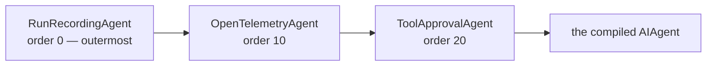
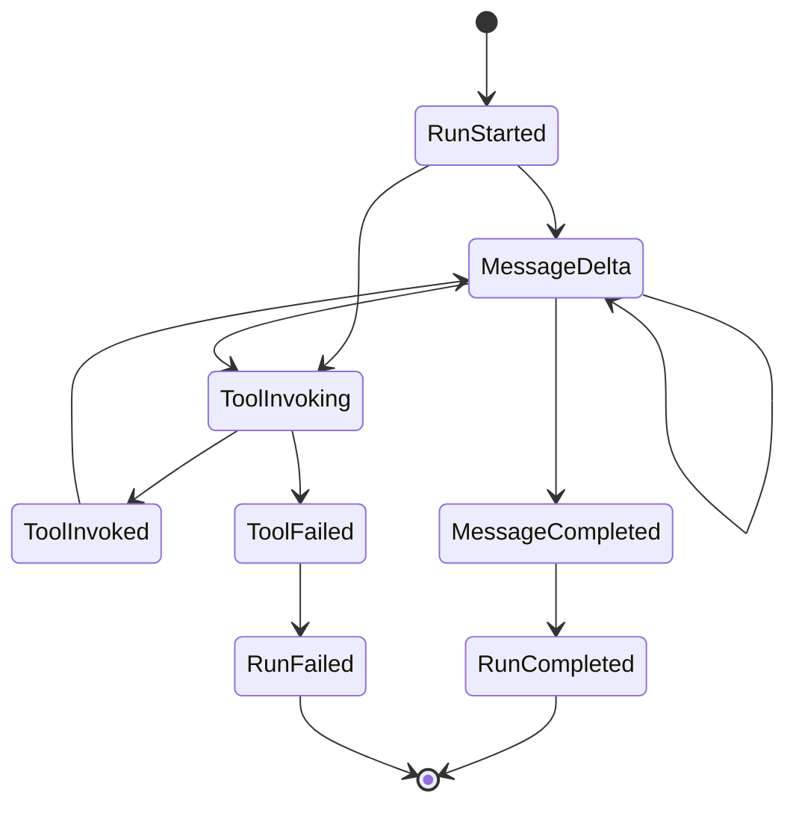

A **run** is one execution of an agent. Every run is recorded — there is no code path
that runs an agent without writing a run row, whether the call came from the HTTP API,
the console, a workflow, an eval, or your own code.

## How recording happens

`IAgentCatalog.ResolveAsync` never returns a bare agent. What it hands back is wrapped
in a chain of decorators:



The order is deliberate. **Recording is outermost** so the time it measures includes
everything the inner layers spend. **Approval is innermost**, closest to the model
call — outside it, telemetry would count the wait for a human as part of its own
duration.

Decorators are plain `DelegatingAIAgent` wrappers rather than MAF middleware, because
middleware is per-agent and a harness agent adds its own inner decorators. An outer
wrapper behaves identically for every agent type.

:::note[Recording never breaks a run]
If the run store fails, the run continues and the error is logged. Observability does
not get to break function. The same rule holds for the audit trail — with one
deliberate exception, described in [governance](/AgentPrism/concepts/governance/).
:::

## What a run carries

The summary — `GET /api/runs/{runId}` — has status, timings, token counts, error
class, and cost when pricing is configured. It does not carry the conversation.

The conversation is the **event stream**, written with gapless sequence numbers by a
single writer:



One writer producing the numbers is what makes the live stream and a later replay
identical, and it is what lets a client resume with `Last-Event-ID` after a dropped
connection.

```bash
curl -N http://localhost:5081/agentprism/api/runs/{runId}/events
```

Tool calls are also written individually — name, arguments, result, duration, error —
so "which tool failed and with what input" is a query, not a log search.

## Three ways to start a run

| | How | Response |
|---|---|---|
| **Streaming** | `POST /api/agents/{name}/run` | `text/event-stream`, one frame per event |
| **Deduplicated** | the same call with `Idempotency-Key` | a single JSON response — a replay cannot be reconstructed from a stream |
| **Queued** | the same call with `Prefer: respond-async` | `202 Accepted` and a `Location` header |

A queued run behaves the same once a worker picks it up. The difference shows at the
end: if a queued run needs a tool approval it closes as `AwaitingApproval` and the
request lands in the approval mailbox, whereas a streaming run carries the approval in
its next turn.

:::caution[A closed run is never rewritten]
A run that ended `AwaitingApproval` stays that way forever. Deciding the approval
opens a **new** run with the same session and a new run id. History is append-only,
so what you read a week later is what actually happened.
:::

## Errors are classified

A failed run carries an error class, not just a message: a provider outage, a content
filter, a blocked guard decision, a quota, a timeout. Two of them are deliberately
distinct — `ContentFiltered` means the *provider's* filter cut the response, while
`ContentBlocked` means *your* guard refused it. The operator response differs: one is
a provider setting, the other is your policy.

`GET /api/stats` aggregates the classes, so a rise in one bucket is visible before
anyone reports it.

## Replay and comparison

- `GET /api/runs/{runId}/input` — the recorded input, when input recording is on
- `GET /api/runs/{a}/compare/{b}` — both summaries, verbatim; the client shows the
  comparison
- `POST /api/runs/{runId}/judge` — score a run with the registered judges, skipping
  the sampling decision, for calibration

## Read next

- [Sessions and conversations](/AgentPrism/concepts/sessions/)
- [Evaluation and experiments](/AgentPrism/concepts/evaluation/)
