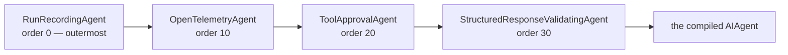
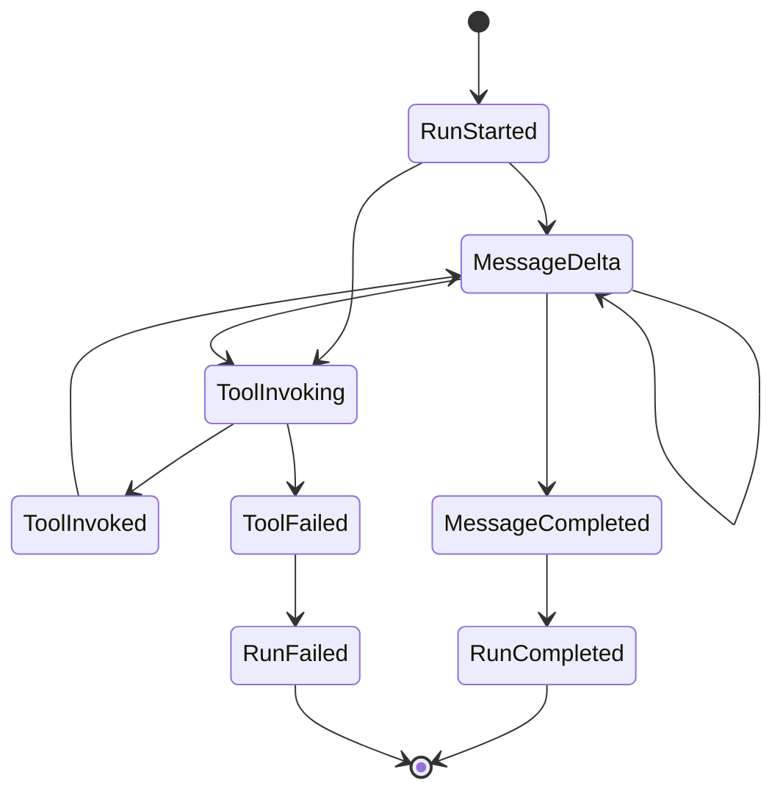

A **run** is one execution of an agent. Recording is on by default for agents resolved
through the Tracon catalog, whether the call came from HTTP, the console, a
workflow, an eval, or your code. You can disable it. A failed store write also leaves
the agent running, so recording is best-effort rather than an availability dependency —
and after the first store failure, recording stops for the rest of that run. Which
records carry a stronger guarantee than this one is set out in
[What is guaranteed to be written](/concepts/governance/#what-is-guaranteed-to-be-written).

## How recording happens

`IAgentCatalog.ResolveAsync` applies the registered decorators. The four built-in
decorators have this outer-to-inner order:



Recording is outermost among the built-in decorators, so its duration includes the
inner layers. Structured response validation is innermost and checks the final
agent response. Tool approval sits between validation and telemetry. A custom
`IAgentDecorator` can change the surrounding chain through its `Order`.

Decorators are plain `DelegatingAIAgent` wrappers rather than MAF middleware, because
middleware is per-agent and a harness agent adds its own inner decorators. An outer
wrapper behaves identically for every agent type.

:::note[Recording never breaks a run]
If the run store fails, the run continues and the error is logged. Observability does
not get to break function. The same rule holds for the audit trail — with one
deliberate exception, described in [governance](/concepts/governance/).
:::

## What a run carries

The summary — `GET /api/runs/{runId}` — has status, timings, token counts, error
class, and cost when pricing is configured. It does not carry the conversation.

`modelProvider` names the provider that actually answered — the same provider
`modelId`'s model came from. `cost` is a **price snapshot**: it also carries the
unit price (per million tokens) that was applied for input, output, and any
prompt-cache read, computed once when the run ends. A later change to your
pricing catalog or configuration never rewrites a run's already-known cost —
`POST /api/stats/recalculate-costs` only fills in runs whose price was unknown
at the time, it never re-prices a run that already has one.

The conversation is the **event stream**, written with gapless sequence numbers by a
single writer:



One writer producing the numbers is what makes the live stream and a later replay
identical, and it is what lets a client resume with `Last-Event-ID` after a dropped
connection.

A run ends **once**, and which ending it gets is decided by what actually happened
rather than by the exception type that surfaced. `Canceled` means somebody asked
for the run to stop — the caller's request went away, or a cancel request reached
the process that owns the run. A model call that simply never came back is
`Failed` with the `Timeout` error class, even though .NET reports an `HttpClient`
timeout as a `TaskCanceledException`. The distinction matters when you alert on
these: cancellations are user behaviour, timeouts are an outage.

A cancelled run is still a **recorded** run: the record and the events written
before the stop stay readable, and the ending is `Canceled` rather than a gap.
What cancellation does prevent is a half-written row after it. Every store
Tracon ships — and every store a contract suite passes — throws
`OperationCanceledException` from a call whose token was already cancelled and
writes nothing at all, so a cancelled run never leaves a partial record behind.
[Write your own store](/guides/write-your-own-store/#cancellation-the-one-promise-every-store-makes)
has the rule in full for a custom implementation.

```bash
curl -N http://localhost:5081/tracon/api/runs/{runId}/events
```

### Two SSE contracts, not one

This is a **different** stream from the one `POST /api/agents/{name}/run` returns, and
the two do not share a frame-name contract. Both report `Content-Type:
text/event-stream`, so the `event:` name is the only way to tell them apart:

| Stream | Frame names |
|---|---|
| `POST /api/agents/{name}/run` (and the workflow and OpenAI-compatible equivalents) | `run` · `update` · `approvals` · `done` · `error` — one per step of that single live call |
| `GET /api/runs/{runId}/events` | `run.started` · `message.delta` · `tool.invoking` · `tool.invoked` · `tool.failed` · `run.completed` · `run.failed` and one more per event type in the diagram above — the recorded, append-only log |

A client written against one contract will not decode the other; pick the endpoint
that matches what you are building — a live turn, or a run's full recorded history.

Tool calls are also written individually — name, arguments, result, duration, error —
so "which tool failed and with what input" is a query, not a log search.

A reasoning model's thinking is a separate event type, `ReasoningDelta`, never merged
into `MessageDelta`. It is off by default — reasoning output can run far longer than
the answer, and it can restate user input in a form the final answer never shows:

```csharp
services.Configure<TraconOptions>(options =>
    options.RunRecording.RecordReasoningDeltas = true);
```

With it off, a reasoning model still streams its thinking to the caller in real time —
this setting only controls whether it is **recorded**.

### Writing your own event

The event types above are a closed set — the console maps every one of them to a
specific visual, and a client can rely on that never changing shape. `RunEventType.Custom`
is the one deliberate escape hatch: your own tool writes it directly, through the
writer your run already carries:

```csharp
[TraconTool("mark_preview_ready", "Marks an order's preview as ready to review.")]
public static async Task<string> MarkPreviewReady(string orderId)
{
    var writer = TraconRunContext.Current?.Writer;

    if (writer is not null)
    {
        await writer.AppendAsync(new RunEventDraft(RunEventType.Custom)
        {
            CustomType = "contoso.preview-ready",
            Payload = $$"""{"orderId":"{{orderId}}"}""",
        });
    }

    return $"Preview for order {orderId} is ready to review.";
}
```

`CustomType` names your event — 1-128 characters, lowercase ASCII letters,
digits, `.`, `_`, or `-`. It is required on a `Custom` event and rejected
(`ArgumentException`) on every other type: a caller who sets it on a built-in
event type gets told immediately, rather than having it silently dropped by
every store. The `tracon.` prefix is reserved, so a future built-in
custom type can never collide with your own — `tracon.quota.threshold`
(the [quota threshold notice](/concepts/governance/#quotas-and-rate-limits))
is the one built-in use of it today; `AppendAsync` rejects any value under
that prefix, so a `Custom` event carrying it can only have come from
Tracon itself. `Payload` is yours too — Tracon makes no claim about
its shape and never reads it.

The console draws an unrecognized `CustomType` with a single generic card —
its own name as the title, `Payload` pretty-printed as the body — so a new
custom type never needs a console change to show up. When a built-in event
type already fits what happened, use that instead; `Custom` is for events
Tracon has no name for.

## Observing events beyond the store

Register an `IRunEventSink` to receive every event as it is written, in addition to
the store — a live dashboard, a message queue, a second archive:

```csharp
public sealed class QueueRunEventSink : IRunEventSink
{
    // Bounded and non-blocking: a full channel drops the oldest event rather
    // than holding up the run. Your own background reader drains it.
    private readonly Channel<RunEvent> _pending = Channel.CreateBounded<RunEvent>(
        new BoundedChannelOptions(1024) { FullMode = BoundedChannelFullMode.DropOldest });

    public ChannelReader<RunEvent> Pending => _pending.Reader;

    public ValueTask OnEventAsync(RunEvent runEvent, CancellationToken cancellationToken = default)
    {
        _pending.Writer.TryWrite(runEvent);

        return ValueTask.CompletedTask;
    }
}

services.AddSingleton<IRunEventSink, QueueRunEventSink>();
```

A sink runs on the hot path — Tracon awaits `OnEventAsync` directly and holds no
queue of its own in front of it, so the buffer above is yours to own. Queue and
return; do not publish to a message bus inline. One instance serves every concurrent
run, so it must be thread-safe. A sink that throws is disabled for the rest of that
run and logged; neither the store write nor any other registered sink is affected.
Register none and nothing changes.

## Who ran it, and for what

A run also records **who** it belongs to and **which job** it was made for. Both
answer questions the tenant cannot: a tenant tells you whose data this is, not
which of that tenant's users spent the money.

Neither value is ever read from the run request body. A `userId` field on
`POST /api/agents/{name}/run` would let any client write spend against another
user's name, so the body is not a source of attribution at all. The value comes
from `IRunAttributionContext`, which your application binds to its own identity
pipeline:

```csharp
public sealed class ClaimsRunAttributionContext(IHttpContextAccessor accessor)
    : IRunAttributionContext
{
    public string? UserId =>
        accessor.HttpContext?.User.FindFirst("sub")?.Value;

    public IReadOnlyDictionary<string, string>? Labels =>
        accessor.HttpContext?.Request.Headers.TryGetValue("X-Job", out var job) == true
            ? new Dictionary<string, string> { ["job"] = job.ToString() }
            : null;
}

// Registered BEFORE AddTracon(); Tracon uses TryAdd, so yours wins.
builder.Services.AddSingleton<IRunAttributionContext, ClaimsRunAttributionContext>();
```

Register nothing and nothing changes: both columns stay `NULL` and no behaviour
differs. For work that runs outside a request — a queued job, a scheduled run, a
direct .NET call — use the ambient scope instead:

```csharp
using (AmbientRunAttributionScope.Begin("user-42", labels: null))
{
    await agent.RunAsync("summarise this ticket");
}
```

The user id is an **opaque string**. Tracon neither resolves nor validates
what it means and stores no personal detail of its own — the same stance the
data-subject erasure flow takes, which covers this column too.

Labels are bounded on purpose: at most **8** per run, keys up to **64**
characters, values up to **256**. Breaking a limit **rejects the request with
400**; nothing is trimmed to fit, because a trimmed label set still reads as a
complete measurement to whoever queries the report later.

:::caution
Labels and user ids are **query** dimensions, not **metric** dimensions. They
live in the `runs` table and are never added to `tracon.tokens` or
`tracon.run.cost` — promoting a free-form label set to a metric tag has no
upper bound on time-series cardinality.
:::

Both are filters on the run list and breakdowns in the summary:

```bash
curl "http://localhost:5081/tracon/api/runs?userId=user-42"
curl "http://localhost:5081/tracon/api/runs?label=team:payments"
curl "http://localhost:5081/tracon/api/stats" | jq '.byUser, .byLabel'
```

`byLabel` rows do **not** sum to `totalRuns`: a run carrying three labels appears
in three of them. A label set is not a partition of the runs.

## Who is allowed to start it

Attribution answers "who did this, for the cost report"; it does not by
itself stop anyone from starting a run. Tracon draws ownership at the
**tenant** level, so by default any caller with the `Operator` role in a
tenant can start any agent in that tenant, regardless of `UserId`.

Bind `IRunAuthorizationHandler` to enforce your own per-user rule. It is
called at every endpoint that starts a run — the agent run endpoint, the
workflow run endpoint, the inbound trigger accept endpoint, the
OpenAI-compatible `/v1/responses` and `/v1/chat/completions` endpoints, and
`POST /api/runs/{id}/replay` — **before** the quota check, so a denied call
never consumes the tenant's quota. The same method is asked again for every
access to an existing run's resources: reading it, canceling it, scoring it,
and reaching its attachments and approval requests. Which question is being
asked is on `request.Access`, and a resource question carries
`request.RunId`:

```csharp
public sealed class YourRunAuthorizationHandler(IYourOwnershipService ownership) : IRunAuthorizationHandler
{
    public async ValueTask<RunAuthorizationResult> AuthorizeRunAsync(
        RunAuthorizationRequest request, CancellationToken cancellationToken = default)
        => request.RunId is { } runId
            ? await ownership.OwnsRunAsync(request.TenantId, request.UserId, runId, cancellationToken)
                ? RunAuthorizationResult.Allow()
                : RunAuthorizationResult.Deny("This run belongs to a different user.")
            : await ownership.CanStartAsync(request.TenantId, request.UserId, request.AgentName, cancellationToken)
                ? RunAuthorizationResult.Allow()
                : RunAuthorizationResult.Deny("This user cannot run this agent.");

    public ValueTask<RunAuthorizationResult> AuthorizeSessionAsync(
        SessionAuthorizationRequest request, CancellationToken cancellationToken = default)
        => new(RunAuthorizationResult.Allow());
}

builder.Services.AddSingleton<IRunAuthorizationHandler, YourRunAuthorizationHandler>();
```

Register nothing and nothing changes: every run starts and every run stays
readable, exactly as before this binding existed. If the handler throws, the
call is denied (fail-closed), an `Error` line naming your handler type is
logged in the `Tracon.RunAuthorization` category, and a `403` says that the
check failed and can be retried. A denied single resource answers `404`, with a
body identical to a run that does not exist — a `403` there would confirm
the run exists; a denied list answers `403`. See
[Embedding: run and session authorization](/guides/embedding/#6--run-and-session-authorization)
for the full `RunAccess` table, the session half of the same contract (list,
read, delete, branch, voice), and the exact response shape each denial
produces.

### Starting a run from .NET with explicit identity

`TraconRunOptions` is the .NET-side counterpart of the run request. It is not a
configuration section: it is passed per call, and all but the last property answer
"which run is this, and where does it sit in a larger story".

| Property | What it sets |
|---|---|
| `RunId` | The identifier to record this run under. Supply your own when the caller already has one; otherwise Tracon generates it |
| `ParentRunId` · `RootRunId` · `Depth` | The run's place in a call tree. The child-agent invoker fills these in; set them yourself only when you drive a tree by hand |
| `AgentVersion` | The definition version this run used, when you resolved a specific one |
| `ExperimentId` | The experiment this run is a sample of, so results group correctly |
| `ReplayOfRunId` | The original run this one replays, which is what makes a comparison possible |
| `ContinuedFromRunId` | The interrupted run this one continues, set automatically — not something you set by hand |
| `SessionId` | The session at the root of the tree. It feeds the run scope, not the run row's own `session_id` |
| `Kind` · `Variant` · `Budget` | The run's kind, its experiment variant, and the shared budget a call tree draws from |
| `BeforePendingApprovalIsPublished` | A callback that runs immediately before a run closes as `AwaitingApproval`, on the streaming and the buffered path alike. Record the approval request here |

Leave every property unset for an ordinary run: Tracon then records a root run with
a generated id, and the values above are filled in by the components that own them.

The last one is a hook rather than an identity, and it exists because the status and the
request become visible at different moments. A run closes inside the agent call, so
without it the status is published first and
[`GET /api/approvals/pending`](/http-api/approvals/) answers an empty list for a run that
already says it is waiting. The callback receives the messages the run produced, and
anything it throws fails the run — an `AwaitingApproval` status whose request was never
recorded is unanswerable.

<span id="three-ways-to-start-a-run"></span>

## Ways to start a run

| | How | Response |
|---|---|---|
| **Streaming** | `POST /api/agents/{name}/run` | `text/event-stream`, one frame per event |
| **Deduplicated** | the same call with `Idempotency-Key` | a single JSON response — a replay cannot be reconstructed from a stream |
| **Queued** | the same call with `Prefer: respond-async` | `202 Accepted` and a `Location` header |
| **Triggered** | `POST /api/triggers/{tenantId}/{name}`, signed by an external system | `202 Accepted` and a `Location` header |

A queued run behaves the same once a worker picks it up. The difference shows at the
end: if a queued run needs a tool approval it closes as `AwaitingApproval` and the
request lands in the approval mailbox, whereas a streaming run carries the approval in
its next turn.

A triggered run is a queued run under the hood — same placeholder row, same worker —
started by a signed HTTP request instead of a management API caller. See
[Inbound triggers](/guides/inbound-triggers/).

:::caution[A closed run is never rewritten]
A run that ended `AwaitingApproval` stays that way forever. Deciding the approval
opens a **new** run with the same session and a new run id. History is append-only,
so what you read a week later is what actually happened.
:::

## Errors are classified

A failed run carries an error class, not just a message: a provider outage, a content
filter, a blocked guard decision, a quota, a timeout, a rejected structured response.
Two of them are deliberately distinct — `ContentFiltered` means the *provider's*
filter cut the response, while `ContentBlocked` means *your* guard refused it. The
operator response differs: one is a provider setting, the other is your policy.

`GET /api/stats` aggregates the classes, so a rise in one bucket is visible before
anyone reports it.

Both the class and the clustering fingerprint come from a classifier you can
replace or compose with your own rules — see
[Write your own error classifier](/guides/write-your-own-error-classifier/).

### The error message is safe to display, not safe to debug from

`error.message` is deliberately shallow. When the failure is Tracon's own —
a content filter, a blocked guard, a quota — the message is the same stable text
you'd write in a UI. When the failure comes from somewhere else (a provider SDK,
a webhook target, an MCP connection), the message carries only the exception's
type name and a correlation id, for example `HttpRequestException failed. (ref:
7f3a9c21)`: a foreign exception's own text can carry a request detail, an internal
address, or a partial credential, and none of that belongs in a persisted field or
an HTTP response. The full detail, matched to the same correlation id, goes to
your server's own log — that is where you debug a specific failure from, not from
the run record.

This applies everywhere a run, job, or webhook delivery can fail: the
`error`/`error_message` field on a run, job, or webhook delivery, and the error
body of the HTTP, SSE, and MCP endpoints, all follow the same rule.

A failure the queue itself produces — rather than a handler — carries a stable
code instead of prose. A job queued for a handler key nobody registered fails
with `tracon.job.unknown-handler-key`, and the key itself is written to the
log rather than to `errorMessage`, for the same reason a foreign exception's
text is: the key may have come from an untrusted source, and that field is read
back over HTTP. Match on the code, never on the sentence around it.

## Replay and comparison

- `GET /api/runs/{runId}/input` — the recorded input, when input recording is on
- `GET /api/runs/{a}/compare/{b}` — both summaries, verbatim; the client shows the
  comparison
- `POST /api/runs/{runId}/replay` — create a sessionless, single-turn replay. The
  default `ReplayTools` mode reuses recorded tool results; `NoTools` produces only
  the model response; `LiveTools` can repeat real side effects and therefore
  requires Admin. An agent carrying a [client-side tool](/guides/client-side-tools/)
  cannot be replayed in any mode — its call was never recorded on the server
- `POST /api/runs/{runId}/judge` — score a run with the registered judges, skipping
  the sampling decision, for calibration

See [Reliable runs](/guides/reliability/) for idempotency, cancellation,
reconciliation, replay constraints, and failure handling.

## Continuing an interrupted run

Replay is something you ask for, on a run you choose, sessionless. Continuation is
automatic: when reconciliation closes a run a process never finished, a session-bound
run can be picked up again in that same session, as a new run whose
`continuedFromRunId` points back at the interrupted one. The run tree shows the link,
so an operator sees "this run continued that one" rather than two unrelated rows.
Continuation is off by default and does not run every tool call again — see
[Continue an interrupted run automatically](/guides/reliability/#continue-an-interrupted-run-automatically)
for what gets replayed, what runs live, and which tools it refuses to continue.

## Read next

- [Sessions and conversations](/concepts/sessions/) — retain conversation state and understand session lifetime.
- [Evaluation and experiments](/concepts/evaluation/) — compare agent versions using cases, judges, and experiments.
