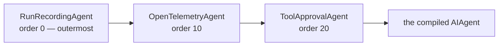
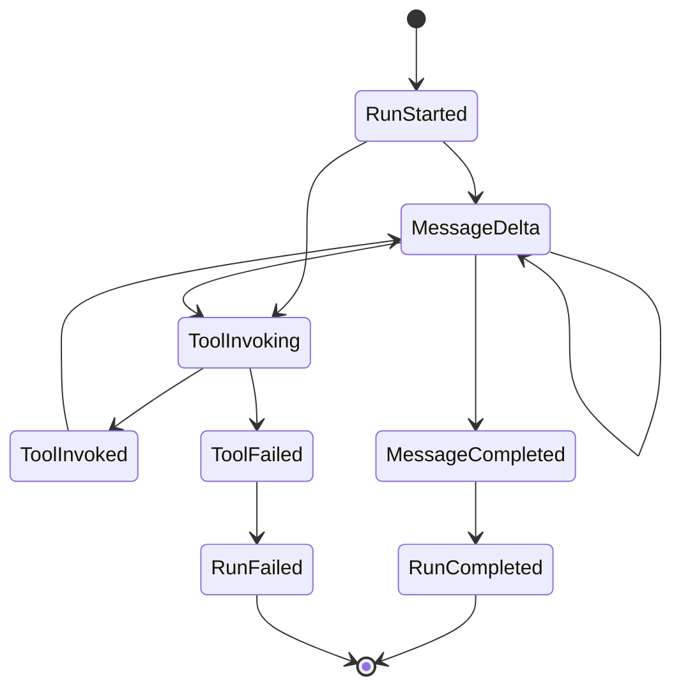

A **run** is one execution of an agent. Recording is on by default for agents resolved
through the AgentPrism catalog, whether the call came from HTTP, the console, a
workflow, an eval, or your code. You can disable it. A failed store write also leaves
the agent running, so recording is best-effort rather than an availability dependency.

## How recording happens

`IAgentCatalog.ResolveAsync` never returns a bare agent. What it hands back is wrapped
in a chain of decorators:



The order is deliberate. **Recording is outermost** so the time it measures includes
everything the inner layers spend. **Approval is innermost**, closest to the model
call — outside it, telemetry would count the wait for a human as part of its own
duration.

Decorators are plain `DelegatingAIAgent` wrappers rather than MAF middleware, because
middleware is per-agent and a harness agent adds its own inner decorators. An outer
wrapper behaves identically for every agent type.

:::note[Recording never breaks a run]
If the run store fails, the run continues and the error is logged. Observability does
not get to break function. The same rule holds for the audit trail — with one
deliberate exception, described in [governance](/concepts/governance/).
:::

## What a run carries

The summary — `GET /api/runs/{runId}` — has status, timings, token counts, error
class, and cost when pricing is configured. It does not carry the conversation.

The conversation is the **event stream**, written with gapless sequence numbers by a
single writer:



One writer producing the numbers is what makes the live stream and a later replay
identical, and it is what lets a client resume with `Last-Event-ID` after a dropped
connection.

```bash
curl -N http://localhost:5081/agentprism/api/runs/{runId}/events
```

Tool calls are also written individually — name, arguments, result, duration, error —
so "which tool failed and with what input" is a query, not a log search.

A reasoning model's thinking is a separate event type, `ReasoningDelta`, never merged
into `MessageDelta`. It is off by default — reasoning output can run far longer than
the answer, and it can restate user input in a form the final answer never shows:

```csharp
services.Configure<AgentPrismOptions>(options =>
    options.RunRecording.RecordReasoningDeltas = true);
```

With it off, a reasoning model still streams its thinking to the caller in real time —
this setting only controls whether it is **recorded**.

## Observing events beyond the store

Register an `IRunEventSink` to receive every event as it is written, in addition to
the store — a live dashboard, a message queue, a second archive:

```csharp
public sealed class QueueRunEventSink(IMessageQueue queue) : IRunEventSink
{
    public async ValueTask OnEventAsync(RunEvent runEvent, CancellationToken cancellationToken = default)
        => await queue.PublishAsync(runEvent, cancellationToken);
}

services.AddSingleton<IRunEventSink, QueueRunEventSink>();
```

A sink runs on the hot path — queue and return, do not block on further I/O — and one
instance serves every concurrent run, so it must be thread-safe. A sink that throws is
disabled for the rest of that run and logged; neither the store write nor any other
registered sink is affected. Register none and nothing changes.

## Who ran it, and for what

A run also records **who** it belongs to and **which job** it was made for. Both
answer questions the tenant cannot: a tenant tells you whose data this is, not
which of that tenant's users spent the money.

Neither value is ever read from the run request body. A `userId` field on
`POST /api/agents/{name}/run` would let any client write spend against another
user's name, so the body is not a source of attribution at all. The value comes
from `IRunAttributionContext`, which your application binds to its own identity
pipeline:

```csharp
public sealed class ClaimsRunAttributionContext(IHttpContextAccessor accessor)
    : IRunAttributionContext
{
    public string? UserId =>
        accessor.HttpContext?.User.FindFirst("sub")?.Value;

    public IReadOnlyDictionary<string, string>? Labels =>
        accessor.HttpContext?.Request.Headers.TryGetValue("X-Job", out var job) == true
            ? new Dictionary<string, string> { ["job"] = job.ToString() }
            : null;
}

// Registered BEFORE AddAgentPrism(); AgentPrism uses TryAdd, so yours wins.
builder.Services.AddSingleton<IRunAttributionContext, ClaimsRunAttributionContext>();
```

Register nothing and nothing changes: both columns stay `NULL` and no behaviour
differs. For work that runs outside a request — a queued job, a scheduled run, a
direct .NET call — use the ambient scope instead:

```csharp
using (AmbientRunAttributionScope.Begin("user-42", labels: null))
{
    await agent.RunAsync("summarise this ticket");
}
```

The user id is an **opaque string**. AgentPrism neither resolves nor validates
what it means and stores no personal detail of its own — the same stance the
data-subject erasure flow takes, which covers this column too.

Labels are bounded on purpose: at most **8** per run, keys up to **64**
characters, values up to **256**. Breaking a limit **rejects the request with
400**; nothing is trimmed to fit, because a trimmed label set still reads as a
complete measurement to whoever queries the report later.

:::caution
Labels and user ids are **query** dimensions, not **metric** dimensions. They
live in the `runs` table and are never added to `agentprism.tokens` or
`agentprism.run.cost` — promoting a free-form label set to a metric tag has no
upper bound on time-series cardinality.
:::

Both are filters on the run list and breakdowns in the summary:

```bash
curl "http://localhost:5081/agentprism/api/runs?userId=user-42"
curl "http://localhost:5081/agentprism/api/runs?label=team:payments"
curl "http://localhost:5081/agentprism/api/stats" | jq '.byUser, .byLabel'
```

`byLabel` rows do **not** sum to `totalRuns`: a run carrying three labels appears
in three of them. A label set is not a partition of the runs.

### Starting a run from .NET with explicit identity

`AgentPrismRunOptions` is the .NET-side counterpart of the run request. It is not a
configuration section: it is passed per call, and all but the last property answer
"which run is this, and where does it sit in a larger story".

| Property | What it sets |
|---|---|
| `RunId` | The identifier to record this run under. Supply your own when the caller already has one; otherwise AgentPrism generates it |
| `ParentRunId` · `RootRunId` · `Depth` | The run's place in a call tree. The child-agent invoker fills these in; set them yourself only when you drive a tree by hand |
| `AgentVersion` | The definition version this run used, when you resolved a specific one |
| `ExperimentId` | The experiment this run is a sample of, so results group correctly |
| `ReplayOfRunId` | The original run this one replays, which is what makes a comparison possible |
| `SessionId` | The session at the root of the tree. It feeds the run scope, not the run row's own `session_id` |
| `Kind` · `Variant` · `Budget` | The run's kind, its experiment variant, and the shared budget a call tree draws from |
| `BeforePendingApprovalIsPublished` | A callback that runs immediately before a run closes as `AwaitingApproval`, on the streaming and the buffered path alike. Record the approval request here |

Leave every property unset for an ordinary run: AgentPrism then records a root run with
a generated id, and the values above are filled in by the components that own them.

The last one is a hook rather than an identity, and it exists because the status and the
request become visible at different moments. A run closes inside the agent call, so
without it the status is published first and
[`GET /api/approvals/pending`](/http-api/approvals/) answers an empty list for a run that
already says it is waiting. The callback receives the messages the run produced, and
anything it throws fails the run — an `AwaitingApproval` status whose request was never
recorded is unanswerable.

## Three ways to start a run

| | How | Response |
|---|---|---|
| **Streaming** | `POST /api/agents/{name}/run` | `text/event-stream`, one frame per event |
| **Deduplicated** | the same call with `Idempotency-Key` | a single JSON response — a replay cannot be reconstructed from a stream |
| **Queued** | the same call with `Prefer: respond-async` | `202 Accepted` and a `Location` header |
| **Triggered** | `POST /api/triggers/{tenantId}/{name}`, signed by an external system | `202 Accepted` and a `Location` header |

A queued run behaves the same once a worker picks it up. The difference shows at the
end: if a queued run needs a tool approval it closes as `AwaitingApproval` and the
request lands in the approval mailbox, whereas a streaming run carries the approval in
its next turn.

A triggered run is a queued run under the hood — same placeholder row, same worker —
started by a signed HTTP request instead of a management API caller. See
[Inbound triggers](/guides/inbound-triggers/).

:::caution[A closed run is never rewritten]
A run that ended `AwaitingApproval` stays that way forever. Deciding the approval
opens a **new** run with the same session and a new run id. History is append-only,
so what you read a week later is what actually happened.
:::

## Errors are classified

A failed run carries an error class, not just a message: a provider outage, a content
filter, a blocked guard decision, a quota, a timeout. Two of them are deliberately
distinct — `ContentFiltered` means the *provider's* filter cut the response, while
`ContentBlocked` means *your* guard refused it. The operator response differs: one is
a provider setting, the other is your policy.

`GET /api/stats` aggregates the classes, so a rise in one bucket is visible before
anyone reports it.

## Replay and comparison

- `GET /api/runs/{runId}/input` — the recorded input, when input recording is on
- `GET /api/runs/{a}/compare/{b}` — both summaries, verbatim; the client shows the
  comparison
- `POST /api/runs/{runId}/replay` — create a sessionless, single-turn replay. The
  default `ReplayTools` mode reuses recorded tool results; `NoTools` produces only
  the model response; `LiveTools` can repeat real side effects and therefore
  requires Admin
- `POST /api/runs/{runId}/judge` — score a run with the registered judges, skipping
  the sampling decision, for calibration

See [Reliable runs](/guides/reliability/) for idempotency, cancellation,
reconciliation, replay constraints, and failure handling.

## Read next

- [Sessions and conversations](/concepts/sessions/)
- [Evaluation and experiments](/concepts/evaluation/)
