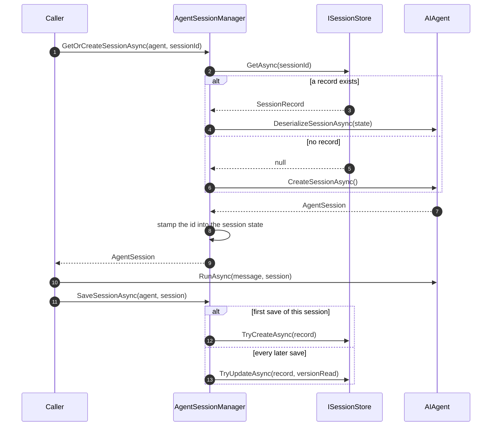
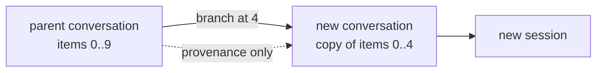

A **session** is where a conversation's state lives between turns. A **run** is one
turn. They are separate on purpose: a session has many runs, and a run can happen
without one.

## The lifecycle



The caller drives it. Tracon does not decide when a conversation starts or ends.

The identity stamp matters: the session id is written into the session's own state
bag, so it survives serialization. A restored session knows which session it is, which
is how the recording layer can put the right session id on a run without being told.

## Two turns at once

Neither save is unconditional, and both refuse rather than overwrite.

| Situation | What the store is asked | If another writer got there first |
|---|---|---|
| First save of a new session | `TryCreateAsync` | `TraconSessionConflictException` |
| Every later save of that session | `TryUpdateAsync(record, versionRead)` | `TraconSessionConflictException` |

`SessionRecord.Version` is the record's write generation. A save replaces the exact
generation it read; if another turn advanced it meanwhile, the write is refused and
the caller is told. The alternative — overwriting — loses a turn that the run record
already reports as successful, with nothing anywhere saying so.

Over HTTP that surfaces as `409 Conflict` on both `/api/agents/{name}/run` (a
problem document whose `errorType` is `session_conflict`) and the OpenAI-compatible
`/v1/responses` (an error envelope whose `error.type` is the same value). **Retry the
turn**; the conflict means the conversation moved on, not that anything is broken. On
a streaming request the response headers are already sent, so the same condition
arrives as an `error` event in the stream instead of a status code.

Saving a session under a **different** id than it was read from — what
`/v1/responses` does when it chains with `previous_response_id` — writes a new record
rather than replacing the source one, so no generation applies and the write is
unconditional.

## Persisted payload compatibility

`SessionRecord.State` is the Microsoft Agent Framework's own serialized
format; Tracon does not interpret it. `SessionRecord.StateSchemaVersion`
(Tracon's own envelope generation) and `StateMafVersion` (the Microsoft
Agent Framework package version that wrote `State`) are stamped on every
save so that a failed restore can report exactly what was recorded instead
of guessing. See [Versions and upgrades](/reference/versioning/#persisted-session-and-checkpoint-state)
for the full compatibility policy and what to do when a session cannot be
restored after an upgrade.

## Reading a conversation back

`GET /api/sessions/{sessionId}` returns metadata plus `messages` — but `messages` is
`null` when the configured storage cannot expose a readable history. With in-memory
storage the history lives inside an opaque provider blob; `state` always carries that
raw blob, and it is not a chat log.

With a SQL provider the history is stored as ordered items, so messages come back in
sequence order. That ordering is not cosmetic: the index of a message **is** the
sequence number the branch endpoint takes.

A provider-hosted live voice session writes into this same history: when it closes,
the conversation's transcript is appended as ordinary user and assistant messages, so
`GET /api/sessions/{sessionId}` shows what was actually said. That write is a
retention decision and can be switched off — see
[voice privacy and retention](/guides/voice/#privacy-and-retention).

## Branching

`POST /api/sessions/{sessionId}/branch` copies items up to and including a sequence
number into a **new** conversation and opens a session on it.



The items are **copied**, not shared. Writing to the branch never changes the parent,
and the pointer back to the parent is provenance, nothing more. This is what "try the
same conversation with a different agent from turn five" looks like.

Branching needs a SQL provider. On in-memory storage there are no addressable items to
copy, and the endpoint answers `501` rather than pretending.

:::note[Only the session screen can branch mid-conversation]
The playground folds its transcript from a live event stream, and those events carry
no sequence numbers. Branching from the playground therefore copies the **whole**
conversation. The session screen reads stored items and can branch at any point.
:::

## OpenAI-compatible conversations

`/v1/conversations` maps onto the same sessions. Two behaviours are worth knowing:

- A conversation id is a **reservation**. An id that has never carried a call is still
  valid and answers `200`. So a `404` means "not yours", not "never used" — an id
  owned by another tenant is reported as missing rather than forbidden, so the API
  does not confirm that it exists.
- `previous_response_id` and `conversation_id` are treated as untrusted input. Tenant
  ownership is verified on every use.

## Who can access a session

By default everything above is tenant-scoped: any caller with the
`Reader`/`Operator` role in a tenant can list, read, delete, and branch every
session in that tenant, regardless of which user opened it.

There are two ways to draw a narrower line, and they compose. **Session
ownership** is built in and needs no code. **`IRunAuthorizationHandler`** hands
the decision to your own policy.

### Session ownership

Turning ownership on makes Tracon record which user a session belongs to,
and narrow the session list to that user:

```json
{
  "Tracon": {
    "SessionOwnership": {
      "Enabled": true
    }
  }
}
```

The owner comes from `IRunAttributionContext` — the same interface that names
the user on a cost report — and is read at the moment a session is **opened**.
It is never read from a request body: a `userId` field there would let any
client open a session under someone else's name.

| With ownership on | What happens |
|---|---|
| `GET /api/sessions` | Only the caller's own sessions, narrowed **before** paging, so `take=3` returns three of *their* sessions |
| `GET`/`DELETE`/`POST …/branch` on another user's session | `404`, byte for byte identical to a session that does not exist |
| Starting a run against another user's session | `403` — continuing a conversation reads its whole history back, so the run surface is guarded too |
| A branch of your own session | The copy inherits **your** ownership; branching is a copy, not a handover |
| No identity can be resolved | The session is not opened at all: `403` with `errorType` `session_owner_required` |

Three properties are worth knowing before you turn it on:

- **It is not retroactive.** Sessions written before you enabled it have no
  owner. Tracon cannot invent one for a conversation it did not watch being
  opened. Those sessions stay readable by id, so nothing that was live at the
  moment of the flip breaks — but they no longer appear in any user's list. Once
  they no longer matter, `RefuseUnownedSessions` closes that door too; see
  below.
- **Someone still needs the whole list.** A caller who satisfies
  `Tracon:SessionOwnership:ManagementPolicy` (default: the `Operator` role
  policy) gets the unfiltered tenant listing, including those unowned rows. If
  the policy is not registered, *nobody* gets the unfiltered list — the failure
  direction is deliberate. Set it to `""` to state that outright.
- **Ownership is drawn under the tenant, never across it.** The same person in
  two tenants still has two independent data spaces.

`RequireAuthenticatedOwner` (default `true`) is what turns an unresolvable
identity into a refusal. Turning it off lets unowned sessions be opened again,
which is only useful while migrating: such a session is invisible in its own
caller's list from the moment it is written.

Sessionless runs are unaffected — there is nothing to own.

#### Refusing the unowned rows too

An unowned row is not discoverable — it appears in no user's list — but by
default it is still readable by anyone in the tenant who knows its id.
`RefuseUnownedSessions` (default `false`) turns that into a refusal:

```json
{
  "Tracon": {
    "SessionOwnership": {
      "Enabled": true,
      "RefuseUnownedSessions": true
    }
  }
}
```

| With strict mode on | What happens |
|---|---|
| `GET`/`DELETE`/`POST …/branch` on an unowned session | `404`, byte for byte identical to a session that does not exist |
| `GET`/`DELETE` `/v1/conversations/{id}` on an unowned session | The same `404` — the OpenAI-compatible routes reach the same sessions |
| A voice socket on an unowned session | Refused with `404` |
| Starting a run against an unowned session | `403` with `errorType` `session_owner_required` |
| A caller who satisfies `ManagementPolicy` reading one | Still `200` — support keeps the access it already had in the management listing |
| A caller who satisfies `ManagementPolicy` starting a run on one | `403` — that exemption covers reading a conversation, never appending to it |
| A session that **does not exist yet** | Unchanged: the first turn opens it and claims it |

The last row is the one to hold on to. "Never created" and "created without an
owner" are different rows and get different answers; if they were folded
together, the first turn of every new conversation would be refused.

The setting does nothing on its own — with `Enabled` off, no owner is ever
read. Default `false` because turning it on strands every conversation that was
live at the moment you enabled ownership. Turn it on once those conversations
no longer matter, or from day one in a deployment that has no unowned rows at
all.

### Your own authorization handler

Ownership answers "which user", and only for sessions. For anything else —
per-project rules, shared conversations, an external policy service — bind
`IRunAuthorizationHandler`:

```csharp
public sealed class YourRunAuthorizationHandler(IYourOwnershipService ownership) : IRunAuthorizationHandler
{
    public ValueTask<RunAuthorizationResult> AuthorizeRunAsync(
        RunAuthorizationRequest request, CancellationToken cancellationToken = default)
        => new(RunAuthorizationResult.Allow());

    public async ValueTask<RunAuthorizationResult> AuthorizeSessionAsync(
        SessionAuthorizationRequest request, CancellationToken cancellationToken = default)
    {
        // request.SessionId is null only for SessionAccess.List.
        if (request.Access == SessionAccess.List)
        {
            return RunAuthorizationResult.Allow();
        }

        return await ownership.OwnsAsync(request.TenantId, request.UserId, request.SessionId!, cancellationToken)
            ? RunAuthorizationResult.Allow()
            : RunAuthorizationResult.Deny("This session belongs to a different user.");
    }
}
```

The response shape follows the same "don't confirm what shouldn't be seen"
rule the OpenAI-compatible conversations above already use: a denied
**read**, **delete**, or **branch** returns `404` with the exact same body a
genuinely missing session gets, and a denied **list** returns `403`. Note the
difference from ownership: a handler answers a yes/no question, so a "no" on a
list rejects the whole call rather than quietly returning fewer rows. Ownership
is a filter and does narrow the list. See
[Embedding: run and session authorization](/guides/embedding/#6--run-and-session-authorization)
for the run-starting half of the same contract.

With ownership on, a handler no longer has to reject a whole listing just to
keep users apart — the listing arrives already narrowed, and the handler is
free to answer the questions ownership cannot.

## Attachments

Attachments are uploaded independently and referenced from messages; the bytes live in
storage and only a small reference travels with a message. The upload's type is
decided by inspecting its magic bytes, not by the `Content-Type` the client claims.

Deleting a session deletes the attachments it owns. You can also call
`DELETE /api/attachments/{id}` for one attachment, and the orphan-attachment retention
target cleans uploads that never become part of a session. Individual deletion is a
hard delete: an older message that still contains the reference will no longer be able
to download the bytes. The link is deliberately not a database foreign key because an
upload can exist before its session does.

Downloads are served with `Content-Disposition: attachment` and
`X-Content-Type-Options: nosniff` together, so uploaded HTML can never execute in the
console's origin.

## Read next

- [Runs and recording](/concepts/runs/) — inspect recorded status, events, tokens, and recording limits.
- [Attachments and multimodal input](/guides/multimodal/) — attach validated files, images, and audio to a conversation.
- [Workflows](/concepts/workflows/) — coordinate multiple agents with checkpoints and human input.
