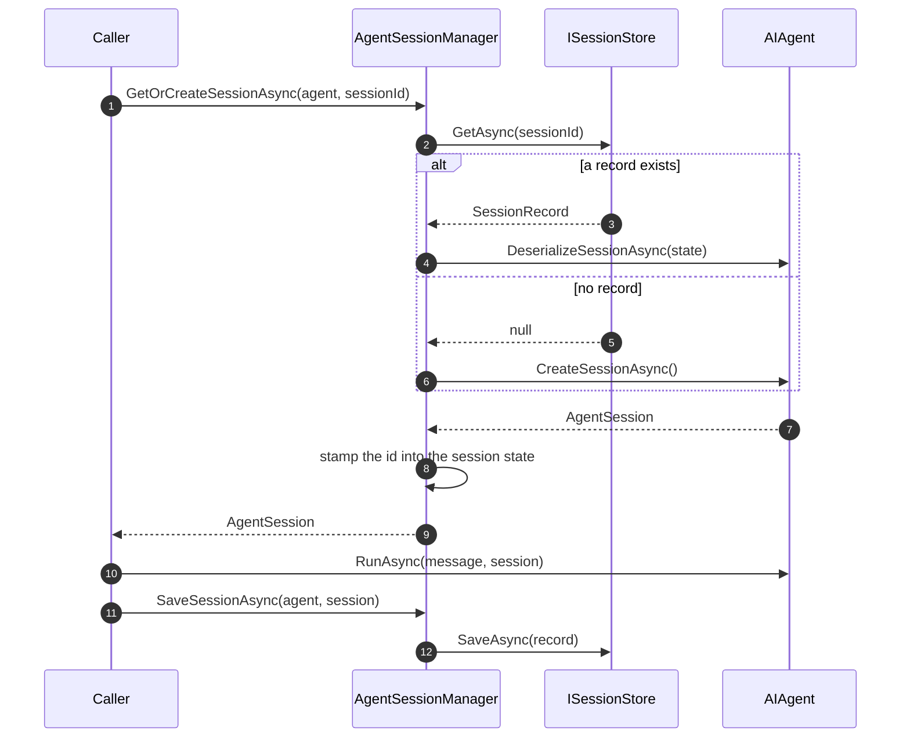
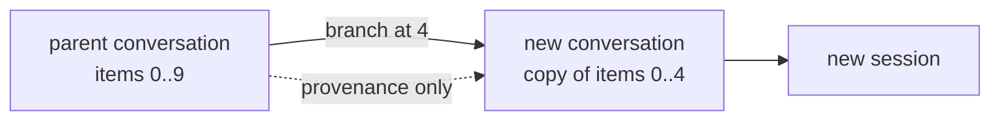

A **session** is where a conversation's state lives between turns. A **run** is one
turn. They are separate on purpose: a session has many runs, and a run can happen
without one.

## The lifecycle

The caller drives it. AgentPrism does not decide when a conversation starts or ends.

The identity stamp matters: the session id is written into the session's own state
bag, so it survives serialization. A restored session knows which session it is, which
is how the recording layer can put the right session id on a run without being told.

## Reading a conversation back

`GET /api/sessions/{sessionId}` returns metadata plus `messages` — but `messages` is
`null` when the configured storage cannot expose a readable history. With in-memory
storage the history lives inside an opaque provider blob; `state` always carries that
raw blob, and it is not a chat log.

With a SQL provider the history is stored as ordered items, so messages come back in
sequence order. That ordering is not cosmetic: the index of a message **is** the
sequence number the branch endpoint takes.

## Branching

`POST /api/sessions/{sessionId}/branch` copies items up to and including a sequence
number into a **new** conversation and opens a session on it.

The items are **copied**, not shared. Writing to the branch never changes the parent,
and the pointer back to the parent is provenance, nothing more. This is what "try the
same conversation with a different agent from turn five" looks like.

Branching needs a SQL provider. On in-memory storage there are no addressable items to
copy, and the endpoint answers `501` rather than pretending.

:::note[Only the session screen can branch mid-conversation]
The playground folds its transcript from a live event stream, and those events carry
no sequence numbers. Branching from the playground therefore copies the **whole**
conversation. The session screen reads stored items and can branch at any point.
:::

## OpenAI-compatible conversations

`/v1/conversations` maps onto the same sessions. Two behaviours are worth knowing:

- A conversation id is a **reservation**. An id that has never carried a call is still
  valid and answers `200`. So a `404` means "not yours", not "never used" — an id
  owned by another tenant is reported as missing rather than forbidden, so the API
  does not confirm that it exists.
- `previous_response_id` and `conversation_id` are treated as untrusted input. Tenant
  ownership is verified on every use.

## Attachments

Attachments are uploaded independently and referenced from messages; the bytes live in
storage and only a small reference travels with a message. The upload's type is
decided by inspecting its magic bytes, not by the `Content-Type` the client claims.

Deleting a session deletes its attachments, and that is the only cleanup path — an
attachment may be uploaded before any session exists, so the link is deliberately not
a database foreign key.

Downloads are served with `Content-Disposition: attachment` and
`X-Content-Type-Options: nosniff` together, so uploaded HTML can never execute in the
console's origin.

## Read next

- [Runs and recording](/AgentPrism/concepts/runs/)
- [Workflows](/AgentPrism/concepts/workflows/)
