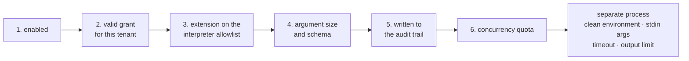

An agent gains capability in a few ways. They differ in where the code lives and who
is allowed to add it.

| | What it is | Where the code runs |
|---|---|---|
| **Tools** | Methods in your codebase | Your process |
| **Client-side tools** | A declaration in your codebase, no server-side body | The caller's process (typically a browser) |
| **Skills** | Markdown instructions plus resources | Nowhere — they are text |
| **MCP tools** | Tools published by a remote MCP server | Someone else's process |

## Tools

A tool is a method you wrote, registered at startup. See
[adding a tool](/getting-started/tools/) for the mechanics.

The rule that governs the whole design: **tools are defined in code only**. The
console lets a user *select* from registered tools; it never defines one. If it could,
anyone who reached the console could execute code on your server.

Wrapping for approval happens in the **registry**, not at the call site. The registry
is the single place where "an agent may only point at a registered tool" is enforced,
so no other code path can skip the wrapper.

### Authorization and timeout

Two more wrappers apply next to approval, in a fixed order: **authorization** (outermost),
**timeout**, then **approval** (innermost), then the real method.

Authorization asks a different question than approval. Approval asks "is this call okay
this time" and stops to wait for a person. Authorization asks "can this caller call this
tool at all" and answers instantly from your own policy — implement
`IToolAuthorizationHandler` and register it; the default allows every call, so an
application that registers nothing keeps today's behavior exactly.

```csharp
public sealed class MyAuthorizationHandler : IToolAuthorizationHandler
{
    public ValueTask<ToolAuthorizationResult> AuthorizeAsync(
        ToolAuthorizationRequest request, CancellationToken cancellationToken = default)
        => request.RequiredPermission is "orders.cancel" && !CallerHasPermission(request)
            ? ValueTask.FromResult(ToolAuthorizationResult.Deny("You cannot cancel orders."))
            : ValueTask.FromResult(ToolAuthorizationResult.Allow());
}

services.AddSingleton<IToolAuthorizationHandler, MyAuthorizationHandler>();
```

A denied call does not fail the run: the model receives the reason text as an ordinary
tool result and continues its turn — the same way a search that finds nothing is not an
error. If your handler throws, the call is denied (fail-closed), never allowed.

`[AgentPrismTool]` also carries an effect class and a per-tool timeout:

```csharp
[AgentPrismTool(
    "cancel_order",
    "Cancels an order.",
    RequiresApproval = true,
    Effect = ToolEffect.Destructive,
    RequiredPermission = "orders.cancel",
    TimeoutSeconds = 30)]
public static string CancelOrder(string orderId) => ...;
```

`Effect` (`Read`/`Write`/`Destructive`/`External`) is information, not a gate — the
console shows it as a badge, and the audit trail records it. A call that outlives its
timeout does not fail the run either: the model sees a tool error and continues, the same
as a denial. `CancellationToken` is cooperative, so a tool body that never reads its own
token is not forcibly stopped — only the *wait* is cut short; the timeout applies to
execution only, never to a pending approval, which can wait indefinitely.

### Concurrent tool calls

By default, when a model turn calls several independent tools at once, AgentPrism
runs them one after another. Set `ModelBinding.AllowConcurrentToolCalls` to run them
at the same time instead — each call still gets its own authorization decision, its
own recorded result, and its own entry in the tool-usage metrics; none of that mixes
up between calls that happen to overlap.

Off by default: with no change, tool calls run one at a time exactly as they do
today. Turn it on only for tools whose bodies are safe to run concurrently with
themselves — a tool that shares mutable state across calls without its own
synchronization should not opt in. See
[Model providers](/guides/model-providers/#concurrent-tool-calls) for where this
setting lives on `ModelBinding`.

## Client-side tools

`AddClientTool(name, description, jsonSchema)` registers a tool the SAME way — the
declaration lives in code — but with no body at all. The model can still call it; the
server returns the pending call to the caller instead of running anything, and the
caller answers it on the next request. See
[Client-side tools and the embeddable widget](/guides/client-side-tools/)
for the full mechanism and the chat widget built on it.

## Skills

A skill is markdown with frontmatter, optionally carrying resources — reference text
the agent can pull in. Skills are tenant-scoped and editable from the console, because
they are *instructions*, not code.

An agent lists skills by name. Deleting a skill an agent still names is a real break:
compiling that agent then fails with "the skill was not found" until the reference is
removed or the skill is recreated. Check which agents use a skill before deleting it.

### Skill scripts — the strict exception

A skill may also carry **scripts**, and this is the second deliberate exception to the
code-only rule. Unlike MCP, the process runs **on this machine**.

It is off by default and can only be turned on in code, with a mandatory
acknowledgement flag, an interpreter allowlist that starts empty, and skill roots
given in code.

Every execution passes six gates in order, and if any is closed the process never
starts:



:::danger[Gate five is an exception to an exception]
Everywhere else in AgentPrism an audit-trail write failure is swallowed, because
observability must not break function. Here it is not: a script execution that cannot
be written to the audit trail would be remote code execution with no record of it, so
the run is refused.
:::

Grants are visible and revocable at `GET /api/skill-script-grants`. A grant without a
script name covers every script in a skill; one with a name covers only that script.
Grants can expire.

:::caution[AgentPrism does not sandbox]
It provides **no** filesystem jail, network restriction, memory or CPU quota, or
privilege dropping. All four belong to the hosting environment — a container, cgroups,
and an unprivileged user. The acknowledgement flag exists so the feature cannot be
enabled without seeing this: with execution on and the flag off, the application fails
at **startup**.
:::

## MCP servers

Registering a remote MCP server means accepting tool definitions from outside, which
is the first deliberate exception to the code-only rule. The process runs elsewhere;
AgentPrism is only a client. Five guards:

1. **`http` and `https` only — there is no stdio transport.** Starting a local process
   would break the rule outright.
2. **`RequiresApproval` defaults to true** for tools discovered this way.
3. **A remote tool whose name collides with a code-registered tool is ignored.** Your
   code always wins; a remote server cannot shadow a local tool.
4. **The registration stores no credential.** It stores the *name* of the
   configuration key the value is read from at call time.
5. **Every call is recorded** with the source server's name.

Prompts fetched from an MCP server are a **snapshot** an administrator copies into the
console — an agent never pulls one live. Resource access is limited to the URI set the
server itself advertises; accepting arbitrary URIs would be an SSRF tool.

OAuth tokens are held in memory per tenant and server and are **never written to the
database**.

## Knowledge

Separate from tools: documents are chunked, embedded, and searched by vector distance.
This needs PostgreSQL — the other providers answer `501` on those endpoints.

`POST /api/knowledge/{collection}/search` runs the same retrieval an agent performs,
which makes it the way to separate a retrieval problem from a prompt problem. If the
right chunk does not come back there, the agent was never going to see it.

## Read next

- [Governance](/concepts/governance/) — approvals, audit, and limits
- [Workflows](/concepts/workflows/)
