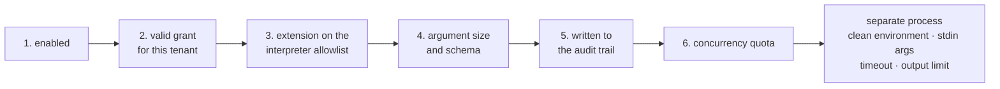

An agent gains capability in a few ways. They differ in where the code lives and who
is allowed to add it.

| | What it is | Where the code runs |
|---|---|---|
| **Tools** | Methods in your codebase | Your process |
| **Client-side tools** | A declaration in your codebase, no server-side body | The caller's process (typically a browser) |
| **Skills** | Markdown instructions plus resources | Nowhere — they are text |
| **MCP tools** | Tools published by a remote MCP server | Someone else's process |

## Tools

A tool is a method you wrote, registered at startup. See
[adding a tool](/getting-started/tools/) for the mechanics.

The rule that governs the whole design: **tools are defined in code only**. The
console lets a user *select* from registered tools; it never defines one. If it could,
anyone who reached the console could execute code on your server.

Wrapping for approval happens in the **registry**, not at the call site. The registry
is the single place where "an agent may only point at a registered tool" is enforced,
so no other code path can skip the wrapper.

### Who owns what

Six concerns belong to the registry and its pipeline, never to a tool body:

| Concern | Owned by |
|---|---|
| Authorization (can this caller call this tool at all) | `IToolAuthorizationHandler` in the pipeline |
| Approval (does a person need to say yes this time) | The registry's approval wrapper |
| Timeout | The registry's timeout wrapper |
| Output truncation | The registry's truncation wrapper |
| Tenant scoping | `AgentPrismRunContext.Current` |
| Audit (what ran, with what result) | Run recording, driven from the registry |

A tool body reads `AgentPrismRunContext.Current` when it needs the tenant, run, or
session — it never re-implements any of the other five; they already ran before the
body was ever invoked.

### Lifecycle and concurrency

The registry is a **startup snapshot**. It is built once, from every `AddTool*` call
made during startup, and never mutates afterward — there is no runtime `AddTool`. MCP
tools are the one deliberate exception: they are discovered from a remote server and
can appear or disappear as that server's own catalog changes, which is why MCP has its
own, separate dynamic model instead of sharing the code registry's snapshot guarantee.

Every tool instance is a **singleton**, shared by every tenant, every run, and every
thread that happens to call it. Keep no per-call state in an instance field — read
[the empty service provider rule](/getting-started/tools/#the-rule-that-trips-people-up)
for the related mistake of resolving a scoped dependency the same way.

Because a tool is shared, the same tool can already run **concurrently across
different runs** today, whether or not `AllowConcurrentToolCalls` is set —
that setting only governs whether one run's own turn calls its several tools
one after another or at the same time. A tool body that keeps no mutable
instance state handles both cases for free.

### Authorization and timeout

Two more wrappers apply next to approval, in a fixed order: **authorization** (outermost),
**timeout**, then **approval** (innermost), then the real method.

Authorization asks a different question than approval. Approval asks "is this call okay
this time" and stops to wait for a person. Authorization asks "can this caller call this
tool at all" and answers instantly from your own policy — implement
`IToolAuthorizationHandler` and register it; the default allows every call, so an
application that registers nothing keeps today's behavior exactly.

```csharp
public sealed class MyAuthorizationHandler : IToolAuthorizationHandler
{
    public ValueTask<ToolAuthorizationResult> AuthorizeAsync(
        ToolAuthorizationRequest request, CancellationToken cancellationToken = default)
        => request.RequiredPermission is "orders.cancel" && !CallerHasPermission(request)
            ? ValueTask.FromResult(ToolAuthorizationResult.Deny("You cannot cancel orders."))
            : ValueTask.FromResult(ToolAuthorizationResult.Allow());
}

services.AddSingleton<IToolAuthorizationHandler, MyAuthorizationHandler>();
```

A denied call does not fail the run: the model receives the reason text as an ordinary
tool result and continues its turn — the same way a search that finds nothing is not an
error. If your handler throws, the call is denied (fail-closed), never allowed.

`[AgentPrismTool]` also carries an effect class and a per-tool timeout:

```csharp
[AgentPrismTool(
    "cancel_order",
    "Cancels an order.",
    RequiresApproval = true,
    Effect = ToolEffect.Destructive,
    RequiredPermission = "orders.cancel",
    TimeoutSeconds = 30)]
public static string CancelOrder(string orderId) => ...;
```

`Effect` (`Read`/`Write`/`Destructive`/`External`) is information, not a gate — the
console shows it as a badge, and the audit trail records it. A call that outlives its
timeout does not fail the run either: the model sees a tool error and continues, the same
as a denial. Timeout is **not cooperative**: it never forcibly stops the body, and it
never hands the body a linked, timeout-aware token either — the body only ever sees the
*caller's own* `CancellationToken`. A tool that never reads that token keeps running to
completion, possibly with a real side effect, after the model has already moved on; only
the *wait* is cut short. The timeout applies to execution only, never to a pending
approval, which can wait indefinitely.

A tool body can also run **more than once for the same logical call**, on two different
timelines that are easy to conflate:

- **Within one turn:** Microsoft Agent Framework retries a throwing tool call up to
  `MaximumConsecutiveErrorsPerRequest` (3 by default) times before giving up and
  re-throwing to the caller. A tool that is not safe to call twice in a row needs its
  own idempotency guard, regardless of any AgentPrism setting.
- **Across an interrupted run:** `SafeToRepeat` (only read for `Destructive`/`External`
  tools) tells AgentPrism whether resuming a run that was cut off mid-call may repeat
  that call. It says nothing about the in-turn retries above.

The one case that does **not** repeat a completed call is a provider fallback: if a call
already finished before the primary provider failed, the fallback model asking the same
question again is answered from that result instead of running the tool's body a second
time — see [Fall back to a secondary provider](/guides/reliability/#fall-back-to-a-secondary-provider).

### Result representation and persistence

Whatever a tool returns, AgentPrism turns it into one **canonical text form** before
anything else — a content guard, the output limit — inspects it. `null`, `string`, and
`JsonElement` each have one stable text form; a primitive, `Guid`, or date value is
serialized the same, culture-independent way every time. A collection, record, or class
result is only canonicalized when the tool's generated declaration carries a consumer
`JsonSerializerContext` for it — code-defined tools using the `[AgentPrismTool]`
attribute (see [Write your own tool](/guides/write-your-own-tool/)) require one for
any result type beyond a plain string or primitive. That context, not reflection, is
what turns it into JSON, which is also what keeps the guard AOT-safe. A raw CLR object
returned directly from a hand-written `AIFunction` with no such context attached is
**not** serialized by guessing: it is
treated as an unsupported result and replaced with a generic, secret-free failure text
rather than passed through unguarded or serialized with reflection. This closes a real
gap: inspecting a type name or a placeholder instead of the actual data would let a
guard approve content it never really looked at, and silently trusting an unknown
object would let it bypass the guard and the output limit entirely.

That same canonical text is what gets **persisted**: a tool's arguments and result are
written into the run's permanent record and streamed to the console over SSE. Neither
one is written into a telemetry span. A tool that would otherwise return a secret —
a connection string, an access token — must redact it before returning, because both
of those surfaces keep it in full. A tool exception is treated more carefully: only
AgentPrism's own exception types keep their message; everything else is replaced with
a generic `Tool failed with <ExceptionType>.` before it reaches the record or the
stream, and the original message goes only to your log.

### Output size limit

A tool's result is unbounded by default and goes straight into the model's context. Set
a byte limit — per tool, or once for every tool that does not set its own — and a
result over it is trimmed before the model ever sees it. The limit is measured against
the same canonical text form described above, for every result type it applies to —
a large complex object is bounded exactly like a large string, not skipped because it
is not one. The one exception is `AIContent` (an attachment, such as the id
`generate_image` returns): it is never inline output and is never subject to this limit.

```csharp
services.AddSingleton(new AgentPrismToolRegistration(
    AIFunctionFactory.Create(GetReport, "get_report", "Fetches a report."),
    maxOutputBytes: 4096));

services.Configure<AgentPrismOptions>(o => o.Tools.DefaultMaxOutputBytes = 4096);
```

No change is required to keep today's behavior: the default is unlimited, and a tool
that never sets a limit is never touched.

Bounding a tool's output inside its own body is always better — the tool knows its
data, this only counts bytes. Treat the limit as the last line of defense for the day
that bound is forgotten, not a substitute for it: a single runaway tool can otherwise
spend a tenant's whole token budget on one call.

A result over the limit is trimmed and wrapped in an envelope, so the trimmed text can
never break the JSON the model reads:

```json
{"truncated": true, "omittedBytes": 1830, "content": "..."}
```

`truncated` and `omittedBytes` are always present on a trimmed result — a silently
shortened answer would lead the model to a confident, wrong conclusion. A result that
already fits is returned exactly as the tool produced it, never wrapped.

### Concurrent tool calls

By default, when a model turn calls several independent tools at once, AgentPrism
runs them one after another. Set `ModelBinding.AllowConcurrentToolCalls` to run them
at the same time instead — each call still gets its own authorization decision, its
own recorded result, and its own entry in the tool-usage metrics; none of that mixes
up between calls that happen to overlap.

Off by default: with no change, tool calls run one at a time exactly as they do
today. Turn it on only for tools whose bodies are safe to run concurrently with
themselves — a tool that shares mutable state across calls without its own
synchronization should not opt in. See
[Model providers](/guides/model-providers/#concurrent-tool-calls) for where this
setting lives on `ModelBinding`.

### Built-in image generation

When `AgentPrism:Images:Enabled` is true and a supported image provider is
registered, AgentPrism adds `generate_image` as an `External` tool. It accepts a
prompt and returns attachment ids, never base64 image data. Generation can spend money
and sends a prompt to an external provider, so the normal authorization, timeout, run
recording, and continuation rules apply. In particular, an interrupted run does not
automatically repeat an image-generation call.

See [Multimodal input and generated images](/guides/multimodal/) for registration,
storage, and price configuration.

## Client-side tools

`AddClientTool(name, description, jsonSchema)` registers a tool the SAME way — the
declaration lives in code — but with no body at all. The model can still call it; the
server returns the pending call to the caller instead of running anything, and the
caller answers it on the next request. See
[Client-side tools and the embeddable widget](/guides/client-side-tools/)
for the full mechanism and the chat widget built on it.

## Skills

A skill is markdown with frontmatter, optionally carrying resources — reference text
the agent can pull in. Skills are tenant-scoped and editable from the console, because
they are *instructions*, not code.

An agent lists skills by name. Deleting a skill an agent still names is a real break:
compiling that agent then fails with "the skill was not found" until the reference is
removed or the skill is recreated. Check which agents use a skill before deleting it.

### Skill scripts — the strict exception

A skill may also carry **scripts**, and this is the second deliberate exception to the
code-only rule. Unlike MCP, the process runs **on this machine**.

It is off by default and can only be turned on in code, with a mandatory
acknowledgement flag, an interpreter allowlist that starts empty, and skill roots
given in code.

Every execution passes six gates in order, and if any is closed the process never
starts:



:::danger[Gate five is an exception to an exception]
Everywhere else in AgentPrism an audit-trail write failure is swallowed, because
observability must not break function. Here it is not: a script execution that cannot
be written to the audit trail would be remote code execution with no record of it, so
the run is refused.
:::

Grants are visible and revocable at `GET /api/skill-script-grants`. A grant without a
script name covers every script in a skill; one with a name covers only that script.
Grants can expire.

:::caution[AgentPrism does not sandbox]
It provides **no** filesystem jail, network restriction, memory or CPU quota, or
privilege dropping. All four belong to the hosting environment — a container, cgroups,
and an unprivileged user. The acknowledgement flag exists so the feature cannot be
enabled without seeing this: with execution on and the flag off, the application fails
at **startup**.
:::

## MCP servers

Registering a remote MCP server means accepting tool definitions from outside, which
is the first deliberate exception to the code-only rule. The process runs elsewhere;
AgentPrism is only a client. Five guards:

1. **`http` and `https` only — there is no stdio transport.** Starting a local process
   would break the rule outright.
2. **`RequiresApproval` defaults to true** for tools discovered this way.
3. **A remote tool whose name collides with a code-registered tool is ignored.** Your
   code always wins; a remote server cannot shadow a local tool.
4. **The registration stores no credential.** It stores the *name* of the
   configuration key the value is read from at call time.
5. **Every call is recorded** with the source server's name.

Prompts fetched from an MCP server are a **snapshot** an administrator copies into the
console — an agent never pulls one live. Resource access is limited to the URI set the
server itself advertises; accepting arbitrary URIs would be an SSRF tool.

OAuth tokens are held in memory per tenant and server and are **never written to the
database**.

## Knowledge

Separate from tools: documents are chunked, embedded, and searched by vector distance.
This needs PostgreSQL — the other providers answer `501` on those endpoints.

`POST /api/knowledge/{collection}/search` runs the same retrieval an agent performs,
which makes it the way to separate a retrieval problem from a prompt problem. If the
right chunk does not come back there, the agent was never going to see it.

## Read next

- [Governance](/concepts/governance/) — approvals, audit, and limits
- [Workflows](/concepts/workflows/)
