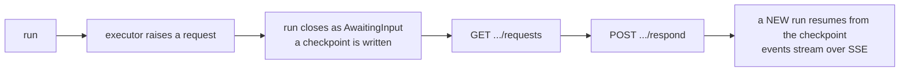

A workflow runs several agents together. Where a callable agent is one agent using
another as a tool, a workflow is an orchestration you define and can watch.

Workflows need `AgentPrism.Workflows`. Without the engine registered, definition
management still works and only the execution endpoints answer `501` — the package
stays optional on purpose.

## Five patterns

| Kind | What it does |
|---|---|
| `Sequential` | Agents run in order; each output is the next input |
| `Concurrent` | Agents run at the same time; results are merged |
| `Handoff` | One agent starts and hands off when needed — the **model** decides |
| `GroupChat` | A manager distributes turns among participants, bounded by `MaxIterations` |
| `Magentic` | A manager plans, tracks progress, and replans; a manager agent is required |

```csharp
new WorkflowDefinition
{
    Name = "triage",
    Kind = WorkflowKind.Handoff,
    AgentNames = ["frontline", "billing", "technical"],
}
```

Which fields are required depends on the kind, and the definition is validated when it
is **saved** using the same rules the compiler applies. A shape that could not run is
rejected at write time rather than on the first execution.

Workflows can also be built in code with MAF's own builder.

:::caution[The registration key is what routing uses]
When you add a workflow in code, `AddWorkflow("approval-flow", …)` is the key every
URL resolves against. A different name passed to the builder's `WithName(…)` is
cosmetic — and an inconsistency between the two produces a silent `404` or a timeout
rather than an error. Use the same string in both places.
:::

## Running one

```bash
curl -N -X POST http://localhost:5081/agentprism/api/workflows/triage/run \
     -H 'Content-Type: application/json' \
     -d '{"message":"My invoice is wrong and the app crashes"}'
```

Events stream over SSE. The first frame reports the run id, and **every agent invoked
inside the workflow opens its own run row** — so the whole thing is readable as a tree
with `GET /api/runs/{runId}/tree`, with each agent's tokens and duration attributed
separately.

`GET /api/workflows/{name}/graph` returns the compiled graph. Node ids are identical
to the executor ids in the run events, which is how the console colours nodes live as
the workflow progresses. The response also carries MAF's generated Mermaid text.

## Checkpoints

A workflow can write checkpoints as it goes. `GET /api/workflows/runs/{runId}/checkpoints`
lists them and `POST /api/workflows/runs/{runId}/resume` continues from one — omit the
id to resume from the latest.

Resuming opens a **new** run. The original is never rewritten, so "what happened, then
what we did about it" stays two readable records rather than one edited one.

Whether checkpoints exist at all is a property of how the workflow was built, not
something the endpoint can switch on. They are also a retention target, so an old run
may have none left.

## Asking a human

A workflow can stop and wait for input:



Requests are read from the run's own event stream — there is no separate table — and
only a run in `AwaitingInput` has any. The answer is matched to the request that is
re-published with the same id when execution resumes.

This is the same append-only shape as tool approvals: the waiting run stays as it was,
and the response opens a new one.

## Read next

- [Runs and recording](/AgentPrism/concepts/runs/) — reading the tree
- [Evaluation and experiments](/AgentPrism/concepts/evaluation/)
