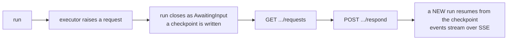

A workflow runs several agents together. Where a callable agent is one agent using
another as a tool, a workflow is an orchestration you define and can watch.

Workflows need `AgentPrism.Workflows`. Without the engine registered, definition
management still works and only the execution endpoints answer `501` — the package
stays optional on purpose.

## Five patterns

| Kind | What it does |
|---|---|
| `Sequential` | Agents run in order; each output is the next input |
| `Concurrent` | Agents run at the same time; results are merged |
| `Handoff` | One agent starts and hands off when needed — the **model** decides |
| `GroupChat` | A manager distributes turns among participants |
| `Magentic` | A manager plans, tracks progress, and replans; a manager agent is required |

`MaxIterations` bounds the turn count for `Handoff`, `GroupChat`, and `Magentic` — the
only structural guard against two agents handing off to each other forever.

```csharp
new WorkflowDefinition
{
    Name = "triage",
    Kind = WorkflowKind.Handoff,
    AgentNames = ["frontline", "billing", "technical"],
}
```

Which fields are required depends on the kind, and the definition is validated when it
is **saved** using the same rules the compiler applies. A shape that could not run is
rejected at write time rather than on the first execution.

## Function nodes

A real pipeline has steps that are not AI calls — a file download, a format
conversion, a database write. `AddWorkflowFunction` registers one by name:

```csharp
agentPrism.AddWorkflowFunction<List<ChatMessage>, List<ChatMessage>>(
    "word-count",
    services => (messages, context, cancellationToken) =>
    {
        var text = messages[^1].Text;
        return ValueTask.FromResult<List<ChatMessage>>([new(ChatRole.User, $"{text}\n\n({text.Split(' ').Length} words)")]);
    },
    "Appends a word count. Runs no model call.");
```

A `Sequential` definition's `Nodes` list can then mix that name in with catalog
agents, in order:

```csharp
new WorkflowDefinition
{
    Name = "summarize-and-count",
    Kind = WorkflowKind.Sequential,
    Nodes =
    [
        new WorkflowNodeReference { Name = "summarizer", Kind = WorkflowNodeKind.Agent },
        new WorkflowNodeReference { Name = "word-count", Kind = WorkflowNodeKind.Function },
    ],
}
```

`Nodes` and `AgentNames` are mutually exclusive — a definition sets one or the
other. Only `Sequential` supports function nodes: the ready-made builders for
the other four patterns accept only agents.

The factory passed to `AddWorkflowFunction` runs once, when the function
registry is built — not once per run. Every workflow compile shares the same
handler closure, so **the handler must be thread-safe**: a captured counter or
non-thread-safe client needs its own guard.

:::note[Code only, same boundary as tools]
A function's body is never written from the UI or the database — only its
*name* crosses that boundary, the identical shape `AgentDefinition.ToolNames`
already uses for tools. `GET /api/workflows/functions` lists what is
registered, for a picker to choose from.
:::

A function node opens no `runs` row of its own and contributes nothing to
cost or token totals — it made no model call. `ExecutorInvoked` /
`ExecutorCompleted` / `ExecutorFailed` still fire for it, same as any node, so
it is visible in the run's event stream and colored live in the graph.

:::caution[The handler must be idempotent]
Resuming from the run's *latest* checkpoint after it already completed does
not call the handler again — there is nothing left to run. Resuming from an
**earlier** checkpoint (the shape a real crash recovery takes) replays the
super-step that follows it, and the handler runs again with the same input. A
handler with a real side effect must tolerate being called more than once.
:::

Workflows can also be built in code with MAF's own builder.

:::caution[The registration key is what routing uses]
When you add a workflow in code, `AddWorkflow("approval-flow", …)` is the key every
URL resolves against. A different name passed to the builder's `WithName(…)` is
cosmetic — and an inconsistency between the two produces a silent `404` or a timeout
rather than an error. Use the same string in both places.
:::

## Running one

```bash
curl -N -X POST http://localhost:5081/agentprism/api/workflows/triage/run \
     -H 'Content-Type: application/json' \
     -d '{"message":"My invoice is wrong and the app crashes"}'
```

Events stream over SSE. The first frame reports the run id, and **every agent invoked
inside the workflow opens its own run row** — so the whole thing is readable as a tree
with `GET /api/runs/{runId}/tree`, with each agent's tokens and duration attributed
separately.

`GET /api/workflows/{name}/graph` returns the compiled graph. Node ids are identical
to the executor ids in the run events, which is how the console colours nodes live as
the workflow progresses. The response also carries MAF's generated Mermaid text.

## Checkpoints

A workflow writes checkpoints as it goes, controlled by
`AgentPrism:Workflows:EnableCheckpointing` (default `true`).
`GET /api/workflows/runs/{runId}/checkpoints` lists them and
`POST /api/workflows/runs/{runId}/resume` continues from one — omit the id to resume
from the latest.

Resuming opens a **new** run. The original is never rewritten, so "what happened, then
what we did about it" stays two readable records rather than one edited one.

Checkpoints survive a process restart only with a SQL provider registered
(`UsePostgreSql()`, `UseSqlServer()`, or `UseSqlite()`). The in-memory store keeps at
most 50 checkpoints per session and drops the oldest — enough for local development,
not for a workflow you expect to resume after a restart. They are also a retention
target, so an old run may have none left even on durable storage.

Turning off `EnableCheckpointing` does not silently disable resumption: a workflow
that stops to wait for a human answer fails outright instead of hanging with no way
to resume.

## Asking a human

A workflow can stop and wait for input:



Requests are read from the run's own event stream — there is no separate table — and
only a run in `AwaitingInput` has any. The answer is matched to the request that is
re-published with the same id when execution resumes.

This is the same append-only shape as tool approvals: the waiting run stays as it was,
and the response opens a new one.

## Read next

- [Runs and recording](/concepts/runs/) — reading the tree
- [Evaluation and experiments](/concepts/evaluation/)
