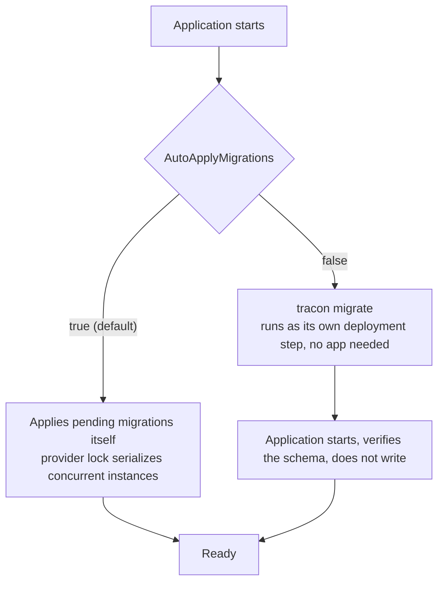

Without a database every store is in memory and everything ends with the process.
That is deliberate — it makes the first agent work with no infrastructure — but it is
not where you stop.

:::caution[In production, Tracon says so out loud]
Start a host in the `Production` environment while storage is still in memory and
Tracon writes one warning at startup, naming the stores that do not survive a
restart. In-memory storage stays a supported mode — the warning never fails
startup and there is no switch to silence it, because a production installation
losing its runs on the next deployment should not be a quiet fact. The same
judgement is what `GET /api/meta` reports as `storage.persistent`, and what the
console's settings screen shows.
:::

## Pick one

```csharp
builder.AddTracon()
       .UsePostgreSql(connectionString);   // Tracon.PostgreSql
```

| Package | Choose it when |
|---|---|
| `Tracon.PostgreSql` | The default. The only one with vector search for knowledge |
| `Tracon.SqlServer` | You already run SQL Server |
| `Tracon.Sqlite` | One node, or a durable local development setup |

All three implement the same store contracts and pass the same shared contract tests.
Their operational limits differ: only PostgreSQL supports Knowledge, only PostgreSQL
keeps the AOT promise, and SQLite is a single-node choice.

:::caution[The connection string is a secret]
It never belongs in `appsettings.json`. Use `dotnet user-secrets` in development and
the environment or a secret store in production. The same rule runs through the whole
product: a webhook or MCP registration stores the *name* of the configuration key its
secret is read from, never the value.
:::

Binding from configuration is the usual shape:

```csharp
.UsePostgreSql(builder.Configuration.GetSection(TraconPostgreSqlOptions.SectionName))
```

```json title="appsettings.json"
{
  "Tracon": {
    "PostgreSql": {
      "ConnectionString": "",
      "SchemaName": "tracon",
      "AutoApplyMigrations": true,
      "CommandTimeoutSeconds": 30,
      "EnableKnowledge": false,
      "EnableReadViews": false
    }
  }
}
```

## How each provider isolates its tables

| Provider | Namespace | Migration coordination |
|---|---|---|
| PostgreSQL | Separate `tracon` schema by default | `pg_advisory_lock`, scoped to the schema |
| SQL Server | Separate `tracon` schema by default; your `dbo` objects stay untouched | `sp_getapplock`, scoped to the schema |
| SQLite | No schema support; `tracon_` table prefix by default | A sidecar file lock next to the database |

Rename `SchemaName` or `TablePrefix` when your conventions require it. A bare SQLite
`Data Source=:memory:` connection is rejected because each opened connection would
see a different database; use a shared in-memory URI for tests.

:::note[Knowledge is opt-in and needs pgvector]
The migration set that creates the `vector` extension and the `document_embeddings`
table only applies when `EnableKnowledge` is `true` — off by default, so a managed
PostgreSQL instance without permission to install extensions works with no
configuration at all. Turn it on only if an agent uses Knowledge:

```csharp
.UsePostgreSql(options =>
{
    options.ConnectionString = connectionString;
    options.EnableKnowledge = true;
})
```

With it off, an agent definition that sets `Memory.EnableVectorSearch` fails
compilation with a clear error instead of a database error at run time. Embedding
`Dimensions` become part of the column type: changing embedding models later needs a
schema migration and a re-embed of existing documents. See
[Knowledge](/guides/knowledge/).
:::

:::note[Read views are opt-in on all three providers]
`EnableReadViews` publishes `runs_v1`, a versioned, read-only SQL view over run
data — off by default, so a deployment that never turns it on never sees the
object. Query it with your own SQL or map it as an EF Core keyless entity. See
[Read contract views](/reference/read-views/).
:::

## Migrations run at startup

The SQL files ship embedded in the assembly and are applied when the application
starts, unless that responsibility is moved to its own deployment step:



Two properties make in-process application safe with several instances starting at
once:

- The runner takes the provider-specific lock shown above, so instances serialize
  instead of racing.
- Each applied file's SHA-256 is recorded. If the content later differs from what was
  applied, startup **fails loudly** rather than running against a schema that is not
  what the code expects.

:::caution[Migrations refuse a non-canonical tenant id]
The tenant identifier is stored in its canonical (lower-case) form — see
[Multi-tenancy](/concepts/governance/#what-a-tenant-identifier-may-be). Before
applying anything, the runner checks every table that carries a `tenant_id` and
**stops, naming the tables**, if any row holds a value that is not canonical.

It does not fold those rows for you. On PostgreSQL and SQLite, which compare
case-sensitively, `Acme` and `acme` may be two real tenants, and merging two
tenants cannot be undone. Decide per table whether the rows belong to one
tenant (lower-case them) or to two (rename one), then start again.
:::

:::danger[Do not edit an applied migration]
The checksum covers the file's whole text, comments included. Editing a file that has
already been applied makes every existing database refuse to start. Add a new
migration instead. If you must take such a change, drop and recreate the schema in
that environment first.
:::

:::caution[A migration can be one-way]
Most migrations only add. Some rewrite or drop a column, and while Tracon is in
preview a release may contain one: the data is carried across by the migration
itself, but there is no downgrade path back to the older schema. Take a backup
before upgrading a database you cannot lose, and roll a version back by restoring
that backup rather than by pointing an older build at the newer schema — the
checksum check will refuse it anyway.

The `run_scores` migration is the current example. It widens the score value from an
integer to a nullable double, adds the score's name and its categorical value, and
rewrites the uniqueness index. Existing rows are carried across: a score written by a
judge keeps that judge's name, every other row is named `overall`. On SQLite the
value column is rebuilt in place, so the table is rewritten — size that step against
your own row count before upgrading a large database.
:::

Most upgrades are not like that one. The latest `run_scores` migration, which adds
the `evaluator_version` column, is the ordinary shape: a single nullable column
appended to the table, no backfill, and no index change. Existing rows are left
exactly as they are and read back with a null version, so the step costs the same
whether the table holds a thousand rows or a million.

Set `AutoApplyMigrations = false` when schema changes are their own deployment step.
Tracon then verifies but does not write. The diagnostics endpoint can report
whether the schema is current, but it is deliberately not mapped by default because
it exposes setup details:

```csharp
app.MapTracon("/tracon", options =>
{
    options.EnableDiagnosticsEndpoint = true;
});
```

After that opt-in, `GET /tracon/api/diagnostics` is an Admin surface and still
passes through the configured access layers.

Something still needs to **apply** the schema before the application starts with
`AutoApplyMigrations = false`. The `tracon` CLI does that as its own step,
against the database directly — no running application required:

```bash
tracon migrate --provider postgres --connection "$TRACON_CONNECTION"
```

Running it again applies nothing (`0 applied`) and exits `0`; `tracon migrate
status` lists pending migration names without writing. See the [typed client and
CLI guide](/guides/cli/) for setup and the rest of the commands.

## Giving your own data source instead of a connection string

Each provider's `Options.DataSource` field accepts a `DbDataSource` you built
yourself instead of `ConnectionString` — most useful when your host already owns
one, for example an EF Core `DbContext` configured with an `NpgsqlDataSource`:

```csharp
.UsePostgreSql(options => options.DataSource = yourDataSource)
```

Tracon never disposes an instance it did not build; ownership stays with
whoever created it. Building two separate data sources from the identical
connection string does **not** share a connection pool — see
[Two data planes, one connection pool or two](/guides/embedding/#two-data-planes-one-connection-pool-or-two)
and, for the full EF Core pattern,
[Two connection planes: EF Core and Tracon](/guides/ef-core/).

## What changes once it is durable

Runs, events, and tool calls survive restarts, so the console shows real history
rather than the current process. Sessions can be read back as chat history rather
than an opaque blob — which is also what makes branching a conversation possible.
Queued runs, schedules, evals, experiments, quotas, and the pending-approval mailbox
all become usable, since they depend on state outliving a request. A resolved
[approval presentation](/concepts/governance/#approvals) is persisted next to the
raw call arguments, so it survives a restart the same way the arguments do.

It is also what makes recovering from a crash possible at all: a run's recorded
tool calls are what an [automatically continued run](/guides/reliability/#continue-an-interrupted-run-automatically)
replays instead of repeating, and orphan reconciliation itself only has a stale
`Running` row to find because that row, and every tool call it already made, outlived
the process that opened it.

Session and workflow checkpoint rows carry a version stamp of their own, separate
from the schema migrations above: Tracon's envelope around the row, and the
Microsoft Agent Framework version that wrote the opaque state inside it. See
[Versions and upgrades](/reference/versioning/#persisted-session-and-checkpoint-state)
for what that stamp promises and what happens when an old row can no longer be read.

Durable state is also state an upgrade has to keep being able to read, and the
stamp is what makes that answerable ahead of time rather than in production:

```bash
tracon state-check --provider postgres --connection "$TRACON_CONNECTION"
```

Run with the **new** version of the tool, it counts your stored rows by stamp,
says which of them the new build understands, and decodes a sample of each. It
writes nothing, so it is safe against the live database. See [the supported
upgrade window](/reference/versioning/#the-supported-upgrade-window).

## Keeping it from growing forever

A recorded run is data, and recorded runs accumulate. Retention policies set an age
or row limit per target — run events, tool calls, traces, jobs, webhook deliveries,
eval results, checkpoints, and more.

Database policies take precedence. When no database policy exists and
`Tracon:Retention:Enabled` is true, configuration falls back to built-in target
defaults, such as 30 days for run events and 14 days for spans. With retention
disabled, nothing is deleted. An `archive: true` policy also deletes nothing when no
`IArchiveSink` is registered; data loss is the failure mode the worker avoids.

Cleanup runs through the job queue. Preview a policy before you execute it:

```bash
curl 'http://localhost:5081/tracon/api/retention/preview'
curl -X POST 'http://localhost:5081/tracon/api/retention/run'
```

## Durability also enables governance

A durable `audit_log` can be **verified**: `GET /api/audit/verify` walks a
hash chain and reports whether any entry was altered or deleted after it was
written. And because sessions, runs, and conversations are real rows now, a data
subject's content can be found and erased by identity, not just aged out — see
[Data subject rights](/concepts/governance/#data-subject-rights).

Both endpoints accept an optional `tenantId` filter; leaving it out never means
"every tenant" — it resolves to the caller's own ambient tenant. A custom
`IAuditLog` implementation must apply this same fallback (see
[Write your own store](/guides/write-your-own-store/)).

Durable rows are also what
[content protection](/getting-started/security/#at-rest-content-protection) encrypts.

A durable `sessions` row is also what
[session ownership](/concepts/sessions/#session-ownership) writes its owner into.
The column is added by a migration, is nullable, and stays NULL until you turn
ownership on — so enabling persistence costs nothing here, and enabling ownership
later is a configuration change rather than a data change. The listing filter is a
`WHERE` clause on that column, applied before paging, which is precisely what an
in-memory setup cannot offer.

## Read next

- [Securing the endpoints](/getting-started/security/) — required reading
before this leaves your machine.
- [Write your own store](/guides/write-your-own-store/) — implement `IRunStore`
  (or another store interface) against a persistence engine none of the three
  built-in providers cover.
