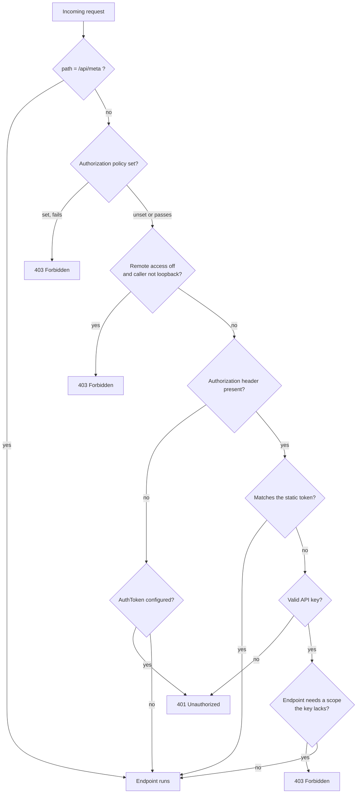

By default AgentPrism is reachable from `localhost` and nowhere else. That is the
safe state, and an application that maps it and forgets to configure anything is not
exposed. Everything below is about leaving that state on purpose.

## The layers

Four independent layers, applied in this order. Use as many as you need.



### 1. The loopback restriction

On by default. A request from anywhere but loopback gets `403`. It exists to make
accidental exposure impossible, so turning it off should be a deliberate line in a
review:

```csharp
app.MapAgentPrism("/agentprism", options => options.AllowRemoteAccess = true);
```

:::danger
Never turn this on without a token, an API key, or a policy behind it. On its own it
publishes your agents — and the ability to run them — to anyone who can reach the
port.
:::

### 2. A bearer token

A single shared token, compared in constant time:

```csharp
options.AuthToken = builder.Configuration["AgentPrism:AuthToken"];
```

Good enough for one operator or a private network. It cannot be revoked
individually, carries no identity, and gives everyone the same rights.

### 3. API keys

Issued from `/api/api-keys`, stored hashed, scoped per capability, revocable, and
optionally expiring. Each key belongs to a tenant.

Scopes **narrow** a role, they never widen it: what a caller may do is the
intersection of its role and its key's scopes. Scope values use the closed JSON enum;
for example, a key with only `RunsWrite` cannot
administer agents no matter what role the caller has.

The [compatibility reference](/AgentPrism/reference/compatibility/#api-key-scopes)
lists all 17 values and the capability each one grants.

A key also proves which tenant is calling — which is why it outranks any claim or
header for tenant resolution. A secret is proof; a header is a claim.

### 4. An authorization policy

The production path. Hand AgentPrism a policy name and it runs inside your own
authentication pipeline:

```csharp
options.RequireAuthorization("AgentPrismAdmin");
```

## Roles

Three policy names — `Reader`, `Operator`, `Admin` — that you bind to your own claims:

| Role | Can |
|---|---|
| Reader | Read agents, runs, sessions, traces, statistics |
| Operator | Reader, plus start runs, decide approvals, delete sessions |
| Admin | Everything: write definitions, add MCP servers, manage tenants and approval rules, read the audit trail |

AgentPrism stores no users and no roles. If a policy is not registered in your
application, that endpoint group simply falls back to the layers above — so upgrading
never breaks a working deployment. Turn on `RequireRolePolicies` and a missing policy
becomes a **startup** error instead of a silent gap.

:::caution[Reverse proxies change the network boundary]
The loopback rule sees the connection presented to ASP.NET Core. Configure trusted
forwarded headers and HTTPS at the proxy before you use the apparent client address
as a boundary. In production, require role policies even when the proxy already
authenticates users.
:::

## Two deliberate exemptions

**`/api/meta`** answers without authentication. The console has to learn which
authentication method to present before it can ask for anything. It returns no
sensitive data.

**The console shell** — its HTML, JavaScript, and CSS — is exempt from the bearer
layer only. A browser cannot attach an `Authorization` header to a `<script src>`
request, so a locked shell would mean the user could never reach the screen that asks
for the token. The shell carries no data. The loopback restriction and the
authorization policy still apply to it, and every data endpoint behind it is fully
protected.

The real-time voice WebSocket is not an exemption: a browser cannot set a header on a
handshake either, so the token travels in the `Sec-WebSocket-Protocol` subprotocol and
is verified in constant time. A query string was rejected — it would be written to
server and proxy logs.

## Outbound requests are guarded too

A webhook address is supplied by a user and called by your server, which makes it an
SSRF risk — cloud metadata endpoints included. Private network targets are refused by
default, only `https` is accepted, and redirects are not followed.

The check lives inside the socket connect callback, so the address that is validated
is the address the socket connects to. Validating a URL and then calling it would
leave a time-of-check/time-of-use gap.

## A short checklist

- [ ] `AllowRemoteAccess` is on only together with a token, a key, or a policy
- [ ] Secrets are in user-secrets, the environment, or a secret store — never a file
- [ ] Roles are bound to your claims, and `RequireRolePolicies` is on
- [ ] Quotas are set, so one caller cannot spend the whole model budget
- [ ] Retention policies exist for run events and traces
- [ ] Skill script execution is left off unless you have read what it does

## Next

- [Governance](/AgentPrism/concepts/governance/) — audit trail, quotas, tenancy
- [Architecture](/AgentPrism/concepts/) — how the pieces fit
