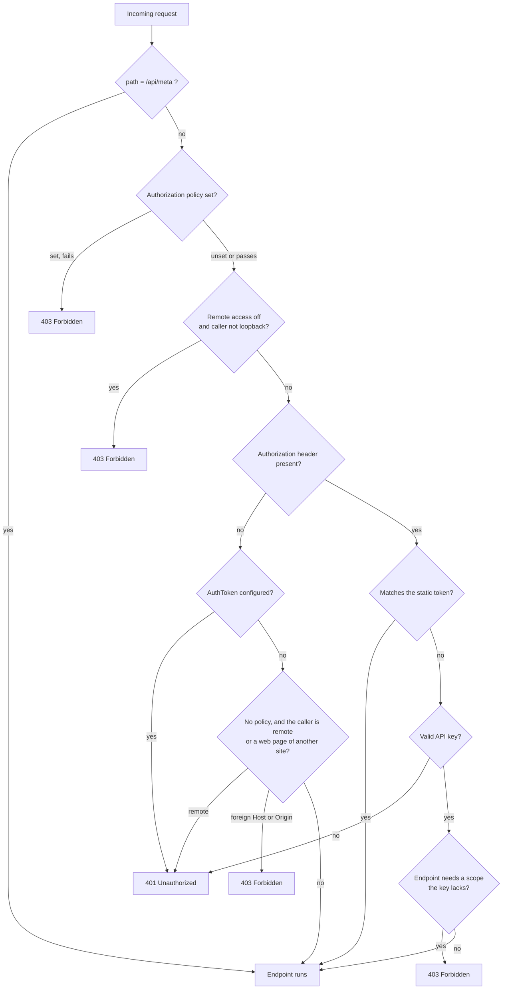

Configure who can reach Tracon, what they can do, and which tenant they can access.
Protected endpoints restrict non-loopback callers by default. This restriction does
not replace host authorization or correct proxy configuration; the metadata endpoint
is an explicit exception.

## The layers

Four independent layers, applied in this order. Use as many as you need.



### 1. The loopback restriction

On protected routes, non-loopback requests receive `403` by default. A request that a
reverse proxy forwarded counts as remote too: if it still carries `X-Forwarded-For`,
`Forwarded`, or `X-Real-IP`, nothing consumed the header, so the connection address is
the proxy's and not the caller's. Review the host and proxy boundary before allowing
remote access:

```csharp
app.MapTracon("/tracon", options => options.AllowRemoteAccess = true);
```

:::danger
Never turn this on without a token, an API key, or a policy behind it. With remote
access on and no authentication method configured, Tracon refuses an anonymous remote
request with `401`; an API key still works. Anonymous access stays a same-machine
convenience.
:::

With no token and no policy, an anonymous caller counts as the local operator only
when it is not a web page of another site. The request's `Host` must be a loopback
name (`localhost`, `*.localhost`, `127.0.0.1`, `[::1]`), and an `Origin` header, when
present, must name one too. Otherwise the request receives `403`: another name that
resolves to this machine (DNS rebinding) or a page on another site is how a browser
takes over a local service. A request with a token or a key is not judged by its host
or origin.

### 2. A bearer token

A single shared token, compared in constant time:

```csharp
options.AuthToken = builder.Configuration["Tracon:AuthToken"];
```

Good enough for one operator or a private network. It cannot be revoked
individually, carries no identity, and gives everyone the same rights.

### 3. API keys

Issued from `/api/api-keys`, stored hashed, scoped per capability, revocable, and
optionally expiring. Each key belongs to a tenant.

Scopes **narrow** a role, they never widen it: what a caller may do is the
intersection of its role and its key's scopes. Scope values use the closed JSON enum;
for example, a key with only `RunsWrite` cannot
administer agents no matter what role the caller has.

The [compatibility reference](/reference/compatibility/#api-key-scopes)
lists all 17 values and the capability each one grants.

A key also proves which tenant is calling — which is why it outranks any claim or
header for tenant resolution. A secret is proof; a header is a claim.

### 4. An authorization policy

The production path. Hand Tracon a policy name and it runs inside your own
authentication pipeline:

```csharp
options.RequireAuthorization("TraconAdmin");
```

## Roles

Three policy names — `Reader`, `Operator`, `Admin` — that you bind to your own claims:

| Role | Can |
|---|---|
| Reader | Read agents, runs, sessions, traces, statistics |
| Operator | Reader, plus start runs, decide approvals, delete sessions |
| Admin | Everything: write definitions, add MCP servers, manage tenants and approval rules, read the audit trail |

Tracon stores no users and no roles. If a policy is not registered in your
application, that endpoint group simply falls back to the layers above — so upgrading
never breaks a working deployment. Turn on `RequireRolePolicies` and a missing policy
becomes a **startup** error instead of a silent gap. If your
`IAuthorizationPolicyProvider` throws while `MapTracon` resolves a role name, that
role is treated as not registered and a `Warning` is logged in the
`Tracon.RolePolicies` category; with `RequireRolePolicies` on, the startup error
carries the provider's exception as its inner exception.

### Acting on another tenant

A few endpoints take the tenant from the request instead of the caller: another
tenant's model provider bindings and egress policy (`/api/tenants/{tenantId}/providers`,
`/api/tenants/{tenantId}/egress`) and the tenant records (`/api/tenants`). The
caller's own tenant needs only the role and scope the endpoint names. Another tenant
needs platform authority, and each identity proves it differently:

| Caller | Platform authority |
|---|---|
| API key | The key also carries the `PlatformAdmin` scope |
| Static `AuthToken` | Always — it identifies the installation, not a tenant |
| Claims principal, multi-tenancy on | The `TraconPolicies.PlatformAdmin` policy (`Tracon.PlatformAdmin`) passes |
| Anonymous, same machine | Always — the zero-configuration local operator |

Unlike the three role policies, a missing `Tracon.PlatformAdmin` registration
**denies**: a claims-authenticated Admin of one tenant does not reach another tenant's
secrets by default. With multi-tenancy off, a claim resolves no tenant, so a
single-tenant installation needs no new policy.

:::caution[Reverse proxies change the network boundary]
The loopback rule sees the connection presented to ASP.NET Core. A proxy on the same
machine connects over loopback or a Unix socket, so Tracon also treats a request that
still carries `X-Forwarded-For`, `Forwarded`, or `X-Real-IP` as remote. Configure the
`ForwardedHeaders` middleware with your trusted proxies, so it consumes the header and
the client address becomes the connection address, and HTTPS at the proxy. In
production, require role policies even when the proxy already authenticates users.
:::

## Two deliberate exemptions

**`/api/meta`** answers without authentication. The console has to learn which
authentication method to present before it can ask for anything. It returns no
sensitive data.

**The console shell** — its HTML, JavaScript, and CSS — is exempt from the bearer
layer only. A browser cannot attach an `Authorization` header to a `<script src>`
request, so a locked shell would mean the user could never reach the screen that asks
for the token. The shell carries no data. The loopback restriction and the
authorization policy still apply to it, and every data endpoint behind it is fully
protected.

The real-time voice WebSocket is not an exemption: a browser cannot set a header on a
handshake either, so the token travels in the `Sec-WebSocket-Protocol` subprotocol and
is verified in constant time. A query string was rejected — it would be written to
server and proxy logs. A WebSocket is not bound by CORS, so an anonymous socket is held
to the same host and origin rule as an anonymous request.

## Outbound requests are guarded too

Tracon reaches the network from three places, and each one accepts an address that
ultimately came from a user. That makes all three an SSRF risk — cloud metadata
endpoints (`169.254.169.254`) included, which often hand out unauthenticated temporary
credentials.

| Surface | Address comes from |
|---|---|
| Webhook delivery | A subscription's `url` |
| MCP server connections | A server definition's `endpoint` |
| Model provider calls | A tenant's provider binding `endpoint` (BYOK) |

One guard covers all three. Private network targets are refused by default:

```json
{
  "Tracon": {
    "Egress": {
      "AllowPrivateNetworkTargets": false
    }
  }
}
```

Refused ranges include `10/8`, `172.16/12`, `192.168/16`, `169.254/16`, loopback,
CGNAT, and the IPv6 equivalents. An IPv6 address that *embeds* an IPv4 address is
reduced to that IPv4 address first and judged by the same rules, so
`::ffff:169.254.169.254`, `::169.254.169.254`, `64:ff9b::a9fe:a9fe` (NAT64) and
`2002:a9fe:a9fe::` (6to4) are all refused as well.

Turn the setting on if your MCP servers really do run inside the private network. The
rejection message names the setting, so an operator who hits it knows what to change.

The check lives inside the socket connect callback, so the address that is validated
is the address the socket connects to. Validating a URL and then calling it would
leave a time-of-check/time-of-use gap: `HttpClient` would resolve the name a second
time, and an attacker can change the answer between the two lookups (DNS rebinding).
Because the guard runs per connection, a name that passed when it was saved is checked
again every time it is used.

Webhook delivery keeps two extra rules of its own: only `https` is accepted (unless
`AllowInsecureHttp` is on, which permits loopback only), and redirects are not
followed — a redirect is an escape route into a private network.

### Configuration keys are fenced too

A stored record never holds a secret value; it holds the **name** of the configuration
key the value is read from. That alone is not enough, so each name must sit under an
allowed prefix. Without it, a record could name `ConnectionStrings:Default` as its
"API key" and Tracon would send that value to a remote server.

| Record | Field | Default prefix |
|---|---|---|
| Inbound trigger | `signingSecretConfigurationName` | `Tracon:TriggerSecrets:` |
| Tenant provider binding | `apiKeyConfigurationName` | `Tracon:ProviderKeys:` |
| MCP server | `authorizationConfigurationKey`, `oauthClientSecretConfigurationKey` | `Tracon:McpSecrets:` |
| Webhook subscription | `secretConfigurationKey` | `Tracon:WebhookSecrets:` |

The prefix is one per installation, so a name must also sit inside its record's
tenant. A tenant names keys under `{prefix}{tenant}:` — for tenant `acme`,
`Tracon:McpSecrets:acme:GithubToken`. A flat name directly under the prefix, such as
`Tracon:McpSecrets:GithubToken`, belongs to the default tenant, so a single-tenant
installation keeps its names unchanged. Without the tenant segment, one tenant could
name another tenant's key and point the record at an address it controls. The segment
matches the tenant id without regard to case, like configuration keys themselves.

Each prefix is configurable through the matching options section, and both rules are
enforced twice: where the record is saved, and again where the value is resolved — so
a record written before a rule existed cannot quietly read outside it.

The extra `headers` of an MCP server or a webhook subscription are the one free-text
exception: they are stored in plain text and sent as given, so do not put a credential
there. No response returns a stored header value — every read and save response
carries the header names with the value `***`, and the audit trail records the names
only. A save that sends `***` back as a value is rejected with `400`: a client that
reads, edits and saves a record must send the real value of every header again.

## What is stored in the clear

By default, Tracon does **not** encrypt content at rest. Your database holds
these in plain form unless you turn on [content protection](#at-rest-content-protection)
below, so plan for that before storing regulated data:

| Column | What it holds |
|---|---|
| `sessions.state` | Microsoft Agent Framework's serialized session state |
| `conversation_items.item` | One stored chat message |
| `run_inputs.messages` | The prompt a run was started with |
| `run_events.text`, `run_events.payload` | Streamed output and event detail |
| `tool_invocations.arguments`, `.result` | What a tool was called with, and what it returned |
| `attachments.content`, `agent_files.content` | Uploaded bytes and agent file contents |
| `responses.payload` | Reserved for provider responses; no store writes to this table today |

Secrets are the exception and are handled separately: a credential value is never
written to the database. Only the **name** of the configuration key is stored, and the
value is resolved at call time from your configuration. API keys are stored as a
SHA-256 hash, never as a recoverable value.

## At-rest content protection

`AddContentProtection(...)` encrypts the ten columns above with AES-256-GCM before
they reach the database, and decrypts them transparently on read — the rest of
Tracon, and your own code, never sees ciphertext. It is off by default (no
surprises); turning it on is a deliberate, explicit call.

```csharp
builder.AddTracon()
       .AddContentProtection(options =>
       {
           options.ActiveKeyId = "2026-08";
           options.Keys["2026-08"] = "ContentProtectionKeys:2026-08";
       })
       .UsePostgreSql(connectionString);
```

`Keys` never holds a key's raw material — it maps a key id to the **name** of
another configuration key, the same indirection Tracon uses for provider
credentials. The raw 32-byte, base64-encoded key lives only in `dotnet user-secrets`
or an environment variable:

```
dotnet user-secrets set "ContentProtectionKeys:2026-08" "<32-byte base64 key>"
```

Three limits are worth knowing before you rely on this:

- **It protects data at rest, not a running process.** A process holding the key
  still sees plaintext once a value is read back — this closes a stolen backup, a
  discarded disk, or a misconfigured table permission, not a compromised
  application server.
- **A protected column cannot be searched or filtered on the server.** Agent file
  search still returns correct results, but the server-side prefilter is skipped
  and every candidate file is decrypted and matched on the client instead.
- **Only new writes are protected.** Turning protection on does not retroactively
  encrypt existing rows, and turning it off does not decrypt them — each row stays
  readable either way, because Tracon decides whether a value is encrypted by
  looking at the value itself, never at configuration. Key rotation is lazy for the
  same reason: an old key id stays configured for as long as any row still carries
  it, and losing that key makes those rows unrecoverable.

Protect what this does not cover at the layer below: full-disk or tablespace
encryption, a managed database with encryption at rest, and retention policies that
delete what you no longer need.

## The boundaries Tracon enforces

The layers above are what you configure. This table is the other question — which
boundaries exist at all, what each one refuses, and where the detail lives. A security
report is assessed against this list; see the [security
policy](/reference/security-policy/) for what is in and out of scope.

| Boundary | What it refuses | Detail |
|---|---|---|
| Endpoint access | An unauthenticated or unauthorized caller | [The layers](#the-layers) |
| Tenant isolation | Reading or writing another tenant's rows | [Multi-tenancy](/concepts/governance/#multi-tenancy) |
| Session ownership | Continuing a conversation the caller does not own | [Session ownership](/concepts/governance/#below-the-tenant-session-ownership) |
| Tool authorization | A tool call the caller is not entitled to make | [Tool authorization](/concepts/governance/#tool-authorization) |
| Tool approval | An unapproved tool call, until a human decides | [Approvals](/concepts/governance/#approvals) |
| Tool definition | A tool written from the console — tools exist only in code | [Tools](/concepts/tools/) |
| Script sandboxing | A skill script escaping its sandbox, when scripts are on at all | [Production defaults](/guides/production/#production-sensitive-defaults) |
| Outbound egress | A request to a private network target or a disallowed host | [Outbound requests](#outbound-requests-are-guarded-too) |
| Content guards | Input or output a configured guard rejects | [Content guards](/concepts/governance/#content-guards) |
| Secret handling | A secret value reaching storage, a log, or a response | [What is stored in the clear](#what-is-stored-in-the-clear) |
| At-rest protection | Readable content in a database you do not fully trust | [At-rest content protection](#at-rest-content-protection) |
| Audit trail | Six operations proceeding without their record | [What is guaranteed to be written](/concepts/governance/#what-is-guaranteed-to-be-written) |
| Quotas and rate limits | Spend and request volume above the configured ceiling | [Quotas and rate limits](/concepts/governance/#quotas-and-rate-limits) |
| Production profile | A host starting with a security decision never made | [Requiring a production decision](/concepts/governance/#requiring-a-production-decision) |

Individual .NET types restate the boundary they sit on in their own API reference
page, so the constraint is visible at the point of use as well as here.

This table says what each boundary refuses. For who it refuses — the attacker
profiles behind "unauthenticated", "another tenant", "a malicious MCP server" — and
which combinations are accepted risk rather than a covered boundary, see the [threat
model](/reference/threat-model/).

## A short checklist

- [ ] `AllowRemoteAccess` is on only together with a token, a key, or a policy
- [ ] A multi-tenant installation registers `Tracon.PlatformAdmin` for its operators, and each tenant's secrets sit under `{prefix}{tenant}:`
- [ ] Secrets are in user-secrets, the environment, or a secret store — never a file
- [ ] Roles are bound to your claims, and `RequireRolePolicies` is on
- [ ] Quotas are set, so one caller cannot spend the whole model budget
- [ ] Retention policies exist for run events and traces
- [ ] Encryption at rest is provided by the database or the disk, `AddContentProtection(...)`, or both
- [ ] Skill script execution is left off unless you have read what it does
- [ ] `Tracon:Egress:AllowPrivateNetworkTargets` is on only if your MCP servers or
      provider endpoints really are on the internal network
- [ ] `IToolAuthorizationHandler` is implemented for any tool that should not be callable
      by every caller — see [Tools: authorization and timeout](/concepts/tools/#authorization-validation-and-timeout)
- [ ] `RequireProductionProfile()` is called, so tenant separation, session ownership,
      at-rest protection, content inspection, rate limiting and retention cannot be skipped
      in silence — see
      [Make a production decision required](/guides/embedding/#make-a-production-decision-required)

## Read next

- [Security policy](/reference/security-policy/) — reporting a vulnerability, and scope
- [Governance](/concepts/governance/) — audit trail, quotas, tenancy
- [Architecture](/concepts/) — how the pieces fit
