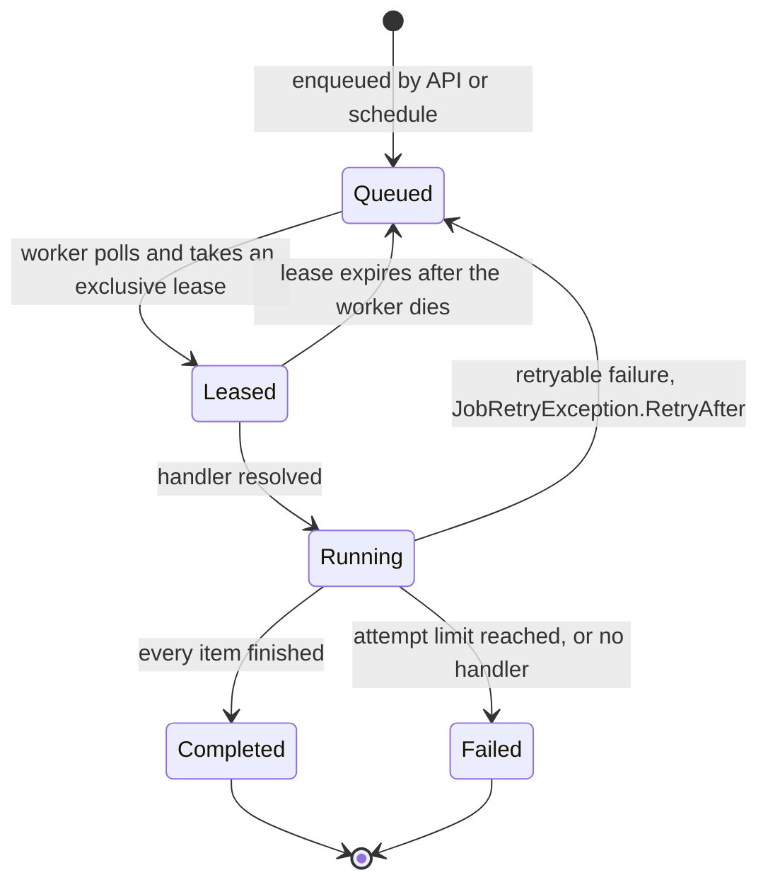

AgentPrism can move a run out of the request path or create work from a recurring
schedule. Both paths use the same durable job queue and worker. This gives an API
caller a short `202 Accepted` response while AgentPrism owns execution, status, and
recovery.

Use background work when the caller cannot keep an SSE connection open, when a batch
contains many independent inputs, or when work must start on a calendar. Keep the
normal streaming run endpoint for interactive conversations and approval flows.



## Configure the worker

`AddAgentPrism()` registers the scheduling stores and worker. `UseScheduling()` only
changes its settings:

```csharp
var builder = WebApplication.CreateBuilder(args);

builder.Services.UseScheduling(options =>
{
    options.RunWorker = true;
    options.MaxConcurrentJobs = 4;
    options.PollInterval = TimeSpan.FromSeconds(5);
    options.LeaseDuration = TimeSpan.FromMinutes(5);
    options.MaxAttempts = 3;
    options.MaxItemsPerJob = 1_000;
});

var agentPrism = builder.AddAgentPrism()
    .UseOpenAI(builder.Configuration.GetSection(OpenAIProviderOptions.SectionName))
    .UsePostgreSql(
        builder.Configuration.GetSection(AgentPrismPostgreSqlOptions.SectionName));

var app = builder.Build();
app.MapAgentPrism("/agentprism");
app.Run();
```

The same values can come from configuration:

```json
{
  "AgentPrism": {
    "Scheduling": {
      "Enabled": true,
      "RunWorker": true,
      "MaxConcurrentJobs": 4,
      "PollInterval": "00:00:05",
      "LeaseDuration": "00:05:00",
      "MaxAttempts": 3,
      "MaxItemsPerJob": 1000
    },
    "AsyncRun": {
      "Enabled": true,
      "MaxAttempts": 1
    }
  }
}
```

Code passed to `UseScheduling()` wins over configuration.

## Queue one agent run

Send the normal management run request with `Prefer: respond-async`:

```bash
curl -i https://agents.example.com/agentprism/api/agents/support/run \
  -H "Authorization: Bearer $AGENTPRISM_API_KEY" \
  -H 'Content-Type: application/json' \
  -H 'Prefer: respond-async' \
  -d '{"message":"Prepare the weekly escalation report."}'
```

AgentPrism returns `202 Accepted`, `Preference-Applied: respond-async`, and a
`Location` header. The response identifies both the run and its backing job. For this
path, the job ID is the run ID. Follow the returned location, or read the run and its
events directly:

```bash
curl -sS \
  -H "Authorization: Bearer $AGENTPRISM_API_KEY" \
  https://agents.example.com/agentprism/api/runs/$RUN_ID

curl -sS \
  -H "Authorization: Bearer $AGENTPRISM_API_KEY" \
  https://agents.example.com/agentprism/api/runs/$RUN_ID/events
```

Queued runs do not accept `attachmentIds` or an initial `approvals` collection. If a
tool asks for approval later, the queued request must include a `sessionId`.

**Do not start a second run yourself.** Deciding the approval is enough: the
decision endpoint creates the continuation run and queues it for the worker in
the same request, and the response's approval record is your confirmation that
it did. Starting another run in that session on top of it duplicates the work.

The run that asked for approval stays `AwaitingApproval` — it is finished. The
continuation is a separate run in the same session, so a client watching for a
result should follow the session rather than the original run id.

If the decision request fails partway, repeat exactly the same decision. The
continuation run's identity is derived from the approval, so a repeat completes
the interrupted handoff instead of creating a second run; only a repeat that
asks for the *opposite* answer is refused with `409`.

This is the durable-mailbox path. An in-band approval — one supplied in a
run request's `approvals` collection — is answered on the next request instead,
and a workflow's human-in-the-loop step uses its own respond call.

`AsyncRun.MaxAttempts` defaults to one. This is deliberate: an expired lease must not
silently repeat an agent run that already changed an external system. Raise it only
when every tool in the run is idempotent and you have tested replay after a worker
crash.

## Create a recurring schedule

The schedule name is part of the URL. The body selects the handler key, target,
calendar, time zone, and payload:

```bash
curl -sS -X PUT \
  https://agents.example.com/agentprism/api/schedules/weekday-support-review \
  -H "Authorization: Bearer $AGENTPRISM_API_KEY" \
  -H 'Content-Type: application/json' \
  -d '{
    "handlerKey": "agentprism.agent-batch",
    "targetName": "support",
    "cron": "0 8 * * 1-5",
    "timeZone": "UTC",
    "payload": [
      "Review unresolved priority-one tickets.",
      "Summarize breaches of the response-time objective."
    ],
    "enabled": true
  }'
```

A JSON array creates one item for each element. Any other JSON value creates one
item. A missing payload creates no items. Each job accepts at most
`MaxItemsPerJob` items.

`handlerKey` names the handler that runs the jobs this schedule produces. Only
the keys the server allows over HTTP are accepted —
`GET /api/schedules/handler-keys` returns exactly that list, and anything else
is a `400`. It is AgentPrism's own built-in keys unless the host set
`Scheduling.HttpSchedulableHandlerKeys`, so making one of your own handlers
schedulable from outside is a deliberate opt-in. A non-empty setting
**replaces** that default rather than extending it — which is what lets an
operator narrow the surface, and also what makes a list naming only a consumer
key turn every built-in key off. See
[Write your own job handler](/guides/write-your-own-job-handler/).

AgentPrism accepts five-field cron expressions: minute, hour, day of month, month,
and day of week. It supports `*`, fixed values, ranges, lists, and `/step`. It does
not support seconds or the `L`, `W`, and `#` extensions. When both day-of-month and
day-of-week are restricted, either field can match. Time-zone identifiers are
validated by `TimeZoneInfo` on the host.

Useful operations are:

| Operation | Endpoint |
|---|---|
| List schedules | `GET /api/schedules` |
| List the handler keys a schedule may use | `GET /api/schedules/handler-keys` |
| Read, replace, or delete one schedule | `GET`, `PUT`, or `DELETE /api/schedules/{name}` |
| Trigger now | `POST /api/schedules/{name}/trigger` |
| List jobs | `GET /api/jobs?handlerKey=&status=&lane=&scheduleId=&skip=&take=` |
| Inspect one job and its items | `GET /api/jobs/{id}` |
| Request cancellation | `POST /api/jobs/{id}/cancel` |

Manual trigger works even when the schedule is disabled. It does not change the next
calendar occurrence. Deleting a schedule does not cancel jobs that it already
created.

## Separate API and worker processes

All application instances run a worker by default. Set `RunWorker=false` on API-only
instances. Start one or more worker instances with the same storage, provider, agent,
and handler registrations:

```csharp
builder.Services.UseScheduling(options =>
{
    options.RunWorker = builder.Configuration.GetValue<bool>("Worker:Enabled");
});
```

`MaxConcurrentJobs` is a per-process limit. Four worker processes with the default of
two can execute up to eight jobs at once. SQL leasing prevents two processes from
owning the same job at the same time, and schedule claiming prevents duplicate
calendar dispatch. PostgreSQL uses a non-blocking row-lock strategy for competing
workers.

## Lanes

Every job runs in a lane — a plain text tag, `"default"` unless something else is
set. A worker leases jobs from every lane by default, so a single long batch and a
fast approval resume compete for the same concurrency slots. Give a lane its own
budget, or scope a worker to specific lanes, to stop one kind of work from blocking
another:

```csharp
builder.Services.UseScheduling(options =>
{
    // This process only leases "default" and "media" work.
    options.Lanes = ["default", "media"];

    // "media" gets its own concurrency budget, separate from MaxConcurrentJobs.
    options.MaxConcurrentJobsPerLane["media"] = 1;

    // A retention job queued without an explicit lane is routed to "housekeeping".
    options.LaneByHandlerKey[JobHandlerKeys.Retention] = "housekeeping";
});
```

A lane name is 1-64 characters: lowercase ASCII letters, digits, `.`, `_`, or `-`,
starting with a letter or digit. An invalid name is rejected where it is set —
`PUT /api/schedules/{name}` and a queued run's `lane` field both return `400`.

Set a job's lane explicitly, or let it inherit one:

- A queued agent run (`Prefer: respond-async`) accepts an optional `lane` field
  next to `message`.
- A schedule accepts an optional `lane` field; every job it produces — on its
  cron, or from a manual trigger — inherits that value.
- Any other job (evaluation, retention, webhook delivery, and so on) uses
  `Scheduling.LaneByHandlerKey` if the operator configured one for its handler
  key, otherwise `"default"`.

`Scheduling.Lanes` left `null` (the default) means the worker leases from every
lane — the same behavior as before lanes existed. Once `MaxConcurrentJobsPerLane`
has an entry and `Lanes` is still `null`, the worker's effective coverage narrows
to `"default"` plus the lanes listed there; a job queued under some other, unlisted
lane is simply never leased by that worker. It still exists — filter
`GET /api/jobs?lane=` or check the lane column on the Jobs screen to find it.

## Watching the queue

The worker publishes two metrics with no configuration at all, both tagged by
lane, handler key, and terminal status:

| Instrument | What it counts |
|---|---|
| `agentprism.job.executions` | Jobs that reached `Completed`, `Failed`, or `Cancelled` |
| `agentprism.job.duration` | How long a single attempt took, in seconds |

A job released for another attempt is **not** counted. A job configured with three
attempts that ultimately fails is one `Failed`, not three, and the recorded duration
belongs to that last attempt rather than to the job's whole lifetime.

A third instrument answers "is work piling up in a lane nobody is leasing from",
which the jobs list and the Jobs screen can only show if somebody looks:

```json
{
  "AgentPrism": {
    "Observability": {
      "EnableJobQueueDepthGauge": true,
      "JobQueueDepthRefreshInterval": "00:00:30"
    }
  }
}
```

`agentprism.job.queue.depth` then reports outstanding jobs per lane and open status
(`Pending`, `Leased`, `Running`). It is off by default because it queries the
database on a scrape; the refresh interval caches those reads, so a scrape more
often than every 30 seconds costs nothing extra. Terminal jobs are never counted
here — they are already on the counter — which keeps the query's cost tied to the
work still outstanding instead of to the queue's history.

Alerting is yours to configure: AgentPrism measures the depth and leaves the
threshold to your observability stack. See
[observability](/guides/observability/#what-the-job-metrics-count) for the full tag
list and the lane-cardinality guard.

## Singleton services and orphaned-run recovery

Two more background concerns sit next to the job queue, both off by default and
both meant for a multi-instance deployment.

**Singleton execution** (`AgentPrism:SingletonExecution`) elects one active
instance for periodic background services that must not run twice at once:
approval expiration, model-provider health polling, canary evaluation, and run
reconciliation itself. It does not protect the job queue — that already uses
per-job SQL leasing, which is unaffected by this setting.

```json
{
  "AgentPrism": {
    "SingletonExecution": {
      "Enabled": true,
      "LeaseDuration": "00:01:00"
    }
  }
}
```

Renewal happens at one third of `LeaseDuration`, so a single missed renewal
still leaves two more attempts before another instance can take over.
`OwnerId` defaults to the machine name, process id, and a random suffix; set
it explicitly only to force a specific instance to hold the lease.

**Run reconciliation** (`AgentPrism:RunReconciliation`) closes runs stuck in
`Running` after the owning process crashes mid-execution — a `Queued` job is
already covered by lease expiry, but a run that already started has no lease
of its own. Without reconciliation, an orphaned row stays `Running` forever
and dilutes the run error rate. An active run writes a bulk heartbeat every
`HeartbeatInterval`; a singleton-elected scanner then looks for rows silent
longer than `OrphanThreshold` and marks them `Failed`.

```json
{
  "AgentPrism": {
    "RunReconciliation": {
      "Enabled": true,
      "HeartbeatInterval": "00:00:30",
      "OrphanThreshold": "00:05:00",
      "ScanInterval": "00:01:00",
      "MaxRunsPerScan": 100
    }
  }
}
```

Both settings work with the in-memory lease store, but that store only
coordinates within one process. Run PostgreSQL or SQL Server to get real
cross-instance election.

SQLite implements the same lease contract and is correct within one process,
but it is not a cross-instance backend: the caution below applies to election
too. A store having lease semantics is not a cluster-support guarantee.

## Defaults and limits

| Setting | Default | Limit or effect |
|---|---:|---|
| `Scheduling.Enabled` | `true` | `false` stops dispatch and worker execution; APIs and stores remain available |
| `Scheduling.RunWorker` | `true` | `false` disables the worker in this process |
| `Scheduling.MaxConcurrentJobs` | `2` | Must be at least `1`; applies per process |
| `Scheduling.PollInterval` | 10 seconds | Must be positive |
| `Scheduling.LeaseDuration` | 5 minutes | Must be positive; renewal starts halfway through the lease |
| `Scheduling.MaxAttempts` | `3` | Must be at least `1`; jobs can override it |
| `Scheduling.MaxItemsPerJob` | `1,000` | Must be at least `1` |
| `Scheduling.Lanes` | `null` | `null` leases from every lane; a list scopes the worker to only those lanes |
| `Scheduling.MaxConcurrentJobsPerLane` | empty | Per-lane concurrency; a lane not listed shares `MaxConcurrentJobs` |
| `Scheduling.LaneByHandlerKey` | empty | Maps a handler key to a lane when the caller left it unset |
| `Scheduling.HttpSchedulableHandlerKeys` | empty | Handler keys `PUT /api/schedules/{name}` accepts; empty means the built-in keys, and a non-empty list replaces that default |
| `AsyncRun.Enabled` | `true` | A queued run request returns `501` when disabled |
| `AsyncRun.MaxAttempts` | `1` | Controls queued agent-run retries |
| Job list page | 50 records | `skip` defaults to `0`; `take` defaults to `50` |
| `SingletonExecution.Enabled` | `false` | `true` elects one instance for the singleton services above |
| `SingletonExecution.LeaseDuration` | 60 seconds | Renewal at one third of this duration |
| `RunReconciliation.Enabled` | `false` | `true` closes orphaned `Running` rows after a crash |
| `RunReconciliation.HeartbeatInterval` | 30 seconds | How often an active run's process signals it is alive |
| `RunReconciliation.OrphanThreshold` | 5 minutes | Silence beyond this marks a run orphaned |
| `RunReconciliation.ScanInterval` | 1 minute | Wait between reconciliation passes |
| `RunReconciliation.MaxRunsPerScan` | `100` | Upper bound on rows closed per pass |

The cron search looks ahead for at most four years. A nonexistent local time during a
spring daylight-saving transition is skipped. A duplicated local minute during the
fall transition maps to the earlier occurrence.

## Delivery and failure behavior

The queue provides exclusive leases, not exactly-once side effects. A process can
fail after an external call succeeds but before its item is committed. A lease can
then expire and another worker can see that item again. Tool calls and custom job
side effects must therefore use their own idempotency key or transactional boundary.
A retried job's item list is unfiltered — it carries every item, including ones an
earlier attempt already completed — so a custom `IJobHandler` must skip any item
whose status is no longer `Pending`; see
[Write your own job handler](/guides/write-your-own-job-handler/).

- A handler exception is retried until the job's attempt limit is reached.
- `JobRetryException.RetryAfter` asks the queue to delay the next attempt. Other
  failures can be retried immediately.
- A missing handler marks the job as failed.
- Lease-renewal, polling, and dispatch errors are logged; later polling ticks continue.
- Cancellation is cooperative. A running handler sees cancellation between items and
  must also pass its token to long operations.
- A batch with both successful and failed items finishes as `Completed`. A batch in
  which every item fails finishes as `Failed`. Inspect item counters, not only the job
  status.

:::caution[Production caveat]
In-memory job and schedule stores disappear when the process stops and cannot
coordinate multiple instances. Use PostgreSQL or SQL Server for durable workers.
SQLite is suitable for one process only. Keep the lease longer than the longest
normal operation between cancellation checks, and make all external side effects
idempotent.
:::

## Troubleshooting

| Symptom | Check |
|---|---|
| A queued run remains `Queued` | Confirm `Scheduling.Enabled` and `RunWorker`; confirm at least one worker passed the schema-ready gate and can reach the same SQL database |
| The request returns `501` | `AgentPrism:AsyncRun:Enabled` is false |
| The request returns `400` | Supply `message`; remove `attachmentIds` and initial `approvals` from a queued run |
| The same external action happens twice | The lease was replayed after an uncertain failure; add an operation-level idempotency key and leave queued-run attempts at one until the tool is safe |
| A job is `Completed` but work is missing | Inspect `failedItems` and the individual item records; mixed-result batches still complete |
| A schedule never fires | Validate the five-field cron, host time-zone identifier, enabled flag, and next occurrence; remember that daylight-saving gaps are skipped |
| More jobs run than expected | Multiply `MaxConcurrentJobs` by the number of worker processes |
| Cancellation takes time | It is a request, not a forced thread abort; pass the cancellation token through every long-running handler operation |
| A run stays `Running` forever after a crash | Enable `RunReconciliation`; confirm a SQL store is registered and `OrphanThreshold` is not longer than an acceptable outage window |
| Two instances both act as the singleton service | Confirm `SingletonExecution.Enabled` and that all instances share the same SQL store; the in-memory lease store cannot coordinate across processes |
| A job never leaves `Pending` even though a worker is running | Check its lane against `Scheduling.Lanes` and `MaxConcurrentJobsPerLane`; a worker only leases the lanes it is scoped to |

## Read next

- [Write your own job handler](/guides/write-your-own-job-handler/) — the `IJobHandler` at-least-once contract, and the reusable test suite that verifies it
- [Reliable runs](/guides/reliability/) — what happens to a queued run when a worker dies mid-flight
- [Production deployment](/guides/production/) — where the worker process lives and how many of them you run
