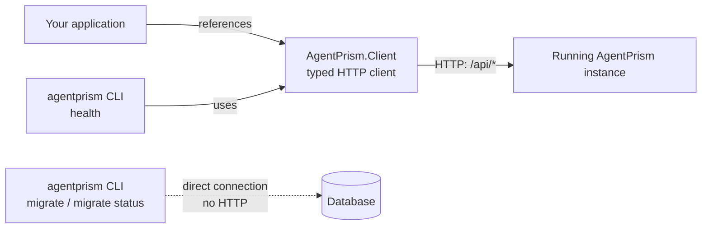

Two packages let you reach a running AgentPrism instance from outside the process
that hosts it: a typed HTTP client for your own code, and a command-line tool for
scripts and deployment pipelines.



## The typed client

```bash
dotnet add package AgentPrism.Client --prerelease
```

`AddAgentPrismClient` builds settings from `AgentPrismClientOptions`:

```csharp
services.AddAgentPrismClient(options =>
{
    // The application root PLUS the MapAgentPrism prefix. The default is
    // "/agentprism"; an app that called MapAgentPrism("/control") needs
    // "https://example.com/control/" instead.
    options.BaseAddress = new Uri("https://example.com/agentprism/");
    options.Token = configuration["AgentPrism:Token"];
});
```

```csharp
var client = provider.GetRequiredService<AgentPrismApiClient>();
var agents = await client.AgentPrismListAgentsAsync(cancellationToken);
```

`AgentPrismApiClient` is generated from the same OpenAPI document that
`AgentPrism.AspNetCore` serves, so it covers every management operation — agents,
runs, sessions, evals, workflows, tenants, and the rest. Its request and response
types are separate from the server's own types: same shape, but the client never
takes on server-side abstractions it does not need.

The client takes no AgentPrism package and only one NuGet package
(`Microsoft.Extensions.DependencyInjection.Abstractions`, for the
`IServiceCollection` extension); an `HttpClient` is built once and kept for the
container's lifetime rather than going through `IHttpClientFactory`.

## The CLI

```bash
dotnet tool install -g AgentPrism.Cli --prerelease
agentprism --help
```

| Command | Reaches | What it does |
|---|---|---|
| `agentprism migrate --provider <postgres\|sqlserver\|sqlite> --connection <connection-string>` | Database, directly | Applies pending migrations. Runs before the application ever starts, so a deployment pipeline can prepare the schema as its own step |
| `agentprism migrate status --provider ... --connection ...` | Database, directly | Lists pending migration names. Writes nothing |
| `agentprism health --url <base-url> [--token <token>] [--json]` | HTTP, through the typed client | Reads model provider health |

`--connection` and `--token` also accept the `AGENTPRISM_CONNECTION` and
`AGENTPRISM_TOKEN` environment variables — useful in a CI/CD step where a literal
secret on the command line would show up in shell history and process listings.
Neither is ever read from a configuration file, and neither is ever printed back.
Exit code `0` means success, `1` a usage error, `2` a runtime failure (could not
connect, an HTTP error, a timeout).

`migrate` talks to the database directly instead of over HTTP because the moment
it matters most is before the application has ever started — there is no endpoint
to call yet, and adding one would open a database-writing operation to the network
for no reason. The tool bundles all three database provider packages so it works
against whichever one you run; that weight lands on the tool's own installation,
never on your application's dependency graph.

## Read next

- [Persistence](/getting-started/persistence/) — what a migration actually does to the schema
- [Every public type](/api/) — the full generated client surface
