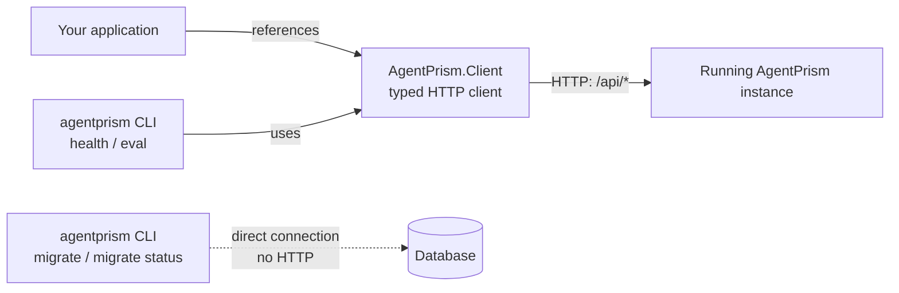

Two packages let you reach a running AgentPrism instance from outside the process
that hosts it: a typed HTTP client for your own code, and a command-line tool for
scripts and deployment pipelines.



## The typed client

```bash
dotnet add package AgentPrism.Client --prerelease
```

`AddAgentPrismClient` builds settings from `AgentPrismClientOptions`:

```csharp
services.AddAgentPrismClient(options =>
{
    // The application root PLUS the MapAgentPrism prefix. The default is
    // "/agentprism"; an app that called MapAgentPrism("/control") needs
    // "https://example.com/control/" instead.
    options.BaseAddress = new Uri("https://example.com/agentprism/");
    options.Token = configuration["AgentPrism:Token"];
});
```

```csharp
var client = provider.GetRequiredService<AgentPrismApiClient>();
var agents = await client.AgentPrismListAgentsAsync(cancellationToken);
```

`AgentPrismApiClient` is generated from the same OpenAPI document that
`AgentPrism.AspNetCore` serves, so it covers every management operation — agents,
runs, sessions, evals, workflows, tenants, and the rest. Its request and response
types are separate from the server's own types: same shape, but the client never
takes on server-side abstractions it does not need.

The client takes no AgentPrism package and only one NuGet package
(`Microsoft.Extensions.DependencyInjection.Abstractions`, for the
`IServiceCollection` extension); an `HttpClient` is built once and kept for the
container's lifetime rather than going through `IHttpClientFactory`.

## The CLI

```bash
dotnet tool install -g AgentPrism.Cli --prerelease
agentprism --help
```

| Command | Reaches | What it does |
|---|---|---|
| `agentprism migrate --provider <postgres\|sqlserver\|sqlite> --connection <connection-string>` | Database, directly | Applies pending migrations. Runs before the application ever starts, so a deployment pipeline can prepare the schema as its own step |
| `agentprism migrate status --provider ... --connection ...` | Database, directly | Lists pending migration names. Writes nothing |
| `agentprism health --url <base-url> [--token <token>] [--json]` | HTTP, through the typed client | Reads model provider health |
| `agentprism eval --url <base-url> --suite <name> [--token <token>] [--agent-version <n>] [--min-pass-rate <0..1>] [--max-failures <n>] [--timeout <seconds>] [--poll-interval <seconds>] [--json]` | HTTP, through the typed client | Triggers a suite, polls it to completion, applies an optional quality gate |

`--connection` and `--token` also accept the `AGENTPRISM_CONNECTION` and
`AGENTPRISM_TOKEN` environment variables — useful in a CI/CD step where a literal
secret on the command line would show up in shell history and process listings.
Neither is ever read from a configuration file, and neither is ever printed back.

`migrate` talks to the database directly instead of over HTTP because the moment
it matters most is before the application has ever started — there is no endpoint
to call yet, and adding one would open a database-writing operation to the network
for no reason. The tool bundles all three database provider packages so it works
against whichever one you run; that weight lands on the tool's own installation,
never on your application's dependency graph.

### `eval`: gating a build on agent quality

An eval run is processed by the background job queue (see
[Evaluation](/concepts/evaluation/)), so "trigger and exit" would never actually
measure anything — `eval` polls the run until it reaches a terminal state, or
`--timeout` (default 30 minutes, checked every `--poll-interval`, default 5
seconds) runs out.

With neither `--min-pass-rate` nor `--max-failures` given, there is no quality
gate: the command exits `0` as soon as the run finishes, whatever the result.
AgentPrism does not impose a default quality bar. With one or both given,
**all** given thresholds must hold — a suite that satisfies `--max-failures`
but not `--min-pass-rate` still fails the gate.

A suite with no cases cannot be triggered at all — the server rejects it with
`400` before any run exists, so `eval` exits `2` ("could not run"), not `3`.
The `--min-pass-rate` math still guards `Total == 0` defensively (it fails
rather than reading a division by zero as "100% passed"), in case a future
server path ever hands back a completed run with no cases.

Triggering needs the `RunsWrite` API key scope; polling needs `EvalsRead`. A
key carrying only one of the two gets exit `2`, with the missing scope named
in the error message — the server's response body is never echoed.

### Exit codes

| Code | Meaning |
|---:|---|
| `0` | Ran and passed the gate (or no gate was given) |
| `1` | Argument error (missing/invalid flag, unknown command) |
| `2` | Could not run: connection failed, HTTP error, timed out, or (`eval` only) the run itself ended `Failed`/`Cancelled` |
| `3` | (`eval` only) Ran, but missed the quality gate |

The distinction between `2` and `3` is operational: `2` is an infrastructure
problem and worth retrying; `3` is a real quality signal and retrying it is
the wrong move. `migrate`, `migrate status`, and `health` never return `3`.

## Read next

- [Persistence](/getting-started/persistence/) — what a migration actually does to the schema
- [Every public type](/api/) — the full generated client surface
