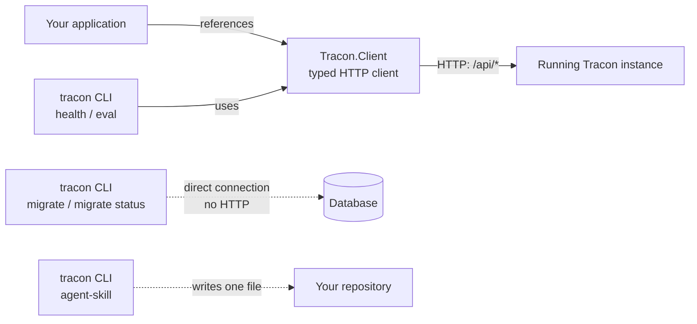

:::note[Preview package]
The CLI is published as `1.0.0-preview.2`. Use `--prerelease` for discovery or
pin the exact version for a reproducible tool manifest.
:::

Use `Tracon.Client` for typed HTTP access to a running host. Use `Tracon.Cli`
for scripted health checks and evaluation over HTTP, or for migrations through
a direct database connection before the host starts.



## The typed client

```bash
dotnet add package Tracon.Client --prerelease
```

`AddTraconClient` builds settings from `TraconClientOptions`:

```csharp
services.AddTraconClient(options =>
{
    // The application root PLUS the MapTracon prefix. The default is
    // "/tracon"; an app that called MapTracon("/control") needs
    // "https://example.com/control/" instead.
    options.BaseAddress = new Uri("https://example.com/tracon/");
    options.Token = configuration["Tracon:Token"];
});
```

```csharp
var client = provider.GetRequiredService<TraconApiClient>();
var agents = await client.TraconListAgentsAsync(cancellationToken);
```

`TraconApiClient` is generated from the same OpenAPI document that
`Tracon.AspNetCore` serves, so it covers every management operation — agents,
runs, sessions, evals, workflows, tenants, and the rest. Its request and response
types are separate from the server's own types: same shape, but the client never
takes on server-side abstractions it does not need.

The client takes no Tracon package and only one NuGet package
(`Microsoft.Extensions.DependencyInjection.Abstractions`, for the
`IServiceCollection` extension); an `HttpClient` is built once and kept for the
container's lifetime rather than going through `IHttpClientFactory`.

### Request budget

`HttpClient` caps every request at 100 seconds by default. If you bound a call
with your own longer budget, that cap applies underneath it — the call ends at
100 seconds, and the transport reports its own cap as an
`OperationCanceledException` with nothing cancelled, which reads exactly like
your budget elapsing. Set `Timeout` so there is only one limit:

```csharp
services.AddTraconClient(options =>
{
    options.BaseAddress = new Uri("https://example.com/tracon/");

    // Either give the transport a budget of its own...
    options.Timeout = TimeSpan.FromSeconds(30);

    // ...or hand the whole budget to the cancellation token you pass in.
    options.Timeout = Timeout.InfiniteTimeSpan;
});
```

Leaving `Timeout` unset keeps the 100-second default. `tracon eval` and
`tracon health` set it to `Timeout.InfiniteTimeSpan` and bound their own calls,
which is why their `--timeout` means what it says.

## The CLI

```bash
dotnet tool install -g Tracon.Cli --prerelease
tracon --help
```

| Command | Reaches | What it does |
|---|---|---|
| `tracon migrate --provider <postgres\|sqlserver\|sqlite> --connection <connection-string>` | Database, directly | Applies pending migrations. Runs before the application ever starts, so a deployment pipeline can prepare the schema as its own step |
| `tracon migrate status --provider ... --connection ...` | Database, directly | Lists pending migration names. Writes nothing |
| `tracon state-check --provider <postgres\|sqlserver\|sqlite> --connection <connection-string> [--sample <n>] [--json]` | Database, directly | Reports whether this build can read the session and workflow checkpoint state already in the database. Writes nothing |
| `tracon health --url <base-url> [--token <token>] [--json]` | HTTP, through the typed client | Reads model provider health |
| `tracon eval --url <base-url> --suite <name> [--token <token>] [--agent-version <n>] [--min-pass-rate <0..1>] [--max-failures <n>] [--baseline <runId\|previous>] [--max-regressions <n>] [--timeout <seconds>] [--poll-interval <seconds>] [--json]` | HTTP, through the typed client | Triggers a suite, polls it to completion, applies an optional quality gate — absolute, relative to an earlier run, or both |
| `tracon agent-skill [--format claude] [--output <directory>] [--force] [--json]` | The local file system | Writes the gate skill a coding agent's harness loads before it writes Tracon code. The only command that changes your working tree, and the only one that reaches neither the database nor HTTP |

`--connection` and `--token` also accept the `TRACON_CONNECTION` and
`TRACON_TOKEN` environment variables — useful in a CI/CD step where a literal
secret on the command line would show up in shell history and process listings.
Neither is ever read from a configuration file, and neither is ever printed back.

`agent-skill` is the odd one out: it neither connects nor listens. It writes one
file, `.claude/skills/tracon/SKILL.md`, under `--output` (default: the root of
the repository you are in, which is where the build looks for it), and leaves an
existing file untouched unless `--force` is given —
you may have edited it. Exit `0` covers both writing it and deliberately leaving
it alone, and the command says which it did. The file carries the capability map
revision the tool was built from, and your project's build reports a mismatch as
`TRC0403`. The [coding agents guide](/guides/coding-agents/#the-gate-skill-speaks-first)
explains what the file is for and which harnesses were measured to load it.

`migrate` talks to the database directly instead of over HTTP because the moment
it matters most is before the application has ever started — there is no endpoint
to call yet, and adding one would open a database-writing operation to the network
for no reason. `state-check` is the same argument from the other side: its whole
point is to ask a question while the new build is *not* running. The tool bundles
all three database provider packages so it works against whichever one you run;
that weight lands on the tool's own installation, never on your application's
dependency graph.

### `state-check`: asking the upgrade question before the upgrade

"Will my pending sessions still be readable after I upgrade?" normally gets
answered in production, after the fact. Run this with the **new** tool version
against a copy of production data instead:

```bash
tracon state-check --provider postgres --connection "$TRACON_CONNECTION"
```

It reports two different things, and the difference is the whole point:

- **A count of every row**, grouped by the Tracon envelope generation
  stamped on it, across **every tenant** — an upgrade replaces the process for
  all of them at once. Each generation is marked readable or not by the build
  running the command. This part is complete.
- **A decode of a sample**: at most `--sample` rows of *each* generation
  (default 5, `0` counts only), deserialized through Microsoft Agent Framework.
  This part is a sample. A clean run says the rows that were read came back
  readable — never that all of them would.

The sample is taken per generation rather than "the newest N rows overall",
because the newest rows are the ones the current build just wrote and prove
nothing; the risk sits in the older generations.

`state-check` **writes nothing** — no row, no migration table entry, no lock —
so it is safe against a live database, and Ctrl+C leaves nothing half-done.

Two kinds of row come back as checked for structure only, and neither is a
failure: workflow checkpoints, whose payload has no decoder outside a running
workflow, and sessions encrypted at rest, which the CLI holds no key for.
Calling either one unreadable would raise a false alarm about a row the
application reads perfectly well.

Exit `0` means nothing was found that blocks reading; `3` means it found state
this build cannot read. See [the supported upgrade
window](/reference/versioning/) for what the promise covers, and [Production
deployment](/guides/production/) for what to do about a `3`.

### `eval`: gating a build on agent quality

An eval run is processed by the background job queue (see
[Evaluation](/concepts/evaluation/)), so "trigger and exit" would never actually
measure anything — `eval` polls the run until it reaches a terminal state, or
`--timeout` (default 30 minutes, checked every `--poll-interval`, default 5
seconds) runs out.

With neither `--min-pass-rate` nor `--max-failures` given, there is no quality
gate: the command exits `0` as soon as the run finishes, whatever the result.
Tracon does not impose a default quality bar. With one or both given,
**all** given thresholds must hold — a suite that satisfies `--max-failures`
but not `--min-pass-rate` still fails the gate.

A suite with no cases cannot be triggered at all — the server rejects it with
`400` before any run exists, so `eval` exits `2` ("could not run"), not `3`.
The `--min-pass-rate` math still guards `Total == 0` defensively (it fails
rather than reading a division by zero as "100% passed"), in case a future
server path ever hands back a completed run with no cases.

Triggering needs the `RunsWrite` API key scope; polling needs `EvalsRead`. A
key carrying only one of the two gets exit `2`, with the missing scope named
in the error message — the server's response body is never echoed.

An absolute threshold cannot see a slide: with `--min-pass-rate 0.85` set, a
drop from 95% to 90% passes. `--baseline` adds a **relative** gate that
compares the finished run against an earlier run of the same suite, case by
case (see [Comparing two runs](/concepts/evaluation/#comparing-two-runs)):

```bash
tracon eval --url http://localhost:5081/tracon --suite support \
  --baseline previous --max-regressions 0
```

`--baseline` takes an eval run id or the word `previous` — the newest
completed run of that suite before this one. Given alone it reports the
comparison without ever failing the build; `--max-regressions` is what turns
the report into a gate. Under `--json` the summary moves to stderr so stdout
stays a single parseable document. `--max-regressions` says how many
cases may break; cases added to or dropped from the suite are never counted as
regressions. `--max-regressions` without `--baseline` is an argument error
(`1`), never a silent no-op: a pipeline must not read a green exit code as "no
regressions" when nothing was compared. On a suite's first run there is no
earlier run; that is written to stderr and the gate is skipped, not failed.

### Exit codes

| Code | Meaning |
|---:|---|
| `0` | Ran and passed the gate (or no gate was given) |
| `1` | Argument error (missing/invalid flag, unknown command) |
| `2` | Could not run: connection failed, HTTP error, timed out, or (`eval` only) the run itself ended `Failed`/`Cancelled` |
| `3` | Ran, but the answer is bad: (`eval`) missed the quality gate, or (`state-check`) found state this build cannot read |
| `4` | (`eval` only) Ran, but could not be compared against `--baseline` |

The distinction between `2` and `3` is operational: `2` is an infrastructure
problem and worth retrying; `3` is a real quality signal and retrying it is
the wrong move. `4` is a third thing again — the baseline's per-case results
have aged out of retention, it never completed, or it measures another suite.
Folding it into `3` would send someone hunting for a regression that was never
measured. `migrate`, `migrate status`, and `health` never return `3` or `4`;
`state-check` never returns `4`. `agent-skill` returns only `0`, `1`, or `2`,
where `2` means the file could not be written.

## Read next

- [Persistence](/getting-started/persistence/) — what a migration actually does to the schema
- [Every public type](/api/) — the full generated client surface
- [Coding agents](/guides/coding-agents/) — what `agent-skill` writes, and why
