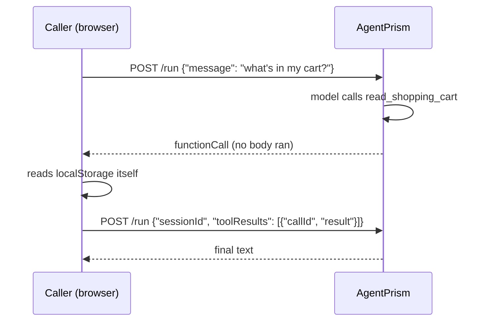

A normal tool's body runs in your server process. Some data only exists somewhere
else — the current page's DOM, a shopping cart in `localStorage`, a file the user
just selected. A client-side tool lets the model call something that runs on the
**caller** instead.

## The mechanic

```csharp
builder.AddAgentPrism()
       .AddClientTool(
           "read_shopping_cart",
           "Reads the items currently in the customer's shopping cart in the browser.",
           JsonSerializer.Deserialize<JsonElement>("""{"type":"object","properties":{}}"""));
```

The declaration — name, description, JSON schema — lives in code, exactly like
[every other tool](/AgentPrism/concepts/tools/): the console can show it, but nothing
short of a code change can add one. What is different is the body: there is none.
When the model calls `read_shopping_cart`, the server never runs it. The run response
carries a pending `FunctionCallContent` instead, and the caller is expected to answer
it.



Answer it with `toolResults` on the next request, matched by `callId`:

```bash
curl -X POST https://your-host/agentprism/api/agents/support/run \
  -H "Authorization: Bearer $API_KEY" \
  -H "Content-Type: application/json" \
  -d '{
    "sessionId": "s-123",
    "toolResults": [{ "callId": "call_abc", "result": "2x Wireless Mouse" }]
  }'
```

A few rules follow directly from this being an HTTP round trip, not a callback:

- **`sessionId` is required.** The pending call lives in session history; a
  sessionless run has nowhere to look it up.
- **A queued run (`Prefer: respond-async`) does not accept `toolResults`.** Nothing
  is connected on the other end of a background job.
- **An unknown or already-answered `callId` is rejected** (`400`/`409`) before the
  response starts streaming, not silently ignored.
- **A failure is still an answer.** If the browser could not fulfil the call — a
  permission was denied, an element was not found — send `errorMessage` instead of
  `result`. The model sees the failure as ordinary tool output and can recover
  (explain, retry, ask a follow-up); it does not become an HTTP error.

```json
{ "callId": "call_abc", "errorMessage": "The user denied camera access." }
```

A client-side tool cannot also `RequiresApproval`. Approval defers a server-side
call; a client-side tool has no server-side call to defer. `AddClientTool` never
exposes the flag, and a direct registration that tries to combine them fails at
startup with a clear message.

Every result passes through the same [content guard](/AgentPrism/concepts/governance/)
pipeline as any other message before it reaches the model — nothing new to configure,
but nothing exempted either.

## CORS

A page calling `/run` from its own origin needs a CORS response, and AgentPrism sends
none by default:

```csharp
app.MapAgentPrism("/agentprism", options =>
{
    options.AllowedOrigins.Add("https://shop.example.com");
});
```

There is no `AllowAnyOrigin`. An endpoint that accepts a bearer token or an API key
must not make a wildcard origin the easy path — add the exact origins that need
access. With the list empty, no `Access-Control-Allow-Origin` header is ever sent and
a cross-origin browser request is blocked by the browser itself; a same-origin caller
(curl, a server-to-server call, your own console) is unaffected either way.

An allowed origin can read a response from **any** endpoint under the prefix, not
only `/run` — CORS applies to the whole group. This does not by itself grant access:
reading a response still needs a valid credential, and CORS only controls whether the
calling page's own script is allowed to read what that credential already permits.
Add an origin only where you also control which credential reaches it — in practice,
an origin you allow should only ever receive a `RunsWrite`-scoped key, never the
management token.

## The embeddable widget

`AgentPrism.UI` also builds a small, framework-free chat widget — a separate bundle
from the console, with its own 30 KB gzip budget. Drop it into any page with one
script tag:

```html
<script src="https://your-agentprism-host/agentprism/embed/embed.js"
  data-server="https://your-agentprism-host"
  data-prefix="/agentprism"
  data-agent="support"
  data-api-key="sk_..."></script>
<script>
  // Runs after the widget script, in document order.
  window.AgentPrismEmbed.registerTool('read_shopping_cart', () => {
    const cart = JSON.parse(localStorage.getItem('cart') ?? '[]');
    return cart.map((item) => `${item.qty}x ${item.name}`).join(', ');
  });
</script>
```

`registerTool` supplies the **implementation** for a tool the server already
declared by name — the widget never sees a schema, and it cannot invent a new tool.
The handler may be synchronous or return a `Promise<string>`; if the model calls a
tool with no registered handler, the widget answers with an `errorMessage` on your
behalf instead of leaving the call hanging.

The widget carries its own small dictionary (English and Turkish), independent from
the console's — pulling in the console's translations would blow its budget for a
handful of strings.

### The identity it needs

`data-api-key` is a [tenant API key](/AgentPrism/getting-started/security/) scoped to
`RunsWrite`, not the management bearer token. The token that unlocks the console must
never reach a browser outside your own network; a scoped, revocable API key is the
credential meant for exactly this.

## Read next

- [Add a tool](/AgentPrism/getting-started/tools/) — the server-side default
- [Tools, skills, and MCP](/AgentPrism/concepts/tools/) — where each capability's code
  actually runs
- [Security](/AgentPrism/getting-started/security/) — API keys, scopes, and the
  three-layer access model
