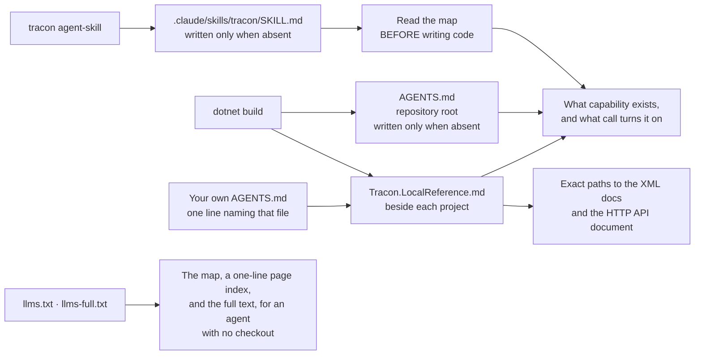

:::caution[Package availability]
Tracon packages and templates are not published yet. The `dotnet new tracon-api`
line below describes the release form and does not currently resolve from public
registries. With authorized repository access, use the
[source build instructions](/getting-started/first-agent/).
:::

A coding agent cannot use a capability it does not know exists. It will write a retry
loop around a chat client, hand-roll an approval queue, or invent a cost table —
carefully, and for no reason, because Tracon ships all three.

Tracon closes that gap from inside the build, without a service to run or an
index to keep in sync. Three files land in your repository or beside your project, and
eight compiler diagnostics speak up when an agent writes something the package already
covers.

Those files wait to be read, and a diagnostic arrives after the code is written.
A fourth file speaks first: the **gate skill**, a short procedure the agent's
harness loads before the agent starts. It is written by the `tracon` tool rather
than the build, and [one step below](#the-gate-skill-speaks-first) turns it on.

## Turn it on

One MSBuild property, **off by default**. Set it where your project file can see it —
the project itself, or a `Directory.Build.props` at the repository root:

```xml
<PropertyGroup>
  <TraconWriteAgentsFile>true</TraconWriteAgentsFile>
</PropertyGroup>
```

That turns on both files. `TraconWriteLocalReference` follows it unless you set it
yourself, so you can keep the capability map and skip the machine-specific reference:

```xml
<PropertyGroup>
  <TraconWriteAgentsFile>true</TraconWriteAgentsFile>
  <TraconWriteLocalReference>false</TraconWriteLocalReference>
</PropertyGroup>
```

The project template sets the first property, so a project created with
`dotnet new tracon-api` already has both files.

## What each file is for



### `AGENTS.md` — the capability map

Written once to your **repository root**, about 10 KB, and read by most coding agents
at the start of a session. It names every registration entry point, the package it
lives in, and the rule each capability group obeys.

It is written **only when the file does not already exist**. Your own `AGENTS.md` is
never overwritten, never merged, and never reformatted.

### If you already have an `AGENTS.md`

Most repositories do, which means the map above is never written and the copy inside
the package is never found. Do not copy the capability list into your file — it would
be a second copy to maintain, and it would go stale the first time you upgrade.

Two steps instead. First, ask for the pointer file on its own; this writes nothing at
your repository root and never touches your `AGENTS.md`:

```xml
<PropertyGroup>
  <TraconWriteLocalReference>true</TraconWriteLocalReference>
</PropertyGroup>
```

Then add one line to your own file:

```markdown
Tracon: read Tracon.LocalReference.md beside each project for the capability
map and the API documentation of the installed version.
```

The pointer cannot go stale: the file it names is rewritten on every build, and its
first section is the absolute path to the capability map in your NuGet cache.

`TRC0402` fires while that line is missing — but **only once the property above is
on**, because until then there is no file to point at. It looks for the exact file name
anywhere in `AGENTS.md`; prose, a list, or a code fence all count.

### `Tracon.LocalReference.md` — the exact paths

Written **beside each project** that references Tracon, on every build, and
regenerated rather than merged — so add it to `.gitignore`. It answers the second
question an agent asks, "how exactly is this called", by pointing at documentation
already on the machine:

- one XML documentation file per referenced Tracon package, at the version this
  project restored;
- the packaged HTTP API document, when the project references
  `Tracon.AspNetCore`.

The paths are machine-specific and version-specific, which is the point: an agent
that greps them reads the signatures of the version you actually installed, not a
newer or older one from the web.

```bash
grep -A 12 "AddToolApprovalPolicy" \
  "$(grep -m1 -o '/.*Tracon\.Core\.xml' Tracon.LocalReference.md)"
```

### `llms.txt` and `llms-full.txt` — for an agent with no checkout

The same capability map, plus one line per documentation page, plus the full text of
every page — three sizes for three questions, published on the documentation site:

- [`llms.txt`](/llms.txt) — the capability map, then **which page answers
  what**: one line per hand-written page, with its title, address, and subject. About
  20 KB.
- [`llms-full.txt`](/llms-full.txt) — every guide, concept, and reference
  page concatenated, about 700 KB.

The middle layer is the one to use. The map names a capability but does not explain it;
the index names the one page that does, and reading that page costs a fraction of the
full text. The capability map lists both addresses, so an agent that only has the
shipped copy still knows they exist.

The generated .NET and HTTP API references are deliberately **not** in either file.
That surface belongs to the compiler and the XML documentation; putting it in a text
file would burn a context window and answer nothing the local reference cannot.

### Any page as plain markdown

Append `index.md` to the address of any page on this site and you get the markdown
it was built from — `/capabilities/` becomes
[`/capabilities/index.md`](/capabilities/index.md), and the generated reference
pages have one too, so
[`/api/tracon.agentdefinition/index.md`](/api/tracon.agentdefinition/index.md)
returns the type's documentation as text. Each page declares the copy with
`<link rel="alternate" type="text/markdown">`, and points at `llms.txt` with
`<link rel="describedby">`.

Fetch that rather than the HTML when you only want the text. It is smaller, and it
is the only form in which a code block keeps its line breaks: the rendered page puts
every code line in its own element with no newline between them, so flattening the
HTML yields `var app = builder.Build();app.MapTracon("/tracon");app.Run();` on one
line. Table columns collapse the same way. Cite the page address, not the `.md` one.

## The gate skill speaks first

The map and the local reference wait to be read. A diagnostic arrives once the
code is already written, compiled, and about to be deleted again. The gate skill
is the channel that runs **before** any of that: it is a short procedure the
harness loads when a task mentions Tracon, and all it says is *read the map of
the installed version first*.

It is written by the `tracon` tool, once, into the repository you point it at:

```bash
dotnet tool install -g Tracon.Cli
tracon agent-skill
```

The command belongs to the same tool as `migrate` and `eval`; the
[CLI guide](/guides/cli/) covers its options and exit codes.

That writes one file, `.claude/skills/tracon/SKILL.md`, **at the root of the
repository** — the same place the build looks for it and the harness loads it
from — and commits nothing. Run it from anywhere inside the repository; the
command prints the path it wrote. An existing file is never touched — it may
carry your own notes — so re-running the command is safe and says what it did.
`--force` overwrites, `--output` names a different root, and `--json` reports
the same answer for a script.

The file is small on purpose: every byte of it is spent out of the context budget
of the agent that loads it, on every task that touches Tracon. It therefore
points at the map rather than repeating it, and it says plainly that it is a
guardrail rather than a complete list — a procedure that overstates its coverage
would replace one wrong assumption with another.

It carries the capability map revision it was written from, and `TRC0403` reports
the difference once your installed packages ship a newer one. Because the tool
carries the revision it stamps, refresh the tool first:

```bash
dotnet tool update -g Tracon.Cli
rm .claude/skills/tracon/SKILL.md
tracon agent-skill
```

### Which harnesses load it

One, measured rather than assumed. The layout a skill file has to use is defined
by the harness that loads it, and a file written to a layout nothing reads is
dead weight that still costs the agent its context budget. Only the layout below
was measured to load, so only it is written:

| Harness | Path | Loads it |
|---|---|---|
| Claude Code | `.claude/skills/tracon/SKILL.md` | Yes — measured |

Other harnesses read other layouts, and `--format` rejects a name this version
does not write rather than quietly writing the file above under another name. If
you keep your own instructions for one of them, the single line `TRC0402` asks
for works there too: name `Tracon.LocalReference.md`, and the map is reachable.

## Keeping the map current

Upgrade the package and the map goes stale — it describes the capabilities of the
version that wrote it. The refresh is two steps and needs no new tool:

```bash
rm AGENTS.md
dotnet build
```

`TRC0401` tells you when this is due, so you do not have to remember.

## The diagnostics

Eight diagnostics in the `Tracon.Usage` category. They are **warnings**, not
suggestions, for one measured reason: an `Info` diagnostic never appears in
`dotnet build` output at any verbosity, and build output is the only channel a coding
agent reliably reads.

| Id | Fires when | What it teaches |
|---|---|---|
| `TRC0101` | `MapTracon()` is called but `AddTracon()` is not | The mapped endpoints have no catalog to serve; the app fails at startup |
| `TRC0102` | A model binding names a built-in provider the compilation never registers | Call the matching `Use…()`, or register a custom `IModelProvider` |
| `TRC0201` | A literal secret is written into a definition | Store the **name of the configuration key**; definitions reach backups, the audit trail, and the console |
| `TRC0301` | A retry loop is written by hand around a chat client | Hand retries hide failures from the circuit breaker and never reach the binding's fallbacks |
| `TRC0302` | An agent is wrapped without any `IAgentDecorator` in the compilation | A hand-applied wrapper misses database-defined agents; a decorator does not |
| `TRC0401` | `AGENTS.md` was generated from an older capability map | Delete it and build again |
| `TRC0402` | The local reference file is written, and your own `AGENTS.md` never names it | An agent reading it cannot reach the capability map on this machine; add one line |
| `TRC0403` | The gate skill carries an older capability map revision than the installed packages | Update the tool, delete the file, and write it again |

A separate family, `TRC0001`–`TRC0008`, validates tool registration itself and comes
from the source generator. Both families carry a help link into the
[capability map](/capabilities/).

### Turning them off

One property switches off the whole `Tracon.Usage` family by adding it to
`$(NoWarn)`:

```xml
<PropertyGroup>
  <TraconUsageDiagnostics>false</TraconUsageDiagnostics>
</PropertyGroup>
```

To silence a single diagnostic instead, use `.editorconfig` as you would for any
analyzer:

```ini
[*.cs]
dotnet_diagnostic.TRC0301.severity = none
```

:::caution
With `TreatWarningsAsErrors` enabled, these warnings break the build — which is the
intended outcome for `TRC0101` and `TRC0201`, both of which describe a defect that
fails at run time or leaks a secret. Narrow the severity of the one you disagree with
rather than switching off the family.
:::

## What this is not

It is not a service, an index, or a plugin. Nothing runs outside `dotnet build` and
one command you run yourself, no process listens, and no content is uploaded
anywhere. Delete the files and unset the property and the only thing you lose is
the map.

The gate skill in particular is a guardrail, not a boundary. It cannot stop an
agent from writing anything; it only changes what the agent reads first.

It also does not make an agent's output correct. The map says what exists; whether a
capability suits your case is still a judgement call, and the guides on this site are
written for the human making it.

## Read next

- [Capability map](/capabilities/) — the source the generated map is built from
- [Troubleshooting](/troubleshooting/#build-diagnostics-and-the-agent-map) — when a diagnostic fires and you disagree
- [Your first agent](/getting-started/first-agent/) — the template that turns this on
