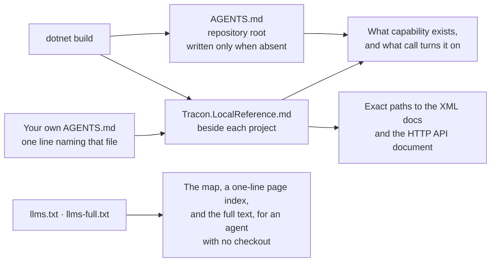

A coding agent cannot use a capability it does not know exists. It will write a retry
loop around a chat client, hand-roll an approval queue, or invent a cost table —
carefully, and for no reason, because Tracon ships all three.

Tracon closes that gap from inside the build, without a service to run or an
index to keep in sync. Three files land in your repository or beside your project, and
seven compiler diagnostics speak up when an agent writes something the package already
covers.

## Turn it on

One MSBuild property, **off by default**. Set it where your project file can see it —
the project itself, or a `Directory.Build.props` at the repository root:

```xml
<PropertyGroup>
  <TraconWriteAgentsFile>true</TraconWriteAgentsFile>
</PropertyGroup>
```

That turns on both files. `TraconWriteLocalReference` follows it unless you set it
yourself, so you can keep the capability map and skip the machine-specific reference:

```xml
<PropertyGroup>
  <TraconWriteAgentsFile>true</TraconWriteAgentsFile>
  <TraconWriteLocalReference>false</TraconWriteLocalReference>
</PropertyGroup>
```

The project template sets the first property, so a project created with
`dotnet new tracon-api` already has both files.

## What each file is for



### `AGENTS.md` — the capability map

Written once to your **repository root**, under 10 KB, and read by most coding agents
at the start of a session. It names every registration entry point, the package it
lives in, and the rule each capability group obeys.

It is written **only when the file does not already exist**. Your own `AGENTS.md` is
never overwritten, never merged, and never reformatted.

### If you already have an `AGENTS.md`

Most repositories do, which means the map above is never written and the copy inside
the package is never found. Do not copy the capability list into your file — it would
be a second copy to maintain, and it would go stale the first time you upgrade.

Two steps instead. First, ask for the pointer file on its own; this writes nothing at
your repository root and never touches your `AGENTS.md`:

```xml
<PropertyGroup>
  <TraconWriteLocalReference>true</TraconWriteLocalReference>
</PropertyGroup>
```

Then add one line to your own file:

```markdown
Tracon: read Tracon.LocalReference.md beside each project for the capability
map and the API documentation of the installed version.
```

The pointer cannot go stale: the file it names is rewritten on every build, and its
first section is the absolute path to the capability map in your NuGet cache.

`APG0402` fires while that line is missing — but **only once the property above is
on**, because until then there is no file to point at. It looks for the exact file name
anywhere in `AGENTS.md`; prose, a list, or a code fence all count.

### `Tracon.LocalReference.md` — the exact paths

Written **beside each project** that references Tracon, on every build, and
regenerated rather than merged — so add it to `.gitignore`. It answers the second
question an agent asks, "how exactly is this called", by pointing at documentation
already on the machine:

- one XML documentation file per referenced Tracon package, at the version this
  project restored;
- the packaged HTTP API document, when the project references
  `Tracon.AspNetCore`.

The paths are machine-specific and version-specific, which is the point: an agent
that greps them reads the signatures of the version you actually installed, not a
newer or older one from the web.

```bash
grep -A 12 "AddToolApprovalPolicy" \
  "$(grep -m1 -o '/.*Tracon\.Core\.xml' Tracon.LocalReference.md)"
```

### `llms.txt` and `llms-full.txt` — for an agent with no checkout

The same capability map, plus one line per documentation page, plus the full text of
every page — three sizes for three questions, published on the documentation site:

- [`llms.txt`](/llms.txt) — the capability map, then **which page answers
  what**: one line per hand-written page, with its title, address, and subject. About
  17 KB.
- [`llms-full.txt`](/llms-full.txt) — every guide, concept, and reference
  page concatenated, about 400 KB.

The middle layer is the one to use. The map names a capability but does not explain it;
the index names the one page that does, and reading that page costs a fraction of the
full text. The capability map lists both addresses, so an agent that only has the
shipped copy still knows they exist.

The generated .NET and HTTP API references are deliberately **not** in either file.
That surface belongs to the compiler and the XML documentation; putting it in a text
file would burn a context window and answer nothing the local reference cannot.

## Keeping the map current

Upgrade the package and the map goes stale — it describes the capabilities of the
version that wrote it. The refresh is two steps and needs no new tool:

```bash
rm AGENTS.md
dotnet build
```

`APG0401` tells you when this is due, so you do not have to remember.

## The diagnostics

Seven diagnostics in the `Tracon.Usage` category. They are **warnings**, not
suggestions, for one measured reason: an `Info` diagnostic never appears in
`dotnet build` output at any verbosity, and build output is the only channel a coding
agent reliably reads.

| Id | Fires when | What it teaches |
|---|---|---|
| `APG0101` | `MapTracon()` is called but `AddTracon()` is not | The mapped endpoints have no catalog to serve; the app fails at startup |
| `APG0102` | A model binding names a built-in provider the compilation never registers | Call the matching `Use…()`, or register a custom `IModelProvider` |
| `APG0201` | A literal secret is written into a definition | Store the **name of the configuration key**; definitions reach backups, the audit trail, and the console |
| `APG0301` | A retry loop is written by hand around a chat client | Hand retries hide failures from the circuit breaker and never reach the binding's fallbacks |
| `APG0302` | An agent is wrapped without any `IAgentDecorator` in the compilation | A hand-applied wrapper misses database-defined agents; a decorator does not |
| `APG0401` | `AGENTS.md` was generated from an older capability map | Delete it and build again |
| `APG0402` | The local reference file is written, and your own `AGENTS.md` never names it | An agent reading it cannot reach the capability map on this machine; add one line |

A separate family, `APG0001`–`APG0008`, validates tool registration itself and comes
from the source generator. Both families carry a help link into the
[capability map](/capabilities/).

### Turning them off

One property switches off the whole `Tracon.Usage` family by adding it to
`$(NoWarn)`:

```xml
<PropertyGroup>
  <TraconUsageDiagnostics>false</TraconUsageDiagnostics>
</PropertyGroup>
```

To silence a single diagnostic instead, use `.editorconfig` as you would for any
analyzer:

```ini
[*.cs]
dotnet_diagnostic.APG0301.severity = none
```

:::caution
With `TreatWarningsAsErrors` enabled, these warnings break the build — which is the
intended outcome for `APG0101` and `APG0201`, both of which describe a defect that
fails at run time or leaks a secret. Narrow the severity of the one you disagree with
rather than switching off the family.
:::

## What this is not

It is not a service, an index, or a plugin. Nothing runs outside `dotnet build`, no
process listens, and no content is uploaded anywhere. Delete the files and unset the
property and the only thing you lose is the map.

It also does not make an agent's output correct. The map says what exists; whether a
capability suits your case is still a judgement call, and the guides on this site are
written for the human making it.

## Read next

- [Capability map](/capabilities/) — the source the generated map is built from
- [Troubleshooting](/troubleshooting/#build-diagnostics-and-the-agent-map) — when a diagnostic fires and you disagree
- [Your first agent](/getting-started/first-agent/) — the template that turns this on
