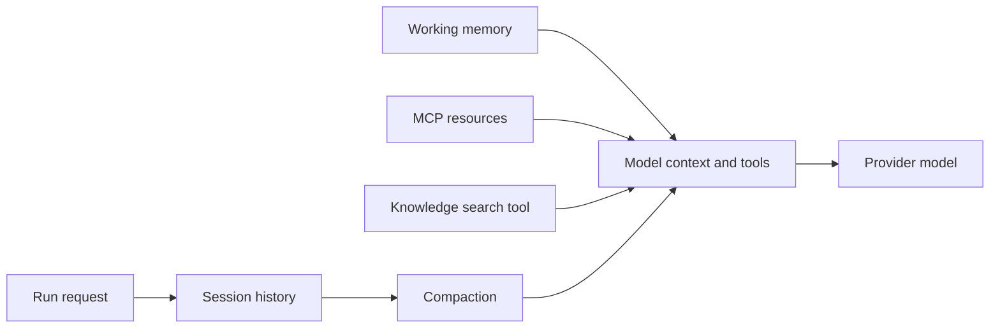

“Memory” is not one store. Tracon separates conversation continuity, context
budgeting, working state, fixed resources, and semantic knowledge. Choose each layer
for the question it answers.

## Mental model: five different jobs

| Layer | Question it answers | Main API |
|---|---|---|
| Session history | What did this conversation already say? | `AgentRunRequest.SessionId` |
| Compaction | Which old context still fits in the next model call? | `CompactionSettings` |
| Working memory | What files, todos, or text should this agent manage during work? | `MemorySettings` |
| MCP resources | Which fixed remote resources enter every run? | `AgentDefinition.McpResourceUris` |
| Knowledge search | Which durable external facts are relevant to this question? | `MemorySettings.EnableVectorSearch` |



A session preserves continuity. Compaction reduces what the model sees. It does not
delete the durable run record. File memory and knowledge search add capabilities; they
do not replace session history.

These five layers all shape what already made it into the conversation. A tool's
[output size limit](/concepts/tools/#output-size-limit) works earlier, at the source:
it bounds a single tool result before that result ever becomes context to compact. The
two are complementary, not competing — a tool limit caps one call's contribution,
compaction manages the accumulated history afterward.

## Session history starts with `sessionId`

A run with no `sessionId` is sessionless. The next request does not receive its chat
history. Reuse a session id when turns must build on each other:

```bash
curl -N -X POST http://localhost:5081/tracon/api/agents/research/run \
  -H "Authorization: Bearer $TRACON_TOKEN" \
  -H 'Content-Type: application/json' \
  -d '{"sessionId":"case-4182","message":"Summarize the customer request."}'

curl -N -X POST http://localhost:5081/tracon/api/agents/research/run \
  -H "Authorization: Bearer $TRACON_TOKEN" \
  -H 'Content-Type: application/json' \
  -d '{"sessionId":"case-4182","message":"Now list the unresolved questions."}'
```

Without a SQL package, session history is in memory. `UsePostgreSql()`,
`UseSqlServer()`, or `UseSqlite()` replaces it with the corresponding durable store.

## Add compaction and working memory

Compaction and memory work on a plain chat agent. A `HarnessSettings` value is not
required. Add the harness only when you also need its execution policy.

```csharp
tracon.AddAgent(new AgentDefinition
{
    Name = "research",
    Instructions = "Investigate the request. Keep a concise evidence trail.",
    Model = new ModelBinding
    {
        Provider = OpenAIProviderNames.ChatCompletions,
        Model = "your-current-model-name",
        MaxOutputTokens = 2_048,
    },
    Harness = new HarnessSettings
    {
        MaxContextWindowTokens = 64_000,
        MaxOutputTokens = 2_048,
        MaximumIterationsPerRequest = 12,
        HarnessInstructions = "Update the todo list before the final answer.",
    },
    Compaction = new CompactionSettings
    {
        Strategy = CompactionStrategyKind.Pipeline,
        TriggerTokens = 48_000,
        MinimumPreservedTurns = 3,
        MinimumPreservedGroups = 6,
        SummarizationModel = new ModelBinding
        {
            Provider = OpenAIProviderNames.ChatCompletions,
            Model = "your-lower-cost-summary-model",
            MaxOutputTokens = 1_024,
        },
    },
    Memory = new MemorySettings
    {
        EnableFileMemory = true,
        EnableTodo = true,
        EnableTextSearch = true,
    },
});
```

The compiler checks conflicts before the run. For example, it rejects
`Memory.EnableFileMemory = true` together with `Harness.DisableFileMemory = true`.
The same rule applies to compaction and todo tracking.

## Choose a compaction strategy

| Strategy | What it does | Required input |
|---|---|---|
| `None` | Sends no compaction policy | None |
| `SlidingWindow` | Drops the oldest turns | At least one trigger |
| `Truncation` | Truncates excluded message groups | At least one trigger |
| `ToolResult` | Shortens tool-call and tool-result groups | At least one trigger |
| `Summarization` | Replaces older groups with a model summary | At least one trigger |
| `ContextWindow` | Evicts or truncates against a known window | `MaxContextWindowTokens` |
| `Pipeline` | Runs ToolResult, then SlidingWindow, then Summarization | At least one trigger |

`TriggerTokens`, `TriggerMessages`, and `TriggerTurns` are combined with **OR**. The
first threshold reached starts compaction. `ContextWindow` manages its own trigger and
does not require one of those fields.

Defaults are explicit:

| Setting | Default |
|---|---|
| `CompactionSettings.Strategy` | `None` |
| `MinimumPreservedTurns` | 2 |
| `MinimumPreservedGroups` | 4 |
| `ContextWindow.MaxOutputTokens` | Agent model limit, then 4096 |
| Summarization prompt | MAF default |
| Summarization model | Agent setting, then application `UtilityModel`, then the agent model |

:::caution[No compaction can become a run failure]
When `Compaction` is absent or uses `None`, Tracon sends no compaction strategy.
A long session eventually exceeds the provider's context window. Set a measured
trigger below the real model limit and leave room for output and tool results.
:::

MAF currently marks its compaction and `AgentFileStore` APIs as evaluation features.
Tracon keeps the integration in one compiler boundary, but you should still test
context behavior when upgrading MAF packages.

## Understand the memory flags

All `MemorySettings` flags default to `false`.

`EnableFileMemory` adds MAF file memory. On a plain agent, `EnableTodo` adds todo
tracking. A harness already keeps todo tracking on unless
`Harness.DisableTodoProvider` is true. `EnableTextSearch` searches the registered
`AgentFileStore`. The default file store is in memory. `UsePostgreSql()`,
`UseSqlServer()`, or `UseSqlite()` replaces it with the corresponding persistent SQL
file store.

`EnableVectorSearch` is different. It adds the code-defined `search_knowledge` tool
over a persistent semantic knowledge base. It is not MAF's
`ChatHistoryMemoryProvider`. See
[Knowledge and RAG](/guides/knowledge/).

The console agent editor exposes harness settings, all compaction strategies, file
memory, todo tracking, and text search. It does not currently expose vector search or
MCP resource URIs. Set vector memory through code or the management HTTP API. Set MCP
resource URIs in code.

## Know the agent modes

A harness agent always runs in a mode. The mode provider is on unless
`Harness.DisableAgentModeProvider` is true. A plain chat agent has no modes.

Two modes come from MAF, and a new session starts in the first one:

| Mode | Behavior |
|---|---|
| `plan` | Interactive. The agent asks clarifying questions, discusses options, and waits for your approval before it proceeds. **This is the starting mode.** |
| `execute` | Autonomous. The agent carries the work out without stopping for approval. |

The provider adds two tools, `mode_set` and `mode_get`, so the model can read and
change its own mode. It also injects the current mode's instructions on every
invocation. Those instructions apply to every substantive request, including short
factual questions — a harness agent in `plan` mode can answer a simple question with
questions of its own.

You cannot define your own modes today. Tracon passes no mode options to MAF, so
you get these two. Set `Harness.DisableAgentModeProvider = true` to turn the provider
off, together with both of its tools.

## Add predictable MCP resources

Code-defined agents can name resources in `{server}:{uri}` form:

```csharp
tracon.AddAgent(new AgentDefinition
{
    Name = "release-reviewer",
    Instructions = "Review the release against the supplied policy.",
    Model = new ModelBinding
    {
        Provider = OpenAIProviderNames.ChatCompletions,
        Model = "your-current-model-name",
    },
    McpResourceUris =
    [
        "github:https://example.com/release-policy.md",
    ],
});
```

Call `UseMcp()` before compiling an agent that uses this field. Tracon reads these
resources at the start of each run. The defaults are 64 KiB per resource and 256 KiB
in total. Configure them with `TraconMcpOptions.MaxResourceBytesPerResource` and
`MaxResourceBytesTotal`.

The current `AgentDefinitionRequest` management contract does not expose
`McpResourceUris`. Define this field in code. Remote tools and server registrations
remain available through the MCP management surface.

Only resources declared by the server are read. An invalid reference, unreachable
server, or undeclared resource is skipped and logged. Content above the per-resource
budget is truncated; resources after the total budget is exhausted are skipped.

## Validate before saving

The validation endpoint compiles the same definition without writing it and without
calling a model:

```bash
curl -sS -X POST http://localhost:5081/tracon/api/agents/validate \
  -H "Authorization: Bearer $TRACON_TOKEN" \
  -H 'Content-Type: application/json' \
  -d '{
    "name": "research",
    "instructions": "Investigate the request.",
    "model": { "provider": "openai", "model": "your-current-model-name" },
    "compaction": {
      "strategy": "Pipeline",
      "triggerTokens": 48000,
      "minimumPreservedTurns": 3,
      "minimumPreservedGroups": 6
    },
    "memory": {
      "enableFileMemory": true,
      "enableTodo": true,
      "enableTextSearch": true
    }
  }'
```

A well-formed request returns `200` even when the report says `valid: false`. That
distinguishes an invalid definition from a transport failure.

## Troubleshooting

**The second turn forgot the first one.** Reuse the same non-empty `sessionId`. A
sessionless run carries no history to a later request.

**A compaction strategy fails to compile.** Every strategy except `ContextWindow`
needs at least one trigger. `ContextWindow` needs `MaxContextWindowTokens`.

**Context still overflows.** Lower the trigger. Reserve space for output, system
instructions, tool schemas, tool results, skills, and resources. A provider's nominal
window is not all available to conversation history.

**Summarization costs more than expected.** It is another model call. Set the agent's
`SummarizationModel`, or configure the application-wide `TraconOptions.UtilityModel`.

**File memory disappears after restart.** The default `AgentFileStore` is in memory.
Register PostgreSQL, SQL Server, or SQLite for a built-in persistent implementation.

**Harness compilation reports a conflict.** Do not enable a capability in
`Compaction` or `Memory` while the matching `Harness.Disable...` flag is true.

**A harness agent asks questions instead of answering.** A new session starts in
`plan` mode, which is interactive by design. Tell the agent to switch, or set
`Harness.DisableAgentModeProvider = true`.

**An MCP resource fails to compile or is truncated.** Confirm `UseMcp()` ran, the
reference uses `{server}:{uri}`, and the resource stays within the configured byte
budgets.

**Vector search fails to compile.** It needs both an `IVectorSearchStore` and an
`IEmbeddingGenerator<string, Embedding<float>>`. The built-in store comes from
PostgreSQL.

## In the reference

- [Agent management HTTP API](/http-api/agents/)
- [`HarnessSettings` API](/api/tracon.harnesssettings/)
- [`CompactionSettings` API](/api/tracon.compactionsettings/)
- [`MemorySettings` API](/api/tracon.memorysettings/)
- [`TraconMcpOptions` API](/api/tracon.traconmcpoptions/)

## Read next

- [Sessions and conversations](/concepts/sessions/)
- [Agents and definitions](/concepts/agents/)
- [Tools, skills, and MCP](/concepts/tools/)
