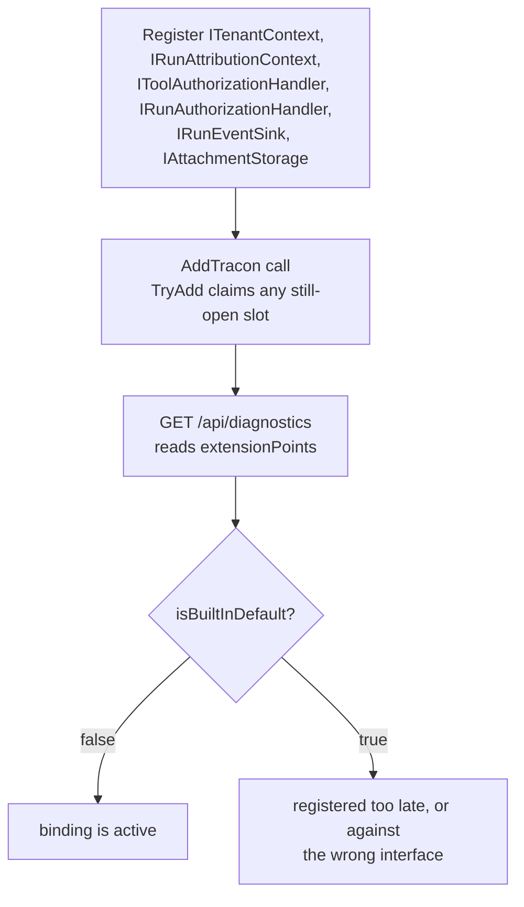

`AddTracon()` plus `MapTracon()` is a complete, working setup on its own —
that two-line promise is what [Your first agent](/getting-started/first-agent/)
shows. Embedding Tracon into an application that already has its own tenants,
users, permissions, event bus, or object storage is a different job: it means
replacing six built-in defaults with bindings into systems you already run. All
six are wired the same way, are all optional, and can be added one at a time.

## The six points

| Contract | What you give it | Built-in default when unbound |
|---|---|---|
| `ITenantContext`, `ITenantStore` | The current tenant, resolved from your own identity layer | A single fixed tenant |
| `IRunAttributionContext` | The current user and job labels a run belongs to | `UserId` and `Labels` are always `null` |
| `IToolAuthorizationHandler` | A decision for every tool call: allowed or denied | Every call is allowed |
| `IRunAuthorizationHandler` | A decision for every run start, every access to a run's resources, and every session access: allowed or denied | Every run starts, every run is readable, and every session is reachable |
| `IRunEventSink` | A bridge that receives every run event as it is written | No bridge; events reach only `IRunStore` |
| `IAttachmentStorage` | A place to write attachment bytes outside the database | Content is stored as `bytea` in the database |

Each interface is registered with `TryAdd`, so a registration made **before**
`AddTracon()` wins over the built-in default. A registration made after it is
where module order starts to matter: a `TryAdd` registration is dropped, because
Tracon's default already holds the slot, while a plain `Add` still wins the
resolve and leaves Tracon's unused registration behind it. Register first and
neither case can bite you. `GET /api/diagnostics` (once you turn it on) reports which
of the six are still built-in and which your application replaced — see
[Extension points](#extension-points-in-diagnostics) below; to turn a missed binding
into a failed startup instead of a report nobody reads, see
[Make a binding required](#make-a-binding-required).

```csharp
var builder = WebApplication.CreateBuilder(args);

builder.Services.AddSingleton<ITenantContext, YourTenantContext>();
builder.Services.AddSingleton<ITenantStore, YourTenantStore>();
builder.Services.AddSingleton<IRunAttributionContext, YourRunAttributionContext>();
builder.Services.AddSingleton<IToolAuthorizationHandler, YourToolAuthorizationHandler>();
builder.Services.AddSingleton<IRunAuthorizationHandler, YourRunAuthorizationHandler>();
builder.Services.AddSingleton<IRunEventSink, YourRunEventSink>();
builder.Services.AddSingleton<IAttachmentStorage, YourAttachmentStorage>();

var tracon = builder.AddTracon()
    .UseOpenAI(builder.Configuration.GetSection(OpenAIProviderOptions.SectionName))
    .UsePostgreSql(builder.Configuration.GetSection(TraconPostgreSqlOptions.SectionName));
```

The order above — bindings first, `AddTracon()` second — is the only order that
works. `AddTracon()` calls `TryAdd*` for all six; called first, it claims every
slot and your registrations that follow do nothing.

### 1 — Tenant resolution

```csharp
public sealed class YourTenantContext(IYourIdentityService identity) : ITenantContext
{
    public string TenantId => identity.CurrentTenantId;
}
```

`YourTenantContext` replaces the built-in resolver entirely — the claim/header
resolution chain [Governance](/concepts/governance/#multi-tenancy) describes only
applies when you leave the default in place and turn it on with `UseTenancy()`.
Bind your own `ITenantContext` instead when the tenant already lives in a service,
a claim shape, or a header your identity layer owns. Bind `ITenantStore` alongside
it only if you also want Tracon's tenant admin endpoints
(`/api/tenants`) to read and write your own tenant records instead of its
in-memory default.

For work that runs outside an HTTP request — a queued job, a scheduled task — no
`HttpContext` exists for `ITenantContext` to read. Open an ambient scope for the
duration of that work instead. It composes with
[`AmbientRunAttributionScope`](/concepts/runs/#who-ran-it-and-for-what) — a
background job binds both together, since neither has a request to read from:

```csharp
using (AmbientTenantScope.Begin(job.TenantId))
using (AmbientRunAttributionScope.Begin(job.RequestedByUserId, labels: null))
{
    await agent.RunAsync(job.Message);
}
```

🚨 Open the scope inside the method that starts the run, in that method's own
body — not in a helper it calls — and reopen it before every `MoveNextAsync` on a
streaming path. `AmbientTenantScope` is an `AsyncLocal<T>`; a value set upstream of
an `await` boundary does not flow back down through one opened later. A dropped
scope reads as "empty tenant", not as an exception, so it fails silently.

### 2 — Run attribution

Attributes a run to a user and, optionally, job labels — see
[Runs: who ran it and for what](/concepts/runs/#who-ran-it-and-for-what) for the
full contract, including why the value is never read from the run request body.

### 3 — Tool authorization

Decides whether a caller may invoke a specific tool at all, separately from
approval — see [Tools](/concepts/tools/#authorization-validation-and-timeout) for the binding
pattern and how authorization and approval order relative to each other. If your
widget renders its own approval card instead of the built-in console's, register
[`IToolApprovalPresenter`](/concepts/governance/#approvals) too — it turns a raw
`{ "orderId": "ORD-1001" }` into a name your widget can show directly, and it reaches
your widget the same way the built-in one reads it: an `approvals` frame on the
streaming run endpoint, keyed by the pending request's `requestId`.

### 4 — Run event bridge

Bridges every run event to your own queue or bus, in addition to the run store —
see [Runs: observing events beyond the store](/concepts/runs/#observing-events-beyond-the-store)
and [Troubleshooting a slow sink](/guides/observability/#troubleshooting) for the
full contract.

**The one rule that matters most:** `OnEventAsync` must queue the event and
return. Tracon awaits it directly on the run's own hot path, before the
response keeps streaming to its caller — a sink that does its own network I/O
inline ties the model's response speed to that network call's latency.

Tracon holds **no queue of its own** in front of your sink, so the buffer is
yours to own: write to a bounded channel and return. Size that channel to drop
the event and log it when it is full rather than block, so a slow consumer of
yours never slows the run down to match its queue depth.

### 5 — Attachment storage

```csharp
public sealed class YourAttachmentStorage(IYourBlobClient blobs) : IAttachmentStorage
{
    public async ValueTask<Uri> WriteAsync(
        string tenantId, Guid id, Stream content, string mediaType, CancellationToken cancellationToken = default)
        => await blobs.PutAsync($"{tenantId}/{id}", content, mediaType, cancellationToken);

    public ValueTask<Stream?> ReadAsync(Uri uri, CancellationToken cancellationToken = default)
        => blobs.OpenReadAsync(uri, cancellationToken);

    public ValueTask DeleteAsync(Uri uri, CancellationToken cancellationToken = default)
        => blobs.DeleteAsync(uri, cancellationToken);
}
```

`IAttachmentStore` keeps the metadata row either way; `IAttachmentStorage` only
decides where the bytes live. Tracon takes no dependency on any cloud SDK —
you write this class against whichever client your object store already uses.

### 6 — Run and session authorization

Tracon draws ownership at the **tenant** level by default; without this
binding, every caller with the `Operator` role in a tenant can start a run as,
read, cancel, score, and delete every other user's runs, attachments,
approvals, and sessions in the same tenant.

:::note[Sessions have a built-in answer too]
Turning on [session ownership](/concepts/sessions/#session-ownership) makes
Tracon record which user opened a session and narrow the session list to
that user, with no handler at all. It covers **sessions only**; runs,
attachments, approvals, and scores still need the handler below. The two
compose — with ownership on, a handler no longer has to reject a whole session
listing just to keep users apart.
:::

#### Ownership and attribution are not the same promise

Both read the user from `IRunAttributionContext`, and it is worth being exact
about how differently they treat a failure there:

| | Attribution | Session ownership |
|---|---|---|
| What the value does | Names the user on a cost report | Decides who may reach a session |
| If your implementation throws | The run continues; the column stays `NULL` | The session is not opened: `403` |
| If it returns an over-long value | Dropped whole; the run continues | Treated as no identity: `403` |
| When it is read | Every run | Only when a session is **opened** |

Same service, two contract strengths. The rule "observability never breaks
functionality" holds for attribution and deliberately does **not** hold once a
deployment has asked for that value to be an authorization input. If you bind
`IRunAttributionContext` and later turn ownership on, re-read your
implementation with that in mind: a path that used to degrade quietly now
refuses.

`AuthorizeRunAsync` answers two different questions, told apart by
`request.Access`. `RunAccess.Start` asks whether a run may **begin**;
every other value asks whether an existing run's **resource** may be reached,
and carries `request.RunId` so you can look that run up in your own records:

| `RunAccess` | What the caller is asking to do |
|---|---|
| `Start` | Start a run — including a replay, which carries the source run's `RunId` |
| `Read` | Read the run: summary, tree, event stream, recorded input, span tree, tool calls, scores |
| `Cancel` | Request cancellation of the run |
| `Feedback` | Write or delete a score for the run |
| `Attachment` | Upload, download, list, or delete an attachment |
| `Approval` | List, read, or decide an approval request |

```csharp
public sealed class YourRunAuthorizationHandler(IYourOwnershipService ownership) : IRunAuthorizationHandler
{
    public async ValueTask<RunAuthorizationResult> AuthorizeRunAsync(
        RunAuthorizationRequest request, CancellationToken cancellationToken = default)
    {
        // Starting a run: there is no run yet, so the question is about the agent.
        if (request.Access == RunAccess.Start && request.RunId is null)
        {
            return await ownership.CanStartAsync(request.TenantId, request.UserId, request.AgentName!, cancellationToken)
                ? RunAuthorizationResult.Allow()
                : RunAuthorizationResult.Deny("This user cannot run this agent.");
        }

        // Everything else is about an existing run. RunId is null only for a
        // list, and for an attachment uploaded before any run existed.
        if (request.RunId is not { } runId)
        {
            return RunAuthorizationResult.Allow();
        }

        return await ownership.OwnsRunAsync(request.TenantId, request.UserId, runId, cancellationToken)
            ? RunAuthorizationResult.Allow()
            : RunAuthorizationResult.Deny("This run belongs to a different user.");
    }

    public async ValueTask<RunAuthorizationResult> AuthorizeSessionAsync(
        SessionAuthorizationRequest request, CancellationToken cancellationToken = default)
    {
        // request.SessionId is null only for SessionAccess.List, which has no
        // single session identity to check ownership of.
        if (request.Access == SessionAccess.List)
        {
            return RunAuthorizationResult.Allow();
        }

        return await ownership.OwnsAsync(request.TenantId, request.UserId, request.SessionId!, cancellationToken)
            ? RunAuthorizationResult.Allow()
            : RunAuthorizationResult.Deny("This session belongs to a different user.");
    }
}
```

Both methods are called explicitly at every endpoint concerned — there is no
single filter they all share, because these endpoints have no route shape in
common, so each one calls this binding in its own body:

- **Six run-starting endpoints:** the agent run endpoint, the workflow run
  endpoint, the inbound trigger accept endpoint, the OpenAI-compatible
  `/v1/responses` and `/v1/chat/completions` endpoints, and `POST
  /api/runs/{id}/replay`. The check runs **before** the quota check, so a
  denied call never consumes the tenant's quota.
- **Every run resource:** the run summary, its tree, its event stream, its
  recorded input, its span tree, its tool calls, its scores, its
  cancellation, its attachments, and its approval requests.
- **Every session access:** list, read, delete, branch, and opening a
  real-time voice conversation (`SessionAccess.Voice`) — including the
  OpenAI-compatible routes that reach the same sessions under another name,
  `GET`/`DELETE /v1/conversations/{id}` and `GET /v1/conversations/{id}/items`.
  `POST /v1/conversations` is not among them: it reserves an identifier and
  writes nothing, so there is no session yet to authorize.

**How a denial answers depends on what was asked for.** A denied single
resource — a run, a session, an attachment, an approval request — returns
`404`, with a body **identical** to the one that resource gets when it
genuinely does not exist. A `403` there would confirm the resource exists to
a caller who should not even know it, and wording that differed between
"denied" and "missing" would leak the same thing through a side channel. A
denied **list** returns `403` instead: a list is an operation, not a single
resource, so there is no existence to leak, and the response is never
silently filtered — filtering there would break the `skip`/`take` paging
contract. A denied **run start** and a denied **attachment upload** also
return `403`: neither addresses an existing resource. A denied voice
handshake is refused before the socket upgrades, with the same `404` an
unreachable session already gives.

A voice session that does not exist yet is **not** an error: the first turn
opens it, and the handler is still asked, so you decide for yourself whether
a caller may open a conversation under that id.

If this handler throws, the call is denied (fail-closed); a gate that fails
open on an exception is not a gate. When it denies a single resource, the
`Reason` you supply is deliberately **not** returned — the response has to
stay identical to a missing resource's.

## Reading identity inside a tool body

A tool cannot reach `AgentSession`, so it cannot read `ITenantContext` or
`IRunAttributionContext` through the normal request pipeline. It reads the same
values from `TraconRunContext.Current` instead — a static, `AsyncLocal`-backed
snapshot the run pipeline populates before every tool call:

```csharp
[TraconTool("current_account", "Returns the tenant, run, session, and caller identity of the current run.")]
public static string CurrentAccount()
{
    var scope = TraconRunContext.Current;

    return scope is null
        ? "no run in progress"
        : $"tenant={scope.TenantId} run={scope.RunId} session={scope.SessionId} user={scope.UserId}";
}
```

This is the only place a tool can read the run's identity — there is no parameter
Tracon injects for it. `scope.UserId` is the same value `IRunAttributionContext`
resolved for the run record, not a new concept — just a second place to read it
from. `AgentRunScope` also carries `RootRunId` (the top of an
agent-calls-agent tree) and `Budget` (the shared token/depth/count ceiling for that
tree).

## Two data planes, one connection pool or two

Your application's own schema and Tracon's tables can live in the same
PostgreSQL database. Tracon writes only inside its own schema (`SchemaName`,
default `tracon`; see
[Choose a migration strategy](/guides/production/#choose-a-migration-strategy)) and
never reads or writes yours.

**Giving both sides the same connection string does not share a pool.** Npgsql
pools a `NpgsqlDataSource` **instance**, not a connection string — two separate
`NpgsqlDataSource` objects built from an identical string open two separate
pools (measured: with 5 concurrent commands held open on each of two data
sources built from the same string, the server showed 10 simultaneous
backends, not 5). If your application uses Entity Framework Core (or any other
Npgsql consumer) and you want Tracon sharing its actual pool, build **one**
`NpgsqlDataSource` and give the same instance to both sides:

```csharp
var dataSource = new NpgsqlDataSourceBuilder(connectionString).Build();
builder.Services.AddDbContext<YourDbContext>(o => o.UseNpgsql(dataSource));
builder.AddTracon()
       .UsePostgreSql(o => o.DataSource = dataSource);
```

See [Two connection planes: EF Core and Tracon](/guides/ef-core/) for the
full pattern, including startup/shutdown ownership. Without a shared
`DataSource`, pointing `Tracon:PostgreSql:ConnectionString` at the same
string your application uses is still fine — the two sides simply keep
independent pools against the same database, exactly as if they pointed at two
different databases.

Give Tracon a **separate** connection string (or data source) — same
server, different database, or a fully different server — when you want its
connection ceiling, credentials, or failure blast radius kept independent of
your application's own database traffic. Nothing in Tracon requires this;
it is purely an operational choice, and it can be changed later since only the
connection string moves.

`AutoApplyMigrations` (default `true`) applies to Tracon's own schema only. In
an embedded setup where your application already owns a controlled migration step
for its own schema, set it to `false` and call the registered
`MigrationRunner.ApplyAsync()` from that same step — Tracon's schema then
migrates alongside yours instead of at every instance's startup. See
[Choose a migration strategy](/guides/production/#choose-a-migration-strategy) for
the fleet-deployment version of this same setting.

## Make a binding required

Reporting a missed binding is not the same as refusing to run without it. An
application that means to enforce its own rule can declare the binding required, and
the host then does not start while Tracon's built-in default is what resolves:

```csharp
builder.Services.AddSingleton<IRunAuthorizationHandler, YourRunAuthorizationHandler>();
builder.Services.AddSingleton<IToolAuthorizationHandler, YourToolAuthorizationHandler>();

builder.AddTracon()
    .RequireCustomBinding<IRunAuthorizationHandler>()
    .RequireCustomBinding<IToolAuthorizationHandler>();
```

The check runs while the host starts, and the message names the contract, the type
that resolved instead, and how to fix it:

```text
IRunAuthorizationHandler was declared as a required custom binding, but Tracon's
built-in default AllowAllRunAuthorizationHandler is what resolved. Register your own
IRunAuthorizationHandler on IServiceCollection BEFORE the AddTracon() call.
```

Four properties are worth knowing before you rely on it:

- **It is off by default.** An application that never calls `RequireCustomBinding`
  behaves exactly as it did before, and the call resolves nothing extra at startup.
- **It is not an HTTP concern.** The check runs at host start, so an embedded host
  that never calls `MapTracon()` gets the same guarantee.
- **`IRunEventSink` and `IAttachmentStorage` are judged by absence.** Tracon
  registers nothing for those two, so "still on the default" means no registration at
  all rather than a particular type.
- **It is a composition gate, not a security proof.** It tells you your
  implementation is the one bound. It cannot tell you that your implementation
  decides correctly — that is what your own tests are for.

Any type that is not one of the seven contracts also stops the host, with a message
listing the seven that are accepted.

## Extension points in diagnostics

`GET /api/diagnostics` (off by default; turn it on with
`TraconEndpointOptions.EnableDiagnosticsEndpoint`) reports an `extensionPoints`
array: one entry per contract above, naming the bound implementation's type and
whether it is still Tracon's built-in default.



```json
{
  "extensionPoints": [
    { "contract": "ITenantContext", "implementation": "YourTenantContext", "isBuiltInDefault": false },
    { "contract": "IRunAttributionContext", "implementation": "DefaultRunAttributionContext", "isBuiltInDefault": true }
  ]
}
```

A fresh installation shows all seven (the six above, plus `IToolApprovalPresenter` —
see [Approvals](/concepts/governance/#approvals)) as built-in. Read this endpoint right after
adding a binding to confirm it actually took — `isBuiltInDefault: true` on a
contract you meant to replace means the registration ran too late, or against the
wrong interface.

## Verification checklist

- [ ] Every binding you need is registered **before** `AddTracon()`
- [ ] Bindings your deployment must not run without are declared with `RequireCustomBinding<T>()`
- [ ] `GET /api/diagnostics` shows `isBuiltInDefault: false` for each contract you bound
- [ ] A background job opens `AmbientTenantScope.Begin(tenantId)` in the method that starts the run, and the scope covers every `await` on that path
- [ ] `IRunEventSink.OnEventAsync` never performs blocking I/O inline — it queues and returns
- [ ] `Tracon:PostgreSql:SchemaName` (or the equivalent SQL Server/SQLite setting) does not collide with a schema your own application already owns
- [ ] `AutoApplyMigrations` matches your deployment's migration strategy, not just the default

## Read next

- [Runs](/concepts/runs/) — attribution and the event sink in full
- [Governance](/concepts/governance/) — the built-in tenant resolution chain `ITenantContext` replaces
- [Production](/guides/production/) — migration strategy and process topology
