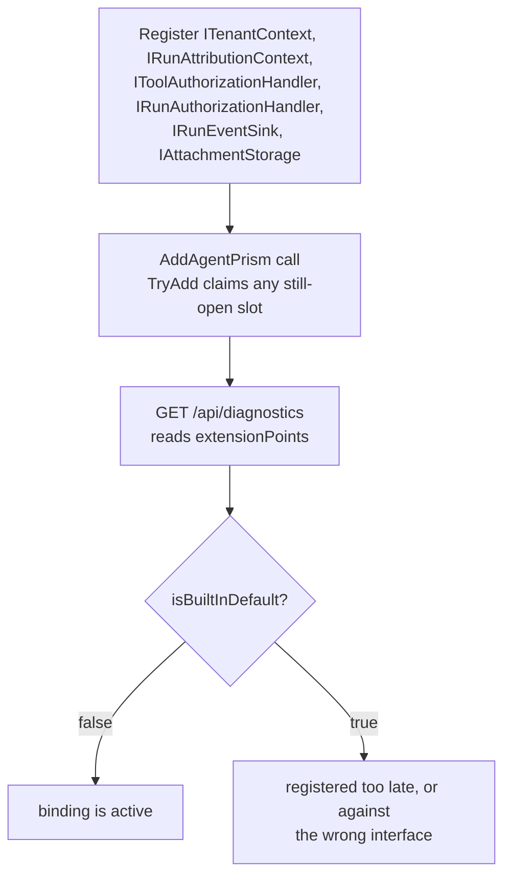

`AddAgentPrism()` plus `MapAgentPrism()` is a complete, working setup on its own —
that two-line promise is what [Your first agent](/getting-started/first-agent/)
shows. Embedding AgentPrism into an application that already has its own tenants,
users, permissions, event bus, or object storage is a different job: it means
replacing six built-in defaults with bindings into systems you already run. All
six are wired the same way, are all optional, and can be added one at a time.

## The six points

| Contract | What you give it | Built-in default when unbound |
|---|---|---|
| `ITenantContext`, `ITenantStore` | The current tenant, resolved from your own identity layer | A single fixed tenant |
| `IRunAttributionContext` | The current user and job labels a run belongs to | `UserId` and `Labels` are always `null` |
| `IToolAuthorizationHandler` | A decision for every tool call: allowed or denied | Every call is allowed |
| `IRunAuthorizationHandler` | A decision for every run start and session access: allowed or denied | Every run starts and every session is reachable |
| `IRunEventSink` | A bridge that receives every run event as it is written | No bridge; events reach only `IRunStore` |
| `IAttachmentStorage` | A place to write attachment bytes outside the database | Content is stored as `bytea` in the database |

Each interface is registered with `TryAdd`, so a registration made **before**
`AddAgentPrism()` wins over the built-in default; a registration made after it is
silently ignored. `GET /api/diagnostics` (once you turn it on) reports which of the
six are still built-in and which your application replaced — see
[Extension points](#extension-points-in-diagnostics) below.

```csharp
var builder = WebApplication.CreateBuilder(args);

builder.Services.AddSingleton<ITenantContext, YourTenantContext>();
builder.Services.AddSingleton<ITenantStore, YourTenantStore>();
builder.Services.AddSingleton<IRunAttributionContext, YourRunAttributionContext>();
builder.Services.AddSingleton<IToolAuthorizationHandler, YourToolAuthorizationHandler>();
builder.Services.AddSingleton<IRunAuthorizationHandler, YourRunAuthorizationHandler>();
builder.Services.AddSingleton<IRunEventSink, YourRunEventSink>();
builder.Services.AddSingleton<IAttachmentStorage, YourAttachmentStorage>();

var agentPrism = builder.AddAgentPrism()
    .UseOpenAI(builder.Configuration.GetSection(OpenAIProviderOptions.SectionName))
    .UsePostgreSql(builder.Configuration.GetSection(AgentPrismPostgreSqlOptions.SectionName));
```

The order above — bindings first, `AddAgentPrism()` second — is the only order that
works. `AddAgentPrism()` calls `TryAdd*` for all six; called first, it claims every
slot and your registrations that follow do nothing.

### 1 — Tenant resolution

```csharp
public sealed class YourTenantContext(IYourIdentityService identity) : ITenantContext
{
    public string TenantId => identity.CurrentTenantId;
}
```

`YourTenantContext` replaces the built-in resolver entirely — the claim/header
resolution chain [Governance](/concepts/governance/#multi-tenancy) describes only
applies when you leave the default in place and turn it on with `UseTenancy()`.
Bind your own `ITenantContext` instead when the tenant already lives in a service,
a claim shape, or a header your identity layer owns. Bind `ITenantStore` alongside
it only if you also want AgentPrism's tenant admin endpoints
(`/api/tenants`) to read and write your own tenant records instead of its
in-memory default.

For work that runs outside an HTTP request — a queued job, a scheduled task — no
`HttpContext` exists for `ITenantContext` to read. Open an ambient scope for the
duration of that work instead. It composes with
[`AmbientRunAttributionScope`](/concepts/runs/#who-ran-it-and-for-what) — a
background job binds both together, since neither has a request to read from:

```csharp
using (AmbientTenantScope.Begin(job.TenantId))
using (AmbientRunAttributionScope.Begin(job.RequestedByUserId, labels: null))
{
    await agent.RunAsync(job.Message);
}
```

🚨 Open the scope inside the method that starts the run, in that method's own
body — not in a helper it calls — and reopen it before every `MoveNextAsync` on a
streaming path. `AmbientTenantScope` is an `AsyncLocal<T>`; a value set upstream of
an `await` boundary does not flow back down through one opened later. A dropped
scope reads as "empty tenant", not as an exception, so it fails silently.

### 2 — Run attribution

Attributes a run to a user and, optionally, job labels — see
[Runs: who ran it and for what](/concepts/runs/#who-ran-it-and-for-what) for the
full contract, including why the value is never read from the run request body.

### 3 — Tool authorization

Decides whether a caller may invoke a specific tool at all, separately from
approval — see [Tools](/concepts/tools/#authorization-validation-and-timeout) for the binding
pattern and how authorization and approval order relative to each other.

### 4 — Run event bridge

Bridges every run event to your own queue or bus, in addition to the run store —
see [Runs: observing events beyond the store](/concepts/runs/#observing-events-beyond-the-store)
and [Troubleshooting a slow sink](/guides/observability/#troubleshooting) for the
full contract.

**The one rule that matters most:** `OnEventAsync` must queue the event and
return. AgentPrism awaits it directly on the run's own hot path, before the
response keeps streaming to its caller — a sink that does its own network I/O
inline ties the model's response speed to that network call's latency.

AgentPrism holds **no queue of its own** in front of your sink, so the buffer is
yours to own: write to a bounded channel and return. Size that channel to drop
the event and log it when it is full rather than block, so a slow consumer of
yours never slows the run down to match its queue depth.

### 5 — Attachment storage

```csharp
public sealed class YourAttachmentStorage(IYourBlobClient blobs) : IAttachmentStorage
{
    public async ValueTask<Uri> WriteAsync(
        string tenantId, Guid id, Stream content, string mediaType, CancellationToken cancellationToken = default)
        => await blobs.PutAsync($"{tenantId}/{id}", content, mediaType, cancellationToken);

    public ValueTask<Stream?> ReadAsync(Uri uri, CancellationToken cancellationToken = default)
        => blobs.OpenReadAsync(uri, cancellationToken);

    public ValueTask DeleteAsync(Uri uri, CancellationToken cancellationToken = default)
        => blobs.DeleteAsync(uri, cancellationToken);
}
```

`IAttachmentStore` keeps the metadata row either way; `IAttachmentStorage` only
decides where the bytes live. AgentPrism takes no dependency on any cloud SDK —
you write this class against whichever client your object store already uses.

### 6 — Run and session authorization

AgentPrism draws ownership at the **tenant** level; it never learns which user
inside a tenant a run or a session belongs to. Without this binding, every
caller with the `Operator` role in a tenant can start a run as, read, and
delete every other user's session in the same tenant.

```csharp
public sealed class YourRunAuthorizationHandler(IYourOwnershipService ownership) : IRunAuthorizationHandler
{
    public async ValueTask<RunAuthorizationResult> AuthorizeRunAsync(
        RunAuthorizationRequest request, CancellationToken cancellationToken = default)
        => await ownership.CanStartAsync(request.TenantId, request.UserId, request.AgentName, cancellationToken)
            ? RunAuthorizationResult.Allow()
            : RunAuthorizationResult.Deny("This user cannot run this agent.");

    public async ValueTask<RunAuthorizationResult> AuthorizeSessionAsync(
        SessionAuthorizationRequest request, CancellationToken cancellationToken = default)
    {
        // request.SessionId is null only for SessionAccess.List, which has no
        // single session identity to check ownership of.
        if (request.Access == SessionAccess.List)
        {
            return RunAuthorizationResult.Allow();
        }

        return await ownership.OwnsAsync(request.TenantId, request.UserId, request.SessionId!, cancellationToken)
            ? RunAuthorizationResult.Allow()
            : RunAuthorizationResult.Deny("This session belongs to a different user.");
    }
}
```

Both methods are called explicitly at every endpoint that starts a run (the
agent run endpoint, the workflow run endpoint, the inbound trigger accept
endpoint, and the OpenAI-compatible `/v1/responses` endpoint — there is no
single filter all four share, so each one calls this binding in its own
body) and at every endpoint that touches a session (list, read, delete,
branch). A denied session **read**, **delete**, or **branch** returns `404`,
identical to a session that does not exist — a `403` there would confirm the
session's existence to a caller who should not even know it. A denied
**list** returns `403` instead: a list is an operation, not a single
resource, so there is no existence to leak, and the response is never
silently filtered — filtering there would break the `skip`/`take` paging
contract. If this handler throws, the call is denied (fail-closed); a gate
that fails open on an exception is not a gate.

## Reading identity inside a tool body

A tool cannot reach `AgentSession`, so it cannot read `ITenantContext` or
`IRunAttributionContext` through the normal request pipeline. It reads the same
values from `AgentPrismRunContext.Current` instead — a static, `AsyncLocal`-backed
snapshot the run pipeline populates before every tool call:

```csharp
[AgentPrismTool("current_account", "Returns the tenant, run, session, and caller identity of the current run.")]
public static string CurrentAccount()
{
    var scope = AgentPrismRunContext.Current;

    return scope is null
        ? "no run in progress"
        : $"tenant={scope.TenantId} run={scope.RunId} session={scope.SessionId} user={scope.UserId}";
}
```

This is the only place a tool can read the run's identity — there is no parameter
AgentPrism injects for it. `scope.UserId` is the same value `IRunAttributionContext`
resolved for the run record, not a new concept — just a second place to read it
from. `AgentRunScope` also carries `RootRunId` (the top of an
agent-calls-agent tree) and `Budget` (the shared token/depth/count ceiling for that
tree).

## Two data planes, one connection pool or two

Your application's own schema and AgentPrism's tables can live in the same
PostgreSQL database. AgentPrism writes only inside its own schema (`SchemaName`,
default `agentprism`; see
[Choose a migration strategy](/guides/production/#choose-a-migration-strategy)) and
never reads or writes yours.

**Giving both sides the same connection string does not share a pool.** Npgsql
pools a `NpgsqlDataSource` **instance**, not a connection string — two separate
`NpgsqlDataSource` objects built from an identical string open two separate
pools (measured: with 5 concurrent commands held open on each of two data
sources built from the same string, the server showed 10 simultaneous
backends, not 5). If your application uses Entity Framework Core (or any other
Npgsql consumer) and you want AgentPrism sharing its actual pool, build **one**
`NpgsqlDataSource` and give the same instance to both sides:

```csharp
var dataSource = new NpgsqlDataSourceBuilder(connectionString).Build();
builder.Services.AddDbContext<YourDbContext>(o => o.UseNpgsql(dataSource));
builder.AddAgentPrism()
       .UsePostgreSql(o => o.DataSource = dataSource);
```

See [Two connection planes: EF Core and AgentPrism](/guides/ef-core/) for the
full pattern, including startup/shutdown ownership. Without a shared
`DataSource`, pointing `AgentPrism:PostgreSql:ConnectionString` at the same
string your application uses is still fine — the two sides simply keep
independent pools against the same database, exactly as if they pointed at two
different databases.

Give AgentPrism a **separate** connection string (or data source) — same
server, different database, or a fully different server — when you want its
connection ceiling, credentials, or failure blast radius kept independent of
your application's own database traffic. Nothing in AgentPrism requires this;
it is purely an operational choice, and it can be changed later since only the
connection string moves.

`AutoApplyMigrations` (default `true`) applies to AgentPrism's own schema only. In
an embedded setup where your application already owns a controlled migration step
for its own schema, set it to `false` and call the registered
`MigrationRunner.ApplyAsync()` from that same step — AgentPrism's schema then
migrates alongside yours instead of at every instance's startup. See
[Choose a migration strategy](/guides/production/#choose-a-migration-strategy) for
the fleet-deployment version of this same setting.

## Extension points in diagnostics

`GET /api/diagnostics` (off by default; turn it on with
`AgentPrismEndpointOptions.EnableDiagnosticsEndpoint`) reports an `extensionPoints`
array: one entry per contract above, naming the bound implementation's type and
whether it is still AgentPrism's built-in default.



```json
{
  "extensionPoints": [
    { "contract": "ITenantContext", "implementation": "YourTenantContext", "isBuiltInDefault": false },
    { "contract": "IRunAttributionContext", "implementation": "DefaultRunAttributionContext", "isBuiltInDefault": true }
  ]
}
```

A fresh installation shows all six as built-in. Read this endpoint right after
adding a binding to confirm it actually took — `isBuiltInDefault: true` on a
contract you meant to replace means the registration ran too late, or against the
wrong interface.

## Verification checklist

- [ ] Every binding you need is registered **before** `AddAgentPrism()`
- [ ] `GET /api/diagnostics` shows `isBuiltInDefault: false` for each contract you bound
- [ ] A background job opens `AmbientTenantScope.Begin(tenantId)` in the method that starts the run, and the scope covers every `await` on that path
- [ ] `IRunEventSink.OnEventAsync` never performs blocking I/O inline — it queues and returns
- [ ] `AgentPrism:PostgreSql:SchemaName` (or the equivalent SQL Server/SQLite setting) does not collide with a schema your own application already owns
- [ ] `AutoApplyMigrations` matches your deployment's migration strategy, not just the default

## Read next

- [Runs](/concepts/runs/) — attribution and the event sink in full
- [Governance](/concepts/governance/) — the built-in tenant resolution chain `ITenantContext` replaces
- [Production](/guides/production/) — migration strategy and process topology
