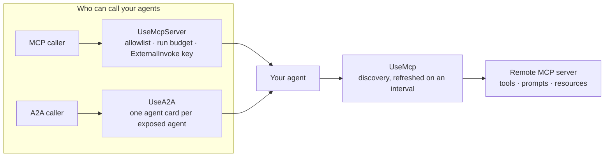

Tracon supports three different external-agent directions. Keep them separate:

| Direction | Purpose | Registration | HTTP surface |
|---|---|---|---|
| MCP client | Bring remote tools, prompts, and resources into Tracon | `UseMcp()` | Managed through `/api/mcp-servers/*` |
| MCP server | Publish an Tracon agent as an MCP tool | `UseMcpServer()` | `/tracon/mcp` by default |
| A2A server | Publish an agent through the agent-to-agent protocol | `UseA2A()` | `/tracon/a2a/{agent}` by default |



The first direction expands what your agents can call. The other two expand who can
call your agents. They have different trust boundaries and must be enabled separately.

## Consume a remote MCP server

Add the non-AOT `Tracon.Mcp` package and register discovery:

```csharp
var tracon = builder.AddTracon()
    .UseOpenAI(builder.Configuration.GetSection(OpenAIProviderOptions.SectionName))
    .UsePostgreSql(connectionString)
    .UseMcp(options =>
    {
        options.RefreshInterval = TimeSpan.FromMinutes(5);
        options.ConnectionTimeout = TimeSpan.FromSeconds(30);
        options.MaxToolsPerServer = 100;
    });
```

Create server records through the console or management API. Only the configuration
key name is persisted; the credential value stays in your secret provider:

```json
{
  "endpoint": "https://mcp.example.com/mcp",
  "authorizationConfigurationKey": "Tracon:Mcp:ExampleToken"
}
```

```bash
dotnet user-secrets set "Tracon:Mcp:ExampleToken" "Bearer ..."
```

Discovery is asynchronous and does not block startup. Refresh immediately after a
configuration change with `POST {prefix}/api/mcp-servers/refresh`. An unreachable
server loses its discovered tools and produces a warning; other servers continue.

### The MCP client security boundary

- Only HTTP and HTTPS transports are accepted. Tracon does not start MCP `stdio`
  processes on the host.
- Discovered tool names are `{server}_{tool}`. A code-defined tool with the same name
  wins, so a remote server cannot replace it.
- New MCP tools require approval by default.
- Discovery is tenant-scoped and limited to 100 tools per server by default.
- OAuth tokens live in memory. Plan for reauthorization after a process restart.

An agent can also receive static MCP resources at run start through
`AgentDefinition.McpResourceUris`. Each entry is `{server}:{uri}`. The limits are
64 KB per resource and 256 KB total. `UseMcp()` is required. This field is currently
code/HTTP-only; the console editor does not preserve it.

## Publish agents as MCP tools

Choose the allowlist before the application is built, then map the management API
before the MCP endpoint:

```csharp
var tracon = builder.AddTracon()
    .UseOpenAI(builder.Configuration.GetSection(OpenAIProviderOptions.SectionName))
    .UsePostgreSql(connectionString)
    .UseMcpServer(options =>
    {
        options.ExposedAgents.Add("support");
        options.ToolNamePrefix = "acme";
        options.Budget = new AgentRunBudget
        {
            MaxDepth = 1,
            MaxTotalRuns = 4,
            MaxTotalTokens = 40_000,
        };
    });

var app = builder.Build();

app.MapTracon("/tracon", options =>
{
    options.AllowRemoteAccess = true;
    options.RequireRolePolicies = true;
});
app.MapTraconMcpServer();
```

No agent is exposed by default. `ExposeAllAgents` exists, but an allowlist is safer
for a catalog that operators can edit. Each MCP call creates a fresh run budget; the
default maximum depth is one, so an external caller cannot open an unbounded agent
tree.

The endpoint inherits the loopback, bearer, and authorization settings from
`MapTracon`. Remote exposure also requires at least one active, unexpired API key
with the exact `ExternalInvoke` scope. A static bearer token alone is rejected at
startup. Create the key before enabling remote access.

An exposed agent cannot contain an approval-required tool. The application waits
until the catalog is queryable, checks the selected agents, and prevents MCP requests
from running if an approval boundary would be crossed. An external protocol caller
cannot act as the missing human.

### Long-running calls as MCP tasks

By default, a `tools/call` for a published agent holds the connection open until the
agent finishes. Set `EnableTasks` to serve long-running calls as MCP tasks instead: a
task-aware client gets an immediate task id back, closes the connection, and polls
`tasks/get` for the result — useful when an agent's response can take longer than a
client is willing to keep a connection open.

```csharp
.UseMcpServer(options =>
{
    options.ExposedAgents.Add("support");
    options.EnableTasks = true;
    options.TaskTimeToLive = TimeSpan.FromHours(2);
    options.TaskPollInterval = TimeSpan.FromSeconds(5);
});
```

`EnableTasks` is `false` by default: a client that never asks for the tasks
capability keeps getting today's immediate response either way. The task id is the
same id the run itself uses, so a task also shows up as an ordinary run in the
management API and cost reports. An agent that ends up needing approval never
surfaces as a task waiting on input — it is reported as a completed task carrying
the same rejection message the synchronous path returns, for the same reason an
approval-required tool cannot be exposed in the first place: an external protocol
caller cannot act as the missing human.

## Publish agents through A2A

A2A exposes a distinct identity and agent card for each selected agent:

```csharp
var tracon = builder.AddTracon()
    .UseOpenAI(builder.Configuration.GetSection(OpenAIProviderOptions.SectionName))
    .UsePostgreSql(connectionString)
    .UseA2A(options =>
    {
        options.ExposedAgents.Add("support");
        options.Budget = new AgentRunBudget
        {
            MaxDepth = 1,
            MaxTotalTokens = 40_000,
        };
    });

var app = builder.Build();

app.MapTracon("/tracon", options =>
{
    options.AllowRemoteAccess = true;
    options.RequireRolePolicies = true;
});
app.MapTraconA2A();
```

The invocation URL is `/tracon/a2a/support`; its card is under
`/tracon/a2a/support/.well-known/agent-card.json`.

A2A names are frozen during service registration because the underlying hosting API
registers one server per name. The agent implementation is still resolved from the
catalog on every call, so updating a database definition changes later behavior, but
adding a new name requires an application restart and registration change. There is
no expose-all switch.

Tracon declares streaming, push notifications, and background A2A runs as
unsupported. The same `ExternalInvoke`, approval, tenant, and budget boundaries as
the MCP server apply.

Both surfaces are configured in code, never from the console:
`TraconMcpServerOptions` for the MCP server and `TraconA2AOptions` for A2A.
They do not carry the same settings.

`ExposeAllAgents` and `ToolNamePrefix` are **MCP-server settings only**:
`ExposeAllAgents` opts out of naming published agents one by one, and
`ToolNamePrefix` keeps the published tool names from colliding with another
server's. A2A has neither — its names are fixed at registration, which is why
there is no expose-all switch for it.

`Budget`, which bounds what an external caller may spend, is on both.

## Production checklist

- [ ] Expose only names whose input contract is safe for another system.
- [ ] Create a tenant-bound `ExternalInvoke` key and test revocation and expiry.
- [ ] Keep approval-required and high-impact tools out of exposed definitions.
- [ ] Set token, depth, and child-run budgets for externally initiated work.
- [ ] Terminate HTTPS at a trusted proxy and preserve the request path.
- [ ] Alert on external run error rate, token use, latency, and rejected credentials.
- [ ] Test catalog availability when migrations are applied outside the process.

MCP server and A2A routes are protocol surfaces, not management endpoints. They do
not appear in the generated OpenAPI operation count. Their runs still use the normal
recording, tenancy, trace, cost, quota, and audit infrastructure.

## Read next

- [Tools, skills, and MCP](/concepts/tools/) — the other direction: consuming an MCP server rather than publishing one
- [Securing the endpoints](/getting-started/security/) — an exposed agent is a public surface, and its budget is the only limit
- [Compatibility matrices](/reference/compatibility/) — which protocol revisions and transports are supported
