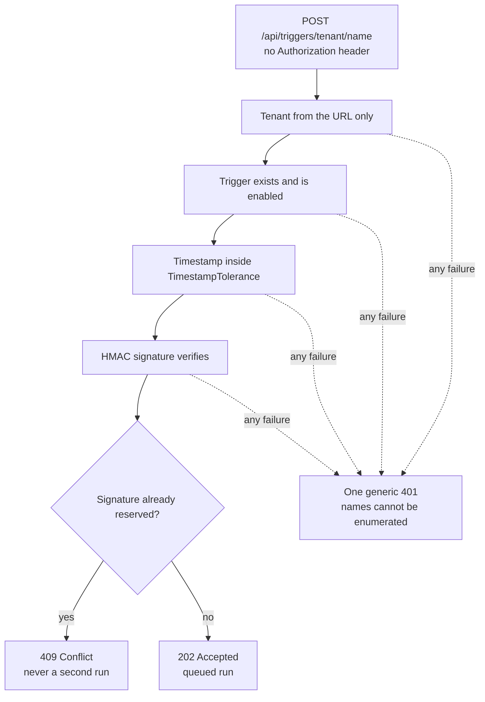

An inbound trigger is the reverse of an [outbound webhook](/concepts/governance/#webhooks):
instead of Tracon notifying another system, another system starts a run in
Tracon. A Slack slash command, a support-desk ticket event, or a queue
consumer can all become the start of an agent or workflow run without holding
a Tracon API key.

The accept endpoint is always queued and always returns `202 Accepted` — there
is no synchronous mode. A caller that needs the model's answer inline should
use the normal run endpoint instead; see
[Jobs, schedules, and queues](/guides/background-work/) for how
queued runs execute.



## Define a trigger

```bash
dotnet user-secrets set "Tracon:TriggerSecrets:Slack" "whsec_..." \
  --project samples/Tracon.Api
```

```bash
curl -sS -X PUT \
  https://agents.example.com/tracon/api/triggers/slack \
  -H "Authorization: Bearer $TRACON_API_KEY" \
  -H 'Content-Type: application/json' \
  -d '{
    "targetKind": "agent",
    "targetName": "support",
    "signingSecretConfigurationName": "Tracon:TriggerSecrets:Slack",
    "payloadMode": "path",
    "payloadPath": "event.text"
  }'
```

`signingSecretConfigurationName` carries only the configuration **key's
name** — never the secret value. Tracon reads the value from
`IConfiguration` at request time, the same rule tenant provider bindings and
MCP server credentials follow. The name must be under
`TraconInboundTriggerOptions.AllowedConfigurationPrefix`, which defaults
to `Tracon:TriggerSecrets:`.

`targetKind` is `agent` or `workflow`. `payloadMode` controls how the request
body becomes the run's message:

| Mode | Behavior |
|---|---|
| `wholeBody` (default) | The whole request body becomes the message, as JSON text |
| `path` | A single field, selected by a dotted `payloadPath` (for example `event.text`), becomes the message |

There is no template language here — the same rule that keeps tool
approval conditions free of expression evaluation. A consumer that needs to
reshape the payload does so before it reaches Tracon.

## Send a signed event

```bash
curl -sS -i -X POST \
  https://agents.example.com/tracon/api/triggers/default/slack \
  -H 'Content-Type: application/json' \
  -H "X-Tracon-Timestamp: $(date +%s)" \
  -H "X-Tracon-Signature: sha256=$SIGNATURE" \
  -d '{"event":{"text":"Reset my password"}}'
```

The signature is the same HMAC-SHA256 contract
[outbound webhooks](/concepts/governance/#webhooks) use, in the reverse
direction — sign `{unixTimestamp}.{rawBody}` with the trigger's secret:

```csharp
var signature = WebhookSigner.Sign(rawBody, DateTimeOffset.UtcNow, secret);
```

A valid request returns `202 Accepted` with a `Location` header, exactly like
a queued agent run. For an agent target, the response also carries `runId`;
poll `GET /api/runs/{runId}` for the outcome. For a workflow target, `runId`
is `null` until the queued job runs — poll `GET /api/jobs/{jobId}` instead.

```json
{
  "runId": "01a01890-1652-7183-9d50-6efd430644a3",
  "jobId": "01a01890-1652-7183-9d50-6efd430644a3",
  "location": "/tracon/api/runs/01a01890-1652-7183-9d50-6efd430644a3",
  "eventsLocation": "/tracon/api/runs/01a01890-1652-7183-9d50-6efd430644a3/events"
}
```

## No bearer token, by design

The accept endpoint (`POST /api/triggers/{tenantId}/{name}`) carries no
`Authorization` requirement — an external system cannot present a Tracon
API key or the static `AuthToken`. Its entire authentication story is the
HMAC signature: a request without a valid, in-window signature never reaches
the queue.

- The tenant comes from the URL, not from an ambient header or claim; a
  segment that does not match a saved trigger never falls back to a default
  tenant.
- An unknown tenant, an unknown or disabled trigger name, and every
  signature/timestamp failure all return the **same** generic `401` body.
  A caller without a valid secret cannot enumerate trigger names, or even
  learn that a tenant exists, by comparing responses.
- The timestamp must fall within `TimestampTolerance` (default five minutes)
  of the server's clock. This is the first line of defense against a
  captured request being replayed.
- The signature itself is also the replay key: Tracon reserves it in the
  idempotency store on the first accepted request, so an identical replay —
  even inside the timestamp window — gets `409 Conflict`, never a second run.

Every trigger definition write (`PUT`/`DELETE`) enters the audit trail
**before** the mutation is applied — the same rule the approval-decision
endpoint follows: a write that cannot be audited is not applied.

## Limits

| Setting | Default | Effect |
|---|---:|---|
| `TimestampTolerance` | 5 minutes | Requests outside this window are rejected (`401`) regardless of signature validity |
| `MaxBodyBytes` | 256 KB | A larger body is rejected (`413`) before it is fully read |
| `MaxRequestsPerMinute` | 60 | Per trigger, per process (`429` beyond the limit) |
| `AllowedConfigurationPrefix` | `Tracon:TriggerSecrets:` | The only prefix a signing secret's configuration key name may start with |

```json
{
  "Tracon": {
    "InboundTriggers": {
      "TimestampTolerance": "00:05:00",
      "MaxBodyBytes": 262144,
      "MaxRequestsPerMinute": 60,
      "AllowedConfigurationPrefix": "Tracon:TriggerSecrets:"
    }
  }
}
```

:::caution[The rate limit is per process]
Like Tracon's general rate limiter, the trigger limit lives in process
memory — there is no distributed counter. In a multi-instance deployment the
limit applies per instance, not per trigger across the whole deployment.
:::

## Manage triggers

| Operation | Endpoint |
|---|---|
| List a tenant's triggers | `GET /api/triggers` |
| Read, replace, or delete one trigger | `GET`, `PUT`, or `DELETE /api/triggers/{name}` |
| Accept an event (no bearer token) | `POST /api/triggers/{tenantId}/{name}` |

The management console's **Triggers** screen covers the same list-and-edit
flow; the editor shows the exact accept URL to paste into the external
system's webhook configuration.

## Troubleshooting

| Symptom | Check |
|---|---|
| Every request returns `401` | Confirm the tenant segment and trigger name are both correct and the trigger is enabled — a missing trigger, a disabled trigger, and a wrong signature are all reported as this SAME response; confirm the secret's configuration key actually has a value (`dotnet user-secrets list`); confirm the signed string is exactly `{unixTimestamp}.{rawBody}` with no re-serialization in between |
| A retried request returns `409` | This is by design — the signature is the replay key. A genuine retry from the external system carries a fresh timestamp and therefore a fresh signature |
| The request returns `400` with a payload-path detail | `payloadMode` is `path` and the field named by `payloadPath` was not found in this request's body |
| The trigger stopped accepting requests after a burst | `MaxRequestsPerMinute` was exceeded; the caller should back off and retry, honoring the response |

## Read next

- [Jobs, schedules, and queues](/guides/background-work/) — how a queued run actually executes
- [Runs and recording](/concepts/runs/) — the four ways a run starts
- [Security](/getting-started/security/) — bind endpoint authorization and tenant resolution to your host.
