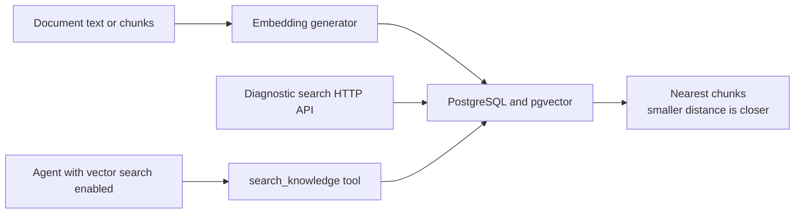

AgentPrism knowledge is retrieval, not hidden prompt injection. Operators ingest
documents into a named collection. An agent gets a code-defined
`search_knowledge` tool for one collection and asks for relevant chunks when needed.

## Mental model: administration and retrieval are separate



The HTTP API owns ingestion, listing, deletion, and diagnostic search. The agent does
not manage the knowledge base. It receives only the search tool.

## Register the two required dependencies

Knowledge becomes functional only when both dependencies exist:

1. An `IVectorSearchStore`. The built-in implementation comes from
   `UsePostgreSql()`.
2. An `IEmbeddingGenerator<string, Embedding<float>>`. The host chooses and
   registers it.

The sample below uses the OpenAI embedding adapter already used by the repository
sample host:

```csharp title="Program.cs"
using AgentPrism;
using Microsoft.Extensions.AI;
using OpenAI;

var openAiKey = builder.Configuration["AgentPrism:Providers:OpenAI:ApiKey"]
    ?? throw new InvalidOperationException("The OpenAI API key is missing.");

var agentPrism = builder.AddAgentPrism()
    .UsePostgreSql(builder.Configuration.GetSection(
        AgentPrismPostgreSqlOptions.SectionName))
    .UseOpenAI(builder.Configuration.GetSection(
        OpenAIProviderOptions.SectionName));

builder.Services.Configure<AgentPrismKnowledgeOptions>(options =>
{
    options.Dimensions = 1_536;
    options.ChunkSize = 1_000;
    options.ChunkOverlap = 100;
    options.MaxResults = 5;
});

builder.Services.AddSingleton<IEmbeddingGenerator<string, Embedding<float>>>(
    new OpenAIClient(openAiKey)
        .GetEmbeddingClient("text-embedding-3-small")
        .AsIEmbeddingGenerator());
```

The embedding model in this example produces 1,536 dimensions. If you choose another
model, set `Dimensions` to its actual output size **before migration 0024 runs**.

:::caution[Dimensions are schema, not a live tuning knob]
PostgreSQL creates `document_embeddings.embedding` as `vector({dimension})`. Changing
`AgentPrismKnowledgeOptions.Dimensions` after migration 0024 has run does not alter
the existing column. Plan a new database migration and re-embed every document.
:::

The PostgreSQL migration runs `CREATE EXTENSION IF NOT EXISTS vector`, creates the
`document_embeddings` table, and adds an HNSW cosine-distance index. The database
role that applies migrations must be allowed to create the `vector` extension, or an
operator must install it first.

## Give an agent access to one collection

```csharp
agentPrism.AddAgent(new AgentDefinition
{
    Name = "support",
    Instructions =
        "Use knowledge search before answering policy questions. Cite the source id.",
    Model = new ModelBinding
    {
        Provider = OpenAIProviderNames.ChatCompletions,
        Model = "your-current-model-name",
    },
    Memory = new MemorySettings
    {
        EnableVectorSearch = true,
        VectorCollection = "support-policies",
    },
});
```

The compiler adds `search_knowledge` automatically. Do not add it to `ToolNames`.
When `VectorCollection` is empty, the agent name is used. The tool returns at most
`AgentPrismKnowledgeOptions.MaxResults` chunks.

The console does not currently provide a knowledge-management screen or vector-memory
fields in the agent editor. Use the knowledge HTTP API for ingestion and calibration,
and use code or the agent management API to enable vector search.

This feature is separate from session history, file memory, and MAF's
`ChatHistoryMemoryProvider`. See
[Context and memory](/AgentPrism/guides/context-and-memory/).

## Ingest raw text

The server accepts either `text` or `chunks`, never both and never neither. Raw text
is split and embedded on the server:

```bash
curl -sS -X POST \
  http://localhost:5081/agentprism/api/knowledge/support-policies/documents \
  -H "Authorization: Bearer $AGENTPRISM_TOKEN" \
  -H 'Content-Type: application/json' \
  -d '{
    "sourceId": "refund-policy-v3",
    "text": "Refunds are available within 30 days when the order is unused..."
  }'
```

The response contains `sourceId` and `chunkCount`. Uploading the same `sourceId`
again replaces all old chunks in one PostgreSQL transaction.

For a pre-chunked pipeline, send `chunks`:

```json
{
  "sourceId": "refund-policy-v3",
  "chunks": [
    {
      "index": 0,
      "content": "Refunds are available within 30 days.",
      "metadata": { "section": "eligibility" }
    }
  ]
}
```

When a chunk has no `embedding`, the server embeds its `content`. When an embedding
is supplied, AgentPrism writes it as-is after checking its length against the store
dimension.

## Calibrate retrieval before blaming the prompt

The diagnostic search endpoint performs the same embedding and vector lookup used by
the agent tool:

```bash
curl -sS -X POST \
  http://localhost:5081/agentprism/api/knowledge/support-policies/search \
  -H "Authorization: Bearer $AGENTPRISM_TOKEN" \
  -H 'Content-Type: application/json' \
  -d '{"query":"Can an unused order be returned after two weeks?","top":3}'
```

Each hit contains `sourceId`, `chunkIndex`, `content`, `distance`, and optional
metadata. Results are ordered by ascending cosine distance. Smaller is closer.

If the right chunk is absent here, the agent never received it. Fix ingestion,
chunking, the embedding model, or collection routing before changing the prompt.
Every diagnostic search and every tool query makes an embedding call, so it has the
latency and cost of that provider call.

## Manage sources

```bash
# Source ids only. An unknown collection returns an empty array.
curl -H "Authorization: Bearer $AGENTPRISM_TOKEN" \
  http://localhost:5081/agentprism/api/knowledge/support-policies/documents

# Deletes all chunks of the source. Repeating it still returns 204.
curl -X DELETE -H "Authorization: Bearer $AGENTPRISM_TOKEN" \
  http://localhost:5081/agentprism/api/knowledge/support-policies/documents/refund-policy-v3
```

Deletion is immediate. Restoring a source requires another upload and another round
of embedding calls.

## Defaults and limits

| Setting or rule | Default or behavior |
|---|---|
| `Dimensions` | 1536 |
| `ChunkSize` | 1000 characters |
| `ChunkOverlap` | 100 characters |
| `MaxResults` | 5 |
| Chunking bounds | `ChunkSize > 0` and `0 <= ChunkOverlap < ChunkSize` |
| Raw text chunking | Character-based, then every chunk is embedded |
| Collection name | Letters, digits, underscores, and hyphens only |
| Source replacement | Same `sourceId` replaces all chunks in that collection |
| Distance | Cosine distance; smaller is closer |
| Tenant boundary | Every write and search is scoped to the current tenant |
| Built-in vector store | PostgreSQL only |

The HTTP search request can set `top`. Use a positive value; this endpoint does not
apply the `1..200` clamp used by paged list endpoints. The agent tool always uses
`MaxResults`. The HTTP contract does not expose a distance threshold; use returned
distances to calibrate relevance in your own ingestion and evaluation process.

A SQL Server or SQLite host can provide a custom `IVectorSearchStore`. Without a
store and an embedding generator, every knowledge endpoint returns `501`. An agent
with `EnableVectorSearch = true` fails compilation instead of receiving an empty tool.

## Production checklist

- Use the same embedding model and dimensions for document and query embeddings.
- Treat an embedding-model change as a data migration. Re-embed the full collection.
- Tune character chunk size and overlap against real documents and retrieval evals.
- Use stable, URL-safe source ids. Re-upload is replacement, not an appended version.
- Separate collections when access or retrieval domains differ. Tenant scoping is
  automatic, but collection design is yours.
- Keep raw source documents outside AgentPrism if you need document version history.
  The knowledge table stores chunks and embeddings, not an immutable source archive.

## Troubleshooting

**Knowledge endpoints return `501`.** Register both `UsePostgreSql()` and an
`IEmbeddingGenerator<string, Embedding<float>>`. One without the other is not enough.

**PostgreSQL startup fails around `vector`.** Install the pgvector extension, or let a
database role with extension permission apply migration 0024.

**Upload says the embedding length is wrong.** The generator output and the migrated
column dimension differ. Do not change only the option. Migrate the schema and
re-embed the collection.

**The agent compiles without `search_knowledge` in `ToolNames`.** This is expected.
`EnableVectorSearch` adds the code-defined tool during compilation.

**Search returns irrelevant chunks.** Run the diagnostic endpoint. Check collection,
source content, chunk boundaries, embedding consistency, and distance distribution.
Prompt changes cannot recover a chunk that retrieval did not return.

**A collection name returns `400`.** Use only letters, digits, underscores, and
hyphens. Spaces, slashes, and other punctuation are rejected.

**Deleting and re-uploading is expensive.** Both replacement and restoration require
fresh embeddings. Avoid unstable source ids that cause unnecessary full replacement.

## Related

- [Context and memory](/AgentPrism/guides/context-and-memory/)
- [Persistence](/AgentPrism/getting-started/persistence/)
- [Knowledge HTTP API](/AgentPrism/http-api/knowledge/)
- [`AgentPrismKnowledgeOptions` API](/AgentPrism/api/agentprism.agentprismknowledgeoptions/)
- [`MemorySettings` API](/AgentPrism/api/agentprism.memorysettings/)
- [`IVectorSearchStore` API](/AgentPrism/api/agentprism.ivectorsearchstore/)
- [`UploadDocumentRequest` API](/AgentPrism/api/agentprism.uploaddocumentrequest/)
- [`SearchKnowledgeRequest` API](/AgentPrism/api/agentprism.searchknowledgerequest/)
- [`UsePostgreSql` API](/AgentPrism/api/agentprism.agentprismpostgresqlbuilderextensions/)
