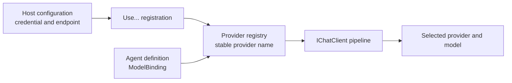

A provider registration opens a model route in the host. An agent definition selects
that route by name. The definition never contains the credential.

## Mental model: register once, select per agent



This separation has two useful effects. You can register several providers in one
process. You can also move an agent to another provider without moving a secret into
the database or the console.

| Package | Registration | Provider name in `ModelBinding` | Surface |
|---|---|---|---|
| `AgentPrism.OpenAI` | `UseOpenAI()` | `openai` | OpenAI Chat Completions |
| `AgentPrism.OpenAI` | `UseOpenAI()` | `openai-responses` | OpenAI Responses |
| `AgentPrism.OpenAI` | `UseOpenAICompatible(name, …)` | your `name` | Compatible Chat Completions |
| `AgentPrism.Anthropic` | `UseAnthropic()` | `anthropic` | Anthropic Messages |
| `AgentPrism.Google` | `UseGoogle()` | `google` | Gemini Developer API |
| `AgentPrism.Azure` | `UseAzureOpenAI()` | `azure-openai` | Azure OpenAI Chat Completions |

The `AgentPrism` meta package includes `AgentPrism.OpenAI`. Add the Anthropic, Google,
or Azure package only when the host uses it.

## Register providers

Read credentials from configuration. Put their values in user-secrets, environment
variables, or a secret manager.

```bash
dotnet user-secrets set "AgentPrism:Providers:OpenAI:ApiKey" "<key>"
dotnet user-secrets set "AgentPrism:Providers:Anthropic:ApiKey" "<key>"
dotnet user-secrets set "AgentPrism:Providers:Google:ApiKey" "<key>"
dotnet user-secrets set "AgentPrism:Providers:AzureOpenAI:ApiKey" "<key>"
```

Register only the providers for which your host has complete configuration:

```csharp title="Program.cs"
using AgentPrism;

var agentPrism = builder.AddAgentPrism()
    .UseOpenAI(builder.Configuration.GetSection(OpenAIProviderOptions.SectionName))
    .UseAnthropic(builder.Configuration.GetSection(AnthropicProviderOptions.SectionName))
    .UseGoogle(builder.Configuration.GetSection(GoogleProviderOptions.SectionName))
    .UseAzureOpenAI(builder.Configuration.GetSection(AzureOpenAIProviderOptions.SectionName));
```

Each options type validates at startup. Missing required configuration stops the host
before the first run. A named compatible endpoint can be keyless, and Azure can use a
credential factory instead of an API key.

Then bind an agent to one stable provider name:

```csharp
agentPrism.AddAgent(new AgentDefinition
{
    Name = "support",
    Instructions = "Resolve support requests. State uncertainty clearly.",
    Model = new ModelBinding
    {
        Provider = AnthropicProviderNames.Anthropic,
        Model = "your-current-model-name",
        MaxOutputTokens = 2_048,
    },
});
```

Use a current model name from the provider. AgentPrism does not pin one for you.

Provider registration is host configuration, not a console operation. The console
never accepts or displays provider secrets. Its Models screen shows the catalog and
cached health for providers that the host already registered. The agent editor can
select a provider and model, but it does not currently edit `ProviderSettings`; set
vendor-specific keys in code or through the management HTTP API.

## OpenAI and compatible endpoints

`UseOpenAI()` always registers both official OpenAI routes. The
`OpenAIProviderOptions.EnableResponsesSurface` option does not change this behavior.
That option applies only to compatible endpoints.

```csharp
agentPrism.UseOpenAICompatible("ollama", options =>
{
    options.Endpoint = new Uri("http://localhost:11434/v1");
    // A local server can run without an API key.
});
```

A compatible registration creates only the Chat Completions route by default. Set
`EnableResponsesSurface = true` only if the server implements `/v1/responses`. The
second provider is then named `{name}-responses`.

The name must match `[a-z0-9][a-z0-9-]{0,31}`. The names `openai` and
`openai-responses` are reserved. An absolute `Endpoint` is required. A compatible
server with no key is valid; AgentPrism supplies only the fixed placeholder required
by the OpenAI client library.

:::caution[Compatibility is measured per server and model]
A successful health check proves reachability. It does not prove tool calling,
structured output, streaming usage, or Responses API compatibility. Some compatible
servers omit usage from streamed responses. In that case token count and cost stay
`null`; AgentPrism does not fabricate them.
:::

## Provider-specific settings

Portable settings live directly on `ModelBinding`: `Temperature`, `TopP`,
`MaxOutputTokens`, `ReasoningEffort`, and `ResponseFormat`. Vendor-only settings live
in `ProviderSettings`. Unknown keys fail compilation instead of being ignored.

```csharp
using System.Text.Json;

var anthropicBinding = new ModelBinding
{
    Provider = AnthropicProviderNames.Anthropic,
    Model = "your-current-claude-model",
    MaxOutputTokens = 4_096,
    ProviderSettings = new Dictionary<string, JsonElement>(
        StringComparer.OrdinalIgnoreCase)
    {
        [AnthropicProviderNames.PromptCachingSetting] =
            JsonSerializer.SerializeToElement(true),
        [AnthropicProviderNames.ThinkingBudgetTokensSetting] =
            JsonSerializer.SerializeToElement(2_048),
    },
};

var googleBinding = new ModelBinding
{
    Provider = GoogleProviderNames.Google,
    Model = "your-current-gemini-model",
    ProviderSettings = new Dictionary<string, JsonElement>(
        StringComparer.OrdinalIgnoreCase)
    {
        [GoogleProviderNames.SafetyHarassmentSetting] =
            JsonSerializer.SerializeToElement("BLOCK_ONLY_HIGH"),
        [GoogleProviderNames.ThinkingBudgetTokensSetting] =
            JsonSerializer.SerializeToElement(512),
        [GoogleProviderNames.ThinkingIncludeThoughtsSetting] =
            JsonSerializer.SerializeToElement(true),
    },
};
```

Anthropic supports `anthropic.promptCaching` and
`anthropic.thinking.budgetTokens`. Prompt caching is off by default. When thinking is
enabled, its budget must be smaller than the effective output limit. Temperature must
be absent or `1`.

Google supports five `google.safety.*` thresholds plus
`google.thinking.budgetTokens` and `google.thinking.includeThoughts`. The thinking
budget range is `-1..65535`; `-1` lets the model decide and `0` disables thinking.
Valid safety values are `BLOCK_LOW_AND_ABOVE`, `BLOCK_MEDIUM_AND_ABOVE`,
`BLOCK_ONLY_HIGH`, `BLOCK_NONE`, and `OFF`. A safety-filtered empty response becomes a
failed run with error type `content_filtered`.

Azure OpenAI supports no `ProviderSettings` keys. The package deliberately rejects
them.

## Azure OpenAI uses deployments

For `azure-openai`, `ModelBinding.Model` is the **deployment name**, not the base model
name. A wrong deployment usually produces `404` even when provider health is good.

Use an API key, or supply an Azure Core credential factory. Managed identity wins if
both are present.

```csharp
// Add Azure.Identity to the consumer project for DefaultAzureCredential.
using Azure.Identity;

agentPrism.UseAzureOpenAI(options =>
{
    options.Endpoint = new Uri("https://my-resource.openai.azure.com/");
    options.CredentialFactory = static () => new DefaultAzureCredential();
    options.DefaultDeployment = "support-production";
});
```

`AgentPrism.Azure` depends on `Azure.Core`, not `Azure.Identity`. The consumer chooses
the credential implementation. Azure OpenAI Responses, On Your Data, and Azure AI
Foundry Agents are not exposed by this provider.

## A provider without a package

`AddModelProvider()` registers a provider AgentPrism does not ship a package for.
Implement `IModelProvider` — a stable `Name`, a `Models` catalog, and
`CreateChatClient(ModelBinding)` returning a raw `IChatClient` — and register it:

```csharp
public sealed class ContosoModelProvider(HttpClient httpClient) : IModelProvider
{
    public string Name => "contoso";

    public IReadOnlyList<ModelDescriptor> Models { get; } =
        [new ModelDescriptor { Name = "contoso-large", SupportsTools = true }];

    public IChatClient CreateChatClient(ModelBinding binding)
        => new ContosoChatClient(httpClient, binding.Model);
}

agentPrism.AddModelProvider(services =>
    new ContosoModelProvider(services.GetRequiredService<HttpClient>()));
```

`ModelProviderRegistry` wraps every provider — built-in or custom — with the same
pipeline: function invocation, OpenTelemetry, the content guard, and the circuit
breaker. Do not build that ring inside `CreateChatClient`; a second, nested
function-invocation loop hides tool calls from the outer one.

## Model catalog is metadata, not permission

Every provider options type has a `Models` collection. It drives the console model
picker, capability hints, and cost calculation. It is not an allow list. A definition
can use a model that is absent from the catalog.

This also means the catalog must be accurate. If a listed model leaves
`SupportsStructuredOutput` at its default `false`, an agent that requests JSON or JSON
Schema output fails compilation. See
[Structured output](/AgentPrism/guides/structured-output/).

## Defaults and operational behavior

| Setting | Default or rule |
|---|---|
| Model fallback | Provider options can define a default model or Azure deployment for programmatic use; the management HTTP API still requires `model.model` |
| Sampling fields | `null` uses the provider default |
| Anthropic output limit | `DefaultMaxOutputTokens = 4096` because Anthropic requires `max_tokens` |
| Compatible Responses route | Off |
| Health cache | 60 seconds |
| Background health checks | Off; checks run on request unless an interval is configured |
| Circuit breaker | On; 5 consecutive failures; one half-open attempt after 30 seconds |
| Model catalog | Empty until the host supplies entries |

Force a current, cost-free reachability check with:

```bash
curl -H "Authorization: Bearer $AGENTPRISM_TOKEN" \
  "http://localhost:5081/agentprism/api/models/health/openai?refresh=true"
```

The health call reads a model list. It does not run a completion.

## Troubleshooting

**“Provider is not registered.”** Confirm that the matching `Use...()` call ran and
that `ModelBinding.Provider` uses the exact stable name from the table above.

**The host fails during startup.** Check the provider's configuration section. Keep
the secret value out of `appsettings.json`, but make sure the environment or secret
manager supplies it. Azure also requires an absolute resource endpoint.

**The model does not appear in the console.** Add it to the provider's `Models`
collection. The absence does not stop a definition from using it.

**Azure health is good, but a run returns `404`.** Health verifies the resource and
credential, not a deployment. Check the deployment name in `ModelBinding.Model`.

**A compatible run has no token count or cost.** The upstream server probably omitted
streaming usage. Configure no estimate unless you can label it as an estimate.

**A compatible provider returns `402`.** Some gateways reserve credit against the
maximum possible output. Set a realistic `ModelBinding.MaxOutputTokens` value.

**Anthropic rejects a thinking request.** Keep the thinking budget below the output
limit. Remove temperature or set it to `1`.

## Related

- [Choosing packages](/AgentPrism/packages/)
- [Agents and definitions](/AgentPrism/concepts/agents/)
- [Model health HTTP API](/AgentPrism/http-api/models/)
- [`ModelBinding` API](/AgentPrism/api/agentprism.modelbinding/)
- [`UseOpenAI` API](/AgentPrism/api/agentprism.openaiproviderextensions/)
- [`UseOpenAICompatible` API](/AgentPrism/api/agentprism.openaicompatibleproviderextensions/)
- [`UseAnthropic` API](/AgentPrism/api/agentprism.anthropicproviderextensions/)
- [`UseGoogle` API](/AgentPrism/api/agentprism.googleproviderextensions/)
- [`UseAzureOpenAI` API](/AgentPrism/api/agentprism.azureopenaiproviderextensions/)
