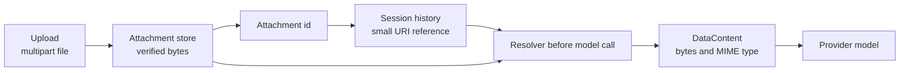

AgentPrism treats binary input as a stored attachment, not as JSON inside a message.
The run carries an attachment id. The model receives the verified bytes only when the
provider call is made.

## Mental model: bytes out of history



This shape keeps session payloads small and makes attachment ownership enforceable.
It also avoids asking a provider to fetch a private URL it cannot reach.

## Upload, then run

Upload with a multipart field named `file`. `sessionId` is optional. When present, it
groups the attachment with that session for listing and lifecycle cleanup.

```bash
curl -sS -X POST \
  "http://localhost:5081/agentprism/api/attachments?sessionId=case-4182" \
  -H "Authorization: Bearer $AGENTPRISM_TOKEN" \
  -F 'file=@invoice.png'
```

The response is `201 Created` with an `AttachmentDescriptor`. Copy its `id`, then put
that UUID in `attachmentIds`:

```bash
curl -N -X POST \
  http://localhost:5081/agentprism/api/agents/invoice-reader/run \
  -H "Authorization: Bearer $AGENTPRISM_TOKEN" \
  -H 'Content-Type: application/json' \
  -d '{
    "sessionId": "case-4182",
    "message": "Read this invoice and identify missing fields.",
    "attachmentIds": ["6c825f61-85e1-4e5e-8ed4-247391e2a9bd"]
  }'
```

The run endpoint checks every id before it starts the SSE stream. An unknown id, or an
id owned by another tenant, returns `400` without contacting the model. A request can
contain attachments without text, because one of `message`, `attachmentIds`, or
`approvals` is sufficient.

The console Playground implements the same flow behind its attachment button. It
uploads first, sends the returned ids with the next turn, and fetches protected image
or audio bytes into object URLs for preview.

## What reaches the model

The stored message contains a `UriContent` reference. Immediately before each model
call, `AttachmentResolvingChatClient` loads the tenant-owned bytes and replaces that
reference with `DataContent`. The resolved bytes are not written back into chat
history.

:::caution[Upload support is not model support]
Passing the upload guard means AgentPrism can store and transport the file. It does
not mean the selected model understands that image, PDF, or audio format. Verify the
exact provider, model, and API surface. A text-only model can ignore the content or
reject the request.
:::

## Default types and limits

One attachment is limited to 20 MiB by default. The default allow list is:

- `image/png`, `image/jpeg`, `image/webp`, and `image/gif`
- `application/pdf`
- UTF-8 `text/plain`
- `audio/*`; the built-in detector recognizes WAV, Ogg, and MP3

The client-provided `Content-Type` and file extension are not trusted. AgentPrism
derives the type from magic bytes. Plain text is the exception: when the first 1 KiB
is valid UTF-8 and has no NUL or disallowed control byte, it is treated as
`text/plain`.

Empty files, unknown signatures, files above the byte limit, and detected types
outside the allow list return `400`.

Change the limit and narrow the list through options:

```csharp
builder.Services.Configure<AgentPrismOptions>(options =>
{
    options.Attachments.MaxBytes = 8 * 1024 * 1024;
    options.Attachments.AllowedMediaTypes.Clear();
    options.Attachments.AllowedMediaTypes.Add("image/png");
    options.Attachments.AllowedMediaTypes.Add("application/pdf");
});
```

Register this configuration after `AddAgentPrism()` when code values must override
the values read from `AgentPrism:Attachments`.

## List, download, and delete

```bash
# Descriptors only. Defaults: skip=0, take=50. take is clamped to 1..200.
curl -H "Authorization: Bearer $AGENTPRISM_TOKEN" \
  "http://localhost:5081/agentprism/api/attachments?sessionId=case-4182"

# Raw bytes with the stored MIME type and a SHA-256 ETag.
curl -OJ -H "Authorization: Bearer $AGENTPRISM_TOKEN" \
  "http://localhost:5081/agentprism/api/attachments/{attachmentId}"

# Immediate hard delete.
curl -X DELETE -H "Authorization: Bearer $AGENTPRISM_TOKEN" \
  "http://localhost:5081/agentprism/api/attachments/{attachmentId}"
```

Downloads send `Content-Disposition: attachment` and
`X-Content-Type-Options: nosniff`. A browser must fetch with the authorization header
and create an object URL for preview. A protected download URL cannot be used directly
as an `` or `<audio>` source.

Deletion is not reversible. Stored messages keep their small reference, but the
reference stops resolving. Delete the owning session when the whole conversation is
finished; session deletion removes its attachments too.

## Persistence and production storage

With no SQL package, descriptors and bytes are in memory. SQL packages persist
attachment metadata and content. If the host registers an external
`IAttachmentStorage`, the SQL store keeps metadata while object storage holds the
bytes.

Attachments are tenant-scoped. Listing, download, use in a run, and deletion all
resolve through the current tenant. A caller cannot use an id to cross that boundary.

Queued runs do not accept attachments. A request with `Prefer: respond-async` and a
non-empty `attachmentIds` list returns `400`. Use the live run endpoint for multimodal
input.

## Audio input and voice are separate

An audio attachment is model input. It is not automatically transcribed.
`AgentPrism.Voice` is a separate package for speech operations. `UseVoice()` registers
the code-defined `speak`, `transcribe`, and `list_voices` tools. Generated speech is
stored as an attachment.

The default speech output is `mp3_44100_128`. Headerless `pcm_*` and `ulaw_*` outputs
cannot pass attachment magic-byte validation and are rejected. For live WebSocket
conversation, register `UseVoiceConversation()` as well.

## Troubleshooting

**Upload returns “type rejected.”** Changing the multipart `Content-Type` does not
help. Check the actual file bytes and the configured allow list.

**Upload returns “too large.”** Raise `AgentPrismOptions.Attachments.MaxBytes` only
after reviewing proxy limits, memory pressure, database growth, and provider limits.
The smallest limit in the request path wins.

**Run returns “attachment not found.”** The id must exist in the current tenant. Also
check whether the attachment or owning session was deleted.

**The model ignores the attachment.** Confirm that the exact provider/model surface
supports the detected MIME type. Upload validation covers transport safety, not model
capability.

**A queued run returns `400`.** Attachments are not supported with
`Prefer: respond-async`. Use the live SSE run endpoint.

**A browser preview shows `401` or a broken image.** Fetch the download with the bearer
header, turn the response into a `Blob`, and use an object URL.

**An old conversation can no longer replay.** A referenced attachment was hard
deleted. Keep it for at least as long as any session or replay path that needs it.

## In the reference

- [Attachment HTTP API](/http-api/attachments/)
- [Agent run HTTP API](/http-api/agents/)
- [Voice HTTP API](/http-api/voice/)
- [`AgentPrismAttachmentOptions` API](/api/agentprism.agentprismattachmentoptions/)
- [`AgentRunRequest` API](/api/agentprism.agentrunrequest/)
- [`UseVoice` API](/api/agentprism.voicebuilderextensions/)

## Read next

- [Sessions and conversations](/concepts/sessions/)
