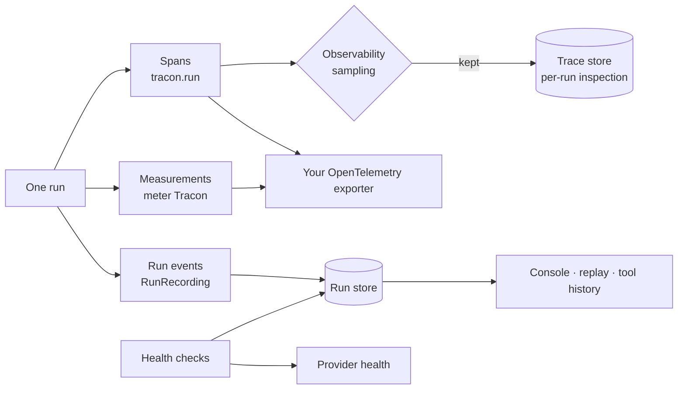

Tracon exposes four complementary views of a running system:

1. **Run records and events** preserve the product-level history.
2. **OpenTelemetry traces and metrics** feed your existing observability backend.
3. **Persisted run traces** make one run inspectable through the console and API.
4. **Health and diagnostics** explain whether storage, migrations, and providers are
   ready.



These views have separate switches and retention concerns. Turning down event
recording does not configure your OpenTelemetry exporter, and disabling trace
persistence does not stop an exporter from receiving spans.

## Export traces and metrics

Tracon does not choose an exporter. Add its stable source and meter to the
OpenTelemetry pipeline that your application owns:

```csharp
using Tracon;
using OpenTelemetry.Metrics;
using OpenTelemetry.Trace;

builder.Services.AddOpenTelemetry()
    .WithTracing(tracing => tracing
        .AddSource(TraconDiagnostics.ActivitySourceName)
        .AddOtlpExporter())
    .WithMetrics(metrics => metrics
        .AddMeter(TraconDiagnostics.MeterName)
        .AddOtlpExporter());
```

Set the OTLP address, headers, protocol, sampling, and resource attributes through
the OpenTelemetry packages and configuration used by your application. Tracon's
activity source and meter are both named `Tracon`. The root run span is
`tracon.run`.

### Stable metric names

| Instrument | Meaning |
|---|---|
| `tracon.runs` | Completed run count by status |
| `tracon.run.duration` | Run duration in seconds |
| `tracon.tokens` | Reported input and output token count |
| `tracon.tool.invocations` | Tool invocation count |
| `tracon.tool.duration` | Tool duration in seconds |
| `tracon.run.cost` | Calculated run cost when a price is known |
| `tracon.quota.usage` | Current quota usage gauge when enabled |
| `tracon.quota.limit` | Current quota limit gauge when enabled |
| `tracon.judge.cost` | Cost reported for evaluation judges |
| `tracon.judge.score` | Judge score distribution |
| `tracon.model.cache` | Response-cache lookups, tagged hit or miss |
| `tracon.agent_source.failures` | Agent-source failure and contract-violation count |
| `tracon.job.executions` | Background jobs that reached a terminal status |
| `tracon.job.duration` | Duration of a single background-job attempt, in seconds |
| `tracon.job.queue.depth` | Outstanding jobs per lane and open status, when enabled |

### The attribute names

These are the tag keys the instruments and the run span carry. They are the names you
group and filter by in a dashboard or an alert rule, so they are as stable as the
metric names above.

| Attribute | Carried by | Value |
|---|---|---|
| `tracon.agent.name` | Every run signal | The agent's registered name |
| `tracon.agent.version` | Run signals for a versioned definition | The definition version that ran |
| `tracon.run.status` | `tracon.runs`, run span | `Completed`, `Failed`, `Canceled`, and the other run statuses |
| `tracon.run.streaming` | Run signals | Whether the caller asked for a stream |
| `tracon.model.id` | Run and cost signals | The model the run was bound to |
| `tracon.tenant.id` | Every signal in a multi-tenant setup | The resolved tenant |
| `tracon.tool.name` | `tracon.tool.invocations`, `tracon.tool.duration` | The invoked tool |
| `tracon.token.direction` | `tracon.tokens` | `input` or `output`, and nothing else |
| `tracon.cost.currency` | `tracon.run.cost` | The currency the configured price is expressed in |
| `tracon.quota.scope` · `tracon.quota.period` · `tracon.quota.metric` | Quota gauges | Which quota the gauge reports |
| `tracon.judge.name` | `tracon.judge.cost`, `tracon.judge.score` | The judge that produced the score |
| `tracon.model.provider` | `tracon.model.cache` | The model provider name |
| `tracon.model.cache.result` | `tracon.model.cache` | `hit` or `miss` |
| `tracon.skill.name` | Skill signals | The loaded skill |
| `tracon.script.name` · `tracon.script.exit_code` · `tracon.script.duration_ms` | Skill-script span | The script, how it ended, and how long it took |
| `tracon.compaction.input_tokens` · `tracon.compaction.output_tokens` | Compaction span | What the summarization call itself cost |
| `tracon.agent_source.name` | `tracon.agent_source.failures` | The failing `IAgentSource`'s name |
| `tracon.agent_source.operation` | `tracon.agent_source.failures` | `list`, `resolve`, or `consistency` |
| `tracon.job.lane` | Every job signal | The lane the job was queued in |
| `tracon.job.handler_key` | `tracon.job.executions`, `tracon.job.duration` | The key of the handler that ran the job |
| `tracon.job.status` | Every job signal | A terminal status on the counter and the histogram; an open one on the gauge |

Three spans and one tool name are not metrics at all, and are named here because a
trace search needs them: `execute_skill_script` (a skill script's own span, carrying
the three `tracon.script.*` attributes), `compact_history` (the summarization
call, carrying the two `tracon.compaction.*` attributes), and the tool name
`skill_script`, which is what a script-backed skill appears as in
`tracon.tool.invocations`.

:::caution
Four of these are **span attributes only** and are deliberately not metric tags:
`tracon.run.id`, `tracon.session.id`, `tracon.run.parent_id`, and
`tracon.run.depth`. Each is unbounded, and promoting one to a metric tag creates a
new time series per run. Use them to find a trace, not to group a chart.
:::

### What the job metrics count

`tracon.job.executions` counts jobs that **finished**. Only a terminal status
reaches it — `Completed`, `Failed`, or `Cancelled`. When an attempt fails and the
job is released for another try, nothing is counted; a job configured with three
attempts that ultimately fails is counted **once**, not three times.

`tracon.job.duration` follows the same rule and measures **one attempt**, not
the job's whole lifetime. For a job that failed twice before succeeding, the
single recorded measurement covers the last attempt. It is taken from a monotonic
clock, so a clock correction during the job cannot produce a negative duration.

`tracon.job.queue.depth` is **off by default**, because it reads the database
on every scrape. Turn it on with `Observability:EnableJobQueueDepthGauge`, and the
reads are cached for `Observability:JobQueueDepthRefreshInterval`. It reports only
the open statuses — `Pending`, `Leased`, and `Running` — so its cost tracks the
work still outstanding rather than the queue's whole history. A lane with no open
jobs is absent rather than reported as zero. The gauge carries **no tenant tag**:
the worker pool leases across every tenant, so queue depth is a signal about the
pool, not about one tenant's work.

:::caution
A lane name is chosen by you, and Tracon does not bound how many exist. To keep
the metric backend safe from a deployment that derives a lane per user, only the
first `Observability:MaxJobLaneCardinality` distinct lanes a process sees (64 by
default) get a series of their own; every further lane is reported as `other`. A
lane that earned its name keeps it for the life of the process, so a chart never
sees the same lane move between its own series and `other`.
:::

Token and cost data depend on the provider response. Missing usage remains unknown;
it is not converted to zero. Tracon also does not invent a price. A run can have
token metrics but no cost metric when neither the model catalog nor your pricing
configuration supplies a price.

A run's cost is a **price snapshot** ([concepts/runs](/concepts/runs/#what-a-run-carries)):
computed once, from the unit price in effect when the run ended, and never
recomputed from a later price change. `POST /api/stats/recalculate-costs` is a
repair tool for the runs that were unpriced at the time — it fills in a price
for them once one becomes available, and never touches a run that already has
a known cost.

:::caution
This tag set is **fixed**, and run attribution is deliberately absent from it.
Neither the user id nor the labels of a run become metric tags: both are
unbounded key spaces, and promoting either would multiply the time series of
`tracon.tokens` and `tracon.run.cost` without limit. Attribution is a
query dimension — break costs down with `GET /api/stats` instead, which returns
`byUser` and `byLabel`.
:::

`tracon.tokens` reports only two `direction` values, `input` and `output`.
The finer counters a provider may report — prompt-cache hits, reasoning tokens,
audio tokens — are counted **inside** those two totals and are recorded on the
`runs` row rather than emitted as extra metric series, for the same reason:
adding them would double count every token on the dashboard.

Where the tokens actually went is a query:

```bash
curl -s "http://localhost:5081/tracon/api/runs?take=1" | jq '.[0].usage'
```

```json
{
  "inputTokens": 12480,
  "outputTokens": 310,
  "totalTokens": 12790,
  "cachedInputTokens": 11900,
  "reasoningTokens": 128
}
```

A counter the provider never reported stays `null`, not `0`. The distinction is
load-bearing: `0` claims a measured cache miss, `null` says nothing was measured
— and a report that cannot tell them apart will show a confident 0% cache hit
rate for every provider that stays silent.

## Configure trace persistence

The internal trace store keeps a sampled copy for run-level inspection:

```json
{
  "Tracon": {
    "Observability": {
      "Enabled": true,
      "PersistSpans": true,
      "SuccessSampleRatio": 0.1,
      "AlwaysPersistFailures": true,
      "MaxSpansPerRun": 200,
      "RecordSensitiveData": false,
      "IncludeAgentVersionTag": true,
      "EnableQuotaUsageGauge": false,
      "QuotaUsageRefreshInterval": "00:00:30"
    }
  }
}
```

Successful traces are sampled when the run finishes because only then is the result
known. Failed traces bypass the success sample when `AlwaysPersistFailures=true`.
Spans remain in memory until that decision, bounded by `MaxSpansPerRun`. Excess spans
are dropped and one warning is logged for the run.

Read a retained trace with the root run ID:

```bash
curl -sS \
  -H "Authorization: Bearer $TRACON_API_KEY" \
  https://agents.example.com/tracon/api/runs/$RUN_ID/trace
```

Child spans are collected into the root run's tree. A `404` can mean that the run was
not sampled, trace persistence was off, the trace was removed, or that no trace was
written. It does not by itself mean the run never existed.

Other useful views are `GET /api/runs/{runId}/tools` and
`GET /api/tools/usage`. The usage endpoint defaults to 50 tools and clamps its
`maxTools` query value to the range 1 through 200.

### Trace defaults and limits

| Setting | Default | Effect |
|---|---:|---|
| `Observability.Enabled` | `true` | Controls the MAF telemetry decorator and internal span collector; run recording remains separate |
| `PersistSpans` | `true` | Writes sampled spans to the Tracon trace store |
| `SuccessSampleRatio` | `0.1` | `0` persists no successful trace; `1` persists all successful traces |
| `AlwaysPersistFailures` | `true` | Keeps failed traces independent of the success sample |
| `MaxSpansPerRun` | `200` | Bounds the in-memory trace buffer; excess spans are dropped |
| `RecordSensitiveData` | `false` | Excludes prompt, message, and completion text from span tags |
| `IncludeAgentVersionTag` | `true` | Adds agent version to run spans and run metrics |
| `EnableQuotaUsageGauge` | `false` | Avoids background database reads until explicitly enabled |
| `QuotaUsageRefreshInterval` | 30 seconds | Caches database-backed gauge samples between collections |

`PersistSpans=false` only disables the internal store. Spans can still reach the
consumer's configured exporter.

`Observability.Enabled` is not a global exporter switch. The run-recording wrapper
owns the root run span and stable run metrics. Your OpenTelemetry source, meter, and
sampler configuration still decides what the consumer pipeline collects.

## Control run recording

Run recording is the durable source for the console, event replay, tool history, and
run inspection:

```json
{
  "Tracon": {
    "RunRecording": {
      "Enabled": true,
      "RecordMessageDeltas": true,
      "RecordToolPayloads": true,
      "RecordReasoningDeltas": false,
      "MaxPayloadLength": 8192,
      "RecordRunInput": true
    }
  }
}
```

| Setting | Default | Limit or consequence |
|---|---:|---|
| `RunRecording.Enabled` | `true` | When false, no run event is written |
| `RecordMessageDeltas` | `true` | Turning it off reduces write volume for streaming runs |
| `RecordToolPayloads` | `true` | Tool arguments and results can contain personal or secret data |
| `RecordReasoningDeltas` | `false` | Off unlike the other flags: reasoning output can run far longer than the answer and can restate input the answer never shows |
| `MaxPayloadLength` | 8,192 characters | Valid range is 0 through 1,048,576; `0` means no truncation |
| `RecordRunInput` | `true` | Required for run replay; input is not truncated by `MaxPayloadLength` |

Event-store failures are logged and then event writes stop for that run. The agent
run continues. A run-input write failure also leaves execution intact, but that run
cannot be replayed. This failure isolation prevents an observability outage from
becoming an agent outage. A registered [`IRunEventSink`](/concepts/runs/#observing-events-beyond-the-store)
is held to the same rule: a sink failure never stops the store write, and a store
failure never stops a sink from seeing the rest of the run.

`RecordSensitiveData=false` does not redact run events, tool payloads, or saved run
input. It applies to span tags. Configure both sections and retention according to
the data that your agents process.

## Add readiness and provider health

Register Tracon in ASP.NET Core health checks, then choose the route yourself:

```csharp
using Microsoft.AspNetCore.Diagnostics.HealthChecks;

builder.Services.AddHealthChecks()
    .AddTraconHealthChecks(tags: ["ready"]);

var app = builder.Build();

app.MapHealthChecks("/health/ready", new HealthCheckOptions
{
    Predicate = registration => registration.Tags.Contains("ready"),
});
```

The check performs a light storage connection probe. It does not spend model tokens.
It reads the cached model-provider health view:

| State | Meaning |
|---|---|
| `Healthy` | Storage is reachable, migrations are current, and at least one provider is confirmed healthy |
| `Degraded` | Storage works, but a provider circuit is open, more than one persistence provider is registered, or no provider is confirmed healthy |
| `Unhealthy` | Storage is unreachable or migrations are pending |

Provider probes call the provider's model-list health surface, not a completion. A
provider that has no health implementation reports `Unknown`. Read the cache with
`GET /api/models/health`; add `?refresh=true` to request a fresh probe.

Health results are cached for 60 seconds by default. No background refresh timer runs
unless `Tracon:Health:BackgroundInterval` is set. A deployment can therefore be
degraded until the first provider refresh fills the cache.

## Enable setup diagnostics deliberately

The setup report is not mapped by default:

```csharp
app.MapTracon("/tracon", options =>
{
    options.EnableDiagnosticsEndpoint = true;
    options.RequireRolePolicies = true;
});
```

`GET /api/diagnostics` reports selected storage, migration state, provider setup, and
whether expected configuration keys resolve. It never returns secret values. It
performs a light SQL probe and does not run a migration or call a model. The endpoint
requires the Tracon Admin role when role policies are registered.

:::caution[Production caveat]
Tenant, agent, model, and version tags create time series. Review cardinality before
you retain them at high volume. Leave sensitive span tags off, reduce message-delta
recording when complete messages are sufficient, and set explicit retention for run
events, inputs, tool payloads, and traces. Protect the diagnostics endpoint even
though it hides secret values; topology and configuration-key names are still
operational information.
:::

## Troubleshooting

| Symptom | Check |
|---|---|
| No Tracon telemetry reaches the backend | Add both `TraconDiagnostics.ActivitySourceName` and `MeterName`; then verify the consumer exporter, endpoint, and sampler |
| A run exists but `/trace` returns `404` | Check `PersistSpans`, success sampling, failure override, retention, and that you used the root run ID |
| A trace is incomplete | Look for the one-per-run span-limit warning and raise `MaxSpansPerRun` only after checking memory cost |
| Run cost is absent | Confirm that the provider reported tokens and that the exact provider/model has a catalog or configured price |
| Replay says input is unavailable | Keep `RecordRunInput=true`; inspect logs for an input-store failure or retention deletion |
| The run succeeded but events stopped | Inspect the first run-store write error; Tracon disables later event writes for that run so execution can continue |
| A reasoning model's thinking never appears in recorded events | Set `RunRecording.RecordReasoningDeltas = true`; the live stream shows it either way, only recording is gated |
| A registered `IRunEventSink` stops receiving events partway through a run | Check the warning log for that sink's exception; it is disabled for the rest of that run only, other sinks and the store are unaffected |
| Readiness starts as `Degraded` | Refresh `/api/models/health?refresh=true` or configure a background health interval |
| Health is `Unhealthy` after deployment | Check database reachability and pending migrations before investigating providers |
| Quota gauges never appear | Enable `Observability.EnableQuotaUsageGauge` and confirm the meter is collected |

## Read next

- [Runs and event recording](/concepts/runs/) — inspect recorded status, events, tokens, and recording limits.
- [Reliable runs](/guides/reliability/) — configure durable execution and understand recovery limits.
- [Production deployment](/guides/production/) — prepare migrations, replicas, health checks, and operational settings.
