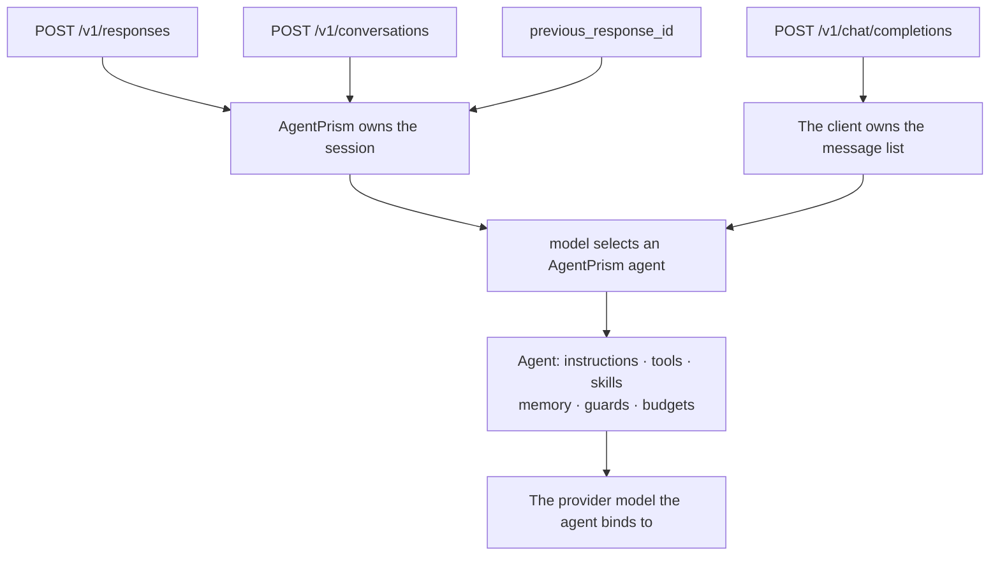

AgentPrism exposes the two OpenAI request styles most application clients already
understand:

- `POST {prefix}/v1/responses`
- `POST {prefix}/v1/chat/completions`
- `/v1/conversations/*` for Responses conversation state



This is an **agent surface**, not a transparent model proxy. The request's `model`
selects an AgentPrism agent. That agent then selects its provider model, instructions,
tools, skills, memory, guards, and budgets on the server.

## Responses API: recommended for stateful clients

The official OpenAI SDK uses `client.responses.create(model=..., input=...)`; point
the same client shape at AgentPrism and use an AgentPrism credential:

```python
import os
from openai import OpenAI

client = OpenAI(
    api_key=os.environ["AGENTPRISM_API_KEY"],
    base_url="https://agents.example.com/agentprism/v1",
)

response = client.responses.create(
    model="support",
    input="Where is order 4182?",
)

print(response.output_text)
```

If your generated SDK version expects the base URL without `/v1`, follow that SDK's
base-URL rule. The request that reaches AgentPrism must end at
`{prefix}/v1/responses`.

The same call without an SDK is unambiguous:

```bash
curl -sS https://agents.example.com/agentprism/v1/responses \
  -H "Authorization: Bearer $AGENTPRISM_API_KEY" \
  -H 'Content-Type: application/json' \
  -d '{"model":"support","input":"Where is order 4182?"}'
```

The response has the familiar `response` object, `resp_...` identifier, output items,
status, and usage when the underlying provider reports it. Errors use the OpenAI
`{"error": { ... }}` envelope so an OpenAI client can parse them.

### Stream Responses events

Set `stream=true`. The server returns SSE with OpenAI event names, including
`response.created`, `response.output_text.delta`, and `response.completed`:

```python
stream = client.responses.create(
    model="support",
    input="Summarize the escalation in three bullets.",
    stream=True,
)

for event in stream:
    if event.type == "response.output_text.delta":
        print(event.delta, end="", flush=True)
```

This follows the official Responses streaming model. AgentPrism still creates its own
run and ordered event history behind the compatible stream.

## Conversation state

Use either mechanism supported by Responses:

```json
{
  "model": "support",
  "input": "Second turn",
  "previous_response_id": "resp_..."
}
```

AgentPrism stores the session under the first response identifier, so
`previous_response_id` finds its history. Or reserve and reuse an explicit
conversation:

```bash
CONVERSATION_ID=$(curl -sS -X POST \
  https://agents.example.com/agentprism/v1/conversations \
  -H "Authorization: Bearer $AGENTPRISM_API_KEY" \
  -H 'Content-Type: application/json' \
  -d '{}' | jq -r .id)

curl -sS https://agents.example.com/agentprism/v1/responses \
  -H "Authorization: Bearer $AGENTPRISM_API_KEY" \
  -H 'Content-Type: application/json' \
  -d "{\"model\":\"support\",\"conversation\":\"$CONVERSATION_ID\",\"input\":\"Hello\"}"
```

Creating a conversation reserves an identifier; the session is born on the first
response call. Tenant ownership is checked on every reference. An identifier owned
by another tenant returns `404`, not evidence that the resource exists.

### The conversation routes go through your own gates

`GET`, `DELETE` and `GET …/items` reach the same sessions `/api/sessions/{id}`
reaches, so they pass the same two checks before answering:

- **Session ownership**, when `AgentPrism:SessionOwnership` is on — including
  `RefuseUnownedSessions`. See
  [Sessions: session ownership](/concepts/sessions/#session-ownership).
- **Your registered `IRunAuthorizationHandler`**, with `SessionAccess.Read` on
  the two reads and `SessionAccess.Delete` on the delete.

:::caution[Behaviour change]
Before this, the conversation routes never asked your handler. If you have one
registered and it refuses some sessions, it now refuses them here too — the
direction is fail-closed, but it is a change. `POST /v1/conversations` is not
gated: it reserves an identifier and writes nothing.
:::

If your deployment does not use these routes at all, leave them unmapped:

```csharp
app.MapAgentPrism("/agentprism", options => options.MapOpenAIConversations = false);
```

The four paths then answer `404` and disappear from the OpenAPI document.
`/v1/responses` and `/v1/chat/completions` are unaffected.

## Chat Completions: stateless history

Chat Completions remains useful for clients that carry their own message list:

```python
completion = client.chat.completions.create(
    model="support",
    messages=[
        {"role": "user", "content": "Where is order 4182?"},
    ],
)

print(completion.choices[0].message.content)
```

`stream=True` returns `chat.completion.chunk` frames and ends with `[DONE]`.
AgentPrism does not open a server session for this endpoint. Send the full history on
every call; otherwise the next turn has no previous context.

## Compatibility matrix

| Capability | Responses | Chat Completions | AgentPrism behavior |
|---|---|---|---|
| Text input and output | yes | yes | Runs the selected agent and records the run |
| SSE streaming | yes | yes | Uses surface-specific OpenAI frame names |
| Server conversation | `conversation` or `previous_response_id` | no | Maps to AgentPrism sessions |
| Client-carried history | input items | `messages` | Resolved attachments reach the provider |
| Agent tool loop | yes | yes | Tools are defined and executed server-side |
| Pending approval visibility | yes | provider-shaped output | The call cannot supply an interactive approval turn |
| Usage | when provider reports it | when provider reports it | Missing usage remains unknown, not zero |
| OpenAI hosted tools | not a pass-through | not a pass-through | Configure AgentPrism tools/MCP instead |
| Background Responses mode | no | no | Use `Prefer: respond-async` on the management run endpoint |

Fields understood by the OpenAI parser can be accepted without becoming an
AgentPrism feature. Do not assume every OpenAI hosted tool, storage flag, service
tier, or retrieval surface is forwarded to the agent's provider. The server-side
definition is authoritative.

## Authentication and authorization

Use the bearer token configured on `MapAgentPrism`, or a tenant-bound AgentPrism API
key with `ExternalInvoke`. The base URL, credential, and model semantics all change;
test them explicitly when moving an existing client.

For a browser or untrusted device, do not embed a long-lived control-plane key.
Terminate user authentication in your application and issue the narrowest credential
your architecture permits.

## Failure behavior

| Symptom | Meaning |
|---|---|
| `400` with listed agents | No valid `model` or `metadata.entity_id` selected an agent |
| `401` | Bearer token or API key is missing, invalid, revoked, or expired |
| `403` | Role, scope, loopback, or tenant rule refused the call |
| `404 model_not_found` | The selected AgentPrism agent does not resolve |
| `422` | An AgentPrism content guard or idempotency contract rejected the request |
| `429` | A rate or quota boundary was reached |
| `502` | The configured upstream provider failed |

Use the management run API when you need AgentPrism-specific controls such as
queued execution, idempotent non-streaming responses, explicit replay, cancellation,
or complete run diagnostics.

The client method and streaming examples follow the
[official OpenAI Responses documentation](https://developers.openai.com/api/docs/guides/text).
The behavior and compatibility limits above are AgentPrism's own contract.

## Read next

- [HTTP API conventions](/http-api/) — the management API, which is a different surface with different rules
- [Model providers](/guides/model-providers/) — what actually answers the request behind the compatible endpoint
- [Attachments and multimodal input](/guides/multimodal/) — how non-text content arrives through the same endpoints
