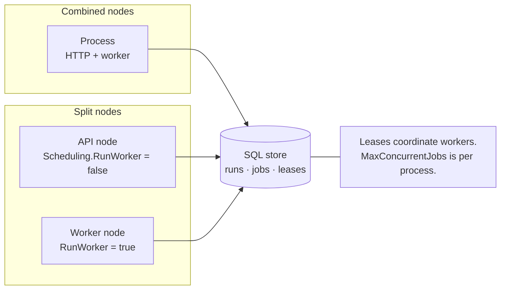

A production AgentPrism deployment needs more than a provider key. It needs durable
state, an explicit identity boundary, a migration strategy, readiness probes, bounded
background work, and a policy for the data that runs create.

The examples below use PostgreSQL. SQL Server is also supported. SQLite is a
single-process option and the in-memory defaults are for development and tests.

## Start from a production registration

Keep credentials outside checked-in configuration. ASP.NET Core maps this environment
variable to `AgentPrism:PostgreSql:ConnectionString`:

```bash
export AgentPrism__PostgreSql__ConnectionString='Host=...;Database=...;Username=...;Password=...'
```

Register one provider and one SQL persistence package:

```csharp
using AgentPrism;
using Microsoft.AspNetCore.Diagnostics.HealthChecks;

var builder = WebApplication.CreateBuilder(args);

var agentPrism = builder.AddAgentPrism()
    .UseOpenAI(builder.Configuration.GetSection(OpenAIProviderOptions.SectionName))
    .UsePostgreSql(
        builder.Configuration.GetSection(AgentPrismPostgreSqlOptions.SectionName));

builder.Services.AddHealthChecks()
    .AddAgentPrismHealthChecks(tags: ["ready"]);

var app = builder.Build();

app.MapHealthChecks("/health/ready", new HealthCheckOptions
{
    Predicate = registration => registration.Tags.Contains("ready"),
});

app.MapAgentPrism("/agentprism");
app.Run();
```

A deployment whose module order can leave an authorization handler on AgentPrism's
permissive default should say so out loud, so the mistake is a failed startup rather
than an allowed request:

```csharp
var agentPrism = builder.AddAgentPrism()
    .RequireCustomBinding<IRunAuthorizationHandler>()
    .RequireCustomBinding<IToolAuthorizationHandler>();
```

See [Make a binding required](/guides/embedding/#make-a-binding-required) for the
seven contracts this accepts and what the check does and does not prove.

Use your platform's secret manager for the provider API key and database connection
string. The canonical OpenAI key path is `AgentPrism:Providers:OpenAI:ApiKey`; its
environment form is `AgentPrism__Providers__OpenAI__ApiKey`. Do not put either value
in `appsettings.json`, a container image, or a deployment manifest that is not backed
by a secret facility.

## Make the HTTP boundary explicit

Remote access is off by default. In production, connect AgentPrism to the same
ASP.NET Core authentication scheme that protects the rest of the application. Bind
the three AgentPrism policy names to your own role or claim model:

```csharp
builder.Services.AddAuthorization(options =>
{
    options.AddPolicy("AgentPrismAccess", policy =>
        policy.RequireAuthenticatedUser());

    options.AddPolicy(AgentPrismPolicies.Reader, policy =>
        policy.RequireRole(
            "agentprism-reader",
            "agentprism-operator",
            "agentprism-admin"));

    options.AddPolicy(AgentPrismPolicies.Operator, policy =>
        policy.RequireRole("agentprism-operator", "agentprism-admin"));

    options.AddPolicy(AgentPrismPolicies.Admin, policy =>
        policy.RequireRole("agentprism-admin"));
});
```

After `UseAuthentication()` and `UseAuthorization()`, map the surface with both the
base policy and strict role-policy validation:

```csharp
app.MapAgentPrism("/agentprism", options =>
{
    options.AllowRemoteAccess = true;
    options.RequireAuthorization("AgentPrismAccess");
    options.RequireRolePolicies = true;
});
```

`RequireRolePolicies=true` turns a missing Reader, Operator, or Admin policy into a
startup failure. When it is false, an unregistered role policy is skipped. The base
authorization policy, loopback rule, and API-key scopes still apply, but a production
deployment should fail closed on this configuration error.

The optional `AuthToken` is a single static shared secret. It is useful for a private
operator surface, but it has no per-user identity or individual revocation. Prefer an
ASP.NET Core policy for people and tenant-bound, narrowly scoped AgentPrism API keys
for system clients.

:::caution[Reverse proxies change the network boundary]
The loopback rule sees the address that connects to ASP.NET Core. A local reverse
proxy can make every caller look local. Configure trusted forwarded-header handling
and TLS at the proxy, but use authentication and authorization as the real boundary.
Do not treat `AllowRemoteAccess=false` as sufficient protection behind a proxy.
:::

## Choose a migration strategy

PostgreSQL configuration has these operational controls:

```json
{
  "AgentPrism": {
    "PostgreSql": {
      "SchemaName": "agentprism",
      "AutoApplyMigrations": false,
      "CommandTimeoutSeconds": 30
    }
  }
}
```

`AutoApplyMigrations` defaults to `true`. Startup takes a database lock scoped to the
AgentPrism schema, validates checksums for applied migrations, and applies each
pending migration in a transaction. A migration failure stops startup.

For a small service, automatic migration is simple and safe. For a fleet, set it to
false and run the registered `MigrationRunner.ApplyAsync()` from one controlled
deployment step before new application instances become ready. With automatic
migration disabled, AgentPrism opens its schema-ready gate on the assumption that the
external step completed. The health check still reports pending migrations as
unhealthy.

Never edit an applied embedded migration. A checksum mismatch is an integrity error,
not a warning to bypass.

### Alongside your own EF Core migrations

The two schemas are not connected by a foreign key and apply in either order — but
run them with `AutoApplyMigrations` set to `false`, so exactly one mechanism ever
touches the database at deploy time instead of two racing at every instance's
startup:

```bash
dotnet ef database update            # your application's own schema
agentprism migrate --provider postgres --connection "$AGENTPRISM_CONNECTION"
```

See [Two connection planes: EF Core and AgentPrism](/guides/ef-core/) for sharing a
connection pool with an EF Core `DbContext` in the same process.

### Storage defaults and limits

| Setting | Default | Limit or consequence |
|---|---:|---|
| PostgreSQL schema | `agentprism` | Lowercase unquoted identifier, at most 63 characters |
| `AutoApplyMigrations` | `true` | A failed migration prevents startup |
| `EnableKnowledge` (PostgreSQL) | `false` | Applies the `pgvector`-dependent migration set; needs no extension permission while off |
| `CommandTimeoutSeconds` | `30` | Valid range 0 through 3,600; `0` means unlimited |
| Persistence without `Use*Sql*` | In memory | State disappears on process exit |
| SQL provider count | One | If several are registered, the last wins and diagnostics become degraded |

PostgreSQL is the only AgentPrism storage provider with vector search. It is opt-in:
`EnableKnowledge` defaults to `false`, so a deployment that never turns it on needs
no `pgvector` extension and no extension-creation permission at all. Turn it on and
install `pgvector` before migrations run only when the deployment includes the
knowledge system.

## Design the process topology

Every process runs the scheduling worker by default. There are two valid shapes:

- **Combined nodes** serve HTTP and execute jobs. This is simple for a small service.
- **Split nodes** set `Scheduling.RunWorker=false` on API nodes and true on worker
  nodes. Worker nodes must register the same SQL store, providers, agents, and job
  handlers as API nodes.



SQL job leases coordinate worker nodes. `MaxConcurrentJobs` is per process, so size
the total concurrency against provider rate limits and database capacity. The
singleton-execution guard coordinates periodic services such as health refresh and
orphan reconciliation; the job queue already has its own leases and does not use that
guard.

Direct-run cancellation is registered in the process that owns the live execution.
A cancel request routed to another instance, or sent after the owner restarts, returns
`409`. Use sticky routing or provide a distributed `IRunCancellationRegistry` when
cross-node cancellation is a requirement. Queued-run cancellation is durable because
it uses the shared job store.

Rate limits are per process for the same reason. The endpoint limiter
(`AgentPrism:RateLimit`) and the inbound trigger limiter both count in the memory
of one instance; AgentPrism ships no distributed counter. Two instances with a
`PermitLimit` of 100 admit 200 requests per window between them, and a `Tenant`
partition splits each instance's own window rather than a window shared across
the deployment. Size the limit per instance, or put a shared limiter in the
ingress in front of them. A ceiling that must hold for the deployment as a whole
is a quota instead: quotas count in the database, so the instance count does not
change them.

## Add readiness, liveness, and diagnostics

Use the AgentPrism check for readiness. It is `Unhealthy` when SQL is unreachable or
migrations are pending. It is `Degraded` when storage works but provider health is
not confirmed, a circuit is open, or several persistence providers are registered.
It does not make a paid model completion.

Keep liveness independent of database and provider availability so the orchestrator
does not restart a healthy process during an upstream outage. The application owns
both health routes and their response policy; AgentPrism only registers the check.

`GET /api/diagnostics` is not mapped by default. If an operations workflow needs it,
set `EnableDiagnosticsEndpoint=true`, require the Admin role, and restrict the route.
It returns configuration-key names and topology, not secret values, but that metadata
is still sensitive.

## Decide what to retain

Run input, streaming message deltas, and tool arguments/results are recorded by
default. They can contain customer data even when sensitive span tags are disabled.
Start with an explicit classification:

| Data | Default recording or retention behavior |
|---|---|
| Run events | Recorded; configuration retention is inactive until retention is enabled |
| Tool payloads | Recorded, with event payloads capped at 8,192 characters |
| Run inputs | Recorded without event-payload truncation so replay remains correct |
| Persisted traces | Successful runs sampled at 10%; failures retained when enabled |
| Sessions and conversations | No configuration age limit by default |

`AgentPrism:Retention:Enabled` defaults to `false`. With no explicit database policy,
nothing is deleted automatically. When you enable configuration defaults, run events
default to 30 days, tool invocations to 90 days, traces to 14 days, completed jobs to
30 days, idempotency keys to one day, and run inputs to 30 days. Session and
conversation deletion still require an explicit policy.

Preview a retention rule before you execute it. If archival is enabled but no
`IArchiveSink` is registered, AgentPrism does not delete the rows.

Retention removes data by age; it never touches `audit_log`, which is a separate,
tamper-evident trail (`GET /api/audit/verify`) and stays outside any retention
target on purpose. If a data subject request (export or erasure by identity, not
age) is part of your compliance posture, register an `IDataSubjectResolver` — see
[Data subject rights](/concepts/governance/#data-subject-rights). Without
one, the export and erasure endpoints return `409` rather than a silent no-op.

## Production-sensitive defaults

| Boundary | Default | Production decision |
|---|---|---|
| Remote access | Off | Enable only with a registered authorization policy or scoped key strategy |
| Role-policy enforcement | Off | Turn on so a missing policy stops startup |
| Diagnostics endpoint | Off | Enable only for a protected operations path |
| Run event poll interval | 250 ms | Lower values reduce SSE latency but increase database reads |
| Background job worker | On, concurrency 2 per process | Separate or size workers deliberately |
| Circuit breaker | On, opens after 5 failures for 30 seconds | Align alerts and upstream retry policy |
| Singleton execution | Off | Enable with SQL when one cluster-wide periodic owner is required |
| Orphan reconciliation | Off | Enable after choosing heartbeat and orphan thresholds |
| Retention defaults | Off | Define legal, privacy, and capacity policy before data grows |
| Skill script execution | Off | Leave off unless the host is isolated and the threat model permits OS processes |
| Private network egress | Refused | Allow only if MCP servers or provider endpoints really are on the internal network |
| Agent-graph token budget | On, 200,000 tokens shared per call tree | Raise it for a tree with genuinely long tool loops, or set a `AgentGraph.MaxTotalCost` cap alongside it |
| Agent-graph time budget | Off | Set `AgentGraph.MaxDuration` where a queued run's lease renewal is otherwise the only thing keeping it going |

## Upgrading: outbound targets and configuration keys

Three boundaries tightened, and all three can refuse something a running setup
accepted before. Reading is unaffected in each case; only writing, connecting, and
long-running calls change.

**Private network targets are refused on all three outbound surfaces.** Webhook
delivery already behaved this way; MCP server connections and per-tenant provider
endpoints now do too. If your MCP servers run inside the internal network, this is a
one-line change:

```json
{
  "AgentPrism": {
    "Egress": {
      "AllowPrivateNetworkTargets": true
    }
  }
}
```

The rejection message names that setting, so an operator who hits it can act without
reading this page. `AgentPrism:Webhooks:AllowPrivateNetworkTargets` still works and
still applies to webhook delivery only; either setting being on is enough for a
webhook target.

**The agent-graph token budget now actually cuts a run off.** The default
(`AgentGraph.MaxTotalTokens`, 200,000) always existed, but earlier releases only
checked it before starting a *new* child run — a single agent's own tool loop could
run past it freely. It is now enforced between model turns for every run, so a tree
whose tool loop genuinely needs more than 200,000 tokens now ends `Failed` with
`error_class: QuotaExceeded` where it previously would have finished. Raise the
setting, or set it to `0` to remove the limit:

```json
{
  "AgentPrism": {
    "AgentGraph": {
      "MaxTotalTokens": 500000
    }
  }
}
```

**Configuration key names must sit under an allowed prefix.** MCP server definitions
and webhook subscriptions join inbound triggers and provider bindings in this rule. A
record whose key name sits outside its prefix can still be **read** and listed, but
saving it again is refused with a message naming both the field and the prefix.

| Record | Field | Required prefix |
|---|---|---|
| MCP server | `authorizationConfigurationKey`, `oauthClientSecretConfigurationKey` | `AgentPrism:McpSecrets:` |
| Webhook subscription | `secretConfigurationKey` | `AgentPrism:WebhookSecrets:` |

Fix each record by moving the key name under the prefix and re-writing the value under
the new name in your secret store. There is no migration helper and this is
deliberate: it is one field per record, and what moves is a **name**, not a secret
value. Alternatively, widen the prefix through
`AgentPrism:Mcp:AllowedConfigurationPrefix` or
`AgentPrism:Webhooks:AllowedConfigurationPrefix` — but a prefix broad enough to cover
an arbitrary key removes the boundary it exists to provide.

## When the state preflight comes back red

Run `agentprism state-check` with the **new** tool version against a copy of
production data before every upgrade — see [the upgrade
window](/reference/versioning/) for what the command reports and what its
answer is worth. Exit code `3` means it found stored state the new build
cannot read. This is what to do about it.

The command itself never changes anything, so a red result costs you nothing
but the time it took to run.

**1. Read which of the two answers came back red.** They call for different
actions:

| What the output says | What it means | What to do |
|---|---|---|
| `... NOT readable by this build` on a generation line | Rows carry an AgentPrism envelope generation **newer** than the build you are installing. You are downgrading, or deploying a mixed package graph | Do not deploy. Install the version that wrote those rows, or newer. This is a version selection mistake, not a data problem |
| `unreadable: session ...` on a sampled row | The AgentPrism envelope is fine; Microsoft Agent Framework cannot deserialize the body it wrote earlier. The message names both the recorded and the running framework version | Continue to step 2 |

**2. Decide whether those sessions have to survive the upgrade.** They often do
not — a session is a conversation, and most are minutes old. `state-check`'s
generation counts tell you how many rows are in play; your own retention policy
tells you how long they were going to live anyway.

If they do not have to survive: clear the affected sessions and checkpoints
before the upgrade, or let retention age them out and upgrade after. A run that
starts after the upgrade opens a new session and is unaffected.

**3. If they do have to survive, drain instead of cutting over.** Stop accepting
new work, let in-flight runs finish under the **old** build, and only then
deploy. Draining is a supported, tested shutdown path: the host stops taking new
jobs, waits for running ones, and does not abandon them. The sessions that
existed only for those runs are finished business by the time the new build
starts.

**4. Keep the old runtime available until you have a green preflight, and not
longer.** "Roll back the application" does not roll back the database —
migrations are forward-only, as [the migration
strategy](#choose-a-migration-strategy) above says. The old runtime is a way to
finish draining, not a permanent escape hatch, and the [supported upgrade
window](/reference/versioning/) is what bounds how long an old version stays
readable at all. Plan the drain window, not an indefinite dual-runtime setup.

**5. If none of the above fits, treat it as a compatibility defect and report
it** with the facts from [Record the version in incident
reports](/reference/versioning/): the exact package versions, the recorded and
running Microsoft Agent Framework versions from the failure line, and the
generation counts. Do not attach the state payload itself — it is conversation
content.

:::caution[What a clean preflight does and does not promise]
The generation count covers every row. The decode covers `--sample` rows of
each generation, five by default. A clean run says the rows that were read came
back readable; it does not say every row would. Raising `--sample` buys more
evidence at the cost of time, and no value of it turns the sample into a
survey.
:::

## What a failure actually does

The behaviours below are measured, not inferred. Each one has a failure manifest
in the test suite that runs on every build, and each is stated as what was
observed rather than as a guarantee.

:::caution[Measured, not promised]
These observations describe how one AgentPrism version behaves against one SQL
store. They are not a statement that AgentPrism supports multiple nodes, and
they set no service level. SQLite remains a single-process store; run the
scenarios below on PostgreSQL or SQL Server.
:::

### A worker process dies mid-job

The job stays leased to the dead worker until its lease expires. No other worker
touches it before then — the lease is a database row, so a process that dies
without releasing anything still holds it for the remainder of the term. Once
`LeaseDuration` elapses, another worker leases the job, `Attempt` increments, and
the job runs again from the start.

Two consequences follow, and both are yours to design for:

- **Recovery is not instant.** A job's worst-case stall after a crash is one full
  `LeaseDuration`. That value is the trade: shorter recovers faster, longer
  tolerates more pause, garbage collection, and network wobble before a live
  worker's own job is stolen from underneath it.
- **Execution is at-least-once, never exactly-once.** The crashed attempt's
  side effects already happened. Item progress is idempotent — a re-reported item
  does not double the job's counters — but nothing outside the database is.
  Application-level idempotency for irreversible actions is not optional.

What does **not** happen is two workers inside the same job at once. That is the
guarantee the lease actually provides.

### The database is unreachable

Three different behaviours, deliberately:

- **Reads and queue operations fail loudly.** A store call raises the provider's
  exception. It never degrades into an empty list, because an empty answer is
  indistinguishable from "no data" and would be read as success.
- **Run recording fails quietly.** The recorder disables itself for that run,
  logs, and the run continues. Observability must not break functionality.
- **Worker processes stay up.** A failed queue tick is logged and the next tick
  runs, and the process resumes when the database returns. Work in flight when
  the database went away is lost the same way a crash loses it — the job is not
  completed, and it becomes leasable again once its lease expires.

### The provider times out

A timeout moves to the next link of the model fallback chain, and the client sees
an ordinary answer. Without a fallback the run is recorded as `Failed` with the
`Timeout` error class and the endpoint answers `502`.

:::note[Fixed in a recent version]
Earlier versions recorded a provider timeout as a **cancelled** run and answered
`200` with an empty body, because .NET reports an `HttpClient` timeout as a
`TaskCanceledException`. If you have dashboards or alerts keyed on cancelled runs,
expect timeouts to move out of that bucket and into `Timeout` after upgrading.
:::

### A run event sink is slow

Sink dispatch is **inline** on the recording path. A failing sink is isolated —
it is disabled for that run after its first failure and the run finishes normally
— but a *slow* sink is not: its latency is added to every event the run produces.
"Observability must not break functionality" means it cannot break a run; it does
not mean it cannot slow one. A sink that talks to a network target must buffer
internally and return immediately.

### A retention pass deletes at volume

A delete of the rows a retention pass targets takes row locks, not a table lock.
Reads of the same table, and writes of rows the delete does not match, both run
to completion while one is in flight — verified against PostgreSQL with the
delete deliberately left uncommitted. Batch size is your lock-duration control:
a pass deletes exactly its batch and leaves the rest for the next call, which is
why cleanup never becomes one unbounded statement.

### Many subscribers read one run's stream

Every subscriber reads the same complete sequence from the store, from the
beginning — a late subscriber has not missed anything, and an abandoned reader
changes nothing for the others. The cost model to size for is therefore
*subscribers x events* of database reads, not one read shared between them.
(What is measured is the recorded stream of a finished run, which is the case
where every subscriber must agree exactly; a live run's tail adds polling on top
of the same per-subscriber reads.)

### Two versions are up during a rolling upgrade

Migrations are additive, so a process running the older version keeps reading and
writing the tables it knows while the newer schema is already applied, and both
lease from the same queue without collision. Verify the window before you open it
with `agentprism state-check`, which reads and writes nothing. Keep the window
short and planned; an indefinite dual-version deployment is not a supported shape.

Unlike the other behaviours on this page, this one is measured with **one** build
standing in for both sides — a process that enabled fewer optional migration sets
than the schema has. Two released AgentPrism versions running side by side is not
something we have measured, which is another reason to keep the window short.

## Release and capacity caveats

AgentPrism and its Microsoft Agent Framework hosting dependencies are pre-release.
Pin an exact NuGet version, run contract and integration tests before upgrades, and
review generated API changes as part of the release. `AgentPrism.AspNetCore` is not
Native AOT compatible.

AgentPrism does not provide an operating-system sandbox for skill scripts. If you
enable them, run the service as an unprivileged identity in an isolated container,
restrict its filesystem and network, and treat every script as deployed code.

Capacity planning must include model concurrency, SQL event volume, job polling,
message-delta recording, trace cardinality, attachment storage, and provider rate
limits. A healthy HTTP process can still overload a provider if worker count is
scaled without a matching quota.

## Deployment checklist

- [ ] Pin one tested AgentPrism version and one SQL provider.
- [ ] Load database and provider credentials only from a secret facility.
- [ ] Run or verify migrations before readiness can pass.
- [ ] Require a real authentication policy and all three role policies.
- [ ] Declare every embedding point the deployment depends on with `RequireCustomBinding<T>()`.
- [ ] Configure trusted proxy headers and TLS without relying on loopback identity.
- [ ] Choose combined or split workers and calculate cluster-wide concurrency.
- [ ] Enable singleton execution and orphan reconciliation only with shared SQL state.
- [ ] Test direct and queued cancellation through the actual load balancer.
- [ ] Size `LeaseDuration` deliberately: it is the worst-case stall after a worker crash.
- [ ] Make every irreversible side effect idempotent; job execution is at-least-once.
- [ ] Export the `AgentPrism` activity source and meter; alert on readiness and job age.
- [ ] Define retention, privacy, backup, and restore procedures for every stored data class.
- [ ] Run `agentprism state-check` with the new tool version against a copy of
      production data before every upgrade, and know what a `3` means (above).
- [ ] Register `IDataSubjectResolver` if data subject export/erasure requests are part of your compliance posture.
- [ ] Keep skill scripts and diagnostics disabled unless their operational need is explicit.
- [ ] Decide private network egress deliberately, and move every stored configuration
      key name under its allowed prefix before upgrading.

:::caution[Production caveat]
A SQL database makes records durable; it does not make external tool side effects
exactly once. A worker can fail after a side effect and before its lease is committed.
Use application-level idempotency for payments, messages, writes, and every other
irreversible action. Test the crash boundary, not only the successful path.
:::

## Troubleshooting

| Symptom | Check |
|---|---|
| The application fails during startup | Read the first migration or options-validation error; verify connection-string resolution, database permissions, schema rules, and migration checksums |
| Readiness is `Unhealthy` | Check SQL reachability and pending migrations before provider status |
| Readiness is `Degraded` after startup | Refresh model health, inspect open circuits, and verify that only one SQL provider is registered |
| Remote users get `403` | Confirm `AllowRemoteAccess`, the base policy, role policy, API-key scope, tenant, and trusted proxy configuration |
| Startup reports missing role policies | Register all `AgentPrism.Reader`, `AgentPrism.Operator`, and `AgentPrism.Admin` policies or keep strict remote mapping disabled until they exist |
| A direct run cannot be canceled | Route the request to the owning process or install a distributed `IRunCancellationRegistry`; a restarted owner no longer has the in-process registration |
| Jobs do not move | Confirm a worker is enabled, shares the same SQL database, and passed the schema-ready gate |
| A job restarted by itself | A worker holding its lease died or stalled past `LeaseDuration`; check `Attempt` and the worker's own liveness before suspecting the handler |
| Runs are slow but the model is not | Check registered `IRunEventSink` implementations; sink dispatch is inline and its latency is paid per event |
| Database volume grows without bound | Retention is off by default; create and preview policies, then verify cleanup history and archival behavior |
| Cost dashboards are empty | Confirm the provider reported token usage and that the exact model has a price; unknown cost is not zero |

## Read next

- [Securing the endpoints](/getting-started/security/) — the authentication and authorization decisions this topology assumes
- [Persistence](/getting-started/persistence/) — choosing and migrating the store the topology writes to
- [Observability and cost](/guides/observability/) — what to watch once it is running
