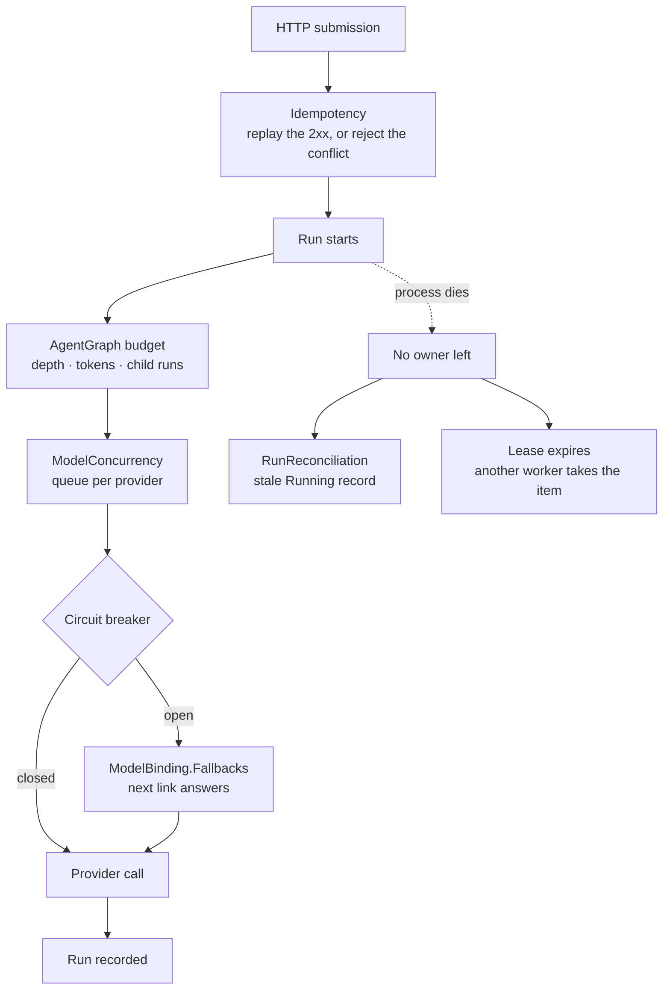

Reliable agent execution is not one retry switch. Provider calls, HTTP submissions,
background leases, live cancellation, and multi-agent trees fail at different
boundaries. AgentPrism gives each boundary a separate control so recovery stays
explicit.



A useful production baseline is:

```json
{
  "AgentPrism": {
    "CircuitBreaker": {
      "Enabled": true,
      "FailureThreshold": 5,
      "BreakDuration": "00:00:30"
    },
    "Idempotency": {
      "Enabled": true,
      "MaxKeyLength": 255
    },
    "SingletonExecution": {
      "Enabled": true,
      "LeaseDuration": "00:01:00"
    },
    "RunReconciliation": {
      "Enabled": true,
      "HeartbeatInterval": "00:00:30",
      "OrphanThreshold": "00:05:00",
      "ScanInterval": "00:01:00",
      "MaxRunsPerScan": 100
    },
    "AgentGraph": {
      "MaxDepth": 3,
      "MaxTotalTokens": 200000,
      "MaxTotalRuns": 25
    },
    "ModelConcurrency": {
      "MaxConcurrentCallsPerProvider": null
    }
  }
}
```

Enable the SQL provider before treating singleton election, reconciliation, or
idempotency as cluster-wide. Their in-memory stores coordinate only one process.

## Stop calling an unhealthy provider

The circuit breaker is maintained per provider name and per process. After five
consecutive counted failures by default, it opens for 30 seconds. Calls rejected by
an open circuit do not reach the provider and throw
`AgentPrismProviderUnavailableException`; its `ProviderName` and `RetryAfter` tell an
HTTP or job caller when recovery can be tried.

A successful provider call resets the consecutive failure count. Caller cancellation
and `AgentPrismContentBlockedException` do not count as provider failures. Other
provider-client failures do. After the break duration, new calls can probe recovery;
a successful probe closes the circuit.

| Setting | Default | Validation |
|---|---:|---|
| `CircuitBreaker.Enabled` | `true` | When false, every call reaches the provider |
| `FailureThreshold` | `5` | Must be at least `1` |
| `BreakDuration` | 30 seconds | Must be positive |

The breaker fails fast. It does not replay a complete direct run, and it does not
roll back tool calls that already succeeded. Decide retry policy at the HTTP client,
job, or business-operation boundary where idempotency is known.

An open circuit still blocks a call even when [response caching](/guides/model-providers/#response-caching)
is on for that agent: the breaker sits outside the whole tool-call loop, a cached
lookup sits inside it, so a would-be cache hit is never reached while the circuit is
open. Once the circuit closes again, the same prompt can still resolve from cache.

## Fall back to a secondary provider

`ModelBinding.Fallbacks` is an ordered list of `{ provider, model }` links tried
after the primary binding, without changing today's behavior when the list is
empty:

```json
{
  "provider": "openai",
  "model": "gpt-5.4-mini",
  "fallbacks": [
    { "provider": "anthropic", "model": "claude-opus-5" },
    { "provider": "google", "model": "gemini-3.6-flash" }
  ]
}
```

A fallback link carries only a provider and a model name — none of the primary
binding's temperature, `maxOutputTokens`, or `providerSettings` carry over. Give
the fallback model its own settings through a separate agent if it needs them.

The chain tries the next link only for a transient failure: the local circuit
already open, a `5xx`/`429` response, or a bare connection error. It never falls
back on an authentication error (`401`/`403`) or a canceled request — masking a
misconfigured key behind a silent provider switch costs more than the switch
saves. A provider's own content/safety filter is not a fallback trigger either;
that decision is made once, after whichever link actually answered.

Registering an `IProviderRetryClassifier` overrides this decision for a
specific SDK exception without replacing the built-in rules above — see
[Write your own error classifier](/guides/write-your-own-error-classifier/).

A fallback switch is never silent. The run record gets a `ModelFallbackUsed`
event naming the primary and fallback bindings, and cost and the `runs.model_id`
column both reflect the model that actually answered — not the primary
binding. `RunStatistics.ByModel` groups by the real model too.

If every link in the chain fails, the error surfaces the **first** failure, not
the last one — the root cause across a chain of transient errors is more useful
than whichever link happened to fail last — and its message names every
provider that was tried.

Because the fallback client wraps the whole tool-call loop, switching providers
mid-turn restarts that turn from scratch on the fallback provider — the
conversation state itself is not carried over. A tool call that already
completed on an earlier link is not run a second time, though: every link in
the chain shares one ledger for the turn, so if the fallback model asks the
same question again, it gets the already-computed answer instead of running
the tool's body a second time. This matters for a tool with a real side effect
(charging a payment, sending a webhook, deleting a record) — without it, a
provider outage that happens right after such a tool call would silently run
it twice. A read-only tool call is answered from the ledger the same way; the
rule does not special-case tool effects, only whether the exact same call was
already made in this turn. This only applies to a non-streaming run: a
streaming response can only fall back before its first chunk, at which point
no tool has been called yet.

| Setting | Default | Effect |
|---|---:|---|
| `ModelBinding.Fallbacks` | `[]` | Empty preserves today's behavior: an unavailable primary throws |

## Limit outgoing concurrency per provider

`ModelConcurrency.MaxConcurrentCallsPerProvider` bounds how many calls to one
provider can be in flight at once, across every agent that binds to it. The goal
is to avoid producing the burst of `429` responses that would eventually open
the circuit breaker in the first place. A call over the limit **waits** for a
slot — bounded by its own cancellation token — instead of being rejected; an
immediate rejection would turn a short traffic spike into exactly the failure
this setting exists to prevent.

| Setting | Default | Effect |
|---|---:|---|
| `ModelConcurrency.MaxConcurrentCallsPerProvider` | `null` (unlimited) | `null` matches today's behavior; the hot path allocates nothing extra |

## Make supported HTTP submissions idempotent

Add a unique `Idempotency-Key` to a non-streaming request:

```bash
curl -i https://agents.example.com/agentprism/api/agents/support/run \
  -H "Authorization: Bearer $AGENTPRISM_API_KEY" \
  -H 'Content-Type: application/json' \
  -H 'Idempotency-Key: support-ticket-4182-v1' \
  -d '{"message":"Prepare the customer-safe status for ticket 4182."}'
```

The management run endpoint normally streams SSE. Supplying an idempotency key makes
this endpoint return one buffered JSON response so it can be stored and replayed. A
later request with the same tenant, key, method, path, and exact request body receives
the saved response and `Idempotency-Replayed: true`.

Idempotency is attached only to these routes:

- `POST /api/agents/{name}/run`
- `POST /v1/responses`
- `POST /v1/chat/completions`

It does not apply globally to management writes. A request without the header avoids
body buffering and the idempotency-store query.

### Exact outcomes

| Condition | Result |
|---|---|
| First request reserves the key | The endpoint executes |
| Same completed 2xx request | Stored status, body, content type, `Location`, and `Preference-Applied` are replayed |
| Same key is still in progress | `409 Conflict` |
| Same key, different path or raw body | `422 Unprocessable Entity` |
| Key longer than 255 characters by default | `400 Bad Request` |
| Key on a request whose body sets `stream:true` | `400 Bad Request` |
| Idempotency is disabled but the header is present | `501 Not Implemented`; the endpoint does not execute |
| Endpoint returns non-2xx or throws | Reservation is released; a retry can execute |

The fingerprint contains the HTTP method, path, and raw body. Semantically equivalent
JSON with different whitespace or property order is a different request. Generate the
key at the business operation boundary and reuse both the serialized bytes and key on
transport retry.

In a crash after reservation but before completion, an `InProgress` record can remain.
SQL makes that record visible to every node but does not infer whether the side effect
finished. Set a retention policy for idempotency keys and build an operator path for
the rare uncertain result. Configuration retention is off by default; its enabled
fallback for idempotency records is one day.

## Cancel with the right delivery guarantee

Request cancellation with:

```bash
curl -i -X POST \
  -H "Authorization: Bearer $AGENTPRISM_API_KEY" \
  https://agents.example.com/agentprism/api/runs/$RUN_ID/cancel
```

For a registered live run, AgentPrism returns `202 Accepted`. This confirms that the
request reached the owner, not that execution already stopped. Poll the run until it
reaches a terminal status. Providers and tools must observe and pass on the
cancellation token.

The live cancellation registry is in-process by default. A request routed to another
instance, or sent after the owner restarts, returns `409`. Unknown and cross-tenant
runs return `404`; terminal runs return `409`. Queued-run cancellation uses the
shared job store and can work across processes.

Canceling a root run propagates to its child runs. Canceling one child does not cancel
the root or its siblings.

## Reconcile runs left behind by a crash

With run reconciliation enabled, active runs write a bulk heartbeat every 30 seconds
by default. A periodic scan closes `Running` records that have not signaled for five
minutes. The reconciler changes them to `Failed`, records the infrastructure error
type `orphaned`, and appends a `RunFailed` event.

Only `Running` records are reconciled. Queued work belongs to the job queue and its
leases. Heartbeat-write failures are logged, and the next interval tries again.

| Setting | Default | Validation or effect |
|---|---:|---|
| `RunReconciliation.Enabled` | `false` | No heartbeats or scan until enabled |
| `HeartbeatInterval` | 30 seconds | Must be positive |
| `OrphanThreshold` | 5 minutes | Must be positive and at least the heartbeat interval |
| `ScanInterval` | 1 minute | Must be positive |
| `MaxRunsPerScan` | `100` | Must be positive; bounds one pass |

Choose `OrphanThreshold` above the longest expected database pause, runtime stop-the-
world event, or deployment handoff. A threshold that is too short can close a run
whose process is still working.

## Continue an interrupted run automatically

`RunContinuation` builds on reconciliation: right after an orphaned `Running` record
closes, a session-bound run can be picked up again — in the same session, as a new
run — instead of staying `Failed` for good.

```json
{
  "AgentPrism": {
    "RunContinuation": {
      "Enabled": true,
      "MaxAttempts": 1
    }
  }
}
```

The continuation re-sends the interrupted turn's original input into the same
session and lets the model run its turn again from the start. Every tool call the
interrupted run already completed is answered from its own recorded result instead
of running again; only a call past the interruption point — one with no recorded
result, because it never happened — actually runs. A tool the interrupted run called
with different arguments each time can still repeat, because matching is by the
exact recorded arguments.

A tool whose effect is destructive or leaves the process (a database delete, a
payment, a webhook) blocks continuation by default; the interrupted run stays
`Failed` and its event stream records why. A tool author who can prove a call is
safe to repeat — typically because it carries its own idempotency key — opts that
one tool back in when registering it. A run with no session, or one whose chain has
already reached `MaxAttempts`, is never continued.

The new run's record links back to the interrupted one, so an operator reading the
run tree can see that a run continued another rather than starting fresh.

| Setting | Default | Effect |
|---|---:|---|
| `RunContinuation.Enabled` | `false` | No continuation is attempted until `RunReconciliation` is also enabled |
| `MaxAttempts` | `1` | The most continuations one interruption chain may have before it stays `Failed` |

## Elect one owner for periodic services

`SingletonExecution.Enabled` adds lease-based cluster election to AgentPrism's
periodic model-health refresh, MCP discovery, run reconciliation, approval expiry,
and canary evaluation. It is off by default and uses a 60-second lease. Renewal runs
at one third of the lease duration. An empty `OwnerId` becomes a
machine/process/unique-suffix identifier.

Lease acquisition or renewal errors are logged. The process stops treating itself as
the owner until it acquires a valid lease again. This is coordination, not a guarantee
that an external side effect happens exactly once.

The background job queue does not use this option. It already owns independent job
leases, so turning on singleton execution does not reduce job-worker concurrency.

## Bound multi-agent trees

Every root run creates a budget shared by its child-agent tree:

| Limit | Default | Meaning |
|---|---:|---|
| `AgentGraph.MaxDepth` | `3` | Root is depth zero; negative values clamp to zero |
| `AgentGraph.MaxTotalTokens` | `200,000` | Zero or negative removes the token limit |
| `AgentGraph.MaxTotalCost` | none | Zero, negative, or unset removes the cost limit |
| `AgentGraph.MaxTotalRuns` | `25` | Counts child runs only; zero or negative removes the count limit |
| `AgentGraph.MaxDuration` | none | Zero, negative, or unset removes the wall-clock limit |

`MaxDepth` and `MaxTotalRuns` only stop a *new* child run from starting — a run
already in progress finishes even if the tree is over either limit.
`MaxTotalTokens`, `MaxTotalCost`, and `MaxDuration` are enforced differently:
the check runs between two model turns, inside the tool-call loop, so a tree
that has already spent past its limit is cut off before its *next* model
call — mid-run, not only at the next child call. The run ends `Failed` with
`error_class: QuotaExceeded` and a message naming which limit was hit and
which setting raises it. A cost limit falls back to the token limit for a
model whose price is undefined (`PricingSource.Unknown`) — the cost cannot be
measured, so it cannot be enforced.

`MaxDuration` is not a hard timeout: a tool call already running when the
deadline passes is never interrupted, only the *next* model call after it is
refused. It applies the same way to a queued (`Prefer: respond-async`) run,
whose lease is otherwise renewed for as long as the run keeps going — before
`MaxDuration`, nothing capped a queued run's wall-clock time.

Because several branches of a tree can be mid-turn at the same time, the check
is not perfectly precise: two concurrent turns can each pass the check before
either records its spend, so a tree can still overshoot its limit by a bounded
amount before the next check on each branch catches it. Use stricter per-run
budgets for externally exposed MCP and A2A agents.

## Wait for in-flight runs before the process stops

By default a process that receives a stop signal exits immediately and any run in
flight is cut off — the same crash reconciliation and continuation exist to recover
from. `Drain` makes a graceful stop wait instead:

```json
{
  "AgentPrism": {
    "Drain": {
      "Enabled": true,
      "Timeout": "00:00:30"
    }
  }
}
```

Once a stop signal arrives, new runs are refused — the run endpoint returns `503`,
and the background job worker stops leasing new jobs — while runs already in flight
are given up to `Timeout` to finish before the process actually exits. A run that is
still going when the timeout elapses is cut off anyway; a stuck run must not block a
deployment forever. The host's own shutdown timeout still applies on top of this
value, so raise both together for the full wait to take effect.

| Setting | Default | Effect |
|---|---:|---|
| `Drain.Enabled` | `false` | The process stops immediately, exactly as before |
| `Drain.Timeout` | 30 seconds | The longest a stop waits for in-flight runs |

## Failure boundaries at a glance

| Failure | AgentPrism response | Your responsibility |
|---|---|---|
| Consecutive provider errors | Open the local provider circuit and fail fast | Choose whether the whole business operation is safe to retry |
| Primary provider unavailable, transiently | Try the next `ModelBinding.Fallbacks` link and record which one answered | Configure a fallback chain for agents where availability matters more than a fixed model |
| Provider approaching its own rate limit | Queue outgoing calls at `ModelConcurrency.MaxConcurrentCallsPerProvider` instead of bursting | Set a limit sized to the provider's own quota, if bursts are a recurring problem |
| Duplicate supported HTTP request | Replay the completed 2xx response or reject conflict | Keep key and serialized request stable |
| Process dies during a direct run | Reconcile a stale `Running` record when enabled, and continue it in the same session when safe | Make external tool effects idempotent, or declare a tool safe to repeat |
| Process dies during a queued job | Release or expire the lease for another worker | Make item processing replay-safe |
| Process receives a stop signal mid-run | Wait up to `Drain.Timeout` for in-flight runs, refuse new ones | Set a timeout that covers your slowest normal run |
| Live cancel reaches wrong node | Return `409` | Use sticky routing or a distributed cancellation registry |
| Child-agent fan-out grows | Refuse new children at tree limits | Set budgets that match cost and latency objectives |

:::caution[Production caveat]
Do not combine automatic retries with side-effecting tools until you can prove an
operation-level idempotency contract. HTTP response idempotency prevents duplicate
execution only on its three supported ingress routes. It cannot undo or deduplicate a
tool call after a process fails. Use SQL for cluster coordination, and monitor lease
age, orphaned runs, open circuits, and `409` cancellation responses.
:::

## Troubleshooting

| Symptom | Check |
|---|---|
| Every call fails fast with provider unavailable | Inspect the provider circuit and `RetryAfter`; fix upstream health before adding retries |
| A run's response came from an unexpected model | Check the run's events for `ModelFallbackUsed`; the primary provider was unavailable for that call |
| A fallback never triggers on a real outage | Confirm the failure is transient (`5xx`/`429`/connection error) — a `401`/`403` or a canceled request never retries by design |
| The same idempotency key returns `422` | Method, path, or raw JSON bytes changed; reuse the original serialization or issue a new key for a new operation |
| A duplicate request returns `409` | The first reservation is still in progress; wait and query the original operation instead of starting another |
| An idempotent request returns `400` | Remove streaming or shorten the key to `MaxKeyLength` |
| An idempotent request returns `501` | Re-enable `AgentPrism:Idempotency` or omit the header and accept normal execution semantics |
| A run stays `Running` after a process crash | Enable reconciliation, use shared SQL state, and confirm singleton election permits a scanner to run |
| Healthy long runs become `orphaned` | Increase `OrphanThreshold`; inspect heartbeat-store latency and failures |
| Two nodes perform the same periodic scan | Confirm singleton execution is enabled and backed by the same SQL database; in-memory leases are process-local |
| A cancel request returns `409` | The run is terminal, the live owner restarted, or the request reached another node |
| A child call is refused | Inspect depth, child-run count, and total-token budget on the root tree |
| An orphaned run never continues | Confirm `RunContinuation.Enabled` and `RunReconciliation.Enabled` are both on, the run had a session, and its chain has not already reached `MaxAttempts` |
| A continuation stops instead of finishing | A tool it called has no recorded result and no matching arguments in the new turn; check the tool's argument stability, or whether its effect blocks continuation entirely |
| A run request returns `503` right after a deploy | The process is draining; retry shortly, or lower `Drain.Timeout` if deploys should not wait this long |

## Read next

- [Jobs, schedules, and queues](/guides/background-work/) — the queue these failure boundaries protect
- [Observability and cost](/guides/observability/) — the signals that tell you a boundary fired
- [Production deployment](/guides/production/) — the process topology that makes reconciliation possible
