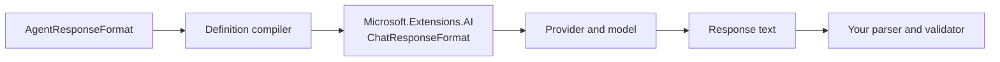

Structured output changes the format requested from the model. It does not turn a
model response into a trusted .NET object, and it does not add server-side schema
validation after the response arrives.

## Mental model: constrain, then verify



AgentPrism validates the configuration. The provider asks the model for the format.
Your application still parses and validates the result at its trust boundary.

## Choose the mode

| `ResponseFormat` | Request sent to the provider | Local response validation |
|---|---|---|
| `null` | No format constraint | None |
| `Text` | Explicit plain-text format | None |
| `Json` | Valid JSON document, with no schema | None |
| `JsonSchema` | JSON that follows the supplied schema | None |

`null` and `Text` are not the same. `null` leaves the provider behavior unchanged.
`Text` asks for plain text explicitly.

## Define a JSON Schema response in C#

Use a `JsonElement` schema. Clone the root element before disposing its document.

```csharp
using System.Text.Json;
using AgentPrism;

using var schemaDocument = JsonDocument.Parse(
    """
    {
      "type": "object",
      "additionalProperties": false,
      "required": ["invoiceNumber", "currency", "total"],
      "properties": {
        "invoiceNumber": { "type": "string" },
        "currency": { "type": "string" },
        "total": { "type": "number" }
      }
    }
    """);

agentPrism.AddAgent(new AgentDefinition
{
    Name = "invoice-extractor",
    Instructions = "Extract only facts present in the supplied invoice.",
    Model = new ModelBinding
    {
        Provider = OpenAIProviderNames.ChatCompletions,
        Model = "your-structured-output-model",
        ResponseFormat = new AgentResponseFormat
        {
            Kind = AgentResponseFormatKind.JsonSchema,
            Schema = schemaDocument.RootElement.Clone(),
            SchemaName = "invoice",
            SchemaDescription = "Normalized invoice fields.",
        },
    },
});
```

AgentPrism uses the `ChatResponseFormat.ForJsonSchema(JsonElement, …)` overload. It
does not reflect over a CLR type, so this path preserves the runtime's AOT stance.

For schema-free JSON, use:

```csharp
ResponseFormat = new AgentResponseFormat
{
    Kind = AgentResponseFormatKind.Json,
}
```

## Validate an HTTP definition in CI

`POST /api/agents/validate` compiles a definition without saving it and without
calling a model:

```bash
curl -sS -X POST http://localhost:5081/agentprism/api/agents/validate \
  -H "Authorization: Bearer $AGENTPRISM_TOKEN" \
  -H 'Content-Type: application/json' \
  -d '{
    "name": "invoice-extractor",
    "instructions": "Extract only facts present in the supplied invoice.",
    "model": {
      "provider": "openai",
      "model": "your-structured-output-model",
      "responseFormat": {
        "kind": "JsonSchema",
        "schemaName": "invoice",
        "schemaDescription": "Normalized invoice fields.",
        "schema": {
          "type": "object",
          "additionalProperties": false,
          "required": ["invoiceNumber", "currency", "total"],
          "properties": {
            "invoiceNumber": { "type": "string" },
            "currency": { "type": "string" },
            "total": { "type": "number" }
          }
        }
      }
    }
  }'
```

A valid HTTP body returns `200`. Read the response's `valid` field and messages. A
definition error is a validation result, not an HTTP transport error.

The console agent editor exposes the same four choices: not set, Text, JSON, and JSON
Schema. In JSON Schema mode it also edits the schema name, description, and JSON
object. Saving still goes through server compilation.

## What AgentPrism checks

The compiler rejects these combinations before a run:

- `JsonSchema` without `Schema`
- A schema whose JSON root is not an object
- A schema supplied with `Text` or `Json`
- `Json` or `JsonSchema` for a cataloged model whose
  `SupportsStructuredOutput` value is `false`

AgentPrism checks only that the schema is a JSON object. It does not validate the
schema vocabulary, references, keywords, or logical consistency.

The model catalog needs special attention. `ModelDescriptor.SupportsStructuredOutput`
defaults to `false`. If the model is present in the catalog, set this flag to `true`
only after you verify the provider/model combination. If the model is absent from the
catalog, AgentPrism skips the capability preflight because the catalog is metadata,
not an allow list. The provider can still reject the request at run time.

:::caution[Provider support is the final gate]
AgentPrism normalizes the request through `Microsoft.Extensions.AI`. The selected
provider and model decide whether `Json` or `JsonSchema` is supported and which JSON
Schema features they accept. Test the exact provider, model, and API surface you use.
:::

## Design schemas for reliable extraction

Keep the schema small and explicit. Mark required fields. Use
`additionalProperties: false` when extra keys would break consumers. Put semantic
rules in property descriptions and repeat critical evidence rules in the agent
instructions.

Do not use structured output as authorization or business validation. After the run:

1. Parse JSON with bounded input settings.
2. Validate it against the schema or a typed contract.
3. Apply domain rules, such as allowed currency codes and non-negative totals.
4. Reject or quarantine invalid output. Do not silently repair security-sensitive
   fields.

This second check is necessary because AgentPrism does not validate the returned
payload against your schema.

## Defaults and caveats

| Item | Behavior |
|---|---|
| `ModelBinding.ResponseFormat` | `null`; no constraint is sent |
| `SchemaName` | Optional; passed to the provider |
| `SchemaDescription` | Optional; passed to the provider |
| Schema root | Must be a JSON object |
| Schema vocabulary validation | Not performed |
| Returned payload validation | Not performed |
| Capability check | Enforced only when the selected model exists in the configured catalog |
| Streaming | The structured document can still arrive in multiple text updates |

For a streamed run, assemble the complete response before parsing JSON. Individual
SSE text events are fragments, not standalone JSON documents.

## Troubleshooting

**“Schema must be a JSON object.”** Pass the schema object itself. Do not wrap it in a
JSON string or array.

**The compiler says the model does not support structured output.** The model exists
in your configured catalog with `SupportsStructuredOutput = false`, which is also the
property default. Correct the catalog only if that exact provider/model surface
supports the feature.

**Validation succeeds, but the provider rejects the run.** The model was absent from
the catalog, or the provider supports a smaller schema subset. Verify the exact API
surface and simplify unsupported keywords.

**The response parses but violates a business rule.** Structured output controls
shape, not truth. Run normal domain validation after deserialization.

**JSON parsing fails during streaming.** Buffer the response text until the run is
complete. Do not parse each SSE frame as a document.

**The model returns JSON inside a Markdown fence.** Confirm that the selected model
supports the requested format. Use `Json` or `JsonSchema`, not prompt wording alone,
and still reject a fenced payload at the application boundary.

## Related

- [Model providers](/AgentPrism/guides/model-providers/)
- [Agents and definitions](/AgentPrism/concepts/agents/)
- [Agent management HTTP API](/AgentPrism/http-api/agents/)
- [`AgentResponseFormat` API](/AgentPrism/api/agentprism.agentresponseformat/)
- [`AgentResponseFormatKind` API](/AgentPrism/api/agentprism.agentresponseformatkind/)
- [`ModelBinding` API](/AgentPrism/api/agentprism.modelbinding/)
