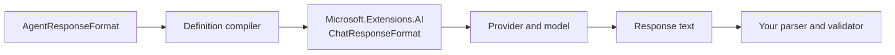

Structured output changes the format requested from the model. It does not turn a
model response into a trusted .NET object, and it does not add server-side schema
validation after the response arrives — an opt-in seam can check well-formedness and
your own rules before the run closes; see [Validate the response](#validate-the-response).

## Mental model: constrain, then verify



Tracon validates the configuration. The provider asks the model for the format.
Your application still parses and validates the result at its trust boundary.

## Choose the mode

| `ResponseFormat` | Request sent to the provider | Local response validation (default) |
|---|---|---|
| `null` | No format constraint | None |
| `Text` | Explicit plain-text format | None |
| `Json` | Valid JSON document, with no schema | None |
| `JsonSchema` | JSON that follows the supplied schema | None |

The last column is the **default**, not a permanent limit: with
`Tracon:StructuredResponse:Enabled` turned on, a `Json` or `JsonSchema`
response is checked for well-formed JSON before the run closes, and your own
`IStructuredResponseValidator` runs alongside it. What is never built in — on or
off — is validation of the payload against the schema you supplied; that is a
rule you write in the validator. See [Validate the response](#validate-the-response).

`null` and `Text` are not the same. `null` leaves the provider behavior unchanged.
`Text` asks for plain text explicitly.

## Define a JSON Schema response in C#

Use a `JsonElement` schema. Clone the root element before disposing its document.

```csharp
using System.Text.Json;
using Tracon;

using var schemaDocument = JsonDocument.Parse(
    """
    {
      "type": "object",
      "additionalProperties": false,
      "required": ["invoiceNumber", "currency", "total"],
      "properties": {
        "invoiceNumber": { "type": "string" },
        "currency": { "type": "string" },
        "total": { "type": "number" }
      }
    }
    """);

tracon.AddAgent(new AgentDefinition
{
    Name = "invoice-extractor",
    Instructions = "Extract only facts present in the supplied invoice.",
    Model = new ModelBinding
    {
        Provider = OpenAIProviderNames.ChatCompletions,
        Model = "your-structured-output-model",
        ResponseFormat = new AgentResponseFormat
        {
            Kind = AgentResponseFormatKind.JsonSchema,
            Schema = schemaDocument.RootElement.Clone(),
            SchemaName = "invoice",
            SchemaDescription = "Normalized invoice fields.",
        },
    },
});
```

Tracon uses the `ChatResponseFormat.ForJsonSchema(JsonElement, …)` overload. It
does not reflect over a CLR type, so this path preserves the runtime's AOT stance.

For schema-free JSON, use:

```csharp
ResponseFormat = new AgentResponseFormat
{
    Kind = AgentResponseFormatKind.Json,
}
```

## Validate an HTTP definition in CI

`POST /api/agents/validate` compiles a definition without saving it and without
calling a model:

```bash
curl -sS -X POST http://localhost:5081/tracon/api/agents/validate \
  -H "Authorization: Bearer $TRACON_TOKEN" \
  -H 'Content-Type: application/json' \
  -d '{
    "name": "invoice-extractor",
    "instructions": "Extract only facts present in the supplied invoice.",
    "model": {
      "provider": "openai",
      "model": "your-structured-output-model",
      "responseFormat": {
        "kind": "JsonSchema",
        "schemaName": "invoice",
        "schemaDescription": "Normalized invoice fields.",
        "schema": {
          "type": "object",
          "additionalProperties": false,
          "required": ["invoiceNumber", "currency", "total"],
          "properties": {
            "invoiceNumber": { "type": "string" },
            "currency": { "type": "string" },
            "total": { "type": "number" }
          }
        }
      }
    }
  }'
```

A valid HTTP body returns `200`. Read the response's `valid` field and messages. A
definition error is a validation result, not an HTTP transport error.

The console agent editor exposes the same four choices: not set, Text, JSON, and JSON
Schema. In JSON Schema mode it also edits the schema name, description, and JSON
object. Saving still goes through server compilation.

## What Tracon checks

The compiler rejects these combinations before a run:

- `JsonSchema` without `Schema`
- A schema whose JSON root is not an object
- A schema supplied with `Text` or `Json`
- `Json` or `JsonSchema` for a cataloged model whose
  `SupportsStructuredOutput` value is `false`

Tracon checks only that the schema is a JSON object. It does not validate the
schema vocabulary, references, keywords, or logical consistency.

The model catalog needs special attention. `ModelDescriptor.SupportsStructuredOutput`
defaults to `false`. If the model is present in the catalog, set this flag to `true`
only after you verify the provider/model combination. If the model is absent from the
catalog, Tracon skips the capability preflight because the catalog is metadata,
not an allow list. The provider can still reject the request at run time.

:::caution[Provider support is the final gate]
Tracon normalizes the request through `Microsoft.Extensions.AI`. The selected
provider and model decide whether `Json` or `JsonSchema` is supported and which JSON
Schema features they accept. Test the exact provider, model, and API surface you use.
:::

## Validate the response

`Tracon:StructuredResponse:Enabled` (default `false`) turns on a check that runs
after the model answers and before the run closes, for any agent whose
`ResponseFormat.Kind` is `Json` or `JsonSchema`:

```json
{
  "Tracon": {
    "StructuredResponse": {
      "Enabled": true
    }
  }
}
```

With it on, Tracon first checks well-formedness itself: the response must be
non-empty and parse as JSON. That check alone catches the two failure modes every
consumer would otherwise check by hand — an empty response and a response cut off
mid-document. Register `IStructuredResponseValidator` to add your own rule on top —
schema conformance, an allowed value range, a required field the schema does not
express:

```csharp
public sealed class ScoreRangeValidator : IStructuredResponseValidator
{
    public ValueTask<StructuredResponseValidationResult> ValidateAsync(
        StructuredResponseValidationContext context, CancellationToken cancellationToken = default)
    {
        using var document = JsonDocument.Parse(context.ResponseText);

        return document.RootElement.TryGetProperty("score", out var score) &&
               score.GetInt32() is >= 0 and <= 100
            ? new(StructuredResponseValidationResult.Valid)
            : new(StructuredResponseValidationResult.Invalid("'score' must be between 0 and 100."));
    }
}

services.AddSingleton<IStructuredResponseValidator, ScoreRangeValidator>();
```

There is no built-in JSON Schema validator — validation stays inside your own trust
boundary, the same stance [argument validation](/guides/write-your-own-tool/#argument-validation)
takes on the tool-call side. Nothing is registered by default, so an installation that
turns the flag on but registers no validator only gets the well-formedness check. If
your validator throws, the response is rejected (fail-closed) — a gate that fails open
on an exception is not a gate.

A rejected response closes the run as `Failed` with `runs.error_class`
`StructuredResponseInvalid` and writes a `StructuredResponseRejected` run event
carrying the safe reason, the requested `kind`, `schemaName`, `provider`, and `model` —
never the response text itself. Your `Invalid(reason)` string reaches that same event
and the run's error message, so it must not carry the response text either; a run
event is persistent.

:::caution[Streaming cannot un-send content]
On a streamed run the response reaches the client as it arrives; validation only runs
after the last update. A rejected streamed response still closes the run as `Failed`
and still writes the event, but the client already received the invalid content — an
agent that uses structured output as a gate should not stream.
:::

## Let the model repair a rejected response

`Tracon:StructuredResponse:MaxRepairAttempts` (default `0`) lets a rejected
response get a bounded number of second chances before the run fails:

```json
{
  "Tracon": {
    "StructuredResponse": {
      "Enabled": true,
      "MaxRepairAttempts": 2
    }
  }
}
```

`0` disables repair entirely — an invalid response fails the run exactly as it does
without this setting. A value of `2` permits at most **three** model calls in
total: the original turn plus two repairs. Each repair turn resends the original
messages together with the rejected response and a short, fixed correction message,
through the same call every other model turn makes — the tree's token, cost, and
duration budget, the deadline, cancellation, and the fallback chain all apply to a
repair turn exactly as they do to any other. A repair turn never opens a second
`Idempotency-Key`, a child run, or a separate model pipeline: it stays inside the
same run, and its token usage is folded into that run's own `usage` total.

Each attempt writes its own `StructuredResponseRejected` event; a repair round that
is about to start writes `StructuredResponseRepairAttempted` first. When repair
finally succeeds, the run closes `Completed` and its `usage` is the sum of every
attempt. When the attempts run out, the run closes `Failed` with the same
`StructuredResponseInvalid` error class a straight rejection uses — repair adds no
new failure category to handle.

Repair never runs on the streaming path, for the same reason validation there cannot
undo already-sent content: see the caution above.

:::caution[Repair does not run on a run that carries a session]
A run you gave a `sessionId` gets **no repair budget**, even when
`MaxRepairAttempts` is set: the rejection fails the run exactly as it would with
repair switched off, and the rejection event carries `repairSuppressedBySession`
so you can tell the two apart.

The reason is that the underlying agent framework saves a turn's request and
response as soon as that one model call completes — before Tracon can judge
it. Repairing anyway would let the run succeed while the conversation it belongs
to still ended in the rejected draft, so your next turn would read an answer the
caller never received. Failing instead keeps the run's result and the
conversation saying the same thing.

Use repair on stateless runs — extraction, classification, generation jobs. For a
structured agent that must keep a conversation, validate and handle the rejection
in your own code. This is a current limitation, not a permanent contract.
:::

## Design schemas for reliable extraction

Keep the schema small and explicit. Mark required fields. Use
`additionalProperties: false` when extra keys would break consumers. Put semantic
rules in property descriptions and repeat critical evidence rules in the agent
instructions.

Do not use structured output as authorization or business validation. After the run:

1. Parse JSON with bounded input settings.
2. Validate it against the schema or a typed contract.
3. Apply domain rules, such as allowed currency codes and non-negative totals.
4. Reject or quarantine invalid output. Do not silently repair security-sensitive
   fields.

This second check is necessary because Tracon does not validate the returned
payload against your schema.

## Defaults and caveats

| Item | Behavior |
|---|---|
| `ModelBinding.ResponseFormat` | `null`; no constraint is sent |
| `SchemaName` | Optional; passed to the provider |
| `SchemaDescription` | Optional; passed to the provider |
| Schema root | Must be a JSON object |
| Schema vocabulary validation | Not performed |
| Returned payload validation against your schema | Not performed, on or off — write it in `IStructuredResponseValidator` |
| Returned payload JSON syntax check | Not performed by default; performed when `StructuredResponse:Enabled` is on |
| Capability check | Enforced only when the selected model exists in the configured catalog |
| Streaming | The structured document can still arrive in multiple text updates |
| `Tracon:StructuredResponse:Enabled` | `false`; the response is never inspected after the model returns it |
| `IStructuredResponseValidator` | No-op by default (always valid); register your own to enforce a rule |
| `Tracon:StructuredResponse:MaxRepairAttempts` | `0`; repair is off, an invalid response fails the run immediately |

For a streamed run, assemble the complete response before parsing JSON. Individual
SSE text events are fragments, not standalone JSON documents.

## Troubleshooting

**“Schema must be a JSON object.”** Pass the schema object itself. Do not wrap it in a
JSON string or array.

**The compiler says the model does not support structured output.** The model exists
in your configured catalog with `SupportsStructuredOutput = false`, which is also the
property default. Correct the catalog only if that exact provider/model surface
supports the feature.

**Validation succeeds, but the provider rejects the run.** The model was absent from
the catalog, or the provider supports a smaller schema subset. Verify the exact API
surface and simplify unsupported keywords.

**The response parses but violates a business rule.** Structured output controls
shape, not truth. Run normal domain validation after deserialization.

**JSON parsing fails during streaming.** Buffer the response text until the run is
complete. Do not parse each SSE frame as a document.

**The model returns JSON inside a Markdown fence.** Confirm that the selected model
supports the requested format. Use `Json` or `JsonSchema`, not prompt wording alone,
and still reject a fenced payload at the application boundary.

## In the reference

- [Agent management HTTP API](/http-api/agents/)
- [`AgentResponseFormat` API](/api/tracon.agentresponseformat/)
- [`AgentResponseFormatKind` API](/api/tracon.agentresponseformatkind/)
- [`ModelBinding` API](/api/tracon.modelbinding/)
- [`IStructuredResponseValidator` API](/api/tracon.istructuredresponsevalidator/)
- [`TraconStructuredResponseOptions` reference](/reference/configuration/#structured-response-validation)

## Read next

- [Model providers](/guides/model-providers/)
- [Agents and definitions](/concepts/agents/)
