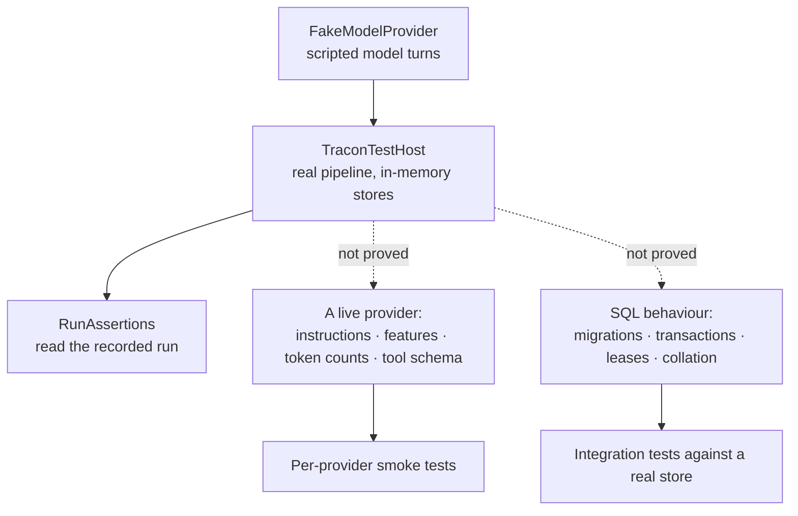

:::note[Preview packages]
Tracon is published as `1.0.0-preview.3`. Use `--prerelease` for discovery or
pin the exact version for reproducible builds.
:::

`Tracon.Testing` runs your agent through the real Tracon HTTP, catalog, tool,
recording, and streaming pipeline without a database or network model call. You
control the provider response, then assert against the recorded run model rather than
mocking internal services.



Add it to the test project only:

```bash
dotnet add package Tracon.Testing --prerelease
```

The meta package does not include it. The package targets .NET 10, has no Native AOT
promise, and does not depend on xUnit, NUnit, MSTest, Shouldly, or FluentAssertions.

## Test a complete tool loop

This xUnit example scripts one tool call and then makes the final model response
depend on the real tool result:

```csharp
using Tracon;
using Tracon.Testing;

public sealed class SupportAgentTests
{
    [Fact]
    public async Task Order_status_comes_from_the_registered_tool()
    {
        var provider = new FakeModelProvider()
            .CallsTool("get_order_status", new { orderId = "ORD-7" })
            .EchoesLastToolResult("Agent: ");

        await using var host = await TraconTestHost.StartAsync(options =>
        {
            options.ModelProvider = provider;
            options.ConfigureTracon = tracon => tracon
                .AddToolsFrom(typeof(OrderTools))
                .AddAgent(new AgentDefinition
                {
                    Name = "support",
                    Instructions = "Give a short, factual order status.",
                    Model = new ModelBinding
                    {
                        Provider = provider.Name,
                        Model = "fake-model",
                    },
                    ToolNames = ["get_order_status"],
                    Origin = AgentDefinitionOrigin.Code,
                });
        });

        var run = await host.RunAsync("support", "Where is ORD-7?");

        run.ShouldHaveCompleted()
            .ShouldHaveCalledTool("get_order_status", times: 1)
            .ShouldHaveOutputContaining("Order ORD-7 has shipped.");
    }

    private static class OrderTools
    {
        [TraconTool(
            "get_order_status",
            "Returns the current shipping status of an order.")]
        public static string GetOrderStatus(string orderId)
            => $"Order {orderId} has shipped.";
    }
}
```

`RunAsync()` posts to the real management run endpoint, drains its SSE stream, reads
the final run record and events, and returns `RunAssertions`. A missing agent, rejected
request, missing run frame, or missing run record throws
`TraconAssertionException` with the observed response.

## Script deterministic model behavior

Each model has an ordered response queue. Each provider call consumes one step:

```csharp
var provider = new FakeModelProvider()
    .RespondsWith(
        "First model response",
        "Second model response")
    .EchoesUserMessage();
```

After the two fixed responses are consumed, every later call echoes the latest user
message. The fallback lasts for the lifetime of that provider. If you do not select a
fallback, the lasting fallback text is `fake response`.

Available scripts are:

| Method | Behavior |
|---|---|
| `RespondsWith(params string[])` | Enqueues fixed text responses |
| `RespondsWith(text, inputTokens, outputTokens)` | Enqueues text with reported usage for cost and metric tests |
| `CallsTool(name, arguments)` | Enqueues one model-requested tool call |
| `EchoesUserMessage()` | Uses the latest user message after the queue drains |
| `EchoesLastToolResult(prefix, ...)` | Uses the latest real tool result after the queue drains |
| `ForModel(modelId, configure)` | Gives one model an independent queue and fallback |
| `WithModel(ModelDescriptor)` | Advertises an explicit model descriptor |

Use separate queues when an agent graph selects more than one model:

```csharp
var provider = new FakeModelProvider()
    .ForModel("router", script => script
        .CallsTool("background_agents_start_task", new { agentName = "researcher" })
        .RespondsWith("Routing complete."))
    .ForModel("researcher", script => script
        .RespondsWith("Research complete.", inputTokens: 120, outputTokens: 24));
```

`ForModel()` also advertises that model when it is not already in `Models`. The
default provider is named `fake`. Without explicit models, it advertises
`fake-model` with an 8,192-token context window and a 1,024-token output limit.

## Inspect what reached the provider

`Requests` is ordered oldest to newest and records the actual messages, chat options,
tool definitions, and streaming mode that reached the fake:

```csharp
Assert.Equal(2, provider.Requests.Count); // tool request, then final response

var firstRequest = provider.Requests[0];
Assert.True(firstRequest.IsStreaming);
Assert.Contains(firstRequest.Messages, message =>
    message.Text?.Contains("Where is ORD-7?", StringComparison.Ordinal) == true);
Assert.Contains(firstRequest.Options?.Tools ?? [], tool =>
    tool.Name == "get_order_status");
```

Inspect recorded requests when a test must prove prompt history, model options, or
tool exposure. Assert run behavior for user-visible outcomes. Tests tied to every
internal message can become brittle when the framework changes harmless formatting.

## Use framework-neutral run assertions

`RunAssertions` exposes `Record`, ordered `Events`, and `ToolInvocations`. Its fluent
methods throw `TraconAssertionException` on a mismatch:

```csharp
run.ShouldHaveCompleted();
run.ShouldHaveFailed();
run.ShouldHaveFailedWith("content_blocked");
run.ShouldHaveCalledTool("refund_order");
run.ShouldHaveCalledTool("refund_order", times: 1);
run.ShouldNotHaveCalledTool("delete_account");
run.ShouldHaveOutputContaining("refunded");
```

`ShouldHaveOutputContaining()` uses a completed message when present. For an SSE run,
it joins message-delta events. The helper does not combine both forms and therefore
does not duplicate output.

Use the raw host when a scenario needs an endpoint the convenience method does not
cover:

```csharp
await using var host = await TraconTestHost.StartAsync(options =>
{
    options.Prefix = "/control";
    options.ModelProvider = new FakeModelProvider().EchoesUserMessage();
    options.ConfigureTracon = tracon => tracon.AddAgent(agent);
});

using var response = await host.Client.GetAsync("/control/api/agents");
response.EnsureSuccessStatusCode();
```

`host.Services` exposes the built service provider for assertions against public
stores and services.

## Host defaults and limits

`TraconTestHostOptions` is the host's configuration: `Prefix` sets the mapped
path, `ModelProvider` swaps in your own fake, and `ConfigureServices`,
`ConfigureTracon`, and `ConfigureEndpoints` are the three hooks that let a test
reach the real registration chain.

| Host behavior | Default or limit |
|---|---|
| ASP.NET Core host | `WebApplication.CreateSlimBuilder()` with `UseTestServer()` |
| Persistence | In-memory stores; no database or migration |
| Route prefix | `/tracon` |
| Model provider | `new FakeModelProvider().EchoesUserMessage()` |
| External model traffic | None |
| Test framework dependency | None |
| Target framework | .NET 10 only |
| Native AOT | Not supported by the testing package |

`ConfigureServices` runs before `AddTracon()`. `ConfigureTracon` runs after
the fake provider is registered. `ConfigureEndpoints` changes `MapTracon()`
options. This order lets a test register its dependencies, then agents and tools,
then endpoint behavior without replacing the host.

## Know what this test does not prove

The host proves Tracon integration with your definitions and code tools. It does
not prove that a live provider follows instructions, supports a requested model
feature, returns the same token counts, or accepts the same tool schema. Keep a small
separate smoke-test suite for each real provider and model you deploy.

The in-memory stores do not prove SQL migrations, transaction behavior, cross-process
leases, database collation, or provider-specific query behavior. Test those boundaries
against the real PostgreSQL, SQL Server, or SQLite package in integration tests.

:::caution[Production caveat]
Never reference `Tracon.Testing` from the production application. It transitively
depends on the ASP.NET Core test host, uses reflection for anonymous tool arguments,
and makes no AOT promise. A deterministic fake is a test oracle, not evidence of model
quality or production-provider compatibility.
:::

## The tool dependency trap

The Microsoft Agent Framework pipeline gives tool calls an empty
`AIFunctionArguments.Services`. A tool must not resolve its dependency inside the tool
method. Capture dependencies when the tool object or registration factory is built.
`ConfigureServices` can register the repository, but the tool registration must take
it from DI at setup time. The test host uses the real pipeline, so it exposes this
mistake instead of hiding it.

## Troubleshooting

| Symptom | Check |
|---|---|
| `RunAsync()` throws before assertions | Read the embedded status and body; confirm the agent name, provider/model binding, tool names, and endpoint policy |
| The second run returns an unexpected response | Script queues are consumed once; set the intended lasting fallback or create a fresh provider per test |
| Two models consume each other's steps | Give each binding a `ForModel()` queue and use the exact model ID |
| The tool never runs | Match `CallsTool()` and `ToolNames` to the registered `TraconTool` name, including case |
| A tool dependency is null | Capture it in the tool instance or registration factory; do not resolve it from `AIFunctionArguments.Services` |
| Output assertion misses text that appeared in the stream | Inspect `run.Events`; verify message-delta recording is enabled for the host scenario |
| Tests affect one another | Do not share a mutable `FakeModelProvider`; its queue and `Requests` last for its lifetime |
| SQL behavior passes in the host but fails in deployment | The host is intentionally in-memory; add a database integration test for that contract |
| Live provider behavior differs from the fake | Add a bounded provider smoke test; fake scripts do not evaluate instruction following or schema support |

## Read next

- [Your first agent](/getting-started/first-agent/) — the application these tests are written against
- [Runs and recording](/concepts/runs/) — the record a test reads to prove what happened
- [Write your own tool](/guides/write-your-own-tool/) — fuzz-test your own `IToolArgumentsValidator` or `IToolAuthorizationHandler` with `Tracon.Testing.Contracts.Xunit`
